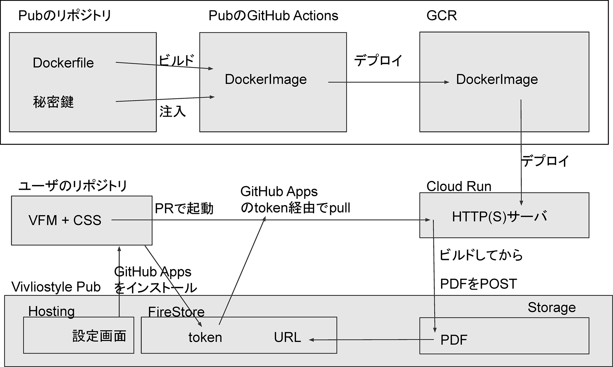
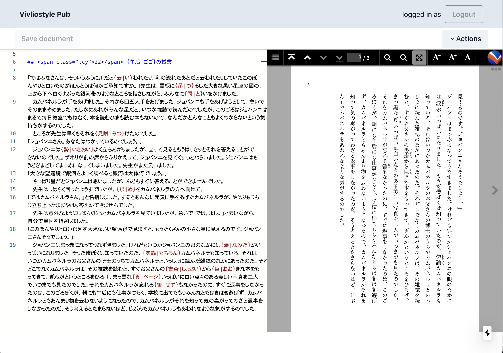

# ** Activity Report for FY2020**

(The 3rd Fiscal Year: from April 1, 2020 to March 31, 2021)

## 1. Organize developer/user events

We have decided to hold developer/user events twice a year as a place to widely let users and developers know about Vivliostyle. This year, we were able to hold the following events.

- [April 4, 2020: Vivliostyle User/Dev Meetup 2020 Spring (Held online)](https://vivliostyle.connpass.com/event/170939/)
- [October 24, 2020: Vivliostyle User/Dev Meetup 2020 Autumn (Held online)](https://vivliostyle.connpass.com/event/189940/)

The spring event coincided with the pandemic. Initially, the event was scheduled to be held at the Japan Association of Graphic Arts Technology (JAGAT), but as Avoid the "Three Cs" was becoming a top priority, we were able to get through it by switching to hold the event online. While most of the similar events were cancelled, thankfully, 142 people registered for the event. In terms of content, we were able to inform people about the real activities of our corporation, focusing on the report of Vivliostyle Pub, which was in the midst of alpha development at the time.

On the other hand, the autumn event seemed to be a good opportunity to work on CSS typesetting as a seminar on the subject. For example, [Simon Worthington](https://www.force11.org/users/simon-worthington)of the Open Science Lab - German National Library of Science and Technology reported on Rapid publishing for public health books against COVID 19. And our contributor [akabeko](https://github.com/akabekobeko) reported on Vivliostyle's competitor [Paged.js](https://www.pagedjs.org/). In this way, we were able to show the appeal of CSS typesetting beyond Vivliostyle.

## 2. Official website renewal

As briefly mentioned in [the previous year's activity report](https://vivliostyle.github.io/vivliostyle_doc/en/reports/vivliostyle-report-2019/vf2019report.html), the design of the official website had remained unchanged for over two years since the founding of the corporation. In order to revamp it, we had a series of discussions at the developer meetings and decided on the following policy, and commissioned [yamasy1549](https://github.com/yamasy1549) to start work on it in December 2019.
- Single column layout for mobile viewing.
- The top page of the site features an animation that provides an intuitive understanding of what Vivliostyle is all about.
- Place the GitHub repository link prominently on each page.
- For the convenience of users, the following pages will be newly added.
    - "Getting Started" that summarizes the product outline. 
    - Detailed development documentation, including "User Guides" and "Tutorial Guides".
    - "FAQ" to solve users' doubts.

It was difficult to prepare for the developer/user event (see the previous section) at the same time, but we managed to renew the site on April 3, the day before the event. After that, the following information was added.

- 2020-04-10: [Notified that the German National Library of Science and Technology has published a textbook on COVID-19 measures using Vivliostyle.](https://vivliostyle.org/blog/2020/04/10/tib-book-against-covid19/)
- 2020-04-29: [Called for support from GitHub Sponsors.](https://vivliostyle.org/blog/2020/04/29/become-a-sponsor-to-vivliostyle-via-github-sponsors/)
- 2020-06-11: [2019 Activity Report released.](https://vivliostyle.github.io/vivliostyle_doc/en/reports/vivliostyle-report-2019/vf2019report.html)
- 2020-08-19: [Create Book Tutorial Guide Released.](https://vivliostyle.org/make-books-with-create-book/)
- 2020-08-29: [Announced the start of accepting donations in Japanese yen by credit card.](https://vivliostyle.org/blog/\1-\2-\3/You-can-support-Vivliostyle-without-a-GitHub-account/)

In particular, the appeal for donations is important for a general incorporated association that does not make a profit (and does not distribute profits). In fact, we were able to collect 61,209 yen in total this fiscal year (Fig. 1), which is about 4% of our total ordinary income. This is still not a large amount, but we would like to continue to nurture it as a receptacle for people who support our activities.

{ width=60% }
 
## 3. Product Development Status

In this section, we will explain the development status of each product for this fiscal year.

### [Vivliostyle Core / Viewer (vivliostyle.js)](https://github.com/vivliostyle/vivliostyle.js)

We were able to add many functions to Vivliostyle Core and Vivliostyle Viewer (Vivliostyle.js), which are the foundation of the entire products, this year. As a result, we were able to promote support for [CSS Paged Media](https://www.w3.org/TR/css-page-3/), which had not been sufficiently supported in the past. The main features we added are as follows.

 - Implementation of a slide bar for page navigation, and support for mouse wheel. ([v2.2.0 / 2020-11-26](https://github.com/vivliostyle/vivliostyle.js/releases/tag/v2.2.0))
- Support for specifying EPUB spread view. ([v2.3.0 / 2020-12-07](https://github.com/vivliostyle/vivliostyle.js/releases/tag/v2.3.0))
- Support for named strings to realize headers, footers, etc. ([v2.4.0 / 2020-12-28](https://github.com/vivliostyle/vivliostyle.js/releases/tag/v2.4.0))
- Support for n-th page selector. ([v2.5.0 / 2021-02-26](https://github.com/vivliostyle/vivliostyle.js/releases/tag/v2.5.0))
- Added the Print button ([v2.6.0 / 2021-03-14](https://github.com/vivliostyle/vivliostyle.js/releases/tag/v2.6.0))

### [Vivliostyle CLI](https://github.com/vivliostyle/vivliostyle-cli)

This is a converter that allows CSS typesetting with a command line interface. With the addition of support for Markdown format input this fiscal year, the scope of its use has expanded dramatically. In addition, since the  As will be discussed later, this is expected to have a positive impact on the future Vivliostyle Pub v1. The details for each release are as follows.

- Replaced the preview UI with Vivliostyle Viewer. ([v3.2.0 / 2021-03-29](https://github.com/vivliostyle/vivliostyle-cli/releases/tag/v3.2.0))
- Supports input of various file formats including Markdown; Support for [Themes](https://github.com/vivliostyle/themes); Supports multiple outputs, including web books; Support loading external web pages by URL. ([v3.0.0 / 2021-02-07](https://github.com/vivliostyle/vivliostyle-cli/releases/tag/v3.0.0))

### [Vivliostyle Flavored Markdown (VFM)](https://github.com/vivliostyle/vfm)

This is a Markdown dialect for book typesetting that allows for ruby, image size specification, captions, footnotes, etc. It is upwardly compatible with the most popular Markdown specification, GitHub Flavored Markdown (GFM), and was developed for input data in Vivliostyle CLI v3.0. v1.0.0-alpha.0 was released on June 13, and v1.0.0-alpha.17 was released as of the end of this fiscal year. It has been under continuous development since then.

### [Themes](https://github.com/vivliostyle/themes)

This is a mechanism to publish/reuse style sheets for CSS typesetting in Vivliostyle CLI as a package. The first official theme was released on July 1, and as of the end of this fiscal year, the following three themes have been released. We will continue to expand them.

- [theme-slide (Slide)](https://github.com/vivliostyle/themes/tree/master/packages/@vivliostyle/theme-slide)
- [theme-bunko (Japanese book with vertical text)](https://github.com/vivliostyle/themes/tree/master/packages/@vivliostyle/theme-bunko)
- [theme-techbook (Tech book)](https://github.com/vivliostyle/themes/tree/master/packages/%40vivliostyle/theme-techbook)

### [Create Book](https://github.com/vivliostyle/create-book)

This is an installer that builds an environment for book production using the Vivliostyle CLI locally, and it is also a local version of the Vivliostyle Pub. It was created by [uetchy](https://github.com/uetchy) in the wake of the Mitou Advanced program defeat, which will be described later. As of the end of this fiscal year, v0.1.6 has been released. For details, please refer to the following article posted on the official website. 

- [Feature Articles: Let's self-publish with Create Book!](https://vivliostyle.org/make-books-with-create-book/)

### [Vivliostyle Pub](https://github.com/vivliostyle/vivliostyle-pub)

The Vivliostyle Pub is the culmination of our products. I will explain the development process in some detail in this section. The starting point is "Viola", an online editor that runs in a browser. The author, [spring-raining](https://github.com/spring-raining), offered to give it to our organization so that the contributors could work together to recreate it. Later, during the monthly developer's meeting, the project was given the name "Vivliostyle Pub" by Representative Director Murakami, and development was officially started. This was also mentioned in the previous year's activity report.

As of the end of the previous fiscal year, the biggest concern was securing development funding, and the solution was discussed at the developer meeting. Therefore, the contributors suggested that they apply for the [Mitou Advanced Project](https://www.ipa.go.jp/jinzai/advanced/2020/koubo_index.html) with the theme of developing Vivliostyle Pub. 

After discussing it with everyone, we decided to give it a try. Since organizations are not allowed to apply due to regulations, the application process was completed on April 2 in the form of the following group of individuals.

- [spring-raining: Representative](https://github.com/spring-raining) 
- [youchan](https://github.com/youchan)
- [takanakahiko](https://github.com/takanakahiko)
- [uetchy](https://github.com/uetchy)
- [yamasy1549](https://github.com/yamasy1549)
- [MurakamiShinyu](https://github.com/MurakamiShinyu)

From that point on, the intensive development work on Vivliostyle Pub began. The goal is the second round of review scheduled for mid-May 2020. The following is an overview of the version (alpha version) at this point.

- The Vivliostyle CLI deployed in the cloud implements a very early parser for VFM.
- It can output the result of CSS typesetting to the browser.
- The generated PDF can be downloaded from the Export menu.
- As a result, when you write Markdown in the editor on the left side of the browser screen, the result of the typesetting is quickly displayed on the right side of the screen.

The following is a flowchart of the Vivliostyle Pub (Figure 2) that takanakahiko created for collaboration at the time.

{ width=70% }

They successfully passed the first round of screening on May 15. On the following day, May 16, they went through the second round of screening, but unfortunately they received a message on June 10 that they had not been selected.

Since then, Vivliostyle Pub has had some very minor updates, but the Vivliostyle Pub that is running as of the end of this fiscal year has not changed much from the alpha version. Here is a screenshot of the current version.

{ width=70% }

Vivliostyle Pub has almost stopped development, while its components, VFM, Themes, Vivliostyle CLI, and Vivliostyle Core / Viewer, have evolved significantly.  However, in order to do so, it was necessary to overcome the impact of the failure of the Mitou Advanced Project. The following document by Representative Director Murakami served as a roadmap.

- [Vivliostyle Pub v1 Req (2020-11-09)](https://github.com/vivliostyle/community/wiki/Vivliostyle-Pub-v1-Req)
- [Vivliostyle CLI v3.0 new spec (2020-11-09--2021-02-09)](https://github.com/vivliostyle/community/wiki/Vivliostyle-CLI-v3.0-new-spec)

If we can incorporate the VFM, Themes, and Vivliostyle CLI that have been developed in this way, we can successfully release Vivliostyle Pub v1. That will be the task for the next fiscal year. In order to accomplish this, the development is now underway with the aim of releasing the beta version at the end of August 2021 and launching it at the end of December of the same year.

## 4. Collaborate with external organizations

In the previous fiscal year, the project income was 0 yen. However, as shown in the next chapter and Figure 1 above, we were able to generate 1,503,721 yen in business income this fiscal year. Especially significant was the development contracted by companies that Representative Director Murakami has been involved with for a long time. In fact, many of the development results mentioned in the previous section on Vivliostyle Core / Viewer were paid for by these companies.

In addition, Representative Director Murakami continued to have discussions with Simon Worthington, who was mentioned in Section 1, and continued to commit himself to their development. As a result, we were able to receive development orders from them and earn business income. In this way, collaboration with external organizations led directly to the development of Vivliostyle, and as a result, we were able to proceed with the CSS Paged Media support, which had been an issue. We are very grateful for this.

## 5. Directors

- [Shinyu Murakami](https://github.com/MurakamiShinyu) (Representative Director, Founding Member)
- [Florian Rivoal](https://github.com/frivoal) (Director, Founding Member)
- [Johannes Wilm](https://github.com/johanneswilm) (Director, Founding Member)
- [Katsuhiro Ogata](https://github.com/ogwata) (Director, From January 21, 2020)