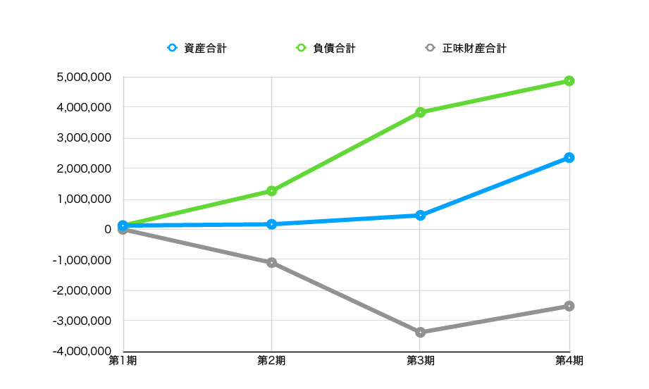
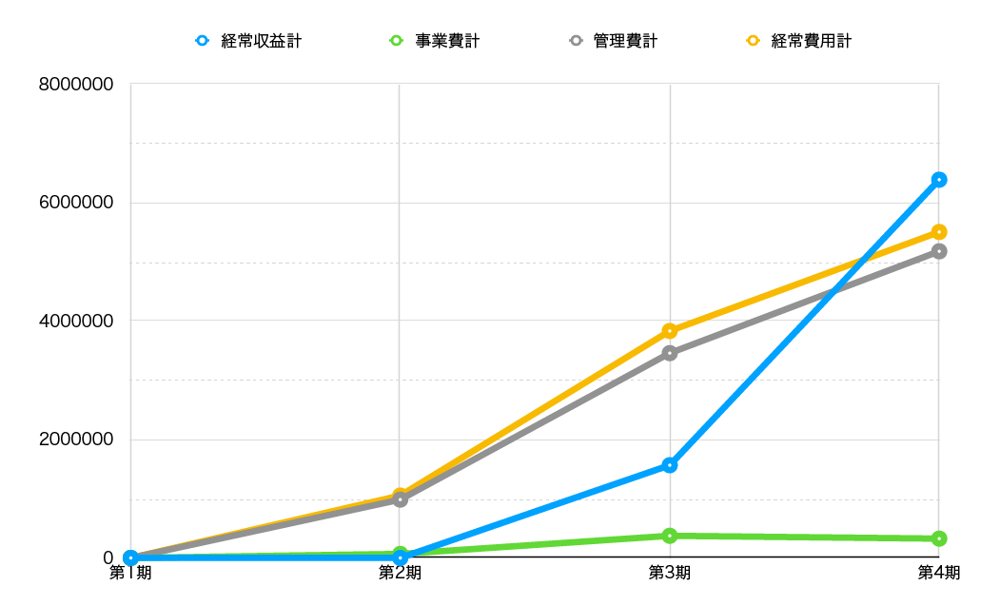
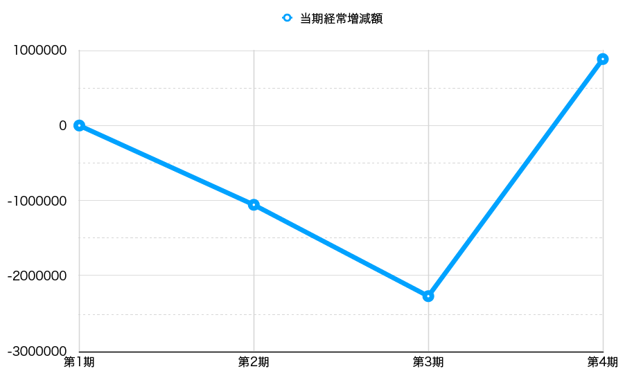

## **Financial Report for FY2021**

(The 4th Fiscal Year: from April 1, 2021 to March 31, 2022)

### Foreword

The structure of the annual report for this fiscal year has been changed from previous years, with the first section reporting the financial results in comparison with the past, and the second section reporting the activities based on that report.

### Balance Sheet for FY2021

The following table shows the status of assets held (balance sheet) as of the end of this fiscal year (March 31, 2022). The figures are in yen.

| Title           | **This FY (2021)**    | **Prev. FY (2020)**    | **Increase/Decrease**     |
| ------------ | ---------- | ---------- | ---------- |
| **I. Assets**   |            |            |            |
| 1. Current assets |            |            |            |
| Cash and deposits |   1,180,342  | 345,708     | 834,634    |
| Other current assets |   1,058,750  |      | 1,058,750    |
| Total current assets |   2,239,092  | 345,708     | 1,893,384    |
| 2 Fixed Assets |            |            |            |
| (1) Other fixed assets |            |            |            |
| Founding expenses | 113,050    | 113,050    | 0          |
| Total other fixed assets | 113,050    | 113,050    | 0          |
| Total fixed assets | 113,050    | 113,050    | 0          |
| Total assets | 2,352,142    | 458,758    | 1,893,384    |
| **II. Liabilities**   |            |            |            |
| 1. Current liabilities |            |            |            |
| Withholdings | 31,139     | 31,139     | 0    |
| Loan from officer | 4,806,561  | 3,806,561  | 1,000,000  |
| Accounts payable |  11,000  |            |  11,000 |
| Accrued income taxes |  20,000 |            | 20,000  |
| Total current liabilities | 4,868,700 | 3,837,700 | 1,031,000 |
| Total liabilities | 4,868,700 | 3,837,700 | 1,031,000 |
| **III. Net Assets** |            |            |            |
| 1. General Net Assets | -2,516,558 | -3,378,942 | 862,384 |
| Total net assets | -2,516,558 | -3,378,942 | 862,384 |
| Total liabilities and net assets | 2,352,142    | 458,758    | 1,893,384    |

Assets that can be recovered within one year are called current assets. Total current assets for this fiscal year were 2,239,092 yen, up 1,893,384 yen from the previous fiscal year, and total assets, including fixed assets held for longer than one year, were 2,352,142 yen, also up 1,893,384 yen (the amount of fixed assets has not changed since the company was founded).

Total liabilities, on the other hand, increased by 1,031,000 yen from last year to 4,868,700 yen. Total net assets, which are total assets minus total liabilities, increased by 862,384 yen from the previous year to -2,516,558 yen. Graph below shows the main indicators on the balance sheet from the 1st fiscal year (Figure 1). It is striking that total net assets, which had been on a downward trend since its establishment, was able to turn upward in the current term, although still negative.

{ width=100% }

### Net Assets Increase/Decrease Statement for FY2021

Next, let's look at the statement of changes in net assets, which shows the details of money spent and sales during this fiscal year (April 1, 2020 to March 31, 2021). This is also in yen.

| Title                | **This FY (2021)** | **Prev. FY (2020)** | **Increase/Decrease** |
| ----------------- | ---------- | ---------- | ---------- |
| **I. General Net Assets Increase/Decrease** |            |            |            |
| 1. Ordinary Increase/Decrease |            |            |            |
| ⑴ Ordinary revenues  |            |            |            |
| ① Business income | ( 6,267,250) | (1,503,721)  | (4,763,529)  |
| Business income | 6,267,250  |  1,503,721  | 4,763,529  |
| ② Donation received | (116,546)  |  (61,209) | (55,337)     |
| Donation received  | 116,546  |  61,209 | 55,337     |
| ③ Other revenues | (6)          | (4)          | (2)          |
| Interest received   | 6          | 4          | 2          |
| Total ordinary revenues | 6,383,802   | 1,564,934  | 4,818,868  |
| ⑵ Ordinary expenses |            |            |            |
| ① Business expenses |            |            |            |
| Business expenses | (325,918)    | (373,823)     | (-47,905)    |
| Travel and transportation expenses |      | 11,527   | -11,527  |
| Communication transportation costs | 940    |   252   | 688        |
| Consumables costs | 22,000    |     | 22,000        |
| Miscellaneous expenses |      |  39,064  | -39,064     |
| Commission fee  | 97,624     | 65,575     | 32,049     |
| Compensation paid | 198,000    |   257,405 | -59,405    |
| Newspaper book expenses | 7,354   |    | 7,354    |
| Total business expenses  | 325,918    | 373,823    | -47,905    |
| ② Administrative expenses  |            |            |            |
| Outsourcing costs  | 5,175,500  | 3,454,000    | 1,721,500  |
| Meeting fee  |       |  2,623 | -2,623      |
| Total administrative expenses | 5,175,500  | 3,456,623    | 1,718,877  |
| Total ordinary expenses  | 5,501,418  | 3,830,446  | 1,670,972  |
| Ordinary increase/decrease before valuation gain/loss this FY | 882,384 | -2,265,512 | 3,147,896 |
| Total valuation gain/loss | 0          | 0          | 0          |
| Ordinary increase/decrease this FY | 882,384 | -2,265,512 | 3,147,896 |
| 2. Non-ordinary Increase/Decrease |            |            |            |
| ⑴ Non-ordinary revenues |            |            |            |
| Total non-ordinary revenues | 0          | 0          | 0          |
| ⑵ Non-ordinary expenses |            |            |            |
| Total non-ordinary expenses | 0          | 0          | 0          |
| Non-ordinary increase/decrease this FY | 0          | 0          | 0          |
| General net assets increase/decrease before transfer to other accounts this FY | 882,384 | -2,265,512 | 3,147,896 |
| General net assets increase/decrease before taxes this FY | 882,384 | -2,265,512 | 3,147,896 |
| Corporate tax, resident tax and business tax | 20,000     | 20,000     | 0    |
| General net assets increase/decrease this FY | 862,384 | -2,285,512 | 3,147,896 |
| General net assets at beginning of FY | -3,378,942 | -1,093,430  | -2,285,512 |
| General net assets at end of FY | -2,516,558 | -3,378,942 | 862,384 |
| **II. Designated Net Assets Increase/Decrease** |            |            |            |
| Designated net assets increase/decrease this FY  | 0          | 0          | 0          |
| Designated net assets at beginning of FY | 0          | 0          | 0          |
| Designated net assets at end of FY  | 0          | 0          | 0          |
| **III. Net Assets at End of FY**   | -2,516,558 | -3,378,942 | 862,384 |

First, let's look at "I. General Net Assets". The term "General net assets" here is the opposite of "Designated Net Assets". While the latter is property that is designated for use and the corporation cannot decide how to use it, the former is the opposite, allowing the corporation to freely decide how to use it. Since our corporation has no "Designated net assets" as described below, we should be able to grasp the income and expenses for the 4th fiscal year by looking at this section.

Among the "I. General Net Assets Increase/Decrease" section, what catches the eye is that "Business income" raised 6,267,250 yen, which is 4,763,529 yen more than the previous fiscal year (pale yellow cell). As a result, the "Total ordinary revenues", which indicates the profit earned in the main business, was able to raise 6,383,802 yen, which is 1,564,934 yen more than the previous year. This revenue amount is about four times that of the previous fiscal year. This was due to the expansion of contract development from external companies, which was also mentioned in the [Previous Business Report](https://vivliostyle.org/viewer/#src=https://vivliostyle.github.io/vivliostyle_doc/ja/reports/vivliostyle-report-2020/vf2020report.html&bookMode=true&f=epubcfi(/2!/4/84)) in the current fiscal year. In addition, although the amount is not a large amount, we were able to obtain 116,546 yen in "Donations received", which is 55,337 yen more than the previous fiscal year.

On the other hand, "Total business expenses", which are the expenses to conduct business, were 325,918 yen, 47,905 yen less than the previous fiscal year. "Total administrative expenses", which are the costs of maintaining the corporation, totaled 5,175,500 yen, 1,718,877 yen more than in the previous fiscal year. This increase was due to the aforementioned "Outsourcing costs" (labor costs to subcontractors) related to the large increase in "Business income". As already mentioned, in the previous fiscal year, "Business income" totaled 1,503,721 yen. The reason for the four-fold increase was due in part to the increase in the number of projects, but also to the fact that the company was able to subcontract work to developers other than Representative Director Murakami. Securing development resources will be the key to securing the same or higher business profits in the next fiscal year. "Total ordinary expenses", which are the sum of the "Total business expenses"and "Total administrative expenses" mentioned above, totaled 5,501,418 yen, 1,670,972 yen more than the previous fiscal year.

Looking further down, "Total valuation gain/loss", which shows the difference between the purchase price and the current price of assets held related to securities, etc., is 0 yen. This is because we do not hold any securities. "Total non-ordinary expenses", which represent income other than core business, are also zero.

At the end of "I. General Net Assets Increase/Decrease" is "General net assets at beginning of FY" and "General net assets at end of FY". To put it simply, the former is the money carried forward from the previous term, while the latter is the money carried forward to the next term. The former, that is, the "General net assets at beginning of FY" was -3,378,942, while the latter, that is, the "General net assets at end of FY" increased by 862,384 yen to -2,516,558. To put it simply, it shows that although the deficit up to the previous term has been reduced, there is still a long way to go to eliminate it.

The next section, "II. Designated Net Assets Increase/Decrease" are all zero yen, as mentioned above. And the carryover to the 5th fiscal year, "III. Net Assets at End of FY" was -2,516,558 yen (the same as "General net assets at end of FY"). Figure 2 shows a graphical representation of the changes in the main indicators on the statement of changes in net assets since the foundation of the company. The graph (Figure 2) shows that all indicators, except for "Business expenses", have increased significantly.

{ width=100% }

Finally, "Ordinary increase/decrease this FY", an indicator of whether a business is in the red or in the black, is shown graphically from its inception (Figure 3). It can be seen that the deficit amount had been increasing until the previous fiscal year, but this fiscal year it has been able to turn into a surplus (so-called single-year surplus) with a V-shaped recovery.

{ width=100% }

### Income and Expenditure Statement for FY2021

At the end of Chapter 1, we will look at "Income and Expenditure Statement", which compares the budgeted amount to the closing amount during the current fiscal year (April 1, 2020 to March 31, 2021). However, since we have not developed a budget, it will remain a formality and will be substantially the same as the statement of changes in net assets in the previous section. The unit of measure is also yen.

| Title   | Budgetary Amount | Settlement Amount | Difference | Note |
| ----------------- | --- | ---------- | ---------- | -- |
| **I. General Net Assets Increase/Decrease** |     |            |            |    |
| 1. Ordinary Increase/Decrease |     |            |            |    |
| ⑴ Ordinary revenues  |     |            |            |    |
| ① Business income  | (0)   | (6,267,250)  | -6,267,250 |    |
| Business income |     | 6,267,250  | -6,267,250 |    |
| ② Donation received  | (0)   |( 116,546)     | (-116,546)    |    |
| Donation received |     | 116,546     | -116,546   |    |
| ③ Other revenues | (0)   | (6)          | (-6)         |    |
| Interest received  |  0   | 6          | -6         |    |
| Total ordinary revenues | 0   | 6,383,802  | -6,383,802 |    |
| ⑵ Ordinary expenses  |     |            |            |    |
| ① Business expenses |     |            |            |    |
| Business expenses  | (0)   | (325,918)    | -325,918   |    |
| Travel and transportation expenses  |     | 940        | -940      |    |
| Communication transportation costs |     | 22,000     | -22,000    |    |
| Consumables costs |     | 97,624    | -97,624    |    |
| Compensation paid   |     | 198,000    | -198,000   |    |
| Newspaper book expenses |     | 7,354    | -7,354   |    |
| Total business expenses | 0   | 325,918    | -325,918   |    |
| ② Administrative expenses  |     |            |            |    |
| Outsourcing costs |     | 5,175,500  | -5,175,500 |    |
| Total administrative expenses | 0   | 5,175,500  | -5,175,500 |    |
| Total ordinary expenses | 0   | 5,501,418  | -5,501,418 |    |
| Ordinary increase/decrease before valuation gain/loss this FY | 0   | 882,384 |-882,384  |    |
| Total valuation gain/loss | 0   | 0          | 0          |    |
| Ordinary increase/decrease this FY | 0   | 882,384 | -882,384  |    |
| 2. Non-ordinary Increase/Decrease  |     |            |            |    |
| ⑴ Non-ordinary revenues |     |            |            |    |
| Total non-ordinary revenues  | 0   | 0          | 0          |    |
| ⑵ Non-ordinary expenses  |     |            |            |    |
| Total non-ordinary expenses | 0   | 0          | 0          |    |
| Non-ordinary increase/decrease this FY  | 0   | 0          | 0          |    |
| General net assets increase/decrease before transfer to other accounts this FY | 0   | 882,384 | -882,384  |    |
| General net assets increase/decrease before taxes this FY | 0   | 882,384 | -882,384  |    |
| Corporate tax, resident tax and business tax | 0   | 20,000     | -20,000    |    |
| General net assets increase/decrease this FY | 0   | 882,384 | -882,384  |    |
| General net assets at beginning of FY  | 0   | -3,378,942 | 3,378,942  |    |
| General net assets at end of FY  | 0   | -2,516,558 | 2,516,558  |    |
| **Ⅱ. Designated Net Assets Increase/Decrease** |     |            |            |    |
| II. Designated Net Assets Increase/Decrease | 0   | 0          | 0          |    |
| Designated net assets at beginning of FY  | 0   | 0          | 0          |    |
| Designated net assets at end of FY  | 0   | 0          | 0          |    |
| **III. Net Assets at End of FY**   | 0   | -2,516,558 | 2,516,558  |    | 