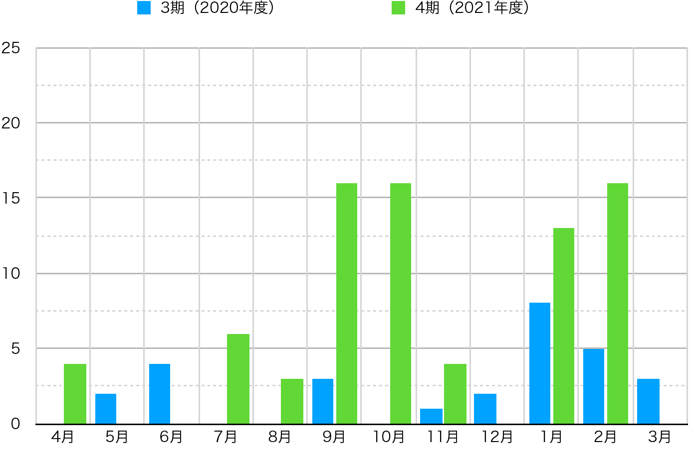
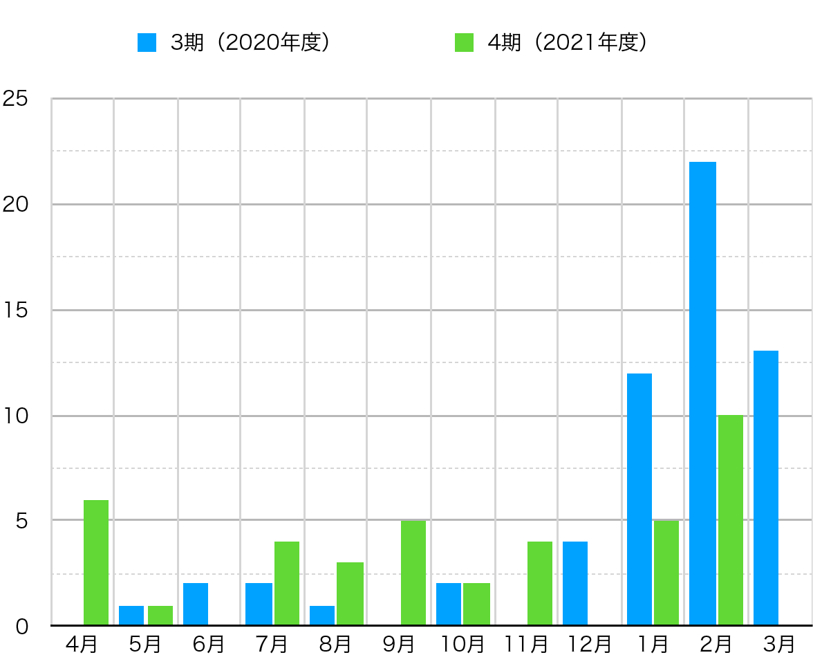
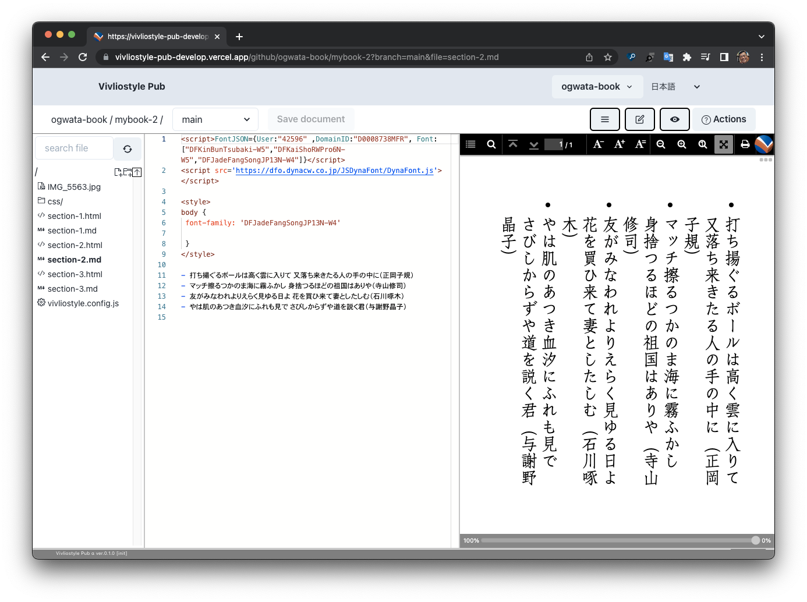
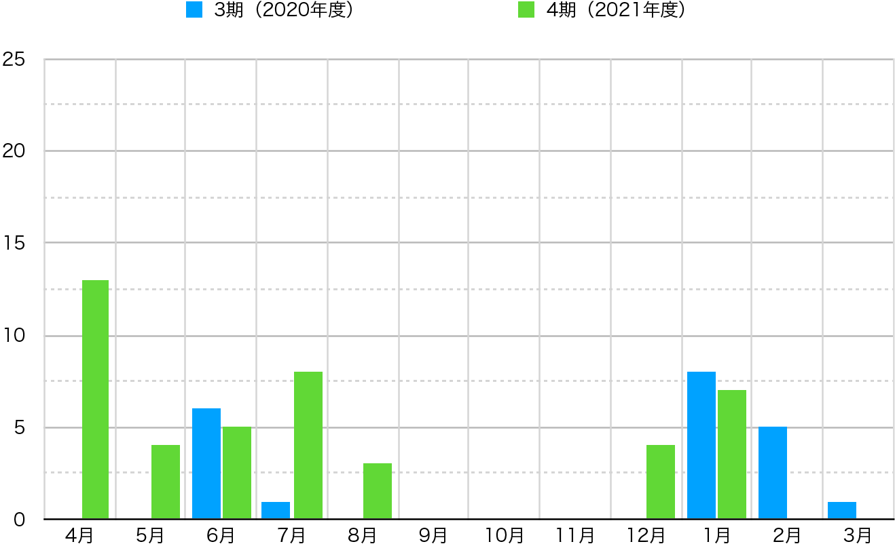
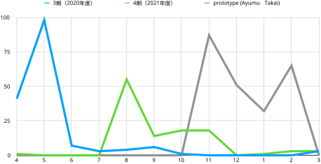

## ** Activity Report for FY2021**

### Foreword

This fiscal year we were able to achieve a profit for the single fiscal year. The direct cause of this was the expansion of contracted development from outside companies, as mentioned in the previous chapter. However, behind this is the fact that Vivliostyle products have been enhanced and the ecosystem among these products has begun to function. In other words, without these factors, there would have been no expansion of contract development.

Therefore, this chapter describes the development status of each of the Vivliostyle products. We will also explore the challenges for the next fiscal year. Again, this is because we have an accumulated deficit, which is not small, and eliminating it is our immediate goal.

### Classification of products and their roles

Before reporting on the development status of each product, let us review its position in the product lineup. The increase in the number of products in recent years has been gratifying, but it has become difficult to understand from the outside what role each product plays and how it fits into the overall product lineup.

- **Libraries (“common components” that are built into the application)**
    - [Vivliostyle.js (including Vivliostyle Viewer)](https://github.com/vivliostyle/vivliostyle.js)
    - [VFM (Vivliostyle Flavored Markdown)](https://github.com/vivliostyle/vfm)
    - [Vivliostyle Themes](https://github.com/vivliostyle/themes)
- **Generator (converts Markdown+CSS to HTML+CSS)**
    - [Vivliostyle CLI](https://github.com/vivliostyle/vivliostyle-cli)
    - [create-book](https://github.com/vivliostyle/create-book)
    - [vivliostyle-sitegen](https://github.com/vivliostyle/vivliostyle-sitegen)
- **Web application (application integrating the above)**
    - [Vivliostyle Pub](https://github.com/vivliostyle/vivliostyle-pub)
- **Web content and its production system (documents sites related to Vivliostyle)**
    - [vivliostyle.org](https://github.com/vivliostyle/vivliostyle.org)（[Foundation's official website](https://vivliostyle.org/ja/)）
    - [docs.vivliostyle.org](https://github.com/vivliostyle/docs.vivliostyle.org) （[User guides for each product](https://vivliostyle.org/ja/documents/)）
    - [docs-vivliostyle-pub](https://github.com/vivliostyle/docs-vivliostyle-pub) （[Vivliostyle Pub User Guide](https://vivliostyle.github.io/docs-vivliostyle-pub/#/ja/)）
    - [vivliostyle_doc](https://github.com/vivliostyle/vivliostyle_doc)（[Sample pages](https://vivliostyle.org/ja/samples/)や[Activity Reports](https://vivliostyle.org/ja/about-us/)）

The above links are to the respective repositories. In other words, the above classification is also a classification of repositories. However, the above classifications are for the sake of clarity and are not necessarily strict. For example, VFM is not only a library but also a generator that converts Markdown to HTML.

From the next section, we will explain the development status of each product in the current fiscal year according to the above classification, referring to announcements made at user events, blog posts, and other sources. For reference, the beginning of FY and end of FY versions are shown in parentheses (except Vivliostyle Themes and Vivliostyle Pub, which have no concept of release as a product).

### Library: Vivliostyle.js (v2.6.2 -> v2.14.4)

[Vivliostyle.js](https://github.com/vivliostyle/vivliostyle.js) is the actual CSS typesetting software and is the core of the Vivliostyle product. Fortunately, we were able to make significant functional improvements to this product this fiscal year, as follows.

- **Improved typesetting capabilities**
     - [Presentation: Implementing CSS Paged Media in Vivliostyle Core; Japanese](https://www.youtube.com/watch?v=_y3YBHNN2Oc) (Shinyu Murakami)
     - [Presentation: Vivliostyle.js evolution and future development plans; Japanese](https://www.youtube.com/watch?v=2hvsMhTJai4) (Shinyu Murakami)
     - [Blog: Recent Vivliostyle.js updates](https://vivliostyle.org/blog/2021/10/12/recent-vivliostyle-js-updates/) (Katsuhiro Ogata)
     - [Blog: Line end handling has been evolved to allow multiple typesetting options](https://vivliostyle.org/blog/2022/02/08/Improved-of-line-end-handling-and-support-for-page-progression-direction-in-PDF/) (Katsuhiro Ogata)
- **Enables JavaScript execution from within HTML**
     - [Blog: JavaScript can now be used in typesetting by Vivliostyle](https://vivliostyle.org/blog/2022/01/24/JavaScript-can-now-be-used-in-typesetting-by-Vivliostyle/) (Katsuhiro Ogata)
- **Web font support**
     - [Presentation: Trying to use web fonts in Vivliostyle Pub; Japanese](https://www.youtube.com/watch?v=Hz5_Wd7d5lw) (Katsuhiro Ogata)
     - [Presentation: Survey for using Web fonts in Vivliostyle; Japanese](https://www.youtube.com/watch?v=czVRSsekLjc) (Katsuhiro Ogata)

So how were these features developed? The graph shows the number of pull requests per month in the repository and compared with the previous fiscal year (Fig. 4 / Excluding automatic processing, only pull requests by humans were targeted. The same applies hereafter).

{ width=100% }

The previous fiscal year also saw constant pull requests throughout the year, but the pace of development this fiscal year was even faster than that. The functional upgrades mentioned above were also realized as a result of such enthusiastic development.

The important thing here is that the enhancements Vivliostyle.js also spilled over into the Vivliostyle CLI and Vivliostyle Pub that incorporated it, and they immediately implemented the new features. It was a scene where the true nature of the library was demonstrated.

### Library: VFM (v1.0.0-alpha.17 -> v1.2.1)

VFM (Vivliostyle Flavored Markdown)(https://github.com/vivliostyle/vfm), a Markdown dialect optimized for book typesetting, has released v1 this fiscal year. This v1 is partly a preparation for the upcoming v2.

Originally, this product used [Remark](https://remark.js.org/) as its Markdown conversion engine. However, its new version, Remark 13, contains many changes that are incompatible with past versions, and its implementation was expected to be a significant amount of work.

Therefore, we decided to first release a version with a range of functions that can be implemented without Remark 13 as v1, and then work on support for Remark 13 as v2. For details, please refer to the presentation by [akabekobeko](https://github.com/akabekobeko), the maintainer.

- [Presentation: Development status of Vivliostyle Flavored Markdown; Japanese](https://speakerdeck.com/akabekobeko/vfm-dev-stat)（akabekobeko）

The [v1.0.2](https://github.com/vivliostyle/vfm/releases/tag/v1.0.2) released on July 21, 2021 implements the functionality that can be achieved without this Remark 13. See below for details.

- [Presentation: Release of VFM 1.0 and future prospects; Japanese](https://www.youtube.com/watch?v=lF6Mb2DXJK0)（akabekobeko）

As with Vivliostyle.js, these enhancements were quickly implemented in the Vivliostyle CLI and other products.

- [v1.x](https://github.com/vivliostyle/vfm/milestone/3?closed=1)

### Library: Vivliostyle Themes

[This product](https://github.com/vivliostyle/themes) is a library of style files that all Vivliostyle products share. It consists of a set of Theme files that define styles and a set of tools for creating these Themes.

Several minor updates were made this fiscal year. However, the most significant achievement is the release of the User's Guide, which is shown below.

- [Development Tutorial](https://vivliostyle.github.io/themes/#/tutorial/step0.md)
- [Operational Guideline](https://vivliostyle.github.io/themes/#/official)

This product will allow users to create documents faster and easier by eliminating the need to set up new styles when using Vivliostyle products. However, to achieve this, it is necessary to publish a wide variety of themes in response to user demand. However, it is not realistic for us to create and publish many themes by ourselves. We need to make it easy for individual users to create new themes and to make them easily available to the public. This will make this product more useful as a library, which in turn will encourage the creation of new themes.

However, at present, awareness of this product is low and there is still a long way to go to reach the goal. Therefore, [yamasy1549](https://github.com/yamasy1549), the maintainer of this product, decided to develop a document to let people know how to use the Theme and how to create it. The above user guide is the first step. For more details, please refer to the following.

- [Presentation: Hands-on with Vivliostyle Themes; Japanese](https://www.youtube.com/watch?v=auqefAA0Bx0)（yamasy1549）
- [Presentation: CSS typesetting tutorial starting at vivliostyle.org; Japanese](https://www.youtube.com/watch?v=NioXx9NFUZU)（yamasy1549）

### Generator: Vivliostyle CLI (v3.2.1 -> v4.8.2)

[This product]((https://github.com/vivliostyle/vivliostyle-cli)) converts Markdown to HTML by CLI (command line interface) and outputs it. First, please take a look at the graph comparing the number of monthly pull requests with the previous fiscal year. Although not as high as in the previous fiscal year, the graph shows that development continued consistently during this fiscal year (Figure 5).

{ width=80% }

As a result of these developments, the product was able to achieve a variety of functional enhancements this fiscal year. The most significant of these is support for Docker mode, which allows execution in a virtual environment ([v4.0.0](https://github.com/vivliostyle/vivliostyle-cli/releases/tag/v4.0.0)). Docker virtualizes the program execution environment. This frees users from the trouble of output results changing when the OS, browser, or Vivliostyle CLI itself is upgraded. This kind of idempotency/reliability should be essential for users who want to use the Vivliostyle CLI in practice.

Here, let's explain the update contents after v4.0.0 by referring to the presentation ["Vivliostyle CLI update --2022 Spring"](https://www.youtube.com/watch?v=GMzLJ17MLOk) in ["Vivliostyle User / Dev Meetup 2022 Spring"](https://vivliostyle.connpass.com/event/208401/) by [spring-raining](https://github.com/spring-raining) who is the maintainer of this product.

- Added `--http` option for use of external Web font services, etc. [#234](https://github.com/vivliostyle/vivliostyle-cli/pull/234)
- Added `--viewer` option to specify a viewer other than the preinstalled one [#234](https://github.com/vivliostyle/vivliostyle-cli/pull/234)
- Improved meta information in output PDF with more detail [#239](https://github.com/vivliostyle/vivliostyle-cli/pull/239)
- PDF reading direction (right/left binding) can be specified [#240](https://github.com/vivliostyle/vivliostyle-cli/pull/240)
- CLI commands are converted to API and can be operated from JavaScript [#243](https://github.com/vivliostyle/vivliostyle-cli/pull/243)
- Multiple publications can now be output simultaneously [#268](https://github.com/vivliostyle/vivliostyle-cli/pull/268)
- `vfm` options in vivliostyle.config.js can now be passed directly to the internal VFM execution. [#264](https://github.com/vivliostyle/vivliostyle-cli/pull/264)
- Improved error output for better readability [#264](https://github.com/vivliostyle/vivliostyle-cli/pull/264)

In his presentation, spring-raining described his vision for the future of this product as follows Expectations for the next fiscal year are growing.

 - **Expansion of output destinations**
     - EPUB/MOBI
     - Other Markdown Dialects
     - Text formatting for various novel submission sites
 - **Ability to add a cover page in conjunction with an external image service**

### Generator: create-book (v0.1.6 -> v0.5.1)

[This product](https://github.com/vivliostyle/create-book) is a software, or installer, that allows users to interactively build an execution environment for the Vivliostyle CLI. However, there were some maintenance updates this fiscal year and no major functional upgrades.

### Generator: vivliostyle-sitegen

[This product](https://github.com/vivliostyle/vivliostyle-sitegen) was conceived as a static site generator using VFM, and development of this product was newly started this fiscal year.

The original trigger was a free discussion session at a user event in the fall ("Vivliostyle User/Dev Meetup Autumn 2021"](https://vivliostyle.connpass.com/event/227954/) on November 14, 2021) in which VFM released v1, but there were voices saying that it was a pity that VFM could not use it on the Vivliostyle site. In response, VFM maintainer [akabekobeko](https://github.com/akabekobeko) raised his hand, and development began in January 2022.

Development is currently underway with the aim of releasing the system within the next fiscal year. After the release, the system will be implemented in a document production system for Vivliostyle users, such as [vivliostyle.org](https://github.com/vivliostyle/vivliostyle.org). Once this happens, it will be possible to disseminate information about Vivliostyle using VFM, which has a wealth of expressive power. In this way, the Vivliostyle ecosystem will expand even further.

### Web application: Vivliostyle Pub

[This product](https://github.com/vivliostyle/vivliostyle-pub) is a web application that deploys Vivliostyle.js, VFM, Vivliostyle Themes, and Vivliostyle CLI on the cloud. When a user writes Markdown on the left side of the browser, CSS typesetting is immediately performed and previewed on the right side of the browser (Figure 6).

{ width=100% }

The project was originally launched in a hurry to apply for the Unexplored Advanced Project in FY2019 with the aim of securing development funds. After two months of intensive development by a team of committers, the project was completed to PoC (Proof of Concept) in May 2020 (see [annual report for the previous fiscal year](https://vivliostyle.org/viewer/#src=https://vivliostyle.github.io/vivliostyle_doc/en/reports/vivliostyle-report-2020/vf2020report.html&bookMode=true&userStyle=data:,/*%3Cviewer%3E*/%0A@page%20%7B%20size:%20A4;%20%7D%0A/*%3C/viewer%3E*/&f=epubcfi(/2!/4/38/1:193[promote,support]))).

However, after the lose in June 2020, the committers gradually left, and only [takanakahiko](https://github.com/takanakahiko) remained and continued to develop steadily. This situation changed drastically in November 2021, when [AyumuTakai](https://github.com/AyumuTakai) joined the project. The graph below shows the number of monthly pull requests for this product compared to the previous fiscal year (Figure 7).

{ width=100% }

At first glance, there are more pull requests in the first half of this fiscal year than in the previous fiscal year (this is takanakahiko's work), but from November to February of the following year, when Ayumu Takai joined, there does not seem to be much difference between the previous fiscal year and this fiscal year. Let us change the indicator and look at the graph comparing the number of monthly commits with the previous fiscal year (Figure 8).

{ width=100% }

The blue line shows the number of commits to the default branch in the previous fiscal year, and the green line shows the number of commits to the default branch in the current fiscal year. Looking at these two lines, as with the monthly number of pull requests in Figure 7 above, it appears that not much development progress was made from November to February of the following year. However, note the gray line. This is the number of monthly commits by Ayumu Takai on the `prototype` branch for the current term. The number of commits in April and May of the previous fiscal year was the result of a team of four to five developers, but the number of commits by just one person exceeds that number. However, the development method was somewhat irregular.

AyumuTakai started development on the `prototype` branch on November 2, but did not submit a pull request to the default branch until February, and has been accumulating many commits on the `prototype` branch. Perhaps, as a result of adding many improvements one after another, he lost the timing to submit a pull request. In the end, he left the `prototype` branch as it was and created a new branch called `pre_alpha` on February 3, from which he submitted only one pull request to the default branch.

As a result, although AyumuTakai's work hardly appeared in the number of pull requests shown in Figure 7 above, his contribution could be visualized by superimposing the number of commits in the prototype branch in Figure 8 above. In this pull request, [アルファ版準備 #142](https://github.com/vivliostyle/vivliostyle-pub/pull/142), you can see a list of user interface changes and added features added at this time. It can be seen that all of them were indispensable elements for the normal use of this product (AyumuTakai withdrew from development at the end of March due to the busyness of its main business. We sincerely appreciate his contribution).

So far, we have described the contributions of AyumuTakai and takanakahiko, who were directly responsible for the development of this product. However, it is important not to forget that this product has been able to incorporate the results of the Vivliostyle.js, VFM, Vivliostyle Themes, and Vivliostyle CLI updates described in the previous sections, simply by replacing the components. This means that this product has been able to incorporate the results of the Vivliostyle.js, VFM, Vivliostyle Themes, and Vivliostyle CLI updates by simply replacing components.

For example, in Figure 6 above, the Web font is displayed, but this is not this product, but a function realized by the update of the Vivliostyle .js. You can truly feel the power of Vivliostyle products as an ecosystem.

In this way, although it was far behind our original goal, we were able to announce the alpha release of this product at the ["Vivliostyle User / Dev Meetup 2022 Spring"](https://vivliostyle.connpass.com/event/227954/) held on April 23, 2022.

### Web content and its production system

This section will collectively address the following user documents related to Vivliostyle and its production system.

1. [vivliostyle.org](https://github.com/vivliostyle/vivliostyle.org)（[Foundation's official website](https://vivliostyle.org/ja/)）
2. [docs.vivliostyle.org](https://github.com/vivliostyle/docs.vivliostyle.org) （[User guides for each product](https://vivliostyle.org/ja/documents/)）
3. [docs-vivliostyle-pub](https://github.com/vivliostyle/docs-vivliostyle-pub) （[Vivliostyle Pub User Guide](https://vivliostyle.github.io/docs-vivliostyle-pub/#/ja/)）
4. [vivliostyle_doc](https://github.com/vivliostyle/vivliostyle_doc)（[Sample page](https://vivliostyle.org/ja/samples/) and [Annual reports](https://vivliostyle.org/ja/about-us/)）

The most familiar information dissemination tool for us is the blog in #1 above. The following eight articles were updated during this fiscal year.

- [2021/04/21 Updates on Vivliostyle—Improved CLI and CSS Paged Media support](https://vivliostyle.org/blog/2021/04/21/vivliostyle-improved-css-paged-media-support/)
- [2021/04/23 Event report of “Vivliostyle User/Dev meetup Spring 2021”](https://vivliostyle.org/blog/2021/04/23/meetup-2021-spring-report/)
- [2021/06/16 Presentation about Vivliostyle at JEPA seminar](https://vivliostyle.org/blog/2021/06/16/Presentation-at-JEPA-Seminar/)
- [2021/06/26 技術書典 11 出展 & 合同誌無料配布キャンペーンのお知らせ; Japanese](https://vivliostyle.org/ja/blog/2021/06/26/make-books-with-vivliostyle-vol5/)
- [2021/07/02 New FY2020 Report Released](https://vivliostyle.org/blog/2021/07/02/New-FY2020-Report-Released/)
- [2021/10/12 Recent Vivliostyle.js updates](https://vivliostyle.org/blog/2021/10/12/recent-vivliostyle-js-updates/)
- [2021/11/17 Event report of “Vivliostyle User/Dev Meetup Autumn 2021”](https://vivliostyle.org/blog/2021/11/17/meetup-2021-autumn-report/)
- [2022/01/24 JavaScript can now be used in typesetting by Vivliostyle](https://vivliostyle.org/blog/2022/01/24/JavaScript-can-now-be-used-in-typesetting-by-Vivliostyle/)
- [2022/02/08 Line end handling has been evolved to allow multiple typesetting options](https://vivliostyle.org/blog/2022/02/08/Improved-of-line-end-handling-and-support-for-page-progression-direction-in-PDF/)

Also, the user guide mentioned as newly added in the Vivliostyle Themes section is one of the #2 above. And #3 above is another user guide newly added this fiscal year in preparation for the alpha release of Vivliostyle Pub.

All of them are written in Markdown, but the converters for converting them to HTML are different: [Jekyll](http://jekyllrb-ja.github.io/) for #1, [docute](https://github.com/egoist/docute) for #2 and #3, and [Pandoc](https://pandoc-doc-ja.readthedocs.io/ja/latest/users-guide.html) for #4. As mentioned above, [vivliostyle-sitegen](https://github.com/vivliostyle/vivliostyle-sitegen) is an attempt to improve this situation and further enable the use of VFM's rich expressions.

### Challenges for the next fiscal year and how to address them

So far, we have described the development status of Vivliostyle products during the current term. At the beginning, our products were limited to the current Vivliostyle Viewer/Vivliostyle.js and the Vivliostyle CLI. From there, the number of repositories was gradually increased each year, and we have reached the point where the ecosystem among products as described in the previous section is beginning to function.

In the previous section, we reported that the foundation achieved a profit for the single fiscal year, and most of the revenue was generated from contracted development related to Vivliostyle products and from maintenance of products that had been delivered in the past. In other words, in our case, the development and expansion of our products are directly linked to securing business income.

However, simply expanding Vivliostyle products will not necessarily lead to an increase in business income. In other words, product expansion is not a necessary condition for increasing profits, but a sufficient condition. Then, what are the obstacles to increasing profits? We would like to list the following issues.

1. Most of the business income is limited to contracted development.
2. Limited number of developers who undertake contracted development.
3. Almost only one company places orders for contracted development.

To address #1 above, it is necessary to secure a variety of revenues other than contracted development. For example, business income from Vivliostyle Pub. We should also seriously consider expanding the amount of donations we receive, which we have done little to promote since the creation of the [sponsor solicitation page] in the 3rd fiscal year.

To address #2 above, as discussed in the previous section, "Statement of Net Assets Increase/Decrease for FY2021", we were able to secure a trustee other than Representative Murakami this fiscal year, but the key will be whether we can continue to secure a trustee in the next fiscal year. For example, we should consider asking committers to contracted development. In addition, it will be important to make efforts to increase the number of committers for the entire product in order to reduce the burden on individual committers.

Finally, to address #3 above, diversification of ordering sources is a matter of course, and addressing #1 above should also address #3 as it is.

### Directors

- [Shinyu Murakami](https://github.com/MurakamiShinyu) (Representative Director, Founding Member)
- [Florian Rivoal](https://github.com/frivoal) (Director, Founding Member)
- [Johannes Wilm](https://github.com/johanneswilm) (Director, Founding Member)
- [Katsuhiro Ogata](https://github.com/ogwata) (Director, From January 21, 2020)
