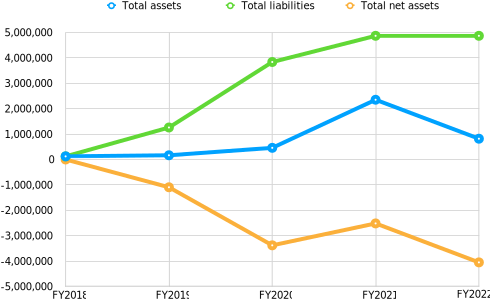
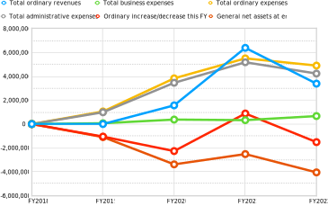
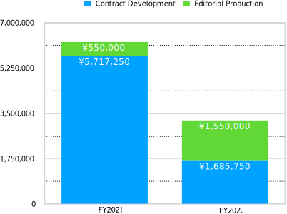
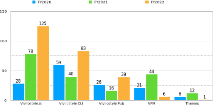

## **Chapter 1: Financial Report for FY2022**

(The 5th Fiscal Year: from April 1, 2022 to March 31, 2023)

### Foreword

After achieving a profit for the first time in a single fiscal year in the previous fiscal year, the corporation unfortunately posted a loss again in the current fiscal year. The details are explained below.

### Balance Sheet for FY2022

The following table shows the status of assets held (balance sheet) as of the end of this fiscal year (March 31, 2023). The figures are in yen.

| Title           | **This FY (2022)**    | **Prev. FY (2021)**    | **Increase/Decrease**     |
| ------------ | ---------- | ---------- | ---------- |
| **I. Assets**   |            |            |            |
| 1. Current assets |            |            |            |
| Cash and deposits | 493,367 | 1,180,342     | -686,975 |
| Other current assets |211,750 |  1,058,750 | -847,000 |
| Total current assets | 705,117 | 2,239,092  | -1,533,975  |
| 2 Fixed Assets |            |            |            |
| (1) Other fixed assets |            |            |            |
| Founding expenses | 113,050    | 113,050    | 0          |
| Total other fixed assets | 113,050    | 113,050    | 0          |
| Total fixed assets | 113,050    | 113,050    | 0          |
| Total assets |818,167 | 2,352,142 | -1,533,975 |
| **II. Liabilities**   |            |            |            |
| 1. Current liabilities |            |            |            |
| Withholdings |31,139     | 31,139     | 0    |
| Loan from officer | 4,806,561 | 4,806,561  | 0  |
| Accounts payable |  11,000  | 11,000 |  0 |
| Accrued income taxes |20,000 |  20,000 | 0  |
| Total current liabilities |4,868,700 | 4,868,700 | 0 |
| Total liabilities | 4,868,700 | 4,868,700 | 0 |
| **III. Net Assets** |            |            |            |
| 1. General Net Assets |-4,050,533 | -2,516,558 | -1,533,975 |
| Total net assets |-4,050,533 | -2,516,558 | -1,533,975 |
| Total liabilities and net assets | 818,167 | 2,352,142  | -1,533,975  |

Total liabilities were unchanged from the previous fiscal year. On the other hand, total assets fell significantly below the previous fiscal year's level. This is precisely what characterized this term's financial results. Specifically, total assets were 2,239,092 yen in the previous period, while they were 1,533,975 yen lower this period, at 705,117 yen. Let us now take a look at the changes in the main indicators (Light blue cells in the table) on the balance sheet since its establishment (Fig-1).

{ width=90% }

Total assets rose slightly in FY2020 and FY2021, but dropped in FY2022. Net assets had been
continued to fall and picked up in FY2021, but dropped again in FY2022. Only total liabilities remained flat, as mentioned above. As a matter of fact, this fiscal year was the first time since the founding of the corporation that it did not increase its debt. As a top priority for the foundation, we will continue to aim to control and reduce the amount of debt in the next fiscal year and beyond.

### Net Assets Increase/Decrease Statement for FY2022

The value of assets minus liabilities is called “net assets”. ”The Statement of Net Assets Increase/Decrease” records the increase/decrease in net assets, and shows how money was spent and sales during the current term (from April 1, 2022 to March 31, 2023).

| Title           | **This FY (2022)**    | **Prev. FY (2021)**    | **Increase/Decrease**     |
| ----------------- | ---------- | ---------- | ---------- |
| **I. General Net Assets Increase/Decrease** |            |            |            |
| 1. Ordinary Increase/Decrease |            |            |            |
| ⑴ Ordinary revenues  |            |            |            |
| ① Business income |( 3,235,750 ) | (6,267,250)  | (-3,031,500)  |
| Business income |3,235,750  |  6,267,250  | -3,031,500  |
| ② Donation received | (148,498)  |  (116,546) | (31,952)     |
| Donation received  | 148,498  |  116,546 | 31,952 |
| ③ Other revenues |(10)          | (6)          | (4)          |
| Interest received   | 10          | 6          | 4          |
| Total ordinary revenues |3,384,258   | 6,383,802  | -2,999,544 |
| ⑵ Ordinary expenses |            |            |            |
| ① Business expenses |            |            |            |
| Business expenses | (668,733)    | (325,918)     | (342,815)    |
| Travel and transportation expenses |1,676 | 0 | 1,676 |
| Communication transportation costs | 1,848 | 940  | 908 |
| Consumables costs |204 | 22,000 | -21,796 |
| Commission fee  | 461,405 | 97,624  | 363,781  |
| Compensation paid |198,000    |  198,000 | 0 |
| Newspaper book expenses |5,600 | 7,354 | -1,754 |
| Total business expenses  | 668,733 | 325,918 | 342,815  |
| ② Administrative expenses  |            |            |            |
| Outsourcing costs  |4,229,500 | 5,175,500  | -946,000 |
| Total administrative expenses |4,229,500  | 5,175,500  | -946,000 |
| Total ordinary expenses  | 4,898,233  | 5,501,418 | -603,185 |
| Ordinary increase/decrease before valuation gain/loss this FY | -1,513,975 | 882,384 | -2,396,359 |
| Total valuation gain/loss | 0          | 0          | 0          |
| Ordinary increase/decrease this FY |-1,513,975 | 882,384 | -2,396,359 |
| 2. Non-ordinary Increase/Decrease |            |            |            |
| ⑴ Non-ordinary revenues |            |            |            |
| Total non-ordinary revenues | 0          | 0          | 0          |
| ⑵ Non-ordinary expenses |            |            |            |
| Total non-ordinary expenses | 0          | 0          | 0          |
| Non-ordinary increase/decrease this FY | 0          | 0          | 0          |
| General net assets increase/decrease before transfer to other accounts this FY |-1,513,975 | 882,384 | -2,396,359 |
| General net assets increase/decrease before taxes this FY |-1,513,975 | 882,384 | -2,396,359 |
| Corporate tax, resident tax and business tax | 20,000     | 20,000     | 0    |
| General net assets increase/decrease this FY | -1,513,975 | 862,384 | -2,396,359 |
| General net assets at beginning of FY |-2,516,558 | -3,378,942 | 862,384 |
| General net assets at end of FY |-4,050,533 | -2,516,558 | -1,533,975 |
| **II. Designated Net Assets Increase/Decrease** |            |            |            |
| Designated net assets increase/decrease this FY  | 0          | 0          | 0          |
| Designated net assets at beginning of FY | 0          | 0          | 0          |
| Designated net assets at end of FY  | 0          | 0          | 0          |
| **III. Net Assets at End of FY**   |-4,050,533 | -2,516,558 | -1,513,975 |

The main indicators (Light blue cells in the table) in “The Statement of Net Assets Increase/Decrease” are shown in the graph below (Fig-2), which shows the increase or decrease since the foundation of the foundation.

{ width=90% }

Let's look at them one by one. First, if we look at the change in "Total ordinary revenues" (yellow line), which represents the ordinary revenue earned by the foundation, it continued to rise until FY2021, but then dropped in FY2022. This is the same movement as that of total assets in the previous section.

To begin with, Ordinary revenues consist of ① Business income (yellow cells in the table), ② Donation received, and ③ Other revenues. As can be seen from the Statement of Changes in Net Assets, although ② did well, exceeding the previous period by 31,952 yen, it is ① that accounts for most of the total. In other words, the reason for the decrease in Ordinary revenues was due to the decline in Business income from the previous fiscal year.

Looking at the indicator “current year ordinary income/expenses” (pink line), which indicates whether the business results in a loss or a profit, FY2021 showed a surplus of 882,384 yen, while FY2022 showed a negative figure of -1,513,975 yen.

Business and administrative expenses are the costs of generating ordinary income, and ordinary expenses are the sum of the two. Business expenses were 668,733 yen, up 342,815 yen from FY2021. Administrative expenses, on the other hand, were 4,229,500 yen, down 946,000 yen from FY2021. Also, recurring expenses were 4,898,233 yen, down 603,185 yen from FY2021.

Looking at the “General net assets at end of FY” (red line), which is the amount of net assets at the end of FY2022, the deficit, which had continued to grow until FY2020, recovered somewhat in FY2021, but amounted to 4,050,533 yen in FY2022. The issue will be how to reduce the deficit in the next fiscal year and beyond.

Now, as the last part of this section, let us explore the causes of the decline in recurring revenue. Again, business revenue (yellow cells in the table) accounts for most of the recurring revenue. Therefore, we have graphed the breakdown of business revenue of 6,267,250 yen in FY2021 and 3,235,750 yen in FY2022.

{ width=70% }

While editorial production increased by 1,000,000 yen from the previous period, contracted development from outside sources, including maintenance contracts, decreased to 1,685,750 yen, a decrease of 4,031,500 yen from the previous period (Katsuhiro Ogata is in charge of editorial production, while Representative Director Shinyu Murakami is mainly responsible for contracted development). In the [business report for FY2021](https://github.com/vivliostyle/vivliostyle_doc/tree/gh-pages/en/reports/vivliostyle-report-2021), commissioned development is explained as follows.

> What catches the eye is that “Business income” raised 6,267,250 yen, which is 4,763,529 yen more than the previous fiscal year. (omitted) This was due to the expansion of contract development from external companies.

In other words, the company's contracted development sales declined significantly in the current fiscal year, resulting in a loss.

### Income and Expenditure Statement for FY2022

At the end of Chapter 1, we will look at “Income and Expenditure Statement”, which compares the budgeted amount to the closing amount during the current fiscal year (April 1, 2020 to March 31, 2021). However, since we have not developed a budget, it will remain a formality and will be substantially the same as the statement of changes in net assets in the previous section. The unit of measure is also yen.

| Title   | Budgetary Amount | Settlement Amount | Difference | Note |
| ----------------- | --- | ---------- | ---------- | -- |
| **I. General Net Assets Increase/Decrease** |     |            |            |    |
| 1. Ordinary Increase/Decrease |     |            |            |    |
| ⑴ Ordinary revenues  |     |            |            |    |
| ① Business income  | (0)   | (3,235,750)  | -3,235,750 |    |
| Business income |    | 3,235,750  | -3,235,750 |    |
| ② Donation received  | (0)   |(148,498)     | (-148,498)    |    |
| Donation received |    | 148,498     | -148,498 |    |
| ③ Other revenues | (0)   | (10)          | (-10)         |    |
| Interest received  |  0   | 10          | -10         |    |
| Total ordinary revenues |0   | 3,384,258  | -3,384,258 |    |
| ⑵ Ordinary expenses  |     |            |            |    |
| ① Business expenses |     |            |            |    |
| Business expenses  |(0)   | (668,733)    | -668,733 |    |
| Travel and transportation expenses  |    | 1,676  | -1,676 |    |
| Communication transportation costs |    | 1,848  | -1,848  |    |
| Consumables costs |    | 204  | -204 |    |
| Commission fee |     | 461,405 | -461,405  |    |
| Compensation paid   |    | 198,000    | -198,000   |    |
| Newspaper book expenses |    | 5,600 | -5,600 |    |
| Total business expenses | 0   | 668,733 | -668,733 |    |
| ② Administrative expenses  |     |            |            |    |
| Outsourcing costs |    | 4,229,500 | -4,229,500 |    |
| Total administrative expenses |0   | 4,229,500  | -4,229,500 |    |
| Total ordinary expenses | 0   | 4,898,233  | -4,898,233 |    |
| Ordinary increase/decrease before valuation gain/loss this FY | 0   | -1,513,975 | -1,513,975  |    |
| Total valuation gain/loss | 0   | 0          | 0          |    |
| Ordinary increase/decrease this FY |0   | -1,513,975 | 1,513,975  |    |
| 2. Non-ordinary Increase/Decrease  |     |            |            |    |
| ⑴ Non-ordinary revenues |     |            |            |    |
| Total non-ordinary revenues  | 0   | 0          | 0          |    |
| ⑵ Non-ordinary expenses  |     |            |            |    |
| Total non-ordinary expenses | 0   | 0          | 0          |    |
| Non-ordinary increase/decrease this FY  | 0   | 0          | 0          |    |
| General net assets increase/decrease before transfer to other accounts this FY |0   | -1,513,975 | 1,513,975  |    |
| General net assets increase/decrease before taxes this FY |0   | -1,513,975 | 1,513,975  |    |
| Corporate tax, resident tax and business tax |0   | 20,000     | -20,000    |    |
| General net assets increase/decrease this FY |0   | -1,513,975 | 1,513,975  |    |
| General net assets at beginning of FY  |0   | -2,516,558 | 2,516,558  |    |
| General net assets at end of FY  |0   | -4,050,533 | 4,050,533  |    |
| **Ⅱ. Designated Net Assets Increase/Decrease** |     |            |            |    |
| II. Designated Net Assets Increase/Decrease | 0   | 0          | 0          |    |
| Designated net assets at beginning of FY  | 0   | 0          | 0          |    |
| Designated net assets at end of FY  | 0   | 0          | 0          |    |
| **III. Net Assets at End of FY**   |0   | -4,050,533 | 4,050,533  |    |

## **Chapter 2: Activity Report for FY2022**

### Product development status in terms of number of PRs

In this chapter, we report on the projects we conducted this fiscal year. How was the development of products, which is also the purpose of the foundation of the Foundation? We have tabulated the number of Pull Requests (PRs) for our main products (Fig-4). Note that this report excludes PRs by bots and only counts those by humans.

{ width=100% }

The number of PRs for all the underlying products, [Vivliostyle.js](https://github.com/vivliostyle/vivliostyle.js) is outstanding, and it can be seen that development has made great progress (For more information on our product structure, refer to [FY2021 Activity Report](https://vivliostyle.org/viewer/#src=https://vivliostyle.github.io/vivliostyle_doc/en/reports/vivliostyle-report-2021/vf2021report.html&bookMode=true&userStyle=data:,/*<viewer>*/%0A@page { size: A4; }%0A/*</viewer>*/)).

 Next to that are [Vivliostyle CLI](https://github.com/vivliostyle/vivliostyle-cli), [Vivliostyle Pub](https://github.com/vivliostyle/vivliostyle-pub), and it can be said that development of these products has also progressed well. However, PR numbers for products other than these three were weak.

### Analysis of PR Creators

To summarize so far, there are two distinct groups: the Vivliostyle.js, Vivliostyle CLI, and Vivliostyle Pub groups, whose development has gone smoothly, and the less successful [VFM](https://github.com/vivliostyle/vfm) and [themes](https://github.com/vivliostyle/themes) groups. Let us now turn our attention to the creators of the PRs.

<figure>

| PR creator | number of PRs |
| ----- | --- |
| Representative Murakami | [119](https://github.com/vivliostyle/vivliostyle.js/pulls?q=is%3Apr++created%3A2022-04-01..2023-03-31+author%3AMurakamiShinyu) |
| etc.  | 6 |
| total  | [125](https://github.com/vivliostyle/vivliostyle.js/pulls?q=is%3Apr++created%3A2022-04-01..2023-03-31+-author%3Aapp%2Fdependabot) |

<figcaption>Table-1 Breakdown of PR creators in Vivliostyle.js</figcaption>
</figure>

<figure>

| PR creator | number of PRs |
| ----- | --- |
| Representative Murakami | [72](https://github.com/vivliostyle/vivliostyle-cli/pulls?q=is%3Apr+created%3A2022-04-01..2023-03-31+author%3AMurakamiShinyu) |
| spring-raining | [11](https://github.com/vivliostyle/vivliostyle-cli/pulls?q=is%3Apr+created%3A2022-04-01..2023-03-31+author%3Aspring-raining) |
| total  | [83](https://github.com/vivliostyle/vivliostyle-cli/pulls?q=is%3Apr+created%3A2022-04-01..2023-03-31+-author%3Aapp%2Fdependabot) |

<figcaption>Table-2: Breakdown of PR creators in the Vivliostyle CLI</figcaption>
</figure>

<figure>

| PR creator | number of PRs |
| ----- | --- |
| Representative Murakami | [33](https://github.com/vivliostyle/vivliostyle-pub/pulls?q=is%3Apr+created%3A2022-04-01..2023-03-31+author%3AMurakamiShinyu) |
| takanakahiko | [7](https://github.com/vivliostyle/vivliostyle-pub/pulls?q=is%3Apr+created%3A2022-04-01..2023-03-31+author%3Atakanakahiko) |
| total  | [40](https://github.com/vivliostyle/vivliostyle-pub/pulls?q=is%3Apr+created%3A2022-04-01..2023-03-31+-author%3Aapp%2Fdependabot) |

<figcaption>Table-3: Breakdown of PR Creators at Vivliostyle Pub.</figcaption>
</figure>

As can be seen from these tables, in the groups that developed smoothly, it was Representative Murakami who created many of the PRs. On the other hand, in the group that did not perform so well, Murakami was less involved.

Incidentally, looking at the PR content of Representative Murakami for Vivliostyle CLI and Vivliostyle Pub, it is clear that it is not PR to add original functions to Vivliostyle CLI or Vivliostyle Pub, but rather to spread the feature additions and bug fixes in Vivliostyle.js, for which he himself is the maintainer, to each of them.

In this way, the development situation of Representative Murakami's “solitary struggle,” so to speak, comes to the fore. Of course, as the founder of the Vivliostyle project, it is only natural that Murakami's PR work is heavy. However, in the development of Open Source Software (OSS), it is not desirable from the standpoint of sustainability to concentrate too much work on the founder.

However, there were signs that this situation may change this quarter. Vivliostyle.js, which had been developed almost exclusively by Murakami, now had two new contributors (Fig-5). Of course, the functions added by their PR can be used in other products as well.

](./img/fig-5.png){ width=100% }

The [PR](https://github.com/vivliostyle/vivliostyle.js/pull/1090) by Mr. [hkwi](https://github.com/hkwi), shown above, adds the CSS leader(), which provides the ruled line functionality often used in table of contents. This has been an issue for some time and is a long-awaited addition.

Also, a series of [PRs](https://github.com/vivliostyle/vivliostyle.js/pulls?q=is%3Apr+author%3Adaisuke-tanabe) by Mr. [daisuke-tanabe](https://github.com/daisuke-tanabe) made important corrections, such as bringing the long neglected "@vivliostyle/react" up to the latest version. We need to continue our efforts to increase the number of new contributors in the next fiscal year.

Mr. [spring-raining](https://github.com/orgs/vivliostyle/people/spring-raining), who has been contributing to our foundation since its establishment, has made steady and sustained progress in the Vivliostyle CLI this term, including [v6.0.0 (2022-12-17)](https://github.com/vivliostyle/vivliostyle-cli/blob/main/CHANGELOG.md#600-2022-12-17) that supports ES Modules and [v7.0.0 (2023-03-13)](https://github.com/vivliostyle/vivliostyle-cli/blob/main/CHANGELOG.md#700-2023-03-13) that supports VFM v2.

### Recommendations for the next fiscal year

What can be done to improve the situation described in the previous section, in which Representative Murakami continues to struggle alone? The following are two recommendations.

1. Diversification of development resources
2. Diversification of Business income

Regarding 1 above. Representative Murakami solitary efforts are not limited to this fiscal year. We are truly humbled by his efforts, but unless we can find a way to increase the number of contributors other than Representative Murakami on a sustained basis, the sustainability of our organization will be in jeopardy.

Regarding 2 above. In order to reduce the burden on Representative Murakami, we need to diversify our earnings so that our business income is not solely dependent on contracted development. It is unclear whether the company will be able to receive as many orders in the next fiscal year, but it should continue its efforts.

## Directors

- [Shinyu Murakami](https://github.com/MurakamiShinyu) (Representative Director, Founding Member)
- [Florian Rivoal](https://github.com/frivoal) (Director, Founding Member)
- [Johannes Wilm](https://github.com/johanneswilm) (Director, Founding Member)
- [Katsuhiro Ogata](https://github.com/ogwata) (Director, From January 21, 2020)
