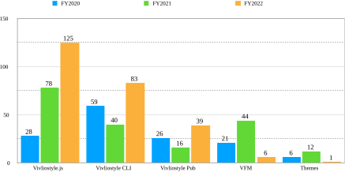

# **Activity Report for FY2022**

## Product development status in terms of number of PRs

In this chapter, we report on the projects we conducted this fiscal year. How was the development of products, which is also the purpose of the foundation of the Foundation? We have tabulated the number of Pull Requests (PRs) for our main products (Fig-4). Note that this report excludes PRs by bots and only counts those by humans.

{ width=100% }

The number of PRs for all the underlying products, [Vivliostyle.js](https://github.com/vivliostyle/vivliostyle.js) is outstanding, and it can be seen that development has made great progress (For more information on our product structure, refer to [FY2021 Activity Report](https://vivliostyle.org/viewer/#src=https://vivliostyle.github.io/vivliostyle_doc/en/reports/vivliostyle-report-2021/vf2021report.html&bookMode=true&userStyle=data:,/*<viewer>*/%0A@page { size: A4; }%0A/*</viewer>*/)).

 Next to that are [Vivliostyle CLI](https://github.com/vivliostyle/vivliostyle-cli), [Vivliostyle Pub](https://github.com/vivliostyle/vivliostyle-pub), and it can be said that development of these products has also progressed well. However, PR numbers for products other than these three were weak.

## Analysis of PR Creators

To summarize so far, there are two distinct groups: the Vivliostyle.js, Vivliostyle CLI, and Vivliostyle Pub groups, whose development has gone smoothly, and the less successful [VFM](https://github.com/vivliostyle/vfm) and [themes](https://github.com/vivliostyle/themes) groups. Let us now turn our attention to the creators of the PRs.

<figure>

| PR creator | number of PRs |
| ----- | --- |
| Representative Murakami | [119](https://github.com/vivliostyle/vivliostyle.js/pulls?q=is%3Apr++created%3A2022-04-01..2023-03-31+author%3AMurakamiShinyu) |
| etc.  | 6 |
| total  | [125](https://github.com/vivliostyle/vivliostyle.js/pulls?q=is%3Apr++created%3A2022-04-01..2023-03-31+-author%3Aapp%2Fdependabot) |

<figcaption>Table-1 Breakdown of PR creators in Vivliostyle.js</figcaption>
</figure>

<figure>

| PR creator | number of PRs |
| ----- | --- |
| Representative Murakami | [72](https://github.com/vivliostyle/vivliostyle-cli/pulls?q=is%3Apr+created%3A2022-04-01..2023-03-31+author%3AMurakamiShinyu) |
| spring-raining | [11](https://github.com/vivliostyle/vivliostyle-cli/pulls?q=is%3Apr+created%3A2022-04-01..2023-03-31+author%3Aspring-raining) |
| total  | [83](https://github.com/vivliostyle/vivliostyle-cli/pulls?q=is%3Apr+created%3A2022-04-01..2023-03-31+-author%3Aapp%2Fdependabot) |

<figcaption>Table-2: Breakdown of PR creators in the Vivliostyle CLI</figcaption>
</figure>

<figure>

| PR creator | number of PRs |
| ----- | --- |
| Representative Murakami | [33](https://github.com/vivliostyle/vivliostyle-pub/pulls?q=is%3Apr+created%3A2022-04-01..2023-03-31+author%3AMurakamiShinyu) |
| takanakahiko | [7](https://github.com/vivliostyle/vivliostyle-pub/pulls?q=is%3Apr+created%3A2022-04-01..2023-03-31+author%3Atakanakahiko) |
| total  | [40](https://github.com/vivliostyle/vivliostyle-pub/pulls?q=is%3Apr+created%3A2022-04-01..2023-03-31+-author%3Aapp%2Fdependabot) |

<figcaption>Table-3: Breakdown of PR Creators at Vivliostyle Pub.</figcaption>
</figure>

As can be seen from these tables, in the groups that developed smoothly, it was Representative Murakami who created many of the PRs. On the other hand, in the group that did not perform so well, Murakami was less involved.

Incidentally, looking at the PR content of Representative Murakami for Vivliostyle CLI and Vivliostyle Pub, it is clear that it is not PR to add original functions to Vivliostyle CLI or Vivliostyle Pub, but rather to spread the feature additions and bug fixes in Vivliostyle.js, for which he himself is the maintainer, to each of them.

In this way, the development situation of Representative Murakami's “solitary struggle,” so to speak, comes to the fore. Of course, as the founder of the Vivliostyle project, it is only natural that Murakami's PR work is heavy. However, in the development of Open Source Software (OSS), it is not desirable from the standpoint of sustainability to concentrate too much work on the founder.

However, there were signs that this situation may change this quarter. Vivliostyle.js, which had been developed almost exclusively by Murakami, now had two new contributors (Fig-5). Of course, the functions added by their PR can be used in other products as well.

](./img/fig-5.png){ width=100% }

The [PR](https://github.com/vivliostyle/vivliostyle.js/pull/1090) by Mr. [hkwi](https://github.com/hkwi), shown above, adds the CSS leader(), which provides the ruled line functionality often used in table of contents. This has been an issue for some time and is a long-awaited addition.

Also, a series of [PRs](https://github.com/vivliostyle/vivliostyle.js/pulls?q=is%3Apr+author%3Adaisuke-tanabe) by Mr. [daisuke-tanabe](https://github.com/daisuke-tanabe) made important corrections, such as bringing the long neglected "@vivliostyle/react" up to the latest version. We need to continue our efforts to increase the number of new contributors in the next fiscal year.

Mr. [spring-raining](https://github.com/orgs/vivliostyle/people/spring-raining), who has been contributing to our foundation since its establishment, has made steady and sustained progress in the Vivliostyle CLI this term, including [v6.0.0 (2022-12-17)](https://github.com/vivliostyle/vivliostyle-cli/blob/main/CHANGELOG.md#600-2022-12-17) that supports ES Modules and [v7.0.0 (2023-03-13)](https://github.com/vivliostyle/vivliostyle-cli/blob/main/CHANGELOG.md#700-2023-03-13) that supports VFM v2.

## Recommendations for the next fiscal year

What can be done to improve the situation described in the previous section, in which Representative Murakami continues to struggle alone? The following are two recommendations.

1. Diversification of development resources
2. Diversification of Business income

Regarding 1 above. Representative Murakami solitary efforts are not limited to this fiscal year. We are truly humbled by his efforts, but unless we can find a way to increase the number of contributors other than Representative Murakami on a sustained basis, the sustainability of our organization will be in jeopardy.

Regarding 2 above. In order to reduce the burden on Representative Murakami, we need to diversify our earnings so that our business income is not solely dependent on contracted development. It is unclear whether the company will be able to receive as many orders in the next fiscal year, but it should continue its efforts.

## Directors

- [Shinyu Murakami](https://github.com/MurakamiShinyu) (Representative Director, Founding Member)
- [Florian Rivoal](https://github.com/frivoal) (Director, Founding Member)
- [Johannes Wilm](https://github.com/johanneswilm) (Director, Founding Member)
- [Katsuhiro Ogata](https://github.com/ogwata) (Director, From January 21, 2020)
