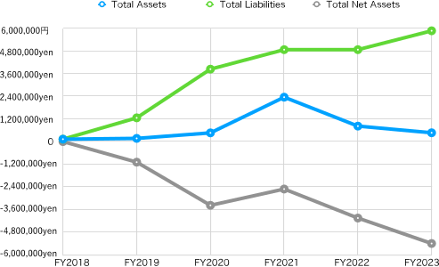
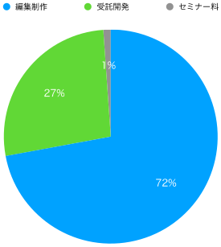
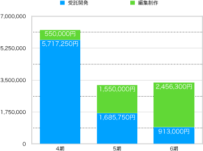
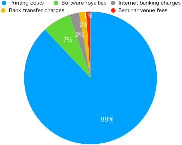

## **Chapter 1: Financial Report for FY2023**

### Introduction

The General Incorporated Association Vivliostyle (hereinafter referred to as "the Association") was established in August 2018 and has been active for five terms until March 2023. Here, we report the financial statements for the sixth term starting in April 2023.

### Balance Sheet for FY 2023

The following shows the status of asset holdings (balance sheet) as of the end of this term (March 31, 2024). The unit is yen.

| Title           | **This FY (2023)**    | **Prev. FY (2022)**    | **Increase/Decrease**     |
| ------------ | ---------- | ---------- | ---------- |
| **I. Assets**   |            |            |            |
| 1. Current assets |            |            |            |
| Cash and deposits | 353,154 | 493,367     | -140,213 |
| Accounts receivable |           |  211,750 | -211,750 |
| Total current assets | 353,154 | 705,117  | -351,963  |
| 2 Fixed Assets |            |            |            |
| (1) Other fixed assets |            |            |            |
| Founding expenses | 113,050    | 113,050    |           |
| Total other fixed assets | 113,050    | 113,050    | 0          |
| Total fixed assets | 113,050    | 113,050    | 0          |
| Total assets | 466,204 | 818,167 | -351,963 |
| **II. Liabilities**   |            |            |            |
| 1. Current liabilities |            |            |            |
| Withholdings | 31,139     | 31,139     |      |
| Loan from officer | 5,806,561 | 4,806,561  | 1,000,000  |
| Accounts payable |  11,000  | 11,000 |    |
| Accrued income taxes |20,000 |  20,000 |    |
| Total current liabilities |5,868,700 | 4,868,700 | 1,000,000 |
| Total liabilities | 5,868,700 | 4,868,700 | 1,000,000 |
| **III. Net Assets** |            |            |            |
| 1. General Net Assets |-5,402,496 | -4,050,533 | -1,351,963 |
| Total net assets |-5,402,496 | -4,050,533 | -1,351,963 |
| Total liabilities and net assets | 466,204 | 818,167  | -351,963  |

Let's look at the transition of the main indicators in the balance sheet since the establishment (Figure 1).

{ width=90% }

The total assets, which had been rising little by little in the third and fourth terms, decreased in the fifth and sixth terms. The net assets also decreased in the fifth and sixth terms following the fifth term. The total liabilities increased by 1 million yen from the previous term. This is due to the increase in loans from officers.

### Statement of Changes in Net Assets for FY 2023

The amount obtained by subtracting liabilities from assets is called "net assets". The "Statement of Changes in Net Assets" records the increase and decrease of this, and from this, we can understand the details of how money was used and sales during this term (from April 1, 2023, to March 31, 2024).

| Title                | **This FY**    | **Prev. FY**    | **Increase/Decrease**     |
| ----------------- | ---------- | ---------- | ---------- |
| **Ⅰ. Changes in General Net Assets** |            |            |            |
| 1. Changes in Ordinary Income         |            |            |            |
| ⑴ Ordinary Revenue            |            |            |            |
| ① Business Revenue             | (3,407,300) | (3,235,750)  | (171,550)  |
| Business Revenue            | 3,407,300  |  3,235,750  | 171,550  |
| ② Received Donations          | (243,254)  |  (148,498) | (94,756)     |
| Received Donations          | 243,254  |  148,498 | 94,756 |
| ③ Miscellaneous Income              | (7)          | (10)          | (-3)   |
| Received Interest              | 7          | 10          | -3          |
| Total Ordinary Revenue              | 3,650,561   | 3,384,258  | 266,303 |
| ⑵ Ordinary Expenses            |            |            |            |
| ① Business Expenses             |            |            |            |
| Business Expenses              | (1,530,724)    | (668,733)     | (861,991)    |
| Travel Expenses             | 8,188 | 1,676 | 6,512 |
| Communication and Transportation Expenses             | 1,221 | 1,848 | -627 |
| Consumables Expenses             |  | 204 | -204 |
| Taxes and Public Dues    | 30,000 |    | 30,000  |
| Miscellaneous Expenses    | 9,650 |    | 9,650  |
| Payment Fees    | 1,129,665 | 461,405  | 668,260 |
| Payment Remuneration   | 352,000 |  198,000 | 154,000 |
| ② Non-operating Expenses             |            |            |            |
| Non-operating Expenses             | (1,000)    | (1,000)     |    |
| Bank Charges             | 1,000 | 1,000 |  |
| Total Ordinary Expenses             | 1,531,724 | 669,733 | 862,991 |
| Ordinary Income (Loss)             | 2,118,837 | 2,714,525 | -595,688 |
| 2. Changes in Extraordinary Income and Losses    |    |    |    |
| ⑴ Extraordinary Income             |            |            |            |
| Extraordinary Income             |  |  |  |
| ⑵ Extraordinary Losses             |            |            |            |
| Extraordinary Losses             |  |  |  |
| Total Extraordinary Income and Losses             |  |  |  |
| Current Term Net Assets             | 2,118,837 | 2,714,525 | -595,688 |
| **Ⅱ. Changes in Designated Net Assets** |            |            |            |
| Changes in Current Term Designated Net Assets       | 0          | 0  | 0    |
| Balance of Designated Net Assets at Beginning of Term        | 0          | 0          | 0     |
| Balance of Designated Net Assets at End of Term        | 0          | 0          | 0          |
| **Ⅲ. Balance of Net Assets at End of Term**   | -5,402,496 | -4,050,533 | -1,331,963 |

The main indicators (the cells in light blue) of this Statement of Changes in Net Assets have been graphed to show the increase and decrease since our establishment (Figure 2).

{ width=90% }

Let's look at each one. First, the "Ordinary Income" (the light blue line) that represents the revenue our organization regularly earns was 3,650,561 yen, 266,303 yen more than the previous term. Looking at the breakdown, the business income, which is our main business, was 3,407,300 yen, 171,550 yen more than the previous term, and the donations received were 243,254 yen, 94,756 yen more than the previous term. The 5th term, which was the previous term, had a significant drop in sales compared to the 4th term, but this term has recovered slightly. Figure 3 shows the breakdown of this business income. It is clear that editing and production, which accounts for more than half at 72%, is the main component.

{ width=45% }

In recent years, our corporation's business income has been centered on contract development and editing production. Figure 3 shows the transition since the 4th term (excluding the seminar fees that were newly added this term). It can be seen that contract development is gradually decreasing, and editing production is increasing.

{ width=70% }

Returning to Figure 2, looking at the Ordinary Expenses (the yellow line), which are the expenses for generating ordinary income, they were 4,982,524 yen, an increase of 84,291 yen from the previous term. Looking at the breakdown, the total business expenses (the green line), which are miscellaneous expenses, increased by 861,991 yen from the previous term to 1,530,724 yen, and the total management fees (the gray line), which are outsourcing fees, decreased by 777,700 yen from the previous term to 3,451,800 yen. In other words, while management fees have decreased, business expenses have increased.

Looking at the breakdown of business expenses, it is noticeable that the payment fees are 1,129,665 yen, which is 668,260 yen more than the previous term. In other words, it can be seen that there was an increase in payment fees that exceeded the reduction in outsourcing fees. Let's take a look at the breakdown of payment fees (Figure 5).

{ width=70% }

88% of the payment fees are for printing. We showed in Figure 3 that editing and production costs have increased, and along with that, it can be seen that printing costs have significantly increased. This is because the contract for editing and production included printing costs, but at the same time, it should be noted that editing and production, which accounts for a large portion of business income, actually has a higher proportion of expenses compared to contract development.

Returning again to Figure 2, looking at the "Current Ordinary Increase/Decrease" (the pink line), which is an indicator of whether the business result is a deficit or a surplus, it was a deficit of minus 1,331,963 yen, although it was 182,012 yen more than the previous term.

Looking at the "General Net Assets End-of-Term Balance" (the red line), which is the amount of net assets at the end of this term, it decreased by 1,331,963 yen from the previous term to minus 5,402,496 yen. This means that the deficit has expanded further from the minus 4,050,533 yen of the previous term.

### Statement of Income and Expenditure for Fiscal 2023

At the end of Chapter 1, let's look at the statement of income and expenditure comparing the budget and the actual amount during this term (from April 1, 2023, to March 31, 2024). However, since our corporation does not formulate a budget, it remains formal and will be substantially the same as the statement of changes in net assets in the previous section.

| Item | Budget | Actual Amount | Difference | Remarks |
| --- | --- | --- | --- | --- |
| **Ⅰ. Changes in General Net Assets** | | | | |
| 1. Changes in Ordinary Income | | | | |
| ⑴ Ordinary Income | | | | |
| ① Business Income | (0) | (3,407,300) | -3,407,300 | |
| Business Income | | 3,407,300 | -3,407,300 | |
| ② Received Donations | (0) | (243,254) | (-243,254) | |
| Received Donations | | 243,254 | -243,254 | |
| ③ Miscellaneous Income | (0) | (7) | (-7) | |
| Received Interest | 0 | 7 | -7 | |
| Total Ordinary Income | 0 | 3,650,561 | -3,650,561 | |
| ⑵ Ordinary Expenses | | | | |
| ① Business Expenses | | | | |
| Business Expenses | (0) | (1,530,724) | -1,530,724 | |
| Travel Expenses | | 8,188 | -8,188 | |
| Communication and Transportation Expenses | | 1,221 | -1,221 | |
| Rent, Taxes and Public Dues | | 30,000 | -30,000 | |
| Miscellaneous Expenses | | 9,650 | -9,650 | |
| Payment Fees | | 1,129,665 | -1,129,665 | |
| Payment Remuneration | | 352,000 | -352,000 | |
| Total Business Expenses | 0 | 1,530,724 | -1,530,724 | |
| ② Administrative Expenses | | | | |
| Admin) Business Contract Expenses | | 3,451,800 | -3,451,800 | |
| Total Administrative Expenses | 0 | 3,451,800 | -3,451,800 | |
| Total Ordinary Expenses | 0 | 4,982,524 | -4,982,524 | |
| Adjusted Ordinary Income and Expenditure Before Valuation Gains and Losses | 0 | -1,331,963 | 1,331,963 | |
| Total Valuation Gains and Losses | 0 | 0 | 0 | |
| Ordinary Income and Expenditure | 0 | -1,331,963 | 1,331,963 | |
| 2. Non-Ordinary Income and Expenditure | | | | |
| ⑴ Non-Ordinary Income | | | | |
| Total Non-Ordinary Income | 0 | 0 | 0 | |
| ⑵ Non-Ordinary Expenses | | | | |
| Total Non-Ordinary Expenses | 0 | 0 | 0 | |
| Non-Ordinary Income and Expenditure | 0 | 0 | 0 | |
| Net Assets Increase/Decrease Before Inter-Account Transfers | 0 | -1,331,963 | 1,331,963 | |
| Net Assets Increase/Decrease Before Tax | 0 | -1,331,963 | 1,331,963 | |
| Corporate Tax, Resident Tax, and Business Tax | 0 | 20,000 | -20,000 | |
| Net Assets Increase/Decrease | 0 | -1,331,963 | 1,331,963 | |
| Balance of General Net Assets at Beginning of Term | 0 | -4,050,533 | 4,050,533 | |
| Balance of General Net Assets at End of Term | 0 | -5,402,496 | 5,402,496 | |
| **Ⅱ. Changes in Designated Net Assets** | | | | |
| Changes in Current Term Designated Net Assets | 0 | 0 | 0 | |
| Balance of Designated Net Assets at Beginning of Term | 0 | 0 | 0 | |
| Balance of Designated Net Assets at End of Term | 0 | 0 | 0 | |
| **Ⅲ. Balance of Net Assets at End of Term** | 0 | -5,402,496 | 5,402,496 | |

## **Chapter 2  Fiscal 2023 (6th Term: April 1, 2023 - March 31, 2024) Business Report**

### Product Development

In Chapter 2, we will report on the business activities conducted this term. First, let's report on product development, which is also the purpose of our establishment. Figure 6 shows the number of PRs for major products over the past four terms.

{ width=100% }

The number of PRs for Vivliostyle.js and Vivliostyle CLI, which are key among the major products, has decreased compared to the previous term. Vivliostyle Pub also fell below the previous term. On the other hand, while VFM and Themes exceeded the previous term, the absolute numbers are small, so overall, unfortunately, it can be said that it was subdued compared to the previous term.

### Hosting Hands-on Seminars

Until now, we have been holding "Vivliostyle User and Developer Gatherings" twice a year in spring and autumn as events to generally showcase our development achievements. However, there were issues such as the burden of preparing for presentations being too great, and the number of participants and video viewers being small, making it not an effective publicity activity. Therefore, we decided to review its format after the last [Vivliostyle ユーザーと開発者の集い 2023春](https://vivliostyle.connpass.com/event/280760/).

What we came up with was a hands-on event in collaboration with a printing company. This involves inviting users from the public to learn how to operate Vivliostyle while actually using it, and having the PDF they created as a final result printed on-demand by the printing company and presented to the user. This should provide an opportunity for the printing company to showcase its own technology, and for users to learn how to use Vivliostyle.

With the cooperation of [欧文印刷株式会社 (Obun Printing Co., Ltd.)](https://obun.jp/), with whom we have a relationship in the editing and production business, we held the [第1回Vivliostyleハンズオンセミナー　講師に教わりながら、Vivliostyleで本を作る！ (First Vivliostyle Hands-on Seminar: Learn from the instructor and create a book with Vivliostyle!)](https://vivliostyle.org/ja/hands-on/1/). However, the result was that the levels of the participating users varied, with the content being too difficult for beginners and not enough for advanced users, making us acutely aware of the difficulty of hands-on seminars. In the future, the challenge will be to appropriately narrow down the level of participants.

- [講師に教わりながら、Vivliostyleで本を作る！（YouTube）](https://www.youtube.com/playlist?list=PLgmHvdtAuq5Ps7oO18Ni2pey1ut7DCfS6)
- [vivliostyle-cli-helper を使った本作り](https://vivliostyle.github.io/vivliostyle-cli-helper-doc/#/ja/)

### Serial Publication on gihyo.jp

An unexpected outcome of the hands-on seminar was the start of a serial publication on gihyo.jp. The discussion began when an editor from Gijutsu-Hyohron Co., Ltd. proposed the idea at a social gathering after the end of the hands-on seminar. The idea is not for a specific person to write, but for all committers to bring the themes they want to write about. As of the time of writing this article, the following articles have been published.

- [第1回：Vivliostyleでなにができるの？（村上真雄・小形克宏）](https://gihyo.jp/article/2024/01/vivliostyle-01)
- [第2回：Vivliostyleに特化したMarkdown - VFMの使い方（akabeko）](https://gihyo.jp/article/2024/03/vivliostyle-02)
- [第3回：CSSフレームワークVivliostyle Themeで簡単にページデザインを編集する（spring-raining）](https://gihyo.jp/article/2024/04/vivliostyle-03)
- [第4回：Vivliostyleで市販書籍とそっくりに組んでみよう（大津雄一郎）](https://gihyo.jp/article/2024/05/vivliostyle-04)

Although the articles are published on the gihyo.jp site, we have set up a private repository within Vivliostyle's GitHub repository for article production. Also, in the pull requests for the manuscripts, our organization is involved as a reviewer.

## Directors

- [Shinyu Murakami](https://github.com/MurakamiShinyu) (Representative Director, Founding Member)
- [Florian Rivoal](https://github.com/frivoal) (Director, Founding Member)
- [Johannes Wilm](https://github.com/johanneswilm) (Director, Founding Member)
- [Katsuhiro Ogata](https://github.com/ogwata) (Director, From January 21, 2020)
