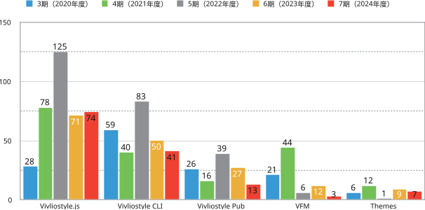

# Vivliostyle Foundation FY2023 Activity Report

## Activity Report for FY2024

### Product Development

First, let's show the number of PRs for major products this term (excluding those from applications). For comparison, we also include data from terms 3-6.

{ width=100% }

### Serial Publication on gihyo.jp

One of the non-development topics is the serial publication on [gihyo.jp](https://gihyo.jp/about/site), titled [Vivliostyleが拓くCSS組版の可能性 (The Possibilities of CSS Typesetting with Vivliostyle)](https://gihyo.jp/list/group/Vivliostyle%E3%81%8C%E6%8B%93%E3%81%8FCSS%E7%B5%84%E7%89%88%E3%81%AE%E5%8F%AF%E8%83%BD%E6%80%A7). This series explains Vivliostyle's technical features, use cases, and the possibilities of CSS typesetting with practical examples. Below is the list of articles published as of the time of writing. For the purpose and background of this series, please refer to the [previous year's activity report](https://vivliostyle.org/viewer/#src=https://vivliostyle.github.io/vivliostyle_doc/en/reports/vivliostyle-report-2023/vf2023report.html&bookMode=true).

- [Vivliostyleでなにができるの？ (What can you do with Vivliostyle?) (Shinyu Murakami, Katsuhiro Ogata)](https://gihyo.jp/article/2024/01/vivliostyle-01)
- [Vivliostyleに特化したMarkdown - VFMの使い方 (VFM: Markdown specialized for Vivliostyle) (akabeko)](https://gihyo.jp/article/2024/03/vivliostyle-02)
- [CSSフレームワークVivliostyle Themeで簡単にページデザインを編集する (Easily edit page design with Vivliostyle Theme CSS framework) (spring-raining)](https://gihyo.jp/article/2024/04/vivliostyle-03)
- [Vivliostyleで市販書籍とそっくりに組んでみよう (Let's typeset exactly like commercial books with Vivliostyle) (Yuichiro Otsu)](https://gihyo.jp/article/2024/05/vivliostyle-040)
- [VFMで学会論文を書いてVivliostyleで組んで投稿する (Writing academic papers with VFM and typesetting with Vivliostyle for submission) [Part 1] (yamahige)](https://gihyo.jp/article/2025/02/vivliostyle-05)
- [VFMで学会論文を書いてVivliostyleで組んで投稿する (Writing academic papers with VFM and typesetting with Vivliostyle for submission) [Part 2] (yamahige)](https://gihyo.jp/article/2025/02/vivliostyle-05-2)

### Reboot of Vivliostyle Pub

Another topic of this term is the reboot of Vivliostyle Pub. This product was released as an alpha version in April 2022, but development had stagnated since then. Vivliostyle Pub aimed to be a web application that allows users to enjoy CSS typesetting without installation, but the alpha version was far from being easy to use, and we had not been able to secure development resources to achieve this goal.

The catalyst for deciding to restart development was meeting with Booko (CEO: Keiko Hasegawa), a self-publishing web service. While Booko has an excellent user interface for easily creating books on the web, it faced technical challenges in typesetting long texts that span across spreads, and needed Vivliostyle's technology to solve this. Therefore, we decided to restart Vivliostyle Pub development in collaboration with Booko. Additionally, to promote the development of open-source Vivliostyle Pub and develop and operate a new Booko service (VivlioBooko) utilizing it, VivlioBooko Inc. was established in February 2025. This includes Booko's CEO Keiko Hasegawa and our foundation's Representative Director Shinyu Murakami and Director Katsuhiro Ogata.

With the addition of new collaborators, we expect not only Vivliostyle Pub but also the entire Vivliostyle project's development to be accelerated. The project's philosophy of aiming to create something that anyone in the world can freely use as open source remains unchanged. We hope to continue increasing the number of collaborators interested in Vivliostyle's development and its applications.

### Directors

- [Shinyu Murakami](https://github.com/MurakamiShinyu) (Representative Director, Founding Member)
- [Florian Rivoal](https://github.com/frivoal) (Director, Founding Member)
- [Johannes Wilm](https://github.com/johanneswilm) (Director, Founding Member)
- [Katsuhiro Ogata](https://github.com/ogwata) (Director, From January 21, 2020)
