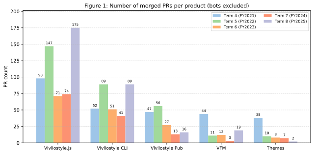

# Vivliostyle Foundation FY2025 Activity Report

## Activity Report for FY2025 (Term 8, April 1, 2025 – March 31, 2026)

### Product Development

The number of PRs for our major products this term (excluding those from applications) is shown below. For comparison, we also include data from terms 4–7.

{ width=100% }

The biggest topic of this term is the marked acceleration of development. The number of PRs for Vivliostyle.js reached 175, more than doubling the 74 of the previous term and setting an all-time high. Vivliostyle CLI also grew significantly, from 41 to 99. VFM, which had dropped to only 3 in the previous term, recovered to 19. On the other hand, Vivliostyle Pub slightly decreased to 6, and Themes recorded its lowest count yet at 3. Overall, it was a year of substantial progress on the core products centered around Vivliostyle.js and Vivliostyle CLI.

### Grant from the NLnet Foundation

Another major topic of this term is that we were selected as a grantee of the [NGI0 Commons Fund](https://nlnet.nl/commonsfund/) administered by the European open-source support organization [NLnet Foundation](https://nlnet.nl/). For details, please refer to [our blog post](https://vivliostyle.org/blog/2025/07/07/obtained-a-grant-from-nlnet/).

The NLnet Foundation, as part of the European Commission's Next Generation Internet (NGI) initiative, supports open-source technology projects that enhance the public nature, privacy, and security of the internet. Vivliostyle began receiving funding from this program, and during this term the first three installments totaling approximately 1.43 million yen were disbursed (see "Grants received" in the financial report).

This grant has enabled us to concentrate on the following areas, where progress had previously been slow due to a lack of development resources:

- Supporting the latest CSS specifications in Vivliostyle.js (improvements to the page-break algorithm, footnote handling, and so on)
- Expanding the editor features and themes of Vivliostyle Pub
- Broadening browser support in Vivliostyle CLI
- Building out the documentation site

The substantial increase in PRs for the major products noted above is also a direct outcome of the development resources secured through this grant.

### Renewal of the Documentation Site

The acceleration of development also created a need to strengthen our outreach to users. To that end, during this term we worked on building a new official documentation site at [docs.vivliostyle.org](https://docs.vivliostyle.org/).

The site aims to comprehensively cover the four products that make up the Vivliostyle ecosystem (Viewer, CLI, VFM, and Themes), from beginner-oriented tutorials to developer-oriented API references. It consists of tutorials, FAQs, references, practical usage guides (footnotes, CMYK conversion, page-group support, and more), and a contribution guide, with each document available for download in WebPub, PDF, and EPUB formats. This embodies Vivliostyle's advantage of "Single Source Multi Output" — generating multiple formats from a single Markdown source.

Until now, information about Vivliostyle has been scattered across GitHub repository READMEs, blog posts and tutorials on `vivliostyle.org`, and articles authored by volunteers. The new documentation site reorganizes these resources and is positioned as a central hub where users can easily find the information they need. We plan to continue expanding it going forward.

### Directors

- [Shinyu Murakami](https://github.com/MurakamiShinyu) (Representative Director, Founding Member)
- [Florian Rivoal](https://github.com/frivoal) (Director, Founding Member)
- [Johannes Wilm](https://github.com/johanneswilm) (Director, Founding Member)
- [Katsuhiro Ogata](https://github.com/ogwata) (Director, From January 21, 2020)
