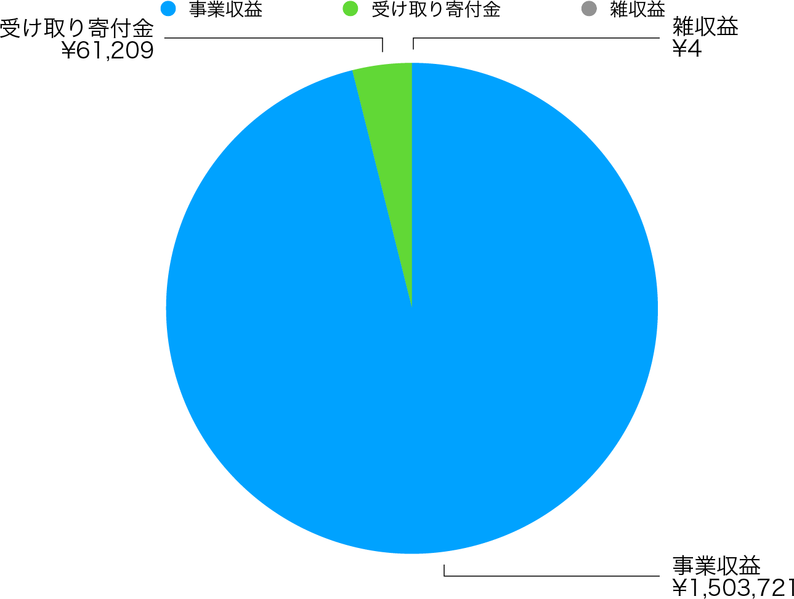
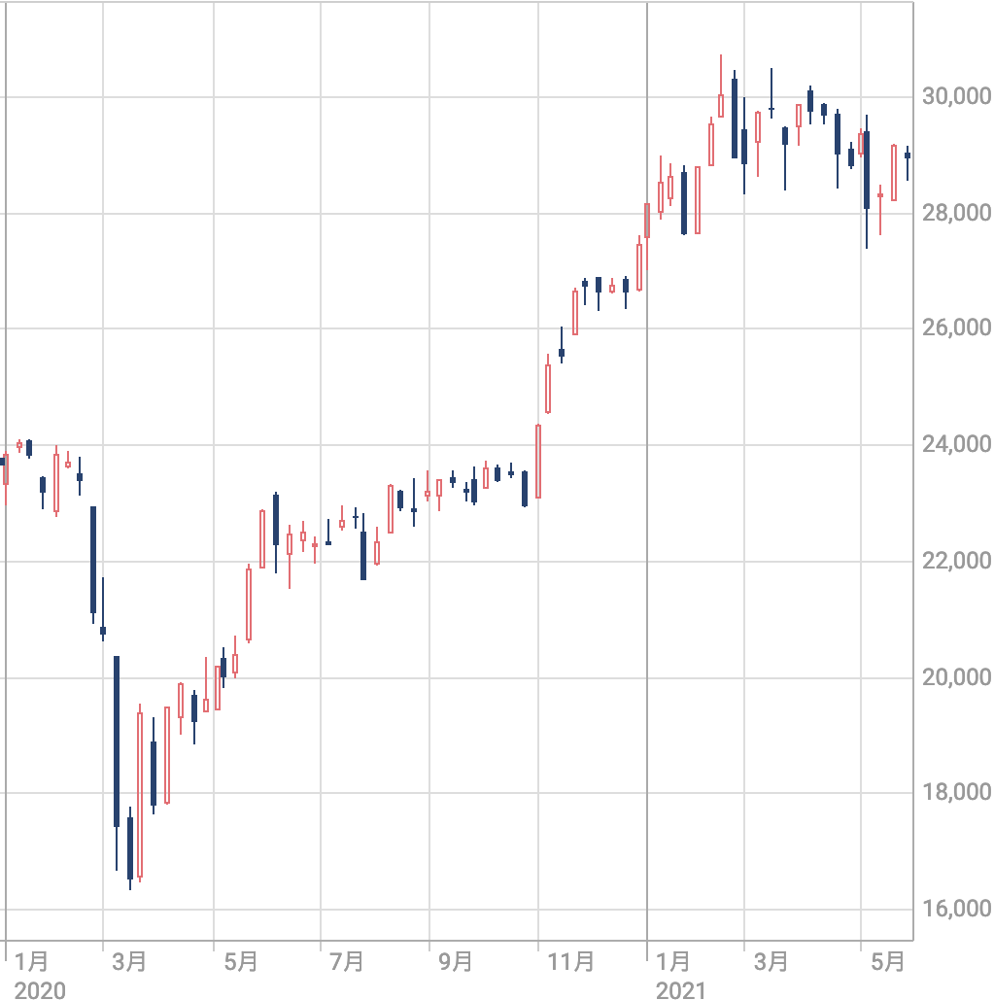
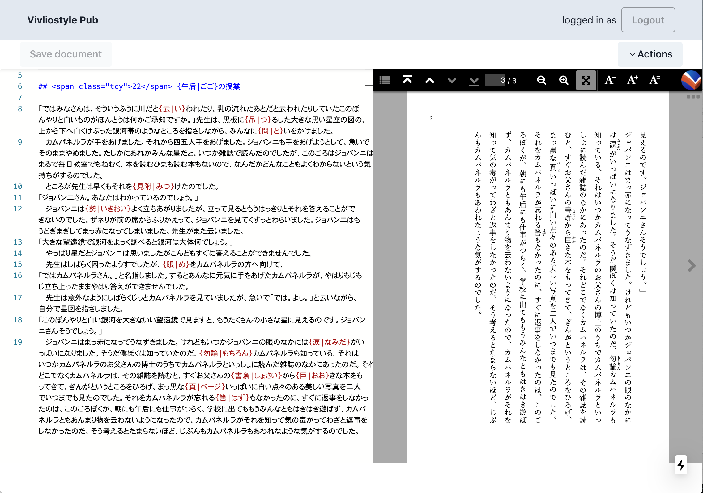

## **第1章  2020年度（第3期 2020年4月1日〜2021年3月31日）事業報告**

### 1. 開発者／ユーザイベントの開催

当法人は、Vivliostyleを広くユーザや開発者に知っていただく場として、開発者／ユーザイベントを年2回開催することにしている。本年度も以下のように開催することができた。

- [2020年4月4日：Vivliostyle ユーザーと開発者の集い 2020春（オンライン）](https://vivliostyle.connpass.com/event/170939/)
-  [2020年10月24日 ：ivliostyle ユーザーと開発者の集い 2020秋（オンライン）](https://vivliostyle.connpass.com/event/189940/)

前者の春イベントは、いわゆるコロナ禍に重なった。当初は日本印刷技術協会（JAGAT）を会場に開催予定だったが、3密回避が至上命題となりつつある状況の中、オンライン配信に切り替えることで乗り切ることができた。同種のイベントがほとんど中止になったことも手伝い、ありがたいことに参加申込は142名にも達した。内容的にも当時アルファ版の開発真っ最中だった Vivliostyle Pub の報告を中心に、当法人のリアルな動きをお知らせすることができたように思う。

春イベントは緊急事態の中、慌ただしく当日を迎えることになったが、それに比べると秋イベントは、CSS組版を主題とするセミナーとして、ある程度熟成できたように思える。たとえばドイツ国立科学図書館オープン・サイエンス・ラボ[Simon Worthington](https://www.force11.org/users/simon-worthington)氏によるCOVID-19に対する公衆衛生教科書の迅速な出版のレポートや、コントリビュータ[akabeko](https://github.com/akabekobeko)氏によるVivliostyleの競合、Paged.jsの使用レポートなど、幅広くCSS組版の魅力を伝えることができたのではないだろうか。

### 2. 公式ウェブサイトのリニューアル**

[前期の事業報告書](https://vivliostyle.org/ja/about-us/#2019%E5%B9%B4%E5%BA%A6%E4%BA%8B%E6%A5%AD%E5%A0%B1%E5%91%8A%E6%9B%B8)でも簡単に触れたが、当法人の創設以来、公式サイトのデザインは2年あまりも変わらないままだった。これを一新するべく、開発者会議で討議を重ねて以下の方針を定め、2019年12月から[yamasy1549](https://github.com/yamasy1549)氏にお願いして作業にとりかかった。

- モバイル環境に対応したシングルカラムレイアウト
- トップページに「Vivliostyle とはなにか」が直感できるアニメを配置
- 各ページの目立つところに GitHub リポジトリのリンクを配置
- ユーザーの利便性のため、以下のページを新設
    - プロダクトの概要をまとめた「使ってみる」
    - ユーザガイドやチュートリアルガイド等の詳細な開発ドキュメント
    - ユーザの疑問を解決するFAQ

平行して4月4日の開催が決まっていた開発者／ユーザイベント（前節参照）の準備をすすめなければならなかったが、なんとかイベント前日の4月3日にリニューアルオープンさせることができた。その後も、以下のような情報を追加していった。

- 4月10日：[ドイツ国立科学技術図書館がVivliostyleを使ってCOVID-19対策の教科書を出版したことを知らせる](https://vivliostyle.org/ja/blog/2020/04/10/tib-book-against-covid19/)
- 4月29日：[GitHub Sponsors による支援を公式サイトで呼びかける](https://vivliostyle.org/ja/blog/2020/04/29/become-a-sponsor-to-vivliostyle-via-github-sponsors/)
- 6月11日：[2019年度事業報告書を公式サイトで公開](https://vivliostyle.org/ja/about-us/#2019%E5%B9%B4%E5%BA%A6%E4%BA%8B%E6%A5%AD%E5%A0%B1%E5%91%8A%E6%9B%B8)
- 8月19日：[Create Bookのチュートリアルを特集企画として公開](https://vivliostyle.org/ja/make-books-with-create-book/)
- 8月29日：[円建てクレジットカード決済（Robot Payment）によるスポンサー募集を公式サイトで開始](https://vivliostyle.org/ja/blog/2020/11/20/You-can-support-Vivliostyle-without-a-GitHub-account/)

中でも寄付による支援の呼びかけは、営利を目的としない（利益の分配をしない）一般社団法人として重要なもので、実際に今期は全部で61,209円の寄付金を集めることができた（図1）。これは経常収益全体の約4%にあたる。今はまだ決して多いとは言えないが、今後も当法人の活動に賛同してくださる人々の受け皿として、大事に育てていきたいと考えている。

{ width=50% }
 
### 3. プロダクトの開発状況

本節では、プロダクトごとに今期の開発状況を説明する。

#### [Vivliostyle CoreとVivliostyle Viewer（vivliostyle.js）](https://github.com/vivliostyle/vivliostyle.js)

プロダクト全体の基盤でもあるVivliostyle CoreとVivliostyle Viewer（vivliostyle.js）は、今期多くの機能追加ができた。この結果、これまで十分とは言えなかった[CSS Paged Media](https://www.w3.org/TR/css-page-3/)への対応をすすめることができた。

 - ページナビゲーション（目次パネル）のサポート（[v2.1.0-pre.1 / 6月30日](https://github.com/vivliostyle/vivliostyle.js/releases/tag/v2.1.0-pre.1)）
 - ページ移動用のスライドバーの実装、マウスホイールのサポート（[v2.2.0 / 11月26日](https://github.com/vivliostyle/vivliostyle.js/releases/tag/v2.2.0)）
- 解凍ずみEPUBの読み込みをサポート（[v2.3.0 / 12月7日](https://github.com/vivliostyle/vivliostyle.js/releases/tag/v2.3.0)）
- ヘッダーやフッター等を実現する名前付き文字列のサポート（[v2.4.0 / 12月28日](https://github.com/vivliostyle/vivliostyle.js/releases/tag/v2.4.0)）
- n番目ページセレクターのサポート（[v2.5.0 / 2月26日](https://github.com/vivliostyle/vivliostyle.js/releases/tag/v2.5.0)）
- 印刷ボタンの追加（[v2.6.0 / 3月14日](https://github.com/vivliostyle/vivliostyle.js/releases/tag/v2.6.0)）

#### [Vivliostyle CLI](https://github.com/vivliostyle/vivliostyle-cli)

Markdown形式の入力をサポートしたことにより、活用の幅が一気に広がった。また、プレビューのUI（画面）がVivliostyle Viewerに統合されたことで、単に組版結果を確認できるだけでなく「長文を読む」プロダクトに成長したと言える。

- プレビューのUIをVivliostyle Viewerに置き換え（[v3.2.0 / 3月29日](https://github.com/vivliostyle/vivliostyle-cli/releases/tag/v3.2.0)）
- Markdownをはじめ様々なファイル形式の入力をサポート、[Vivliostyle Themes](https://github.com/vivliostyle/themes)のサポート、Webブックをはじめ複数の出力をサポート、urlによる外部Webページの読み込みをサポート（[v3.0.0 / 2月7日](https://github.com/vivliostyle/vivliostyle-cli/releases/tag/v3.0.0)）

#### [Vivliostyle Flavored Markdown (VFM)](https://github.com/vivliostyle/vfm)

ルビ、画像サイズ、キャプション、脚注などを実現した、書籍組版のためのMarkdown方言。最も普及しているGitHub Flavored Markdown（GFM）の上位互換である。Vivliostyle CLI v.3.0の原稿作成用に開発されており、6月13日にv1.0.0-alpha.0をリリースし、今期末時点でv1.0.0-alpha.17。

#### [Themes](https://github.com/vivliostyle/themes)

Vivliostyle CLIでCSS組版をするためのスタイルシートを、パッケージとして公開／再利用するための仕組み。7月1日に最初の公式Themeがリリースされ、今期末時点で以下の4つのテーマがリリースされている。

- [theme-slide（スライド）](https://github.com/vivliostyle/themes/tree/master/packages/@vivliostyle/theme-slide)
- [theme-bunko（縦組書籍）](https://github.com/vivliostyle/themes/tree/master/packages/@vivliostyle/theme-bunko#bunko)
- [theme-techbook（横書技術書）](https://github.com/vivliostyle/themes/releases/tag/%40vivliostyle%2Ftheme-techbook%400.2.0)
- {[theme-academic（横組学術レポート）]

#### [Create Book](https://github.com/vivliostyle/create-book)

Vivliostyle CLIを使った書籍制作用の環境を、ローカルに構築するインストーラー。今期末時点でv0.1.6がリリースされている。詳しくは、公式サイトに掲載した以下の記事を参照。

- [特集企画：Create Book で同人誌を作ろう！](https://vivliostyle.org/ja/make-books-with-create-book/)

#### [Vivliostyle Pub](https://github.com/vivliostyle/vivliostyle-pub)

当法人のプロダクトの集大成ともいえるのがVivliostyle Pubだ。そこで開発の経緯を含め、少し詳しく説明する。その出発点はブラウザ上で動作するオンラインエディタ “Viola”である。これを当法人に移譲するので、コントリビュータが協力して作り直してはどうかと申し出てくれたのが、その作者[spring-raining](https://github.com/orgs/vivliostyle/people/spring-raining) 氏だった。その後、月例の開発者会議の中で村上代表理事によりプロジェクト名として “Vivliostyle Pub” が与えられ、正式に開発が開始された。このことは、[前記事業報告書](https://vivliostyle.github.io/vivliostyle_doc/ja/reports/vivliostyle-report-2019/vf2019report.html)でも述べた。

前期末、2020年3月の時点で、最大の懸案は開発資金の確保だった。開発者会議でその解決策が話し合われ、コントリビュータから出されたのが、Vivliostyle Pubの開発をテーマにして[未踏アドバンスト事業](https://www.ipa.go.jp/jinzai/advanced/2020/koubo_index.html)へ応募することだった。このときの開発メンバーは、既述したコントリビュータに加え、[uetchy](https://github.com/orgs/vivliostyle/people/uetchy)氏、[youchan](https://github.com/orgs/vivliostyle/people/youchan)氏、[takanakahiko](https://github.com/orgs/vivliostyle/people/takanakahiko)氏である。

話はまとまった。コントリビュータが一丸となり、日に夜を継いでVivliostyle Pubの開発作業がはじまる。目指すのは5月中旬に予定されている2次審査だ。この時点のバージョンで実装されていたのは、下記のような機能だった。

- クラウド上にデプロイされたVivliostyle CLIには、VFMのごく初期のパーサーが実装
- Vivliostyle CLIはCSS組版した結果を、ライブで出力できる
- 同じくエクスポートメニューからPDFが出力できる
- Webブラウザ経由でエディタで保存すると、GitHub上のファイルが更新される
- こうした結果、ウェブブラウザ画面左のエディタでMarkdownを書くと、画面右で組版結果がライブで確認できる

以下は当時takanakahiko氏が作業用に作った、Vivliostyle Pubのフローチャート（図2）だ。

{ width=100% }

しかし残念ながら6月10日に落選通知を受け取ることとなった。その後、Vivliostyle Pubはごくマイナーなアップデートはされたが、現在動いているのはこの時のアルファ版から大きく変わってはいない。現在のスクリーンショットを示す。

{ width=100% }

他方、開発がほぼ止まったVivliostyle Pubをよそに、その部品とも言えるプロダクト、VFM、Themes、Vivliostyle CL、そしてVivliostyle Viewerの方は大きく進化した。その指針となった文書が、村上代表理事による下記のものだ。

- [Vivliostyle Pub v1 Req (11/9)](https://github.com/vivliostyle/community/wiki/Vivliostyle-Pub-v1-Req)
- [Vivliostyle CLI v3.0 new spec (11/9〜2/9)](https://github.com/vivliostyle/community/wiki/Vivliostyle-CLI-v3.0-new-spec)

こうして開発が進んだVFM、Themes、Vivliostyle CLIを組み込んでいけば、Vivliostyle Pub v1は完成する。次期、2021年8月末にベータ版を公開、同年12月末にローンチを目指して開発が進められることになった。

### 4. Vivliostyleと連携する外部のプロジェクトとの協力

- ドイツ国立科学技術図書館との連携
- 外部企業からの受託開発と保守管理
- プロダクトの進展
      - 売り上げがあった
      - CSS組版の開発を進めることができた

### 5. 理事

- [村上](https://github.com/MurakamiShinyu) [真雄](https://github.com/MurakamiShinyu) [(Shinyu Murakami)](https://github.com/MurakamiShinyu)〈代表理事、設立時社員〉
- [リボアル・フロリアン](https://github.com/frivoal) [(Florian Rivoal)](https://github.com/frivoal)〈理事、設立時社員〉
- [ヨハネス・ウィルム (Johannes Wilm)](https://github.com/johanneswilm)〈理事、設立時社員〉
- [小形](https://github.com/ogwata) [克宏](https://github.com/ogwata) [(Katsuhiro Ogata)](https://github.com/ogwata)〈理事、2020年1月21日より〉

## 第2章 2020年度（第3期 2020年4月1日〜2021年3月31日）決算報告

### 2020年度 貸借対照表

| 科目           | **当年度**    | **前年度**    | **増減**     |
| ------------ | ---------- | ---------- | ---------- |
| **Ⅰ 資産の部**   |            |            |            |
| **1 流動資産**   |            |            |            |
| **現金・預金**    | 345,708    | 52,565     | 293,143    |
| **流動資産合計**   | 345,708    | 52,565     | 293,143    |
| **2 固定資産**   |            |            |            |
| **創立費**      | 113,050    | 113,050    | 0          |
| **資産合計**     | 458,758    | 165,615    | 293,143    |
| **Ⅱ 負債の部**   |            |            |            |
| **1 流動負債**   |            |            |            |
| **預り金**      | 31,139     | 72,568     | -41,429    |
| **役員借入金**    | 3,806,561  | 1,186,477  | 2,620,084  |
| **負債合計**     | 3,837,700  | 1,259,045  | 2,578,655  |
| **Ⅲ 正味財産の部** |            |            |            |
| **1 一般正味財産** | -3,378,942 | -1,093,430 | -2,285,512 |
| **正味財産合計**   | -3,378,942 | -1,093,430 | -2,285,512 |
| **負債及び正味財産合計**   | 458,758    | 165,615    | 293,143    |

### 2020年度 正味財産増減計算書

| 科目                | **当年度**    | **前年度**    | **増減**     |
| ----------------- | ---------- | ---------- | ---------- |
| **Ⅰ. 一般正味財産増減の部** |            |            |            |
| 1. 経常増減の部         |            |            |            |
| ⑴ 経常収益            |            |            |            |
| ①事業収益             | 1,503,721  | 0          | 1,503,721  |
| 事業収益1             | 1,503,721  |            | 1,503,721  |
| ②受け取り寄付金          | 61,209     |            | 61,209     |
| 受け取り寄付金           | 61,209     | 0          | 61,209     |
| ③雑収益              | 4          | 1          | 3          |
| 受取利息              | 4          | 1          | 3          |
| 経常利益計             | 1,564,934  |            |            |
| ⑵ 経常費用            |            |            |            |
| ① 事業費             |            |            |            |
| 事業経費              | 373,823    | 67,850     | 305,973    |
| 旅費交通費             | 11,527     | 12,080     | △553       |
| 通信運搬費             | 252        |            | 252        |
| 雑費                | 39,064     |            | 39,064     |
| 事業費・経費1           | 65,575     | 55,770     | 9,805      |
| 事業費・経費2           | 257,405    |            | 257,405    |
| 事業費計              | 373,823    | 67,850     | 305,973    |
| ② 管理費             |            |            |            |
| 人件費1              | 3,454,000  | 984,881    | 2,469,119  |
| 会議費               | 2,623      |            | 2,623      |
| 管理費計              | 3,456,623  | 984,881    | 2,471,742  |
| 経常費用計             | 3,830,446  | 1,052,731  | 2,777,715  |
| 評価損益等調整前当期経常増減額   | △2,265,512 | △1,052,730 | △1,212,782 |
| 評価損益等計            | 0          | 0          | 0          |
| 当期経常増減額           | △2,265,512 | △1,052,730 | △1,212,782 |
| 2. 経常外増減の部        |            |            |            |
| ⑴ 経常外収益           |            |            |            |
| 経常外収益計            | 0          | 0          | 0          |
| ⑵ 経常外費用           |            |            |            |
| 経常外費用計            | 0          | 0          | 0          |
| 当期経常外増減額          | 0          | 0          | 0          |
| 他会計振替前当期一般正味財産増減額 | △2,265,512 | △1,052,730 | △1,212,782 |
| 税引前当期一般正味財産増減額    | △2,265,512 | △1,052,730 | △1,212,782 |
| 法人税、住民税及び事業税      | 20,000     | 40,700     | △20,700    |
| 当期一般正味財産増減額       | △2,285,512 | △1,052,730 | △1,192,082 |
| 一般正味財産期首残高        | △1,093,430 | 0          | △1,093,430 |
| 一般正味財産期末残高        | △3,378,942 | △1,093,430 | △2,285,512 |
| **Ⅱ. 指定正味財産増減の部** |            |            |            |
| 当期指定正味財産増減額       | 0          | 0          | 0          |
| 指定正味財産期首残高        | 0          | 0          | 0          |
| 指定正味財産期末残高        | 0          | 0          | 0          |
| **Ⅲ. 正味財産期末残高**   | △3,378,942 | △1,093,430 | △1,093,430 |

### 2020年度収支計算書

| 科目                | 予算額 | 決算額        | 差異         | 備考 |
| ----------------- | --- | ---------- | ---------- | -- |
| **Ⅰ. 一般正味財産増減の部** |     |            |            |    |
| 1. 経常増減の部         |     |            |            |    |
| ⑴ 経常収益            |     |            |            |    |
| ①事業収益             | 0   | 1,503,721  | △1,503,721 |    |
| 事業収益1             |     | 1,503,721  | △1,503,721 |    |
| ②受け取り寄付金          | 0   | 61,209     | △61,209    |    |
| 受け取り寄付金           |     | 61,209     | △61,209    |    |
| ③雑収益              | 0   | 4          | △4         |    |
| 受取利息              |     | 4          | △4         |    |
| 経常利益計             | 0   | 1,564,934  | △1,564,934 |    |
| ⑵ 経常費用            |     |            |            |    |
| ① 事業費             |     |            |            |    |
| 事業経費              | 0   | 373,823    | △373,823   |    |
| 旅費交通費             |     | 11,527     | △11,527    |    |
| 通信運搬費             |     | 252        | △252       |    |
| 雑費                |     | 39,064     | △39,064    |    |
| 事業費・経費1           |     | 65,575     | △65,575    |    |
| 事業費・経費2           |     | 257,405    | △257,405   |    |
| 事業費計              | 0   | 373,823    | △373,823   |    |
| ② 管理費             |     |            |            |    |
| 人件費1              |     | 3,454,000  | △3,454,000 |    |
| 会議費               |     | 2,623      | △2,623     |    |
| 管理費計              | 0   | 3,456,623  | △3,456,623 |    |
| 経常費用計             | 0   | 3,830,446  | △3,830,446 |    |
| 評価損益等調整前当期経常増減額   | 0   | △2,265,512 | 2,265,512  |    |
| 評価損益等計            | 0   | 0          | 0          |    |
| 当期経常増減額           | 0   | △2,265,512 | 2,265,512  |    |
| 2. 経常外増減の部        |     |            |            |    |
| ⑴ 経常外収益           |     |            |            |    |
| 経常外収益計            | 0   | 0          | 0          |    |
| ⑵ 経常外費用           |     |            |            |    |
| 経常外費用計            | 0   | 0          | 0          |    |
| 当期経常外増減額          | 0   | 0          | 0          |    |
| 他会計振替前当期一般正味財産増減額 | 0   | △2,265,512 | 2,265,512  |    |
| 税引前当期一般正味財産増減額    | 0   | △2,265,512 | 2,265,512  |    |
| 法人税、住民税及び事業税      | 0   | 20,000     | △20,000    |    |
| 当期一般正味財産増減額       | 0   | △2,285,512 | 2,285,512  |    |
| 一般正味財産期首残高        | 0   | △1,093,430 | 1,093,430  |    |
| 一般正味財産期末残高        | 0   | △3,378,942 | 3,378,942  |    |
| **Ⅱ. 指定正味財産増減の部** |     |            |            |    |
| 当期指定正味財産増減額       | 0   | 0          | 0          |    |
| 指定正味財産期首残高        | 0   | 0          | 0          |    |
| 指定正味財産期末残高        | 0   | 0          | 0          |    |
| **Ⅲ. 正味財産期末残高**   | 0   | △3,378,942 | 3,378,942  |    |

