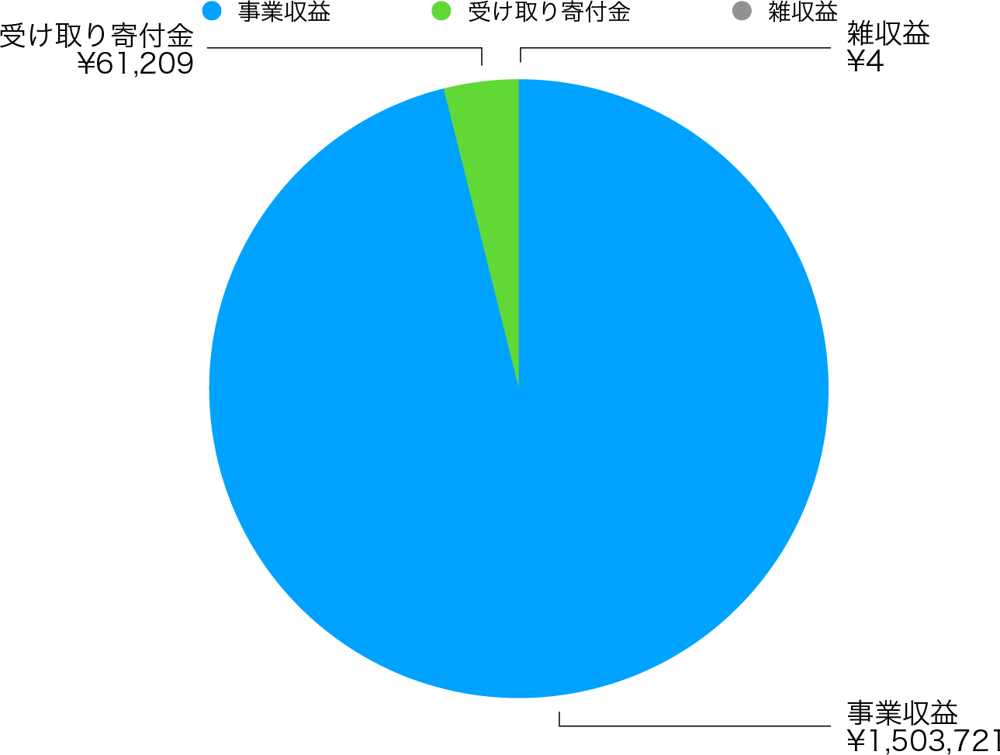

# **2020年度（第3期 2020年4月1日〜2021年3月31日）事業報告**

## 1. 開発者／ユーザーイベントの開催

当法人は、Vivliostyleを広くユーザーや開発者に知っていただく場として、開発者／ユーザーイベントを年2回開催することにしている。本年度も以下のように開催することができた。

- [2020年4月4日：Vivliostyle ユーザーと開発者の集い 2020春（オンライン）](https://vivliostyle.connpass.com/event/170939/)
- [2020年10月24日：Vivliostyle ユーザーと開発者の集い 2020秋（オンライン）](https://vivliostyle.connpass.com/event/189940/)

前者の春イベントは、いわゆるコロナ禍に重なった。当初は日本印刷技術協会（JAGAT）を会場に開催予定だったが、3密回避が至上命題となりつつある状況の中、オンライン配信に切り替えることで乗り切ることができた。同種のイベントの多くが中止になった中で、ありがたいことに参加申込は142名にも達した。内容的にも当時アルファ版の開発真っ最中だった Vivliostyle Pub の報告を中心に、当法人のリアルな動きをお知らせすることができたように思う。

他方、秋イベントはCSS組版を主題とするセミナーとして、じっくり取り組めたように思える。たとえばドイツ国立科学図書館オープン・サイエンス・ラボの[Simon Worthington](https://www.force11.org/users/simon-worthington)氏によるCOVID-19に対する公衆衛生教科書の迅速な出版のレポートや、コントリビュータ[akabeko](https://github.com/akabekobeko)氏による[Paged.js](https://www.pagedmedia.org/paged-js/)（Vivliostyleの競合）の使用レポートなど、Vivliostyleに留まらないCSS組版の魅力を、幅広く伝えることができたのではないだろうか。

## 2. 公式ウェブサイトのリニューアル

[前期の事業報告書](https://vivliostyle.org/ja/about-us/#2019%E5%B9%B4%E5%BA%A6%E4%BA%8B%E6%A5%AD%E5%A0%B1%E5%91%8A%E6%9B%B8)でも簡単に触れたが、当法人の創設以来、公式サイトのデザインは2年あまりも変わらないままだった。これを一新するべく、開発者会議で討議を重ねて以下の方針を定め、2019年12月から[yamasy1549](https://github.com/yamasy1549)氏にお願いして作業にとりかかった。

- モバイル環境に対応したシングルカラムレイアウト
- トップページに「Vivliostyle とはなにか」が直感できるアニメを配置
- 各ページの目立つところに GitHub リポジトリのリンクを配置
- ユーザーの利便性のため、以下のページを新設
    - プロダクトの概要をまとめた「使ってみる」
    - ユーザーガイドやチュートリアルガイド等の詳細な開発ドキュメント
    - ユーザーの疑問を解決するFAQ

平行して開発者／ユーザーイベント（前節参照）の準備をすすめなければならなかったが、なんとかイベント前日の4月3日にリニューアルオープンさせることができた。その後も、以下のような情報を追加していった。

- 4月10日：[ドイツ国立科学技術図書館がVivliostyleを使ってCOVID-19対策の教科書を出版したことを知らせる](https://vivliostyle.org/ja/blog/2020/04/10/tib-book-against-covid19/)
- 4月29日：[GitHub Sponsors による支援を公式サイトで呼びかける](https://vivliostyle.org/ja/blog/2020/04/29/become-a-sponsor-to-vivliostyle-via-github-sponsors/)
- 6月11日：[2019年度事業報告書を公式サイトで公開](https://vivliostyle.org/ja/about-us/#2019%E5%B9%B4%E5%BA%A6%E4%BA%8B%E6%A5%AD%E5%A0%B1%E5%91%8A%E6%9B%B8)
- 8月19日：[Create Bookのチュートリアルを特集企画として公開](https://vivliostyle.org/ja/make-books-with-create-book/)
- 8月29日：[円建てクレジットカード決済（Robot Payment）によるスポンサー募集を公式サイトで開始](https://vivliostyle.org/ja/blog/2020/11/20/You-can-support-Vivliostyle-without-a-GitHub-account/)

中でも寄付による支援の呼びかけは、営利を目的としない（利益の分配をしない）一般社団法人として重要なもので、実際に今期は全部で61,209円の寄付金を集めることができた（図1）。これは経常収益全体の約4%にあたる。今はまだ決して多いとは言えないが、今後も当法人の活動に賛同してくださる人々の受け皿として、大事に育てていきたいと考えている。

{ width=60% }
 
## 3. プロダクトの開発状況

### [Vivliostyle Core / Viewer（vivliostyle.js）](https://github.com/vivliostyle/vivliostyle.js)

プロダクト全体の基盤でもあるVivliostyle CoreとVivliostyle Viewer（vivliostyle.js）は、今期多くの機能追加ができた。この結果、これまで十分とは言えなかった[CSS Paged Media](https://www.w3.org/TR/css-page-3/)への対応をすすめることができた。

 - ページ移動用のスライドバーの実装、マウスホイールのサポート（[v2.2.0 / 11月26日](https://github.com/vivliostyle/vivliostyle.js/releases/tag/v2.2.0)）
- EPUBの見開き表示指定に対応（[v2.3.0 / 12月7日](https://github.com/vivliostyle/vivliostyle.js/releases/tag/v2.3.0)）
- ヘッダーやフッター等を実現する名前付き文字列のサポート（[v2.4.0 / 12月28日](https://github.com/vivliostyle/vivliostyle.js/releases/tag/v2.4.0)）
- n番目ページセレクターのサポート（[v2.5.0 / 2月26日](https://github.com/vivliostyle/vivliostyle.js/releases/tag/v2.5.0)）
- 印刷ボタンの追加（[v2.6.0 / 3月14日](https://github.com/vivliostyle/vivliostyle.js/releases/tag/v2.6.0)）

### [Vivliostyle CLI](https://github.com/vivliostyle/vivliostyle-cli)

これはコマンドライン・インターフェイスでCSS組版ができるコンバーターである。今期Markdown形式の入力をサポートしたことにより、活用の幅が一気に広がった。また、プレビュー画面がVivliostyle Viewerに統合されたことで、単に組版結果を確認できるだけでなく「長文を読める」プロダクトに成長したと言える。後述するが、これは将来のVivliostyle Pub v1にも良い影響を及ぼすことが期待できる。リリースごとの詳細は下記の通りだ。

- プレビューのUIをVivliostyle Viewerに置き換えた（[v3.2.0 / 3月29日](https://github.com/vivliostyle/vivliostyle-cli/releases/tag/v3.2.0)）
- Markdownをはじめ様々なファイル形式の入力をサポート、[Themes](https://github.com/vivliostyle/themes)のサポート、Webブックをはじめ複数の出力をサポート、URLによる外部Webページの読み込みをサポート（[v3.0.0 / 2月7日](https://github.com/vivliostyle/vivliostyle-cli/releases/tag/v3.0.0)）

### [Vivliostyle Flavored Markdown (VFM)](https://github.com/vivliostyle/vfm)

これはルビ、画像サイズ、キャプション、脚注などを実現した、書籍組版のためのMarkdown方言である。最も普及しているMarkdown仕様、GitHub Flavored Markdown（GFM）の上位互換だ。Vivliostyle CLI v3.0の原稿作成用に開発されており、6月13日にv1.0.0-alpha.0をリリースし、今期末時点でv1.0.0-alpha.17をリリースし、継続して開発中である。

### [Themes](https://github.com/vivliostyle/themes)

これはVivliostyle CLIでCSS組版をするためのスタイルシートを、パッケージとして公開／再利用するための仕組みだ。7月1日に最初の公式Themeがリリースされ、今期末時点で以下の3つのテーマがリリースされている。引き続き拡張していきたい。

- [theme-slide（スライド）](https://github.com/vivliostyle/themes/tree/master/packages/@vivliostyle/theme-slide)
- [theme-bunko（縦組書籍）](https://github.com/vivliostyle/themes/tree/master/packages/@vivliostyle/theme-bunko)
- [theme-techbook（技術書）](https://github.com/vivliostyle/themes/tree/master/packages/%40vivliostyle/theme-techbook)

### [Create Book](https://github.com/vivliostyle/create-book)

これはVivliostyle CLIを使った書籍制作用の環境をローカルに構築するインストーラーであり、Vivliostyle Pubのローカル版という一面もある。後述する未踏アドバンスト事業落選を契機に、[uetchy](https://github.com/uetchy)氏によって作られた。今期末時点でv0.1.6がリリースされている。詳細は、公式サイトに掲載した以下の記事を参照してほしい。

- [特集企画：Create Book で同人誌を作ろう！](https://vivliostyle.org/ja/make-books-with-create-book/)

### [Vivliostyle Pub](https://github.com/vivliostyle/vivliostyle-pub)

当法人プロダクトの集大成ともいえるのがVivliostyle Pubだ。そこで開発の経緯について、少し詳しく本項で説明する。その出発点はブラウザ上で動作するオンラインエディタ "Viola" である。その作者である[spring-raining](https://github.com/spring-raining) 氏は、これを当法人に移譲するので、コントリビュータが協力して作り直してはどうかと申し出てくれた。その後、月例の開発者会議の中で村上代表理事により "Vivliostyle Pub" というプロジェクト名が与えられ、正式に開発が開始された。このことは前期事業報告書でも述べた。

前期末の時点で、最大の懸案は開発資金の確保であり、開発者会議でその解決策が話し合われた。そこでコントリビュータから提案されたのが、Vivliostyle Pubの開発をテーマにして[未踏アドバンスト事業](https://www.ipa.go.jp/jinzai/advanced/2020/koubo_index.html)に応募することだった。

皆で検討した結果「挑戦してみよう」と決まる。規定により法人は応募できないため、以下の個人の集まりという形で、4月2日に応募を終えた。

- [spring-raining](https://github.com/spring-raining) （代表）
- [youchan](https://github.com/youchan)
- [takanakahiko](https://github.com/takanakahiko)
- [uetchy](https://github.com/uetchy)
- [yamasy1549](https://github.com/yamasy1549)
- [MurakamiShinyu](https://github.com/MurakamiShinyu)

そこからチームは一丸となり、連携しながらVivliostyle Pubの開発にのめり込んでいった。目指すのは5月中旬に予定されている2次審査である。この時点のバージョン（アルファ版）の概要は下記の通りだ。

- クラウド上にデプロイされたVivliostyle CLIには、VFMのごく初期のパーサーが実装されている
- Vivliostyle CLIはCSS組版した結果をブラウザに出力できる
- 同じくエクスポートメニューからPDFをダウンロードできる
- エディタで保存すると、GitHub上のファイルが更新される
- こうした結果、ウェブブラウザ画面左のエディタでMarkdownを書くと、画面右にすぐさま組版結果が表示される

以下は当時takanakahiko氏が作業用に作った、Vivliostyle Pubのフローチャート（図2）だ。

{ width=60% }

5月15日には無事に第1次審査を通過。翌16日に第2次審査に臨んだものの、残念ながら6月10日に落選通知を受け取ることとなった。その後、Vivliostyle Pubはごくマイナーなアップデートはされたが、今期末の時点で動いているVivliostyle Pubは、アルファ版からあまり変わってはいない。現在のスクリーンショットを示す。

{ width=60% }

開発がほぼ止まったVivliostyle Pubをよそに、その部品とも位置づけられるVFM、Themes、Vivliostyle CLI、そしてVivliostyle Core / Viewerの方は、その後大きく進化させることができた。しかしそのためには、まず未踏アドバンスト事業落選のインパクトを乗り越える必要があった。その指針となったのが、村上代表理事による下記の文書である。

- [Vivliostyle Pub v1 Req (11/9)](https://github.com/vivliostyle/community/wiki/Vivliostyle-Pub-v1-Req)
- [Vivliostyle CLI v3.0 new spec (11/9〜2/9)](https://github.com/vivliostyle/community/wiki/Vivliostyle-CLI-v3.0-new-spec)

こうして開発が進んだVFM、Themes、Vivliostyle CLIを組み込めば、無事にVivliostyle Pub v1がリリースできる。それこそが次期の課題となるはずだ。それを果たすために、2021年8月末にベータ版公開、同年12月末ローンチを目指して開発が進められることになった。

## 4. Vivliostyleと連携する外部組織との協働

前期の事業収入は0円であった。しかし次章や前掲図1にあるとおり、今期は1,503,721円の事業収入を上げることができた。とくに大きかったのは、以前から村上代表理事が関係してきた外部企業からの受託開発だ。じつは、前節Vivliostyle Core / Viewerの項で挙げた開発成果は、多くがこの外部企業からの報酬によるものだ。

また、村上代表理事は第1節でふれたSimon Worthington氏と、その後も議論をつづけることで彼等の開発にコミットし続けた。これにより彼等から開発受注が発生して事業収入を得ることができた。このように、外部組織との協働がそのままVivliostyleの開発につながり、さらにその結果として課題だったCSS Paged Mediaへの対応も進めることができた。これは大変ありがたいことだった。

## 5. 理事

- [村上真雄 (Shinyu Murakami)](https://github.com/MurakamiShinyu)〈代表理事、設立時社員〉
- [リボアル・フロリアン (Florian Rivoal)](https://github.com/frivoal)〈理事、設立時社員〉
- [ヨハネス・ウィルム (Johannes Wilm)](https://github.com/johanneswilm)〈理事、設立時社員〉
- [小形克宏 (Katsuhiro Ogata)](https://github.com/ogwata)〈理事、2020年1月21日より〉

