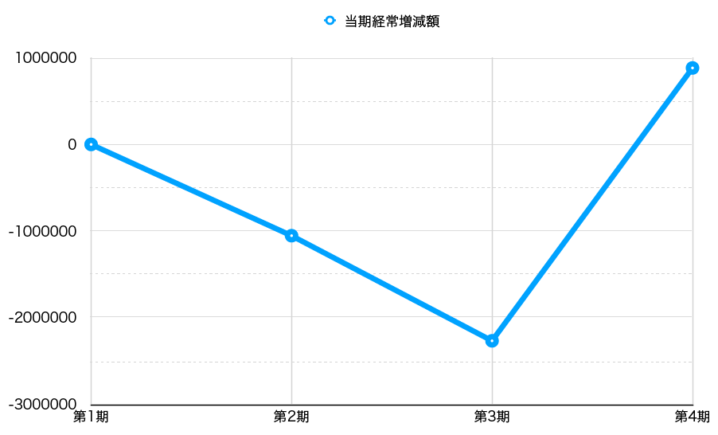
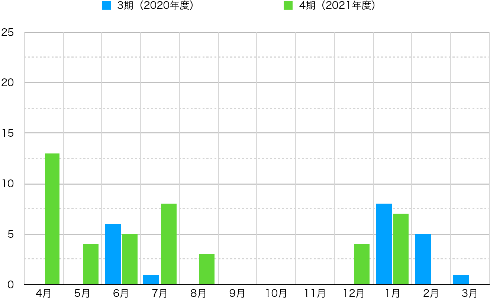

## 第1章 2021年度（第4期 2021年4月1日〜2022年3月31日）決算報告

### はじめに

今期の事業報告から構成を変更し、第1章として過去と比較しながら決算内容を報告し、それを踏まえつつ第2章として今期の事業内容を振り返ることにする。

### 2021年度貸借対照表

今期末（2022年3月31日）現在における資産の保有状況（貸借対照表）を以下に示す。なお、単位は円である。

| 科目           | **当年度**    | **前年度**    | **増減**     |
| ------------ | ---------- | ---------- | ---------- |
| **Ⅰ 資産の部**   |            |            |            |
| 1 流動資産   |            |            |            |
| 現金・預金    |   1,180,342  | 345,708     | 834,634    |
| 他流動資産   |   1,058,750  |      | 1,058,750    |
| 流動資産合計   |   2,239,092  | 345,708     | 1,893,384    |
| 2 固定資産   |            |            |            |
| (1) その他固定資産   |            |            |            |
| 創立費      | 113,050    | 113,050    | 0          |
| その他固定資産合計 | 113,050    | 113,050    | 0          |
| 固定資産合計 | 113,050    | 113,050    | 0          |
| 資産合計     | 2,352,142    | 458,758    | 1,893,384    |
| **Ⅱ 負債の部**   |            |            |            |
|1 流動負債  |            |            |            |
| 預り金     | 31,139     | 31,139     | 0    |
| 役員借入金    | 4,806,561  | 3,806,561  | 1,000,000  |
| 買掛金   |  11,000  |            |  11,000 |
| 未払法人税等   |  20,000 |            | 20,000  |
| 流動負債合計   | 4,868,700 | 3,837,700 | 1,031,000 |
| 負債合計     | 4,868,700 | 3,837,700 | 1,031,000 |
| **Ⅲ 正味財産の部** |            |            |            |
| 1 一般正味財産 | -2,516,558 | -3,378,942 | 862,384 |
| 正味財産合計   | -2,516,558 | -3,378,942 | 862,384 |
| 負債及び正味財産合計   | 2,352,142    | 458,758    | 1,893,384    |

1年以内に回収できる資産を流動資産という。今期の流動資産合計は、前期から1,893,384円増加した2,239,092円だった。1年よりも長く保有される固定資産と合計した資産合計は、同じく1,893,384円増の2,352,142円となっている（なお創立以来、固定資産額は変わってない）。

一方、負債合計は昨年より1,031,000円増えて4,868,700円となった。資産合計から負債合計を引いた正味財産合計は、前期よりも862,384円増加して-2,516,558円だ。ここまでの貸借対照表における主な指標を、第1期から通覧したグラフ1を以下に示そう。創立以来、下降する一方だった正味財産合計が、今期ではまだマイナスながらも上昇に転ずることができたのが目を引く（図1）。

{ width=100% }

### 2021年度正味財産増減計算書

次に、今期中（2020年4月1日から2021年3月31日）のお金の使い方や売上の明細がわかる、正味財産増減計算書を見てみよう。これも単位は円である。

| 科目                | **当年度**    | **前年度**    | **増減**     |
| ----------------- | ---------- | ---------- | ---------- |
| **Ⅰ. 一般正味財産増減の部** |            |            |            |
| 1. 経常増減の部         |            |            |            |
| ⑴ 経常収益            |            |            |            |
| ①事業収益             | ( 6,267,250) | (1,503,721)  | (4,763,529)  |
| 事業収益            | 6,267,250  |  1,503,721  | 4,763,529  |
| ②受取寄付金          | (116,546)  |  (61,209) | (55,337)     |
| 受取寄付金          | 116,546  |  61,209 | 55,337     |
| ③雑収益              | (6)          | (4)          | (2)          |
| 受取利息              | 6          | 4          | 2          |
| 経常収益計              | 6,383,802   | 1,564,934  | 4,818,868  |
| ⑵ 経常費用            |            |            |            |
| ① 事業費             |            |            |            |
| 事業経費              | (325,918)    | (373,823)     | (-47,905)    |
| 事）旅費交通費             |      | 11,527   | -11,527  |
| 事）通信運搬費             | 940    |   252   | 688        |
| 事）消耗品費             | 22,000    |     | 22,000        |
| 事）雑費                |      |  39,064  | -39,064     |
| 事）支払手数料    | 97,624     | 65,575     | 32,049     |
| 事）支払報酬料   | 198,000    |   257,405 | -59,405    |
| 事）新聞図書費   | 7,354   |    | 7,354    |
| 事業費計              | 325,918    | 373,823    | -47,905    |
| ② 管理費             |            |            |            |
| 管）業務委託費  | 5,175,500  | 3,454,000    | 1,721,500  |
| 管）会議費               |       |  2,623 | -2,623      |
| 管理費計              | 5,175,500  | 3,456,623    | 1,718,877  |
| 経常費用計             | 5,501,418  | 3,830,446  | 1,670,972  |
| 評価損益等調整前当期経常増減額   | 882,384 | -2,265,512 | 3,147,896 |
| 評価損益等計            | 0          | 0          | 0          |
| 当期経常増減額           | 882,384 | -2,265,512 | 3,147,896 |
| 2. 経常外増減の部        |            |            |            |
| ⑴ 経常外収益           |            |            |            |
| 経常外収益計            | 0          | 0          | 0          |
| ⑵ 経常外費用           |            |            |            |
| 経常外費用計            | 0          | 0          | 0          |
| 当期経常外増減額          | 0          | 0          | 0          |
| 他会計振替前当期一般正味財産増減額 | 882,384 | -2,265,512 | 3,147,896 |
| 税引前当期一般正味財産増減額    | 882,384 | -2,265,512 | 3,147,896 |
| 法人税、住民税及び事業税      | 20,000     | 20,000     | 0    |
| 当期一般正味財産増減額       | 862,384 | -2,285,512 | 3,147,896 |
| 一般正味財産期首残高        | -3,378,942 | -1,093,430  | -2,285,512 |
| 一般正味財産期末残高        | -2,516,558 | -3,378,942 | 862,384 |
| **Ⅱ. 指定正味財産増減の部** |            |            |            |
| 当期指定正味財産増減額       | 0          | 0          | 0          |
| 指定正味財産期首残高        | 0          | 0          | 0          |
| 指定正味財産期末残高        | 0          | 0          | 0          |
| **Ⅲ. 正味財産期末残高**   | -2,516,558 | -3,378,942 | 862,384 |

まず「Ⅰ. 一般正味財産増減の部」を見ていこう。ここでいう「一般正味財産」とは「指定正味財産」と対になる用語だ。後者が使途を指定され法人の意志で使い道を決められない財産であるのに対し、前者はその反対、法人が自由に使い道を決められる財産だ。後述するように当法人は指定正味財産は0円なので、このセクションを見ることで、第4期の収入と支出を把握することができるはずだ。

その「Ⅰ. 一般正味財産増減の部」の中で目を引くのが、事業収益が前期より4,763,529円多い6,267,250円をあげたことだ（淡黄の背景色）。この結果、本業で得た利益を示す経常利益計は、前期より1,564,934円多い6,383,802円をあげることができた。この収益額は前期の約4倍に当たる。これは[前期事業報告書](https://vivliostyle.org/viewer/#src=https://vivliostyle.github.io/vivliostyle_doc/ja/reports/vivliostyle-report-2020/vf2020report.html&bookMode=true&f=epubcfi(/2!/4/84))でも述べた外部企業からの受託開発が、今期に入って拡大したことによる。また、額としては決して多くないものの、受取寄付金も前期より55,337円多い116,546円を得ることができた。

一方、事業をおこなうための経費である事業費計は、前期より47,905円少ない325,918円だった。法人が存続するための費用である管理費計は、前期より1,718,877円多い5,175,500円だった。この増加分は、前述した大幅増となった事業収益に関わる業務委託費（下請への人件費）である。すでに述べたように、前期も事業収益は1,503,721円をあげていた。それを約4倍も拡大できたのは、件数自体が増えたこともあるが、村上代表理事以外の開発者へ下請に出せたことが大きく寄与している。来期も同様以上の事業収益を確保できるかは、開発リソースの確保がカギとなろう。なお、ここまで述べた事業費計と管理費計を合算した経常費用計は、前期より1,670,972円多い5,501,418円である。

さらに下に見ていって、有価証券等に関わる保有資産の購入価格と現在価格の差額を示す評価損益等計は0円。有価証券は保有していないからだ。本業以外の収益を示す経常外費用計も0円となっている。

「Ⅰ. 一般正味財産増減の部」の最後は、一般正味財産期首残高と一般正味財産期末残高だ。これを簡単に言えば、前者が前期からの繰越金であるのに対し、後者は次期への繰越金だ。前者、つまり一般正味財産期首残高が-3,378,942だったところ、後者、つまり一般正味財産期首残高は862,384円増加した-2,516,558を計上した。わかりやすく言えば、前期までの赤字を減らしはしたものの、解消までの道のりはまだまだ遠いことを表している。

次のセクション「Ⅱ. 指定正味財産増減の部」は前述したとおりすべて0円だ。そして、第5期への繰越金である「Ⅲ. 正味財産期末残高」は-2,516,558円（一般正味財産期末残高と一致）となった。ここまでの正味財産増減計算書における主な指標の変遷を、創立から辿ってグラフ化したものを示す（グラフ2）。事業費を除いた全ての指標が、大きく上昇していることが分かる（図2）。

{ width=100% }

最後に当期経常増減額、つまり事業の結果が赤字か黒字かを示す指標を、創立からグラフ化したものを示す（図3）。前期まで赤字額が増える一方だったのを、今期はV字回復で黒字（いわゆる単年度黒字）に転換できたことが分かる。

{ width=100% }

### 2021年度収支計算書

第1章の終わりとして、今期中（2020年4月1日から2021年3月31日）における、予算額と決算額を比較した収支計算書を見よう。ただし、当法人は予算を策定していないので、形式的なものに留まり、前節の正味財産増減計算書と実質的に同じ内容になる。なお、これも単位は円である。

| 科目                | 予算額 | 決算額        | 差異         | 備考 |
| ----------------- | --- | ---------- | ---------- | -- |
| **Ⅰ. 一般正味財産増減の部** |     |            |            |    |
| 1. 経常増減の部         |     |            |            |    |
| ⑴ 経常収益            |     |            |            |    |
| ①事業収益             | (0)   | (6,267,250)  | -6,267,250 |    |
| 事業収益             |     | 6,267,250  | -6,267,250 |    |
| ②受取寄付金          | (0)   |( 116,546)     | (-116,546)    |    |
| 受取寄付金           |     | 116,546     | -116,546   |    |
| ③雑収益              | (0)   | (6)          | (-6)         |    |
| 受取利息              |  0   | 6          | -6         |    |
| 経常利益計             | 0   | 6,383,802  | -6,383,802 |    |
| ⑵ 経常費用            |     |            |            |    |
| ① 事業費             |     |            |            |    |
| 事業経費              | (0)   | (325,918)    | -325,918   |    |
| 事）通信運搬費  |     | 940        | -940      |    |
| 事）消耗品費   |     | 22,000     | -22,000    |    |
| 事）支払手数料 |     | 97,624    | -97,624    |    |
| 事）支払報酬料   |     | 198,000    | -198,000   |    |
| 事）新聞図書費  |     | 7,354    | -7,354   |    |
| 事業費計              | 0   | 325,918    | -325,918   |    |
| ② 管理費             |     |            |            |    |
| 管）業務委託費    |     | 5,175,500  | -5,175,500 |    |
| 管理費計              | 0   | 5,175,500  | -5,175,500 |    |
| 経常費用計             | 0   | 5,501,418  | -5,501,418 |    |
| 評価損益等調整前当期経常増減額   | 0   | 882,384 |-882,384  |    |
| 評価損益等計            | 0   | 0          | 0          |    |
| 当期経常増減額           | 0   | 882,384 | -882,384  |    |
| 2. 経常外増減の部        |     |            |            |    |
| ⑴ 経常外収益           |     |            |            |    |
| 経常外収益計            | 0   | 0          | 0          |    |
| ⑵ 経常外費用           |     |            |            |    |
| 経常外費用計            | 0   | 0          | 0          |    |
| 当期経常外増減額          | 0   | 0          | 0          |    |
| 他会計振替前当期一般正味財産増減額 | 0   | 882,384 | -882,384  |    |
| 税引前当期一般正味財産増減額    | 0   | 882,384 | -882,384  |    |
| 法人税、住民税及び事業税      | 0   | 20,000     | -20,000    |    |
| 当期一般正味財産増減額       | 0   | 882,384 | -882,384  |    |
| 一般正味財産期首残高        | 0   | -3,378,942 | 3,378,942  |    |
| 一般正味財産期末残高        | 0   | -2,516,558 | 2,516,558  |    |
| **Ⅱ. 指定正味財産増減の部** |     |            |            |    |
| 当期指定正味財産増減額       | 0   | 0          | 0          |    |
| 指定正味財産期首残高        | 0   | 0          | 0          |    |
| 指定正味財産期末残高        | 0   | 0          | 0          |    |
| **Ⅲ. 正味財産期末残高**   | 0   | -2,516,558 | 2,516,558  |    |

## **第2章  2021年度（第3期 2021年4月1日〜2022年3月31日）事業報告**

### はじめに

前章で述べたように、当法人は今期、単年度黒字を達成することができた。その直接の原因は、既述のように外部企業からの受託開発が拡大したからだ。しかし、背景にはVivliostyleプロダクトが充実したこと、そしてラインナップが整備されたことにより、プロダクト間のエコシステムが機能し始めたことが与って大きい。

言い換えれば、これらの要因なしに受託開発の拡大もなかったと考えられる。そこで本章ではVivliostyleプロダクトそれぞれの開発状況を説明する。さらに次期への課題はないかを探っていく。これも繰り返しになるが、当法人は決して少なくない累積赤字を抱えており、その解消が当面の目標となるからだ。

### プロダクトの分類とそれぞれの役目

今期の開発状況について報告する前に、簡単にプロダクトを整理しておこう。近年プロダクトが増え、ラインナップが整ったのは喜ばしいが、それぞれがどのような役割を果たしているのか、全体の中でどのように位置づけられるのか、外側からは分かりづらくなっているからだ。

- **ライブラリ（アプリケーションに組み込まれる「共通部品」）**
    - [Vivliostyle.js（Vivliostyle Viewerを含む）](https://github.com/vivliostyle/vivliostyle.js)
    - [VFM (Vivliostyle Flavored Markdown)](https://github.com/vivliostyle/vfm)
    - [Themes](https://github.com/vivliostyle/themes)
- **ジェネレータ類（Markdown+CSSをHTML+CSSに変換）**
    - [Vivliostyle CLI](https://github.com/vivliostyle/vivliostyle-cli)
    - [create-book](https://github.com/vivliostyle/create-book)
    - [vivliostyle-sitegen](https://github.com/vivliostyle/vivliostyle-sitegen)
- **Webアプリ（上記を統合したアプリケーション）**
    - [Vivliostyle Pub](https://github.com/vivliostyle/vivliostyle-pub)
- **Webコンテンツとその制作サイト（Vivliostyleに関わるドキュメント・サイト）**
    - [vivliostyle.org](https://github.com/vivliostyle/vivliostyle.org)（[Webサイト本体](https://vivliostyle.org/ja/)）
    - [docs.vivliostyle.org](https://github.com/vivliostyle/docs.vivliostyle.org) （[各プロダクトのユーザガイド](https://vivliostyle.org/ja/documents/)）
    - [docs-vivliostyle-pub](https://github.com/vivliostyle/docs-vivliostyle-pub) （[Vivliostyle Pubのユーザガイド](https://vivliostyle.github.io/docs-vivliostyle-pub/#/ja/)）
    - [vivliostyle_doc](https://github.com/vivliostyle/vivliostyle_doc)（[サンプルページ](https://vivliostyle.org/ja/samples/)や[事業報告書](https://vivliostyle.org/ja/about-us/)）

上記のリンクは、それぞれのリポジトリへのものだ。つまり、上記分類はリポジトリの分類でもある。また、上記分類は必ずしも厳密なものではない。たとえばVFMはライブラリであると同時に、MarkdownをHTMLに変換するジェネレータの一面ももつ。

では次節以降、上記分類に従いながら今期における各プロダクトの開発状況を、ユーザイベントでの発表やブログ記事などを参照しながら説明していこう。なお、タイトルのカッコ内は（期首時点のバージョン→期末時点のバージョン）である。

### ライブラリ：Vivliostyle.js（v2.7.0→v2.14.4 ）

[Vivliostyle.js](https://github.com/vivliostyle/vivliostyle.js)は実際にCSS組版をおこなうソフトウェアであり、Vivliostyleプロダクトの中核的存在である。幸いなことに本プロダクトは、以下のように今期大幅な機能アップを果たすことができた。

- **組版機能の向上**
     - [イベント発表：Vivliostyle CoreにおけるCSS Paged Media の実装](https://www.youtube.com/watch?v=_y3YBHNN2Oc)（村上真雄）
     - [イベント発表：CSS text-spacingサポート等Vivliostyle.jsの進化と今後の開発予定](https://www.youtube.com/watch?v=2hvsMhTJai4)（村上真雄）
     - [ブログ：最近のVivliostyle.jsの進化について](https://vivliostyle.org/ja/blog/2021/10/12/recent-vivliostyle-js-updates/)（小形克宏）
     - [ブログ：行末処理が進化して多様な組版ができるように](https://vivliostyle.org/ja/blog/2022/02/08/Improved-of-line-end-handling-and-support-for-page-progression-direction-in-PDF/)（小形克宏）
- **HTMLの中でJavaScriptの実行が可能に**
     - [ブログ：Vivliostyleの組版でJavaScriptが使えるようになりました](https://vivliostyle.org/ja/blog/2022/01/24/JavaScript-can-now-be-used-in-typesetting-by-Vivliostyle/)（小形克宏）
- **Webフォントへの対応**
     - [イベント発表：Vivliostyle PubでWebフォントを使う](https://www.youtube.com/watch?v=Hz5_Wd7d5lw)（小形克宏）
     - [イベント発表：VivliostyleでWebフォントを使う 調査編](https://www.youtube.com/watch?v=czVRSsekLjc)（小形克宏）

では、これらの機能はどのようにして開発されたのか。当該リポジトリにおける月毎のプルリクエスト数をグラフ化し、前期と比較してみたのが下記のグラフだ（図4／自動処理は除外し、人間によるプルリクエストのみを対象にした。以下同）。

{ width=100% }

前期も年間を通してコンスタントにプルリクエストを出していたが、今期はそれを上回る開発ペースであったことがわかる。前掲の機能アップも、こうした熱心な開発の結果として実現された。

ここで重要なことは、Vivliostyle.jsの機能アップが、これを組み込んだVivliostyle CLIやVivliostyle Pubにも波及し、直ちにこれらも新機能を実装していったことだ。まさにライブラリとしての本領が発揮された場面だった。

### ライブラリ：VFM（v1.0.0-alpha.18→v1.2.1）

書籍むけ組版に最適化したMarkdown方言である[VFM (Vivliostyle Flavored Markdown)](https://github.com/vivliostyle/vfm)は、今期v1をリリースすることができた。このv1は、きたるべきv2への準備という側面もある。

もともと本プロダクトは、Markdownへの変換エンジンとして[Remark](https://remark.js.org/)を採用していた。しかし、その新バージョンRemark 13には過去のバージョンと非互換な変更が多く含まれていることから、その実装は多大な作業量が予想された。

そこで、まずRemark 13なしに実装できる機能を実装したバージョンをv1としてリリースし、その後v2としてRemark 13への対応に取り組む方針を決めていた。詳細はメンテナーである[akabekobeko](https://github.com/akabekobeko)氏の発表を参照してほしい。

- [イベント発表：VFMの開発状況](https://speakerdeck.com/akabekobeko/vfm-dev-stat)（akabekobeko）

2021年7月21日にリリースされた[v1.0.2 ](https://github.com/vivliostyle/vfm/releases/tag/v1.0.2)が、このRemark 13なしに実現できる機能を実装したものだ。同じく詳細は下記を参照されたい。

- [イベント発表：VFM 1.0 リリースと今後の展望](https://www.youtube.com/watch?v=lF6Mb2DXJK0)（akabekobeko）

v1で解決されたIssue等の一覧は下記の通りだ。Vivliostyle.jsと同様、こうした機能アップは速やかにVivliostyle CLIをはじめとしたプロダクトに実装されている。

- [v1.x](https://github.com/vivliostyle/vfm/milestone/3?closed=1)

### ライブラリ：Themes（v0.3.0→v0.4.0）

Vivliostyleプロダクトが共通して使えるスタイルファイルのライブラリーが[本プロダクト](https://github.com/vivliostyle/themes)だ。スタイルを定義した複数のThemeファイル群と、それらThemeを作成するためのツールから成り立っている。

今期は3回のマイナーアップデートをおこなっている。しかし今期の成果として取り上げるべきは、むしろ下記ユーザガイドの公開だろう。

- [開発チュートリアル](https://vivliostyle.github.io/themes/#/ja/tutorial/step0.md)
- [運用ガイドライン](https://vivliostyle.github.io/themes/#/ja/official)

ユーザは本プロダクトを利用することで、Vivliostyleプロダクトを使う際に新しくスタイルを設定する手間が不要になり、より早く簡単に文書作成ができるようになる。しかし、そのためにはユーザーの需要に応じた多種多様なThemeの公開が必要だろう。しかし、私たちだけで多くのThemeを作成するのは現実的ではない。個々のユーザが簡単に新しいThemeを作ることができ、また、それを気軽に公開してもらうようにしなくてはならない。そうすることでライブラリーとしての本プロダクトがより便利になり、それがさらに新しいTheme作成を促すと言った循環が成立するはずだ。

ところが現状は本プロダクトの認知度が低く、まだまだ道のりは遠い。そこでメンテナーである[yamasy1549](https://github.com/yamasy1549)氏が考えたのが、まずThemeの使い方、作り方などを知ってもらうためのドキュメント整備だった。上記ユーザガイドはその第一歩といえるものだ。より詳しくは下記を参照してほしい。

- [イベント発表：Themesのハンズオン](https://www.youtube.com/watch?v=auqefAA0Bx0)（yamasy1549）
- [イベント発表：Vivliostyle Theme 開発ガイドラインの公開](https://www.youtube.com/watch?v=NioXx9NFUZU)（yamasy1549）

### ジェネレータ類：Vivliostyle CLI（v3.3.0→v4.8.2）

CLI（コマンドライン・インターフェイス）でMarkdownをHTMLに変換、出力できるのが[本プロダクト](https://github.com/vivliostyle/vivliostyle-cli)だ。まず本プロダクトの月間プルリクエスト数を、前期と比較したグラフを見てほしい。前期ほどではないが、今期もコンスタントに開発が続けられたことが分かる（図5）。

{ width=100% }

このような開発の結果、今期も本プロダクトはさまざまな機能アップを果たすことができた。中でも大きなものは、仮想環境下で実行できるDockerモードのサポートだろう（[v4.0.0](https://github.com/vivliostyle/vivliostyle-cli/releases/tag/v4.0.0)）。Dockerはプログラムの実行環境を仮想化してくれる。これにより、OSやブラウザ、Vivliostyle CLI本体をバージョンアップすることで、出力結果が変わってしまうトラブルから解放された。こうした冪等性／信頼性の確保は、実務でVivliostyle CLIを利用したいユーザにとって不可欠なもののはずだ。

これ以外にもマイナーながらいくつもの機能が追加されている。ここでは本プロダクトのメンテナーである[spring-raining](https://github.com/spring-raining)氏が、第4期終了直後に開催されたユーザイベント[「Vivliostyle ユーザーと開発者の集い 2021春」](https://vivliostyle.connpass.com/event/208401/)において、[「Vivliostyle CLI update - 2022 Spring」](https://www.youtube.com/watch?v=GMzLJ17MLOk)として発表したものに従いながら、v4.0.0以降のアップデート内容をまとめてみよう。

- 外部Webフォントサービスの利用等のために`--http`オプションを追加 [#234](https://github.com/vivliostyle/vivliostyle-cli/pull/234)
- プリインストール以外のビュアーを指定する`--viewer`オプションの追加 [#234](https://github.com/vivliostyle/vivliostyle-cli/pull/234)
- 出力するPDFのメタ情報をより詳細に改善 [#239](https://github.com/vivliostyle/vivliostyle-cli/pull/239)
- PDFの読み方向（右閉じ／左閉じ）が指定できるように [#240](https://github.com/vivliostyle/vivliostyle-cli/pull/240)
- CLIコマンドをAPI化し、JavaScriptから操作可能に [#243](https://github.com/vivliostyle/vivliostyle-cli/pull/243)
- 複数出版物の同時出力 [#268](https://github.com/vivliostyle/vivliostyle-cli/pull/268)
- Vivliostyle.config.jsのvfmオプションを、CLI内部でのVFM実行時にそのまま渡すことが可能に [#264](https://github.com/vivliostyle/vivliostyle-cli/pull/264)
- エラー出力をより読みやすく改善 [#264](https://github.com/vivliostyle/vivliostyle-cli/pull/264)

なお、spring-raining氏はこの時の発表で、本プロダクトの将来構想について以下のように述べている。次期への期待が膨らむ。

 - **エクスポート先の拡充**
     - EPUB/MOBI
     - 他のMarkdown方言
     - 各種小説投稿サイトのテキストフォーマット
 - **外部画像サービスとの連携による表紙の追加機能**

### ジェネレータ類：create-book（v0.3.11→v0.5.1）

[本プロダクト](https://github.com/vivliostyle/create-book)は、Vivliostyle CLIの実行環境をインタラクティブに構築することができるソフトウェア、つまりインストーラーである。ただし、今期はメインテナンス的なアップデートが多く、大きな機能アップはなかった。

### ジェネレータ類：vivliostyle-sitegen

[本プロダクト](https://github.com/vivliostyle/vivliostyle-sitegen)は、VFMを使った静的サイトジェネレーター（Static Site Generator）として構想されたもので、今期に入って新しく開発がスタートしたプロダクトだ。

もともとのきっかけは、秋のユーザイベント（11月14日開催の[CSS組版 Vivliostyle ユーザーと開発者の集い 2021秋](https://vivliostyle.connpass.com/event/227954/)）における自由討議のセッションで、せっかくVFMがv1をリリースするまで成長したのに、これを使ってVivliostyleのサイトや各種ドキュメントが書けないのは残念という声が出たことだった。それに応える形でVFMのメンテナーである[akabekobeko](https://github.com/akabekobeko)氏が手を挙げ、2022年1月から開発がはじまった。

現在、来期中のリリースを目指して開発がすすめられている。リリース後は [vivliostyle.org](https://github.com/vivliostyle/vivliostyle.org)をはじめとする、Vivliostyleに関わるユーザ向けドキュメントの各リポジトリに実装していく予定だ。そうなれば、豊富な表現力をもつVFMを使ってVivliostyleに関する情報発信ができるようになる。こうして、ますますVivliostyleのエコシステムが広がることになるだろう。

### Webアプリ：Vivliostyle Pub

[本プロダクト](https://github.com/vivliostyle/vivliostyle-pub)は、ここまで述べてきたVivliostyle.js、VFM、Themes、Vivliostyle CLIをクラウド上にデプロイしたWebアプリだ。ユーザがブラウザ上の左側画面でMarkdownを書けば、即座にCSS組版して左側画面にプレビュー表示する（図6）。

{ width=100% }

もともとは2019年度（前々期）において、開発資金確保のために未踏アドバンスト事業への応募を目標に急遽立ち上げられたものだ。コミッター達が一丸となった2ヵ月間の集中開発をへて、2020年5月にPoC（Proof of Concept、概念実証）まで完成させた（[前期事業報告書](https://vivliostyle.org/viewer/#src=https://vivliostyle.github.io/vivliostyle_doc/ja/reports/vivliostyle-report-2020/vf2020report.html&bookMode=true&userStyle=data:,/*%3Cviewer%3E*/%0A@page%20%7B%20size:%20A4;%20%7D%0A/*%3C/viewer%3E*/&f=epubcfi(/2!/4/32[%E3%83%97%E3%83%AD%E3%83%80%E3%82%AF%E3%83%88%E3%81%AE%E9%96%8B%E7%99%BA%E7%8A%B6%E6%B3%81]))参照）。

しかし、2020年6月に落選が決まった後、少しずつコミッターが去っていき、残った[takanakahiko](https://github.com/takanakahiko)氏だけがコツコツと開発を続けてくれていた。そうした状況を一変させたのが2021年11月、[AyumuTakai](https://github.com/AyumuTakai)氏の参入だった。ここで、本プロダクトの月間プルリクエスト数を前期と比較したグラフをご覧いただきたい（図7）。

{ width=100% }

一見すると前半において前期よりも今期の方がプルリクエストの数が多かったのは分かるが（これはtakanakahiko氏の仕事）、AyumuTakai氏が加わった11月〜翌年2月に関しては、さほど前期と今期の違いはないように見える。そこで指標を変えて、月間コミット数を前期と比較したグラフを見てみよう（図8）。

{ width=100% }

青い線は前期の、緑の線は今期のデフォルトブランチに対するコミット数だ。この2つのラインを見る限り、前掲図7の月間プルリクエスト数と同様、11月〜翌年2月に関してはさほど開発は進んでなかったように見える。ところがグレイのラインに注目してほしい。これは今期のAyumuTakai氏による`prototype`ブランチでの月間コミット数を重ね合わせたものだ。前期4月〜5月のコミット数は4〜5人のチームで開発した結果なのだが、それを凌駕する数のコミットを、たった1人でしていることが分かる。ただし、その開発方法はいささか変則的と言えるものだった。

AyumuTakai氏は11月2日から`prototype`ブランチで開発を始めているが、2月に入るまでデフォルトブランチへのプルリクエストは出さず、ひたすら`prototype`ブランチで多くのコミットを積み上げている。もしかしたら、たくさんの改良を次々に加えていった結果、プルリクエストを出すタイミングを失ったのかもしれない。結局、`prototype`ブランチはそのままにして、2月3日に`pre_alpha`というブランチを新規作成し、ここからデフォルトブランチへのプルリクエストを1回だけ出している。

この結果、前掲図7で示したプルリクエスト数にはAyumuTakai氏の作業はほとんど現れなかったが、前掲図8においてprototypeブランチでのコミット数を重ね合わせることで、初めて彼の貢献が可視化できた。この時のプルリクエスト[ アルファ版準備 #142 ](https://github.com/vivliostyle/vivliostyle-pub/pull/142)の記録により、ここで追加されたユーザーインターフェースの変更と追加機能のリストを見ることができる。どれも本プロダクトをごく普通に使うために、必須の要素であったことが分かる。

ここまで本プロダクトの開発を直接担当したAyumuTakai氏やtakanakahiko氏の貢献について述べた。しかし、忘れてはいけないのは、前節まで説明したVivliostyle.js、VFM、Themes、そしてVivliostyle CLIのアップデートの結果を、本プロダクトのコンポーネントを入れ替えるだけで、そのまま取り込むことができたということだ。

たとえば、前掲図6を見るとWebフォントを表示しているが、これは本プロダクトではなく、Vivliostyle.jsのアップデートの成果だ。まさにエコシステムとしてのVivliostyleプロダクトの力を実感できよう。

このようにして、当初の目標よりも若干ずれ込んだが、202年4月23日開催のユーザイベントで、本プロダクトのアルファ版公開を告知することができたのである。

### Webコンテンツとその制作サイト

ここでは、下記のVivliostyleに関わるユーザ向けドキュメント・サイトを一括して取り上げる。

1. [vivliostyle.org](https://github.com/vivliostyle/vivliostyle.org)（[Webサイト本体](https://vivliostyle.org/ja/)）
2. [docs.vivliostyle.org](https://github.com/vivliostyle/docs.vivliostyle.org) （[各プロダクトのユーザガイド](https://vivliostyle.org/ja/documents/)）
3. [docs-vivliostyle-pub](https://github.com/vivliostyle/docs-vivliostyle-pub) （[Vivliostyle Pubのユーザガイド](https://vivliostyle.github.io/docs-vivliostyle-pub/#/ja/)）
4. [vivliostyle_doc](https://github.com/vivliostyle/vivliostyle_doc)（[サンプルページ](https://vivliostyle.org/ja/samples/)や[事業報告書](https://vivliostyle.org/ja/about-us/)）

当法人にとって、もっとも身近な情報発信のツールは上記1におけるブログである。今期は以下の8本の記事を更新した。

- [2021/04/21 Vivliostyle の最新アップデート — CLI 改良と CSS Paged Media サポートの充実](https://vivliostyle.org/ja/blog/2021/04/21/vivliostyle-improved-css-paged-media-support/)
- [2021/04/23 「Vivliostyle ユーザーと開発者の集い 2021春」開催報告](https://vivliostyle.org/ja/blog/2021/04/23/meetup-2021-spring-report/)
- [2021/06/16 JEPAセミナーでVivliostyleについて報告](https://vivliostyle.org/ja/blog/2021/06/16/Presentation-at-JEPA-Seminar/)
- [2021/06/26 技術書典 11 出展 & 合同誌無料配布キャンペーンのお知らせ](https://vivliostyle.org/ja/blog/2021/06/26/make-books-with-vivliostyle-vol5/)
- [2021/07/02 2020年度事業報告書を公開します](https://vivliostyle.org/ja/blog/2021/07/02/New-FY2020-Report-Released/)
- [2021/10/12 最近のVivliostyle.jsの進化について](https://vivliostyle.org/ja/blog/2021/10/12/recent-vivliostyle-js-updates/)
- [2021/11/17 「Vivliostyle ユーザーと開発者の集い 2021秋」開催報告](https://vivliostyle.org/ja/blog/2021/11/17/meetup-2021-autumn-report/)
- [2022/01/24 Vivliostyleの組版でJavaScriptが使えるようになりました](https://vivliostyle.org/ja/blog/2022/01/24/JavaScript-can-now-be-used-in-typesetting-by-Vivliostyle/)
- [2022/02/08 行末処理が進化して多様な組版ができるように](https://vivliostyle.org/ja/blog/2022/02/08/Improved-of-line-end-handling-and-support-for-page-progression-direction-in-PDF/)

また、Themesの節で説明したユーザガイドは、上記2のうちの一つだ。そして上記3はVivliostyle Pubのアルファ版公開にあたって、今期新しく追加したリポジトリだ。

いずれも執筆はMarkdownでおこなうが、これをHTMLに変換するのは1は[Jekyll](http://jekyllrb-ja.github.io/)、2と3は[docute](https://github.com/egoist/docute)、4は[Pandoc](https://pandoc-doc-ja.readthedocs.io/ja/latest/users-guide.html)を組み込んだシェルとバラバラという課題がある。この状況を改善し、さらにVFMの豊富な表現を使えるようにしようというのが、 [vivliostyle-sitegen](https://github.com/vivliostyle/vivliostyle-sitegen)であることは前述したとおりだ。

### まとめ

互いが互いを補完するエコシステム。