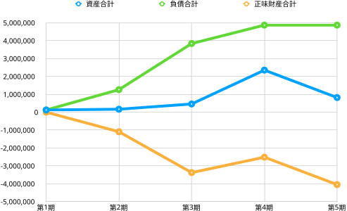
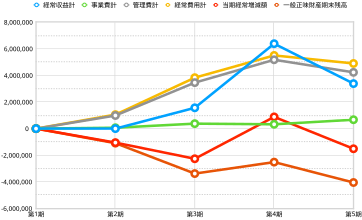
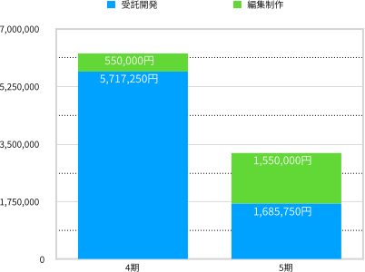

# **2022年度（第5期 2022年4月1日〜2023年3月31日）決算報告**

## 2022年度貸借対照表

今期末（2023年3月31日）現在における資産の保有状況（貸借対照表）を以下に示す。なお、単位は円である。

| 科目           | **当年度**    | **前年度**    | **増減**     |
| ------------ | ---------- | ---------- | ---------- |
| **Ⅰ 資産の部**   |            |            |            |
| 1 流動資産   |            |            |            |
| 現金・預金    | 493,367 | 1,180,342     | -686,975 |
| 他流動資産   | 211,750 |  1,058,750 | -847,000 |
| 流動資産合計   | 705,117 | 2,239,092  | -1,533,975  |
| 2 固定資産   |            |            |            |
| (1) その他固定資産   |            |            |            |
| 創立費      | 113,050    | 113,050    | 0          |
| その他固定資産合計 | 113,050    | 113,050    | 0          |
| 固定資産合計 | 113,050    | 113,050    | 0          |
| 資産合計     | 818,167 | 2,352,142 | -1,533,975 |
| **Ⅱ 負債の部**   |            |            |            |
|1 流動負債  |            |            |            |
| 預り金     | 31,139     | 31,139     | 0    |
| 役員借入金  | 4,806,561 | 4,806,561  | 0  |
| 買掛金   |  11,000  | 11,000 |  0 |
| 未払法人税等   | 20,000 |  20,000 | 0  |
| 流動負債合計   | 4,868,700 | 4,868,700 | 0 |
| 負債合計     | 4,868,700 | 4,868,700 | 0 |
| **Ⅲ 正味財産の部** |            |            |            |
| 1 一般正味財産 | -4,050,533 | -2,516,558 | -1,533,975 |
| 正味財産合計   | -4,050,533 | -2,516,558 | -1,533,975 |
| 負債及び正味財産合計   | 818,167 | 2,352,142  | -1,533,975  |

負債合計が前期から横這いだった一方、資産合計は大きく前期を割り込んだ。まさにこれが今期の決算の特徴となっている。具体的には、前期の資産合計は2,239,092円だったところ、今期は1,533,975円マイナスの705,117円となった。そこで、創立以来の貸借対照表における主な指標（表の水色セル）の変遷を見てみよう（図1）。

{ width=90% }

資産合計は3期、4期と少しずつ上昇していたが、5期で下げてしまった。正味財産は3期まで下がり続けていたのを4期で持ち直したが、再び5期で下げた。負債合計だけは前述の通り横這いを保った。実のところ、今期は創立以来初めて負債を増やさない期にできた。当法人における最優先課題として、来期以降も負債額の抑制、そして圧縮を目指したい。

## 2022年度正味財産増減計算書

資産から負債を差し引いた価額を「正味財産」という。その増減を記録したのが「正味財産増減計算書」であり、これにより今期中（2022年4月1日から2023年3月31日）のお金の使い方や売上の明細がわかる。

| 科目                | **当年度**    | **前年度**    | **増減**     |
| ----------------- | ---------- | ---------- | ---------- |
| **Ⅰ. 一般正味財産増減の部** |            |            |            |
| 1. 経常増減の部         |            |            |            |
| ⑴ 経常収益            |            |            |            |
| ①事業収益             | ( 3,235,750 ) | (6,267,250)  | (-3,031,500)  |
| 事業収益            | 3,235,750  |  6,267,250  | -3,031,500  |
| ②受取寄付金          | (148,498)  |  (116,546) | (31,952)     |
| 受取寄付金          | 148,498  |  116,546 | 31,952 |
| ③雑収益              | (10)          | (6)          | (4)          |
| 受取利息              | 10          | 6          | 4          |
| 経常収益計              | 3,384,258   | 6,383,802  | -2,999,544 |
| ⑵ 経常費用            |            |            |            |
| ① 事業費             |            |            |            |
| 事業経費              | (668,733)    | (325,918)     | (342,815)    |
| 事）旅費交通費             | 1,676 | 0 | 1,676 |
| 事）通信運搬費             | 1,848 | 940  | 908 |
| 事）消耗品費             | 204 | 22,000 | -21,796 |
| 事）支払手数料    | 461,405 | 97,624  | 363,781  |
| 事）支払報酬料   | 198,000    |  198,000 | 0 |
| 事）新聞図書費   | 5,600 | 7,354 | -1,754 |
| 事業費計              | 668,733 | 325,918 | 342,815  |
| ② 管理費             |            |            |            |
| 管）業務委託費  | 4,229,500 | 5,175,500  | -946,000 |
| 管理費計              | 4,229,500  | 5,175,500  | -946,000 |
| 経常費用計             | 4,898,233  | 5,501,418 | -603,185 |
| 評価損益等調整前当期経常増減額   | -1,513,975 | 882,384 | -2,396,359 |
| 評価損益等計            | 0          | 0          | 0          |
| 当期経常増減額           | -1,513,975 | 882,384 | -2,396,359 |
| 2. 経常外増減の部        |            |            |            |
| ⑴ 経常外収益           |            |            |            |
| 経常外収益計            | 0          | 0          | 0          |
| ⑵ 経常外費用           |            |            |           |
| 経常外費用計            | 0          | 0          | 0          |
| 当期経常外増減額          | 0          | 0          | 0          |
| 他会計振替前当期一般正味財産増減額 | -1,513,975 | 882,384 | -2,396,359 |
| 税引前当期一般正味財産増減額    | -1,513,975 | 882,384 | -2,396,359 |
| 法人税、住民税及び事業税      | 20,000     | 20,000     | 0    |
| 当期一般正味財産増減額       | -1,513,975 | 862,384 | -2,396,359 |
| 一般正味財産期首残高        | -2,516,558 | -3,378,942 | 862,384 |
| 一般正味財産期末残高        | -4,050,533 | -2,516,558 | -1,533,975 |
| **Ⅱ. 指定正味財産増減の部** |            |            |            |
| 当期指定正味財産増減額       | 0          | 0          | 0          |
| 指定正味財産期首残高        | 0          | 0          | 0          |
| 指定正味財産期末残高        | 0          | 0          | 0          |
| **Ⅲ. 正味財産期末残高**   | -4,050,533 | -2,516,558 | -1,513,975 |

この正味財産増減計算書のうちの主な指標（表の水色セル）について、創立以来の増減をグラフにした（図2）。

{ width=90% }

一つ一つ見ていこう。まず当団体が経常的に得た収益を表す「経常収益額」（黄色の線）の増減をみると、4期まで上昇を続けたが5期は下げている。これは前項の資産合計と同じ動きだ。

そもそも経常収益は、①事業収益（表の黄色セル）、②受取寄付金、③雑収入からなっている。正味財産増減計算書をみると分かるとおり、②が前期を31,952円上回る健闘をしたものの、ほとんどを占めるのは①だ。つまり、経常収益が減った原因は、事業における収益が前期から下降したことが原因だ。

事業の結果が赤字か黒字かを示す指標「当期経常増減額」（ピンク色の線）をみると、前期は882,384円の黒字だったところ、今期はマイナス1,513,975円となった。

事業費と管理費は経常収益を生み出すための経費であり、経常費用は両者の合計である。事業費は前期よりも342,815円増えた668,733円だった一方、管理費は前期よりも946,000円減った4,229,500円だった。また、経常費用は前期よりも603,185円減の4,898,233円だった。

今期が終わった時点での正味財産の額である「一般正味財産期末残高」（赤色の線）をみると、3期まで拡大を続けてきた赤字額は、4期でやや持ち直したものの、今期は4,050,533円にもなった。来期以降、これをどのように削減していくかが課題となる。

さて、本節の最後として、経常収益が減少した原因を探ってみよう。繰り返しになるが、経常収益のほとんどを占めるのは事業収益（表の黄色セル）だ。そこで前期の事業収益6,267,250円と、今期の事業収益3,235,750円の内訳をグラフにしてみた。

{ width=70% }

編集制作が前期から1,000,000円増える一方で、保守契約を含めた外部からの受託開発が前期からじつに4,031,500円マイナスの1,685,750円に減少した（なお、編集制作は小形克宏理事が、受託開発は村上真雄代表理事が主に担当）。受託開発について[前期の事業報告書](https://github.com/vivliostyle/vivliostyle_doc/tree/gh-pages/ja/reports/vivliostyle-report-2021)で、以下のように説明している。

> 目を引くのが、事業収益が前期より4,763,529円多い6,267,250円をあげたことだ。（中略）これは外部企業からの受託開発が、今期に入って拡大したことによる。

つまり今期は受託開発の売り上げが大幅に減少し、これにより赤字となった訳である。

## 2022年度収支計算書

第1章の終わりとして、今期中（2022年4月1日から2023年3月31日）における、予算額と決算額を比較した収支計算書を見よう。ただし、当法人は予算を策定していないので、形式的なものに留まり、前節の正味財産増減計算書と実質的に同じ内容になる。

| 科目                | 予算額 | 決算額        | 差異         | 備考 |
| ----------------- | --- | ---------- | ---------- | -- |
| **Ⅰ. 一般正味財産増減の部** |     |            |            |    |
| 1. 経常増減の部         |     |            |            |    |
| ⑴ 経常収益            |     |            |            |    |
| ①事業収益             | (0)   | (3,235,750)  | -3,235,750 |    |
| 事業収益             |     | 3,235,750  | -3,235,750 |    |
| ②受取寄付金          | (0)   |(148,498)     | (-148,498)    |    |
| 受取寄付金           |     | 148,498     | -148,498 |    |
| ③雑収益              | (0)   | (10)          | (-10)         |    |
| 受取利息              |  0   | 10          | -10         |    |
| 経常利益計             | 0   | 3,384,258  | -3,384,258 |    |
| ⑵ 経常費用            |     |            |            |    |
| ① 事業費             |     |            |            |    |
| 事業経費              | (0)   | (668,733)    | -668,733 |    |
| 事）旅費交通費   |    | 1,676  | -1,676 |    |
| 事）通信運搬費  |     | 1,848  | -1,848  |    |
| 事）消耗品費   |     | 204  | -204 |    |
| 事）支払手数料 |     | 461,405 | -461,405  |    |
| 事）支払報酬料   |     | 198,000    | -198,000   |    |
| 事）新聞図書費  |     | 5,600 | -5,600 |    |
| 事業費計              | 0   | 668,733 | -668,733 |    |
| ② 管理費             |     |            |            |    |
| 管）業務委託費    |     | 4,229,500 | -4,229,500 |    |
| 管理費計              | 0   | 4,229,500  | -4,229,500 |    |
| 経常費用計             | 0   | 4,898,233  | -4,898,233 |    |
| 評価損益等調整前当期経常増減額   | 0   | -1,513,975 | -1,513,975  |    |
| 評価損益等計            | 0   | 0          | 0          |    |
| 当期経常増減額           | 0   | -1,513,975 | 1,513,975  |    |
| 2. 経常外増減の部        |     |            |            |    |
| ⑴ 経常外収益           |     |            |            |    |
| 経常外収益計            | 0   | 0          | 0          |    |
| ⑵ 経常外費用           |     |            |            |    |
| 経常外費用計            | 0   | 0          | 0          |    |
| 当期経常外増減額          | 0   | 0          | 0          |    |
| 他会計振替前当期一般正味財産増減額 | 0   | -1,513,975 | 1,513,975  |    |
| 税引前当期一般正味財産増減額    | 0   | -1,513,975 | 1,513,975  |    |
| 法人税、住民税及び事業税      | 0   | 20,000     | -20,000    |    |
| 当期一般正味財産増減額       | 0   | -1,513,975 | 1,513,975  |    |
| 一般正味財産期首残高        | 0   | -2,516,558 | 2,516,558  |    |
| 一般正味財産期末残高        | 0   | -4,050,533 | 4,050,533  |    |
| **Ⅱ. 指定正味財産増減の部** |     |            |            |    |
| 当期指定正味財産増減額       | 0   | 0          | 0          |    |
| 指定正味財産期首残高        | 0   | 0          | 0          |    |
| 指定正味財産期末残高        | 0   | 0          | 0          |    |
| **Ⅲ. 正味財産期末残高**   | 0   | -4,050,533 | 4,050,533  |    | 