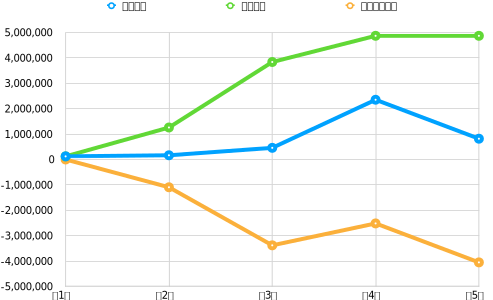
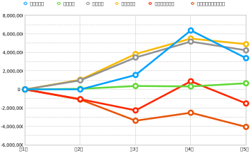
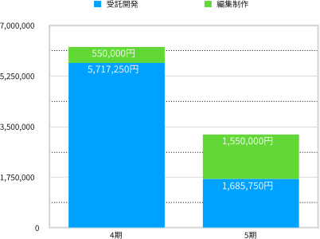
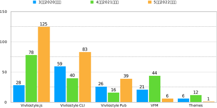

## **第1章 2022年度（第5期 2022年4月1日〜2023年3月31日）決算報告**

### はじめに

前期に初めて単年度黒字を達成した当法人だが、残念ながら今期は再び赤字に転落した。以下、その詳細について説明する。

### 2022年度貸借対照表

今期末（2023年3月31日）現在における資産の保有状況（貸借対照表）を以下に示す。なお、単位は円である。

| 科目           | **当年度**    | **前年度**    | **増減**     |
| ------------ | ---------- | ---------- | ---------- |
| **Ⅰ 資産の部**   |            |            |            |
| 1 流動資産   |            |            |            |
| 現金・預金    | 493,367 | 1,180,342     | -686,975 |
| 他流動資産   | 211,750 |  1,058,750 | -847,000 |
| 流動資産合計   | 705,117 | 2,239,092  | -1,533,975  |
| 2 固定資産   |            |            |            |
| (1) その他固定資産   |            |            |            |
| 創立費      | 113,050    | 113,050    | 0          |
| その他固定資産合計 | 113,050    | 113,050    | 0          |
| 固定資産合計 | 113,050    | 113,050    | 0          |
| 資産合計     | 818,167 | 2,352,142 | -1,533,975 |
| **Ⅱ 負債の部**   |            |            |            |
|1 流動負債  |            |            |            |
| 預り金     | 31,139     | 31,139     | 0    |
| 役員借入金  | 4,806,561 | 4,806,561  | 0  |
| 買掛金   |  11,000  | 11,000 |  0 |
| 未払法人税等   | 20,000 |  20,000 | 0  |
| 流動負債合計   | 4,868,700 | 4,868,700 | 1,031,000 |
| 負債合計     | 4,868,700 | 4,868,700 | 1,031,000 |
| **Ⅲ 正味財産の部** |            |            |            |
| 1 一般正味財産 | -4,050,533 | -2,516,558 | -1,533,975 |
| 正味財産合計   | -4,050,533 | -2,516,558 | -1,533,975 |
| 負債及び正味財産合計   | 818,167 | 2,352,142  | -1,533,975  |

負債合計が前期から横這いだった一方、資産合計は大きく前期を割り込んだことが目を引く。まさにこれが今期の決算の特徴となっている。具体的には、前期の資産合計は2,239,092円だったところ、今期は1,533,975円マイナスの705,117円となった。そこで、創立以来の貸借対照表における主な指標の変遷を見てみよう（図1）。

{ width=90% }

資産合計は3期、4期と少しずつ上昇していたが、5期で大きく下げてしまった。正味財産は3期まで下がり続けていたのを4期で持ち直したが、再び5期で大きく下げた。負債合計だけは前述の通り横這いを保った。今期は創立以来初めて負債を増やさない期にできた。

### 2022年度正味財産増減計算書

資産から負債を差し引いた価額を「正味財産」という。その増減を記録したのが「正味財産増減計算書」であり、これにより今期中（2022年4月1日から2023年3月31日）のお金の使い方や売上の明細がわかる。

| 科目                | **当年度**    | **前年度**    | **増減**     |
| ----------------- | ---------- | ---------- | ---------- |
| **Ⅰ. 一般正味財産増減の部** |            |            |            |
| 1. 経常増減の部         |            |            |            |
| ⑴ 経常収益            |            |            |            |
| ①事業収益             | ( 3,235,750 ) | (6,267,250)  | (-3,031,500)  |
| 事業収益            | 3,235,750  |  6,267,250  | -3,031,500  |
| ②受取寄付金          | (148,498)  |  (116,546) | (31,952)     |
| 受取寄付金          | 148,498  |  116,546 | 31,952 |
| ③雑収益              | (10)          | (6)          | (4)          |
| 受取利息              | 10          | 6          | 4          |
| 経常収益計              | 3,384,258   | 6,383,802  | -2,999,544 |
| ⑵ 経常費用            |            |            |            |
| ① 事業費             |            |            |            |
| 事業経費              | (668,733)    | (325,918)     | (342,815)    |
| 事）旅費交通費             | 1,676 | 0 | 1,676 |
| 事）通信運搬費             | 1,848 | 940  | 908 |
| 事）消耗品費             | 204 | 22,000 | -21,796 |
| 事）支払手数料    | 461,405 | 97,624  | 363,781  |
| 事）支払報酬料   | 198,000    |  198,000 | 0 |
| 事）新聞図書費   | 5,600 | 7,354 | -1,754 |
| 事業費計              | 668,733 | 325,918 | 342,815  |
| ② 管理費             |            |            |            |
| 管）業務委託費  | 4,229,500 | 5,175,500  | -946,000 |
| 管理費計              | 4,229,500  | 5,175,500  | -946,000 |
| 経常費用計             | 4,898,233  | 5,501,418 | -603,185 |
| 評価損益等調整前当期経常増減額   | -1,513,975 | 882,384 | -2,396,359 |
| 評価損益等計            | 0          | 0          | 0          |
| 当期経常増減額           | -1,513,975 | 882,384 | -2,396,359 |
| 2. 経常外増減の部        |            |            |            |
| ⑴ 経常外収益           |            |            |            |
| 経常外収益計            | 0          | 0          | 0          |
| ⑵ 経常外費用           |            |            |           |
| 経常外費用計            | 0          | 0          | 0          |
| 当期経常外増減額          | 0          | 0          | 0          |
| 他会計振替前当期一般正味財産増減額 | -1,513,975 | 882,384 | -2,396,359 |
| 税引前当期一般正味財産増減額    | -1,513,975 | 882,384 | -2,396,359 |
| 法人税、住民税及び事業税      | 20,000     | 20,000     | 0    |
| 当期一般正味財産増減額       | -1,513,975 | 862,384 | -2,396,359 |
| 一般正味財産期首残高        | -2,516,558 | -3,378,942 | 862,384 |
| 一般正味財産期末残高        | -4,050,533 | -2,516,558 | -1,533,975 |
| **Ⅱ. 指定正味財産増減の部** |            |            |            |
| 当期指定正味財産増減額       | 0          | 0          | 0          |
| 指定正味財産期首残高        | 0          | 0          | 0          |
| 指定正味財産期末残高        | 0          | 0          | 0          |
| **Ⅲ. 正味財産期末残高**   | -4,050,533 | -2,516,558 | -1,513,975 |

この正味財産増減計算書のうちの主な指標について、創立以来の増減をグラフにした（図2）。

{ width=90% }

一つ一つ見ていこう。まず当団体が経常的に得た収益を表す「経常収益額」（黄色の線）の増減をみると、4期まで上昇を続けたが、5期は下げている。これは前項の資産合計と同じ動きだ。

そもそも経常収益は、①事業収益（表の黄色セル）、②受取寄付金、③雑収入からなっている。正味財産増減計算書をみると分かるとおり、②が前期を31,952円上回る健闘をしたものの、ほとんどを占めるのは①だ。つまり、経常収益が減った原因は、事業における収益が前期から大きく下降したことが原因だ。

事業の結果が赤字か黒字かを示す指標「当期経常増減額」（ピンク色の線）をみると、前期は882,384円の黒字だったところ、今期は0を大きく下回るマイナス1,513,975円となった。

事業費と管理費は経常収益を生み出すための経費であり、経常費用は両者の合計である。事業費は前期よりも342,815円増えた668,733円だった一方、管理費は前期よりも946,000円減った4,229,500円だった。また、経常費用は前期よりも603,185円減った4,898,233円だった。

今期が終わった時点での正味財産の額である「一般正味財産期末残高」（赤色の線）をみると、3期まで急拡大を続けてきた赤字額は、4期でやや持ち直したものの、今期ついに400万円を超えて4,050,533円となった。来期以降、これをどのように削減していくかが課題となる。

さて、本節の最後として、経常収益が減少した原因を探ってみよう。繰り返しになるが、経常収益のほとんどを占めるのは事業収益（表の黄色セル）だ。そこで前期の事業収益6,267,250円と、今期の事業収益3,235,750円の内訳をグラフにしてみた。

{ width=70% }

編集制作が前期から1,000,000円増える一方で、受託開発が前期からじつに4,031,500円マイナスの1,685,750円に減少した（なお、編集制作は小形克宏理事が、受託開発は村上真雄代表理事が主に担当した）。受託開発について[前期の事業報告書](https://github.com/vivliostyle/vivliostyle_doc/tree/gh-pages/ja/reports/vivliostyle-report-2021)では、以下のように説明している。

> 目を引くのが、事業収益が前期より4,763,529円多い6,267,250円をあげたことだ。（中略）これは外部企業からの受託開発が、今期に入って拡大したことによる。

今期は受託開発の売り上げが大幅に減少し、これにより赤字となった訳である。

### 2022年度収支計算書

第1章の終わりとして、今期中（2022年4月1日から2023年3月31日）における、予算額と決算額を比較した収支計算書を見よう。ただし、当法人は予算を策定していないので、形式的なものに留まり、前節の正味財産増減計算書と実質的に同じ内容になる。

| 科目                | 予算額 | 決算額        | 差異         | 備考 |
| ----------------- | --- | ---------- | ---------- | -- |
| **Ⅰ. 一般正味財産増減の部** |     |            |            |    |
| 1. 経常増減の部         |     |            |            |    |
| ⑴ 経常収益            |     |            |            |    |
| ①事業収益             | (0)   | (3,235,750)  | -3,235,750 |    |
| 事業収益             |     | 3,235,750  | -3,235,750 |    |
| ②受取寄付金          | (0)   |(148,498)     | (-148,498)    |    |
| 受取寄付金           |     | 148,498     | -148,498 |    |
| ③雑収益              | (0)   | (10)          | (-10)         |    |
| 受取利息              |  0   | 10          | -10         |    |
| 経常利益計             | 0   | 6,383,802  | -6,383,802 |    |
| ⑵ 経常費用            |     |            |            |    |
| ① 事業費             |     |            |            |    |
| 事業経費              | (0)   | (668,733)    | -668,733 |    |
| 事）旅費交通費   |    | 1,676  | -1,676 |    |
| 事）通信運搬費  |     | 1,848  | -1,848  |    |
| 事）消耗品費   |     | 204  | -204 |    |
| 事）支払手数料 |     | 461,405 | -461,405  |    |
| 事）支払報酬料   |     | 198,000    | -198,000   |    |
| 事）新聞図書費  |     | 5,600 | -5,600 |    |
| 事業費計              | 0   | 668,733 | -668,733 |    |
| ② 管理費             |     |            |            |    |
| 管）業務委託費    |     | 4,229,500 | -4,229,500 |    |
| 管理費計              | 0   | 4,229,500  | -4,229,500 |    |
| 経常費用計             | 0   | 4,898,233  | -4,898,233 |    |
| 評価損益等調整前当期経常増減額   | 0   | -1,513,975 | -1,513,975  |    |
| 評価損益等計            | 0   | 0          | 0          |    |
| 当期経常増減額           | 0   | -1,513,975 | 1,513,975  |    |
| 2. 経常外増減の部        |     |            |            |    |
| ⑴ 経常外収益           |     |            |            |    |
| 経常外収益計            | 0   | 0          | 0          |    |
| ⑵ 経常外費用           |     |            |            |    |
| 経常外費用計            | 0   | 0          | 0          |    |
| 当期経常外増減額          | 0   | 0          | 0          |    |
| 他会計振替前当期一般正味財産増減額 | 0   | -1,513,975 | 1,513,975  |    |
| 税引前当期一般正味財産増減額    | 0   | -1,513,975 | 1,513,975  |    |
| 法人税、住民税及び事業税      | 0   | 20,000     | -20,000    |    |
| 当期一般正味財産増減額       | 0   | -1,513,975 | 1,513,975  |    |
| 一般正味財産期首残高        | 0   | -2,516,558 | 2,516,558  |    |
| 一般正味財産期末残高        | 0   | -4,050,533 | 4,050,533  |    |
| **Ⅱ. 指定正味財産増減の部** |     |            |            |    |
| 当期指定正味財産増減額       | 0   | 0          | 0          |    |
| 指定正味財産期首残高        | 0   | 0          | 0          |    |
| 指定正味財産期末残高        | 0   | 0          | 0          |    |
| **Ⅲ. 正味財産期末残高**   | 0   | -4,050,533 | 4,050,533  |    |

## **第2章  2022年度（第5期 2022年4月1日〜2023年3月31日）事業報告**

### PR数からみたプロダクトの開発状況

この章では、今期おこなった事業について報告する。当法人のプロダクト開発状況をみてみよう。当法人の主要なプロダクトのプルリクエスト（PR）数を集計してみた（図4）。なお、ここではbotによるPRは排除し、人間によるものだけを集計している。

{ width=100% }

すべての基盤となるプロダクト、[Vivliostyle.js](https://github.com/vivliostyle/vivliostyle.js)のPR数が飛び抜けて多く、開発が大きく進捗したことが分かる（当法人のプロダクトについては[前年度活動報告書](https://vivliostyle.org/viewer/#src=https://vivliostyle.github.io/vivliostyle_doc/ja/reports/vivliostyle-report-2021/vf2021report.html&bookMode=true&userStyle=data:,/*%3Cviewer%3E*/%0A@page%20%7B%20size:%20A4;%20%7D%0A/*%3C/viewer%3E*/&f=epubcfi(/2!/4/52/4/28)&find=%E3%83%97%E3%83%AD%E3%83%80%E3%82%AF%E3%83%88%E3%81%AE%E5%88%86%E9%A1%9E%E3%81%A8%E3%81%9D%E3%82%8C%E3%81%9E%E3%82%8C%E3%81%AE%E5%BD%B9%E7%9B%AE)を参照）。それに次ぐのが、[Vivliostyle CLI](https://github.com/vivliostyle/vivliostyle-cli)、[Vivliostyle Pub](https://github.com/vivliostyle/vivliostyle-pub)で、これらの開発も順調に進んだと言える。ただし、この3つ以外のプロダクトのPR数は低調だった。

### PR作成者の分析

つまり、開発が順調に進んだVivliostyle.js、Vivliostyle CLI、Vivliostyle Pubのグループと、あまり順調とは言えなかった[VFM](https://github.com/vivliostyle/vfm)、[themes](https://github.com/vivliostyle/themes)のグループに明確に分かれる。では、この2つのグループを分けた要因は何か。PRの作成者に注目してみるとそれが分かる。

| 作成者 | PRの数 |
| ----- | --- |
| 村上代表理事 | [119](https://github.com/vivliostyle/vivliostyle.js/pulls?q=is%3Apr++created%3A2022-04-01..2023-03-31+author%3AMurakamiShinyu) |
| その他  | 6 |
| 総計  | [125](https://github.com/vivliostyle/vivliostyle.js/pulls?q=is%3Apr++created%3A2022-04-01..2023-03-31+-author%3Aapp%2Fdependabot) |

表1 Vivliostyle.jsにおけるPR作成者の内訳

| 作成者 | PRの数 |
| ----- | --- |
| 村上代表理事 | [72](https://github.com/vivliostyle/vivliostyle-cli/pulls?q=is%3Apr+created%3A2022-04-01..2023-03-31+author%3AMurakamiShinyu) |
| spring-raining | [6](https://github.com/vivliostyle/vivliostyle-cli/pulls?q=is%3Apr+created%3A2022-04-01..2023-03-31+author%3Aspring-raining) |
| 総計  | [83](https://github.com/vivliostyle/vivliostyle-cli/pulls?q=is%3Apr+created%3A2022-04-01..2023-03-31+-author%3Aapp%2Fdependabot) |

表2 Vivliostyle CLIにおけるPR作成者の内訳

| 作成者 | PRの数 |
| ----- | --- |
| 村上代表理事 | [33](https://github.com/vivliostyle/vivliostyle-pub/pulls?q=is%3Apr+created%3A2022-04-01..2023-03-31+author%3AMurakamiShinyu) |
| takanakahiko | [7](https://github.com/vivliostyle/vivliostyle-pub/pulls?q=is%3Apr+created%3A2022-04-01..2023-03-31+author%3Atakanakahiko) |
| 総計  | [40](https://github.com/vivliostyle/vivliostyle-pub/pulls?q=is%3Apr+created%3A2022-04-01..2023-03-31+-author%3Aapp%2Fdependabot) |

表3 Vivliostyle PubにおけるPR作成者の内訳

これらの表を見ると分かるとおり、順調に開発が進んだグループにおいて、ほとんどのPRを作成したのは村上代表理事だ。一方で、あまり順調と言えなかったグループでは、村上代表理事の関与が少なかった。

さらに、Vivliostyle CLIとVivliostyle Pubにおける村上代表理事のPR内容を見ると、Vivliostyle CLIやVivliostyle Pubに独自の機能を追加するPRという訳ではなく、彼自身がメンテナーを務めるVivliostyle.jsにおける機能追加やバグ修正を、それぞれに波及させるためのものであることが分かる。

ところで、ここまでの分析では作成したPRの数量に注目したが、PR数が村上代表理事より少ないからといって、彼以外のコントリビューターを無視してはいけないだろう。とくにspring-raining氏には、今期Vivliostyle CLIにおいて、ES Modulesに対応した[v6.0.0 (2022-12-17)](https://github.com/vivliostyle/vivliostyle-cli/blob/main/CHANGELOG.md#600-2022-12-17)、VFM v2に対応した[v7.0.0 (2023-03-13)](https://github.com/vivliostyle/vivliostyle-cli/blob/main/CHANGELOG.md#700-2023-03-13)と、メジャーアップデートを2つもリリースしていただいた。

### 来期への提言

それでも、こうして見ていくと村上代表理事の「孤軍奮闘」といった開発状況が浮かび上がってくるのも確かだ。

また、第1章では受託開発の売り上げが大幅に減少して赤字となった状況を説明したが、これは前期では受託開発に振り向けられていた村上代表理事の開発リソースを、今期はVivliostyle.jsをはじめとする前述プロダクトの開発にそっくり切り替えた結果と見ることもできる。

次期以降、こうした状況を乗り越えていくために、以下の3つが大切になるだろう。

1. バランスのとれた開発
2. 開発リソースの多角化
3. 事業収益の多角化

上記1について。Vivliostyleにおけるオープンソースソフトウェア（OSS）開発は、当法人にとってそもそもの設立目的だ。しかし、赤字を拡大して当法人の持続性を損なってしまっては元も子もない。OSS開発と受託開発とで、バランスのとれた開発を進めることが大事だろう。

上記2について。村上代表理事の「孤軍奮闘」はなにも今期に限ったことではない。まことに頭が下がる思いではあるが、彼以外にもコントリビューターを増やして負担軽減を図らないと、やがて当法人の持続性が損なわれるだろう。

上記3について。村上代表理事の負担を軽減するためにも、事業収益を受託開発だけに依存しないよう、収益の多角化を図る必要がある。幸いなことに前章図3「前期と今期における事業収益の内訳」を見ると分かるように、編集制作で全体のほぼ半分の収益を得ることができた。来期もこれほどの受注ができるかは不透明だが、引き続き努力すべきだ。

## 理事

- [村上真雄 (Shinyu Murakami)](https://github.com/MurakamiShinyu)〈代表理事、設立時社員〉
- [リボアル・フロリアン (Florian Rivoal)](https://github.com/frivoal)〈理事、設立時社員〉
- [ヨハネス・ウィルム (Johannes Wilm)](https://github.com/johanneswilm)〈理事、設立時社員〉
- [小形克宏 (Katsuhiro Ogata)](https://github.com/ogwata)〈理事、2020年1月21日より〉
