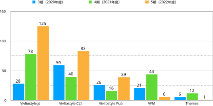

## **2022年度（第5期 2022年4月1日〜2023年3月31日）事業報告**

### PR数からみたプロダクトの開発状況

この章では、今期おこなった事業について報告する。当法人の設立目的でもあるプロダクト開発はどうだったのだろう。当法人の主要なプロダクトのプルリクエスト（PR）数を集計してみた（図4）。なお、ここではbotによるPRは排除し、人間によるものだけを集計している。

{ width=100% }

すべての基盤となるプロダクト、[Vivliostyle.js](https://github.com/vivliostyle/vivliostyle.js)のPR数が飛び抜けて多く、開発が大きく進捗したことが分かる（当法人のプロダクト構成については[前年度活動報告書](https://vivliostyle.org/viewer/#src=https://vivliostyle.github.io/vivliostyle_doc/ja/reports/vivliostyle-report-2021/vf2021report.html&bookMode=true&userStyle=data:,/*<viewer>*/%0A@page { size: A4; }%0A/*</viewer>*/)を参照）。それに次ぐのが、[Vivliostyle CLI](https://github.com/vivliostyle/vivliostyle-cli)、[Vivliostyle Pub](https://github.com/vivliostyle/vivliostyle-pub)で、これらの開発も順調に進んだと言える。ただし、この3つ以外のプロダクトのPR数は低調だった。

### PR作成者の分析

これをまとめると、開発が順調に進んだVivliostyle.js、Vivliostyle CLI、Vivliostyle Pubのグループと、あまり順調とは言えなかった[VFM](https://github.com/vivliostyle/vfm)、[themes](https://github.com/vivliostyle/themes)のグループに明確に分かれる。では、この2つのグループを分けた要因は何か。PRの作成者に注目してみよう。

<figure>

| 作成者 | PRの数 |
| ----- | --- |
| 村上代表理事 | [119](https://github.com/vivliostyle/vivliostyle.js/pulls?q=is%3Apr++created%3A2022-04-01..2023-03-31+author%3AMurakamiShinyu) |
| その他  | 6 |
| 総計  | [125](https://github.com/vivliostyle/vivliostyle.js/pulls?q=is%3Apr++created%3A2022-04-01..2023-03-31+-author%3Aapp%2Fdependabot) |

<figcaption>表1 Vivliostyle.jsにおけるPR作成者の内訳</figcaption>
</figure>

<figure>

| 作成者 | PRの数 |
| ----- | --- |
| 村上代表理事 | [72](https://github.com/vivliostyle/vivliostyle-cli/pulls?q=is%3Apr+created%3A2022-04-01..2023-03-31+author%3AMurakamiShinyu) |
| spring-raining | [11](https://github.com/vivliostyle/vivliostyle-cli/pulls?q=is%3Apr+created%3A2022-04-01..2023-03-31+author%3Aspring-raining) |
| 総計  | [83](https://github.com/vivliostyle/vivliostyle-cli/pulls?q=is%3Apr+created%3A2022-04-01..2023-03-31+-author%3Aapp%2Fdependabot) |

<figcaption>表2 Vivliostyle CLIにおけるPR作成者の内訳</figcaption>
</figure>

<figure>

| 作成者 | PRの数 |
| ----- | --- |
| 村上代表理事 | [33](https://github.com/vivliostyle/vivliostyle-pub/pulls?q=is%3Apr+created%3A2022-04-01..2023-03-31+author%3AMurakamiShinyu) |
| takanakahiko | [7](https://github.com/vivliostyle/vivliostyle-pub/pulls?q=is%3Apr+created%3A2022-04-01..2023-03-31+author%3Atakanakahiko) |
| 総計  | [40](https://github.com/vivliostyle/vivliostyle-pub/pulls?q=is%3Apr+created%3A2022-04-01..2023-03-31+-author%3Aapp%2Fdependabot) |

<figcaption>表3 Vivliostyle PubにおけるPR作成者の内訳</figcaption>
</figure>

これらの表を見ると分かるとおり、順調に開発が進んだグループにおいて、多くのPRを作成したのは村上代表理事だった。一方で、あまり順調と言えなかったグループでは、村上代表理事の関与が少なかった。

ちなみに、Vivliostyle CLIとVivliostyle Pubにおける村上代表理事のPR内容を見ると、Vivliostyle CLIやVivliostyle Pubに独自の機能を追加するPRという訳ではなく、彼自身がメンテナーを務めるVivliostyle.jsにおける機能追加やバグ修正を、それぞれに波及させるためのものであることが分かる。

こうして見ていくと、村上代表理事のいわば「孤軍奮闘」といった開発状況が浮かび上がってくる。もちろん、Vivliostyleプロジェクトの創始者である村上代表理事のPRが多いのは当然だ。それでも、オープンソースソフトウェア（OSS）開発において創始者に負荷が集中しすぎるのは、持続性の観点から決して好ましいことではない。

ただし、今期はそうした状況を変えるかもしれない兆候が見られた。これまでほとんど村上代表理事だけで開発を続けてきたVivliostyle.jsに新たなコントリビューターが、しかも2人も表れた（図3）。もちろん彼等のPRによって追加された機能は、他のプロダクトでも使える。

](./img/fig-5.png){ width=100% }

上図のうち、[hkwi](https://github.com/hkwi)氏の[PR](https://github.com/vivliostyle/vivliostyle.js/pull/1090)は以前からの課題だった、目次等でよく使う罫線、CSS leader() 機能を追加するもので、待望の機能追加と言える。

また、[daisuke-tanabe](https://github.com/daisuke-tanabe)氏の一連の[PR](https://github.com/vivliostyle/vivliostyle.js/pulls?q=is%3Apr+author%3Adaisuke-tanabe)も、ずっと顧みられなかった@vivliostyle/reactを最新バージョンに引き上げるなどの重要な修正をおこなったものだ。来期もこうした新しいコントリビューターを一人でも増やす努力が必要だ。

他にも当法人の創設以来、ずっと貢献してくれている[spring-raining](https://github.com/orgs/vivliostyle/people/spring-raining)氏は、今期Vivliostyle CLIにおいて、ES Modulesに対応した[v6.0.0 (2022-12-17)](https://github.com/vivliostyle/vivliostyle-cli/blob/main/CHANGELOG.md#600-2022-12-17)、VFM v2に対応した[v7.0.0 (2023-03-13)](https://github.com/vivliostyle/vivliostyle-cli/blob/main/CHANGELOG.md#700-2023-03-13)をはじめ、着実で持続的な進歩を遂げてくれた。

### 来期への提言

前節で述べたような、村上代表理事が孤軍奮闘をつづける状況をすこしでも改善するため、どんなことが考えられるだろう。以下の2つを挙げておこう。

1. 開発リソースの多角化
2. 事業収益の多角化

上記1について。村上代表理事の孤軍奮闘はなにも今期に限ったことではない。まことに頭が下がる思いではあるが、彼以外のコントリビューターを持続的に増やす方策を考えないと、当法人の持続は危ういだろう。

上記2について。村上代表理事の負担を軽減するためにも、事業収益を受託開発だけに依存しないよう、収益の多角化を図る必要がある。幸いなことに前章図3「前期と今期における事業収益の内訳」を見ると分かるように、編集制作で全体のほぼ半分の収益を得ることができた。来期もこれほどの受注ができるかは不透明だが、引き続き努力を続けるべきだろう。

## 理事

- [村上真雄 (Shinyu Murakami)](https://github.com/MurakamiShinyu)〈代表理事、設立時社員〉
- [リボアル・フロリアン (Florian Rivoal)](https://github.com/frivoal)〈理事、設立時社員〉
- [ヨハネス・ウィルム (Johannes Wilm)](https://github.com/johanneswilm)〈理事、設立時社員〉
- [小形克宏 (Katsuhiro Ogata)](https://github.com/ogwata)〈理事、2020年1月21日より〉
