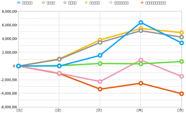

## **第1章 2022年度（第5期 2022年4月1日〜2023年3月31日）決算報告**

### はじめに

昨期、初めて単年度黒字を達成した当法人だが、残念ながら今年度は再び赤字となった。以下、その詳細について説明する。

### 2022年度貸借対照表

今期末（2023年3月31日）現在における資産の保有状況（貸借対照表）を以下に示す。なお、単位は円である。

| 科目           | **当年度**    | **前年度**    | **増減**     |
| ------------ | ---------- | ---------- | ---------- |
| **Ⅰ 資産の部**   |            |            |            |
| 1 流動資産   |            |            |            |
| 現金・預金    | 493,367 | 1,180,342     | -686,975 |
| 他流動資産   | 211,750 |  1,058,750 | -847,000 |
| 流動資産合計   | 705,117 | 2,239,092  | -1,533,975  |
| 2 固定資産   |            |            |            |
| (1) その他固定資産   |            |            |            |
| 創立費      | 113,050    | 113,050    | 0          |
| その他固定資産合計 | 113,050    | 113,050    | 0          |
| 固定資産合計 | 113,050    | 113,050    | 0          |
| 資産合計     | 818,167 | 2,352,142 | -1,533,975 |
| **Ⅱ 負債の部**   |            |            |            |
|1 流動負債  |            |            |            |
| 預り金     | 31,139     | 31,139     | 0    |
| 役員借入金  | 4,806,561 | 4,806,561  | 0  |
| 買掛金   |  11,000  | 11,000 |  0 |
| 未払法人税等   | 20,000 |  20,000 | 0  |
| 流動負債合計   | 4,868,700 | 4,868,700 | 1,031,000 |
| 負債合計     | 4,868,700 | 4,868,700 | 1,031,000 |
| **Ⅲ 正味財産の部** |            |            |            |
| 1 一般正味財産 | -4,050,533 | -2,516,558 | -1,533,975 |
| 正味財産合計   | -4,050,533 | -2,516,558 | -1,533,975 |
| 負債及び正味財産合計   | 818,167 | 2,352,142  | -1,533,975  |

負債合計が前期から横這いとなる一方、資産合計は大きく前期を割り込んでいることが目を引く。まさにこれが今期の決算の特徴となっている。具体的には、前期の資産合計は2,239,092円だったところ、今期は1,533,975円マイナスの705,117円となった。そこで、創立以来の貸借対照表における主な指標の変遷を見てみよう（図1）。

{ width=90% }

資産合計は3期、4期と少しずつ上昇していたが、5期で大きく下げている。正味財産は3期まで下がり続けていたのを4期で持ち直したが、再び5期で大きく下げている。負債合計だけは前述の通り横這いである。

### 2022年度正味財産増減計算書

次に、今期中（2022年4月1日から2023年3月31日）のお金の使い方や売上の明細がわかる、正味財産増減計算書を見てみよう。これも単位は円である。

| 科目                | **当年度**    | **前年度**    | **増減**     |
| ----------------- | ---------- | ---------- | ---------- |
| **Ⅰ. 一般正味財産増減の部** |            |            |            |
| 1. 経常増減の部         |            |            |            |
| ⑴ 経常収益            |            |            |            |
| ①事業収益             | ( 3,235,750 ) | (6,267,250)  | (-3,031,500)  |
| 事業収益            | 3,235,750  |  6,267,250  | -3,031,500  |
| ②受取寄付金          | (148,498)  |  (116,546) | (31,952)     |
| 受取寄付金          | 148,498  |  116,546 | 31,952 |
| ③雑収益              | (10)          | (6)          | (4)          |
| 受取利息              | 10          | 6          | 4          |
| 経常収益計              | 3,384,258   | 6,383,802  | -2,999,544 |
| ⑵ 経常費用            |            |            |            |
| ① 事業費             |            |            |            |
| 事業経費              | (668,733)    | (325,918)     | (342,815)    |
| 事）旅費交通費             | 1,676 | 0 | 1,676 |
| 事）通信運搬費             | 1,848 | 940  | 908 |
| 事）消耗品費             | 204 | 22,000 | -21,796 |
| 事）支払手数料    | 461,405 | 97,624  | 363,781  |
| 事）支払報酬料   | 198,000    |  198,000 | 0 |
| 事）新聞図書費   | 5,600 | 7,354 | -1,754 |
| 事業費計              | 668,733 | 325,918 | 342,815  |
| ② 管理費             |            |            |            |
| 管）業務委託費  | 4,229,500 | 5,175,500  | -946,000 |
| 管理費計              | 4,229,500  | 5,175,500  | -946,000 |
| 経常費用計             | 4,898,233  | 5,501,418 | -603,185 |
| 評価損益等調整前当期経常増減額   | -1,513,975 | 882,384 | -2,396,359 |
| 評価損益等計            | 0          | 0          | 0          |
| 当期経常増減額           | -1,513,975 | 882,384 | -2,396,359 |
| 2. 経常外増減の部        |            |            |            |
| ⑴ 経常外収益           |            |            |            |
| 経常外収益計            | 0          | 0          | 0          |
| ⑵ 経常外費用           |            |            |           |
| 経常外費用計            | 0          | 0          | 0          |
| 当期経常外増減額          | 0          | 0          | 0          |
| 他会計振替前当期一般正味財産増減額 | -1,513,975 | 882,384 | -2,396,359 |
| 税引前当期一般正味財産増減額    | -1,513,975 | 882,384 | -2,396,359 |
| 法人税、住民税及び事業税      | 20,000     | 20,000     | 0    |
| 当期一般正味財産増減額       | -1,513,975 | 862,384 | -2,396,359 |
| 一般正味財産期首残高        | -2,516,558 | -3,378,942 | 862,384 |
| 一般正味財産期末残高        | -4,050,533 | -2,516,558 | -1,533,975 |
| **Ⅱ. 指定正味財産増減の部** |            |            |            |
| 当期指定正味財産増減額       | 0          | 0          | 0          |
| 指定正味財産期首残高        | 0          | 0          | 0          |
| 指定正味財産期末残高        | 0          | 0          | 0          |
| **Ⅲ. 正味財産期末残高**   | -4,050,533 | -2,516,558 | -1,513,975 |

上記、正味財産増減計算書のうちの主な指標について、創立以来の増減をグラフにまとめてみた。

{ width=90% }

一つ一つ見ていこう。まず当団体が経常的に得ている収益を表す「経常収益額」（黄色の線）の増減をみると、4期で大きく上昇したのが、5期で大きく下げている。これは前項の資産合計と同じ動きだ。

経常収益は、①事業収益（表の黄色背景セル）、②受取寄付金、③雑収入からなる。正味財産増減計算書をみると分かるとおり、②が前期を31,952円上回る健闘をしたものの、ほとんどを占めるのは①だ。つまり、経常収益が減った原因は事業における収益が前期から大きく下降したことが原因であることが分かる。

事業の結果が赤字か黒字かを示す指標「当期経常増減額」（赤色の線）をみると、経常収益額の動きと近似しており、これと経常収益額とが照応していることが分かる。

事業費と管理費は経常収益を生み出すための経費であり、経常費用は両者の合計である。事業費は前期よりも342,815円増えた668,733円だった一方、管理費は前期よりも946,000円減った4,229,500円だった。また、経常費用は前期よりも603,185円減った4,898,233円だった。

さて、本節の最後として、経常収益が減少した原因を探ってみよう。前述したように、経常収益のほとんどを占めるのは事業収益（表の黄色背景セル）だ。そこで前期の事業収益6,267,250円と、今期の事業収益3,235,750円の内訳をグラフにしてみた。

{ width=70% }

編集制作が前期から1,000,000円増える一方で、受託開発が前期からじつに4,031,500円マイナスの1,685,750円に減少した。受託開発について[前期の事業報告書](https://github.com/vivliostyle/vivliostyle_doc/tree/gh-pages/ja/reports/vivliostyle-report-2021)では、以下のように説明している。

> 目を引くのが、事業収益が前期より4,763,529円多い6,267,250円をあげたことだ。（中略）これは外部企業からの受託開発が、今期に入って拡大したことによる。

今期は受託開発の売り上げが大幅に減少し、これにより赤字となった。

### 2022年度収支計算書

第1章の終わりとして、今期中（2022年4月1日から2023年3月31日）における、予算額と決算額を比較した収支計算書を見よう。ただし、当法人は予算を策定していないので、形式的なものに留まり、前節の正味財産増減計算書と実質的に同じ内容になる。

| 科目                | 予算額 | 決算額        | 差異         | 備考 |
| ----------------- | --- | ---------- | ---------- | -- |
| **Ⅰ. 一般正味財産増減の部** |     |            |            |    |
| 1. 経常増減の部         |     |            |            |    |
| ⑴ 経常収益            |     |            |            |    |
| ①事業収益             | (0)   | (3,235,750)  | -3,235,750 |    |
| 事業収益             |     | 3,235,750  | -3,235,750 |    |
| ②受取寄付金          | (0)   |(148,498)     | (-148,498)    |    |
| 受取寄付金           |     | 148,498     | -148,498 |    |
| ③雑収益              | (0)   | (10)          | (-10)         |    |
| 受取利息              |  0   | 10          | -10         |    |
| 経常利益計             | 0   | 6,383,802  | -6,383,802 |    |
| ⑵ 経常費用            |     |            |            |    |
| ① 事業費             |     |            |            |    |
| 事業経費              | (0)   | (668,733)    | -668,733 |    |
| 事）旅費交通費   |    | 1,676  | -1,676 |    |
| 事）通信運搬費  |     | 1,848  | -1,848  |    |
| 事）消耗品費   |     | 204  | -204 |    |
| 事）支払手数料 |     | 461,405 | -461,405  |    |
| 事）支払報酬料   |     | 198,000    | -198,000   |    |
| 事）新聞図書費  |     | 5,600 | -5,600 |    |
| 事業費計              | 0   | 668,733 | -668,733 |    |
| ② 管理費             |     |            |            |    |
| 管）業務委託費    |     | 4,229,500 | -4,229,500 |    |
| 管理費計              | 0   | 4,229,500  | -4,229,500 |    |
| 経常費用計             | 0   | 4,898,233  | -4,898,233 |    |
| 評価損益等調整前当期経常増減額   | 0   | -1,513,975 | -1,513,975  |    |
| 評価損益等計            | 0   | 0          | 0          |    |
| 当期経常増減額           | 0   | -1,513,975 | 1,513,975  |    |
| 2. 経常外増減の部        |     |            |            |    |
| ⑴ 経常外収益           |     |            |            |    |
| 経常外収益計            | 0   | 0          | 0          |    |
| ⑵ 経常外費用           |     |            |            |    |
| 経常外費用計            | 0   | 0          | 0          |    |
| 当期経常外増減額          | 0   | 0          | 0          |    |
| 他会計振替前当期一般正味財産増減額 | 0   | -1,513,975 | 1,513,975  |    |
| 税引前当期一般正味財産増減額    | 0   | -1,513,975 | 1,513,975  |    |
| 法人税、住民税及び事業税      | 0   | 20,000     | -20,000    |    |
| 当期一般正味財産増減額       | 0   | -1,513,975 | 1,513,975  |    |
| 一般正味財産期首残高        | 0   | -2,516,558 | 2,516,558  |    |
| 一般正味財産期末残高        | 0   | -4,050,533 | 4,050,533  |    |
| **Ⅱ. 指定正味財産増減の部** |     |            |            |    |
| 当期指定正味財産増減額       | 0   | 0          | 0          |    |
| 指定正味財産期首残高        | 0   | 0          | 0          |    |
| 指定正味財産期末残高        | 0   | 0          | 0          |    |
| **Ⅲ. 正味財産期末残高**   | 0   | -4,050,533 | 4,050,533  |    |

## **第2章  2022年度（第5期 2022年4月1日〜2023年3月31日）事業報告**

### はじめに

この章では、今期おこなった事業について報告する。まず当法人のプロダクト開発状況をみてみよう。まず当法人の主要なプロダクトのプルリクエスト（PR）数を集計してみた（図4）。なお、bot等によるPRは排除し、人間によるものだけを集計している。

{ width=100% }

すべての基盤となるプロダクト、Vivliostyle.jsのPR数が飛び抜けて多く、開発が大きく進捗したことが分かる。それに次ぐのが、Vivliostyle CLI、Vivliostyle Pubで、これらの開発も順調に進んだと言える。ただし、この3つ以外のプロダクトのPR数は低調に見える。

### 開発が好調だったプロダクト

そこで、図4に掲げたプロダクトごとに、過去3期分PR数の推移をまとめてみよう（図5〜図7）。まずは前述したVivliostyle.js、Vivliostyle CLI（以下、CLI）、Vivliostyle Pub（以下、Pub）を見てみよう。

やはり今期の進捗ぶりが際立っているようだ。ただし、PRの作成者に注目してみると、[Vivliostyle.js](https://github.com/vivliostyle/vivliostyle.js/pulls?q=is%3Apr+is%3Aclosed2022-04-01..2023-03-31+)と[Pub](https://github.com/vivliostyle/vivliostyle-pub/pulls?q=is%3Apr+is%3Aclosed2022-04-01..2023-03-31)は、ほとんどが村上代表理事であり、[CLI](https://github.com/vivliostyle/vivliostyle-cli/pulls?q=is%3Apr+is%3Aclosed2022-04-01..2023-03-31+)もメンテナーのspring-raining氏のPR数は〓〓であり、半分以上はやはり村上代表理事である。

PRの内容を見ると、多くは村上代表理事がメンテナーを務めるVivliostyle.jsのアップデートを、CLIとPubに波及させるものだ。つまり、CLIやPubの機能を追加するるPRではない。

### VFMとThemesについて

一方、それ以外のVFMとThemesについてはどうだろう。

グラフを見ると、ほとんど開発は進まなかったことが分かる。いずれもメンテナーの多忙が原因である。

### 次期への課題とその対処

### 理事

- [村上真雄 (Shinyu Murakami)](https://github.com/MurakamiShinyu)〈代表理事、設立時社員〉
- [リボアル・フロリアン (Florian Rivoal)](https://github.com/frivoal)〈理事、設立時社員〉
- [ヨハネス・ウィルム (Johannes Wilm)](https://github.com/johanneswilm)〈理事、設立時社員〉
- [小形克宏 (Katsuhiro Ogata)](https://github.com/ogwata)〈理事、2020年1月21日より〉
