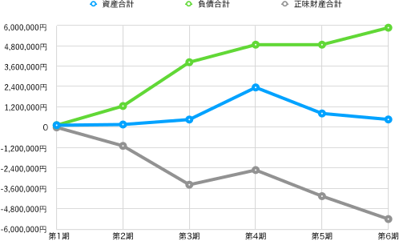
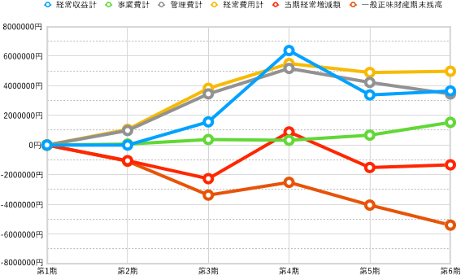
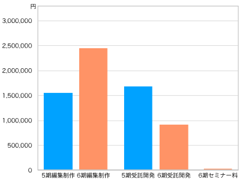

# **2024年度（第6期 2023年4月1日〜2024年3月31日）決算報告**

## 2024年度貸借対照表

今期末（2025年3月31日）現在における資産の保有状況（貸借対照表）を以下に示す。なお、単位は円である。

| 科目           | **当年度**    | **前年度**    | **増減**     |
| ------------ | ---------- | ---------- | ---------- |
| **Ⅰ 資産の部**   |            |            |            |
| 1 流動資産   |            |            |            |
| 現金・預金    |  32,304     | 353,154     | -320,850 |
| 売掛金       |   1,350,000  |  1,350,000    | 0 |
| 流動資産合計   |    1,350,000   |353,154  | 996,846  |
| 2 固定資産   |            |            |            |
| (1) その他固定資産   |            |            |            |
| 創立費      | 113,050    | 113,050    |     0      |
| その他固定資産合計 | 113,050    | 113,050    | 0          |
| 固定資産合計 | 113,050    | 113,050    | 0          |
| 資産合計     |  1,495,354  | 466,204 |1,029,150 |
| **Ⅱ 負債の部**   |            |            |            |
|1 流動負債  |            |            |            |
| 預り金     | 39,304     | 31,139     |  8,165   |
| 役員借入金  |  7,806,561   | 5,806,561   | 2,000,000  |
| 買掛金   |  275,000  | 11,000 | 264,000 |
| 未払法人税等   | 20,000 |  20,000 |    |
| 流動負債合計   |   8,140,865    | 5,868,700 | 2,272,165 |
| 負債合計     |   8,140,865  | 5,868,700 | 2,272,165 |
| **Ⅲ 正味財産の部** |            |            |            |
| 1 一般正味財産 |   -6,645,511    | -5,402,496 | -1,243,015 |
| 正味財産合計   |   -6,645,511    | -5,402,496 | -1,243,015 |
| 負債及び正味財産合計   |  1,495,354 | 466,204  | 1,029,150  |

創立以来の貸借対照表における主な指標（表の水色セル）の変遷を見てみよう（図1）。

{ width=90% }

資産合計は3期、4期と少しずつ上昇していたが、5期につづき6期でも下げる結果となった。正味財産も同様に、5期につづき6期でも下げている。負債合計は前期から100万円増えた。これはそっくり役員借入金の増加によるものである。

## 2024年度正味財産増減計算書

資産から負債を差し引いた価額を「正味財産」という。その増減を記録したのが「正味財産増減計算書」であり、これにより今期中（2024年4月1日から2025年3月31日）のお金の使い方や売上の明細がわかる。

| 科目                | **当年度**    | **前年度**    | **増減**     |
| ----------------- | ---------- | ---------- | ---------- |
| **Ⅰ. 一般正味財産増減の部** |            |            |            |
| 1. 経常増減の部         |            |            |            |
| ⑴ 経常収益            |            |            |            |
| ①事業収益             |  3,063,278      | (3,407,300)  |          |
| 事業収益            | 3,063,278   |  3,407,300  |         |
| ②受取寄付金          |             |  (243,254) |      |
| 受取寄付金          |          |  243,254 |           |
| ③雑収益              |           | (7)          |           |
| 受取利息              |           | 7          |           |
| 経常収益計              |    | 3,650,561  |  |
| ⑵ 経常費用            |            |            |            |
| ① 事業費             |            |            |            |
| 事業経費              |     | (1,530,724)     |     |
| 事）旅費交通費      |          | 8,188 |       |
| 事）通信運搬費     |       | 1,221 |        |
| 事）消耗品費       |         | 204 | -204 |
| 租税公課    |          |  30,000  |        |
| 事）雑費    |          |  9,650  |         |
| 事）支払手数料    |        |1,129,665  |       |
| 事）支払報酬料   |     |  352,000  |           |
| 事）新聞図書費   |         |       |           |
| 事業費計              |            | 1,530,724 |           |
| ② 管理費             |            |            |            |
| 管）業務委託費  |          |  3,451,800  |         |
| 管理費計              |         | 3,451,800 |          |
| 経常費用計             |            | 4,982,524 | 84,291 |
| 評価損益等調整前当期経常増減額   |  | -1,331,963 |             |
| 評価損益等計            | 0          | 0          | 0          |
| 当期経常増減額           |         | -1,331,963 |         |
| 2. 経常外増減の部        |            |            |            |
| ⑴ 経常外収益           |            |            |            |
| 経常外収益計            | 0          | 0          | 0          |
| ⑵ 経常外費用           |            |            |           |
| 経常外費用計            | 0          | 0          | 0          |
| 当期経常外増減額          | 0          | 0          | 0          |
| 他会計振替前当期一般正味財産増減額 |  | -1,331,963 |           |
| 税引前当期一般正味財産増減額    |  | -1,331,963   |           |
| 法人税、住民税及び事業税      |　     | 20,000     |     |
| 当期一般正味財産増減額       |         | -1,331,963 |              |
| 一般正味財産期首残高        |          | -4,050,533 |          |
| 一般正味財産期末残高        |          | -5,402,496 |          |
| **Ⅱ. 指定正味財産増減の部** |            |            |            |
| 当期指定正味財産増減額       | 0          | 0          | 0          |
| 指定正味財産期首残高        | 0          | 0          | 0          |
| 指定正味財産期末残高        | 0          | 0          | 0          |
| **Ⅲ. 正味財産期末残高**   |            | -5,402,496 |            |

この正味財産増減計算書のうちの主な指標（表の水色セル）について、創立以来の増減をグラフにした（図2）。

{ width=90% }

一つ一つ見ていこう。まず当団体が経常的に得た収益を表す「経常収益額」（水色の線）の増減をみると、前期よりも266,303円多い3,650,561円だった。内訳を見ると、本業である事業収益が前期より171,550円多い3,407,300円、受取寄付金が前期よりも94,756円多い243,254円となっている。前期である5期は4期と比べて売上が大きく落ちたのだが、今期は少しだけ持ち直したといえる。図3はその事業収益の内訳を示している。72％と過半を占めるのは編集制作であることが分かる。

{ width=45% }

この数年、当法人の事業収益は受託開発と編集制作が中心となってきた。図3は4期以降の推移を示している（新しく今期加わったセミナー料は除いている）。受託開発が少しずつ減り、編集制作が増えていることがわかる。

{ width=70% }

図2に戻って、経常収益を生み出すための経費である経常費用（黄色の線）をみると、前期より84,291円増えた4,982,524円となっている。内訳を見ると、諸経費である事業費計（緑色の線）は前期より861,991円増えた1,530,724円、業務委託費である管理費計（灰色の線）は前期より777,700円減った3,451,800円となっている。つまり、管理費は減少したが、事業費は増加している。

事業費の内訳を見ると、支払手数料が前期より668,260円も多い1,129,665円であることが目を引く。つまり、業務委託費の削減分を上回る支払手数料の増加があったことが分かる。そこで支払手数料の内訳を見てみよう（図5）。

{ width=70% }

支払手数料の88％を占めるのは印刷代である。図3で編集制作費が増えたことを示したが、それに伴い印刷代が大幅に増えたことが分かる。これは編集制作が印刷費込みの契約であったためであるが、同時に事業収益の中で多くを占める編集制作は、じつは受託開発に比べて経費の割合が多いことに注意が必要だろう。

再び図2に戻って、事業の結果が赤字か黒字かを示す指標「当期経常増減額」（ピンク色の線）をみると、前期より182,012円多いものの、マイナス1,331,963円の赤字となった。

今期が終わった時点での正味財産の額である「一般正味財産期末残高」（赤色の線）をみると前期よりも1,331,963円減少し、マイナス5,402,496円となった。これは、前期のマイナス4,050,533円よりもさらに赤字が拡大したことになる。

