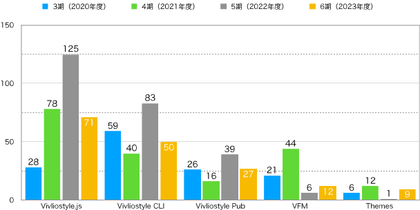

## **第1章 2023年度（第6期 2023年4月1日〜2024年3月31日）決算報告**

### はじめに

一般社団法人ビブリオスタイル（以下、当法人）は、2018年8月に設立され2023年3月まで5期にわたり活動を続けてきた。ここでは2023年4月から始まる第6期の決算を報告する。

### 2023年度貸借対照表

今期末（2024年3月31日）現在における資産の保有状況（貸借対照表）を以下に示す。なお、単位は円である。

| 科目           | **当年度**    | **前年度**    | **増減**     |
| ------------ | ---------- | ---------- | ---------- |
| **Ⅰ 資産の部**   |            |            |            |
| 1 流動資産   |            |            |            |
| 現金・預金    | 353,154 | 493,367     | -140,213 |
| 売掛金       |           |  211,750 | -211,750 |
| 流動資産合計   | 353,154 | 705,117  | -351,963  |
| 2 固定資産   |            |            |            |
| (1) その他固定資産   |            |            |            |
| 創立費      | 113,050    | 113,050    |           |
| その他固定資産合計 | 113,050    | 113,050    | 0          |
| 固定資産合計 | 113,050    | 113,050    | 0          |
| 資産合計     | 466,204 | 818,167 | -351,963 |
| **Ⅱ 負債の部**   |            |            |            |
|1 流動負債  |            |            |            |
| 預り金     | 31,139     | 31,139     |      |
| 役員借入金  | 5,806,561 | 4,806,561  | 1,000,000  |
| 買掛金   |  11,000  | 11,000 |    |
| 未払法人税等   | 20,000 |  20,000 |    |
| 流動負債合計   | 5,868,700 | 4,868,700 | 1,000,000 |
| 負債合計     | 5,868,700 | 4,868,700 | 1,000,000 |
| **Ⅲ 正味財産の部** |            |            |            |
| 1 一般正味財産 | -5,402,496 | -4,050,533 | -1,351,963 |
| 正味財産合計   | -5,402,496 | -4,050,533 | -1,351,963 |
| 負債及び正味財産合計   | 466,204 | 818,167  | -351,963  |

創立以来の貸借対照表における主な指標（表の水色セル）の変遷を見てみよう（図1）。

{ width=90% }

資産合計は3期、4期と少しずつ上昇していたが、5期につづき6期でも下げる結果となった。正味財産も同様に、5期につづき6期でも下げている。負債合計は前期から100万円増えた。これはそっくり役員借入金の増加によるものである。

### 2023年度正味財産増減計算書

資産から負債を差し引いた価額を「正味財産」という。その増減を記録したのが「正味財産増減計算書」であり、これにより今期中（2023年4月1日から2024年3月31日）のお金の使い方や売上の明細がわかる。

| 科目                | **当年度**    | **前年度**    | **増減**     |
| ----------------- | ---------- | ---------- | ---------- |
| **Ⅰ. 一般正味財産増減の部** |            |            |            |
| 1. 経常増減の部         |            |            |            |
| ⑴ 経常収益            |            |            |            |
| ①事業収益             | (3,407,300) | (3,235,750)  | (171,550)  |
| 事業収益            | 3,407,300  |  3,235,750  | 171,550  |
| ②受取寄付金          | (243,254)  |  (148,498) | (94,756)     |
| 受取寄付金          | 243,254  |  148,498 | 94,756 |
| ③雑収益              | (7)          | (10)          | (-3)          |
| 受取利息              | 7          | 10          | -3          |
| 経常収益計              | 3,650,561   | 3,384,258  | 266,303 |
| ⑵ 経常費用            |            |            |            |
| ① 事業費             |            |            |            |
| 事業経費              | (1,530,724)    | (668,733)     | (861,991)    |
| 事）旅費交通費             | 8,188 | 1,676 | 6,512 |
| 事）通信運搬費             | 1,221 | 1,848 | -627 |
| 事）消耗品費             |  | 204 | -204 |
| 租税公課    | 30,000 |    | 30,000  |
| 事）雑費    | 9,650 |    | 9,650  |
| 事）支払手数料    | 1,129,665 | 461,405  | 668,260 |
| 事）支払報酬料   | 352,000 |  198,000 | 154,000 |
| 事）新聞図書費   |         | 5,600 | -5,600 |
| 事業費計              | 1,530,724 | 668,733 | 861,991 |
| ② 管理費             |            |            |            |
| 管）業務委託費  | 3,451,800 |  4,229,500  | -777,700 |
| 管理費計              |  3,451,800  | 4,229,500 | -777,700 |
| 経常費用計             |  4,982,524  | 4,898,233 | 84,291 |
| 評価損益等調整前当期経常増減額   | -1,331,963 | -1,513,975 | 182,012 |
| 評価損益等計            | 0          | 0          | 0          |
| 当期経常増減額           | -1,331,963 | -1,513,975 | 182,012 |
| 2. 経常外増減の部        |            |            |            |
| ⑴ 経常外収益           |            |            |            |
| 経常外収益計            | 0          | 0          | 0          |
| ⑵ 経常外費用           |            |            |           |
| 経常外費用計            | 0          | 0          | 0          |
| 当期経常外増減額          | 0          | 0          | 0          |
| 他会計振替前当期一般正味財産増減額 | -1,331,963 | -1,513,975 | 182,012 |
| 税引前当期一般正味財産増減額    | -1,331,963 | -1,513,975 | 182,012 |
| 法人税、住民税及び事業税      | 20,000     | 20,000     | 0    |
| 当期一般正味財産増減額       | -1,331,963 | -1,513,975 | 182,012 |
| 一般正味財産期首残高        | -4,050,533 | -2,516,558 | -1,533,975 |
| 一般正味財産期末残高        | -5,402,496 | -4,050,533 | -1,331,963 |
| **Ⅱ. 指定正味財産増減の部** |            |            |            |
| 当期指定正味財産増減額       | 0          | 0          | 0          |
| 指定正味財産期首残高        | 0          | 0          | 0          |
| 指定正味財産期末残高        | 0          | 0          | 0          |
| **Ⅲ. 正味財産期末残高**   | -5,402,496 | -4,050,533 | -1,331,963 |

この正味財産増減計算書のうちの主な指標（表の水色セル）について、創立以来の増減をグラフにした（図2）。

{ width=90% }

一つ一つ見ていこう。まず当団体が経常的に得た収益を表す「経常収益額」（水色の線）の増減をみると、前期よりも266,303円多い3,650,561円だった。内訳を見ると、本業である事業収益が前期より171,550円多い3,407,300円、受取寄付金が前期よりも94,756円多い243,254円となっている。前期である5期は4期と比べて売上が大きく落ちたのだが、今期は少しだけ持ち直したといえる。図3はその事業収益の内訳を示している。72％と過半を占めるのは編集制作であることが分かる。

{ width=45% }

この数年、当法人の事業収益は受託開発と編集制作が中心となってきた。図3は4期以降の推移を示している（新しく今期加わったセミナー料は除いている）。受託開発が少しずつ減り、編集制作が増えていることがわかる。

{ width=70% }

図2に戻って、経常収益を生み出すための経費である経常費用（黄色の線）をみると、前期より84,291円増えた4,982,524円となっている。内訳を見ると、諸経費である事業費計（緑色の線）は前期より861,991円増えた1,530,724円、業務委託費である管理費計（灰色の線）は前期より777,700円減った3,451,800円となっている。つまり、管理費は減少したが、事業費は増加している。

事業費の内訳を見ると、支払手数料が前期より668,260円も多い1,129,665円であることが目を引く。つまり、業務委託費の削減分を上回る支払手数料の増加があったことが分かる。そこで支払手数料の内訳を見てみよう（図5）。

{ width=70% }

支払手数料の88％を占めるのは印刷代である。図3で編集制作費が増えたことを示したが、それに伴い印刷代が大幅に増えたことが分かる。これは編集制作が印刷費込みの契約であったためであるが、同時に事業収益の中で多くを占める編集制作は、じつは受託開発に比べて経費の割合が多いことに注意が必要だろう。

再び図2に戻って、事業の結果が赤字か黒字かを示す指標「当期経常増減額」（ピンク色の線）をみると、前期より182,012円多いものの、マイナス1,331,963円の赤字となった。

今期が終わった時点での正味財産の額である「一般正味財産期末残高」（赤色の線）をみると前期よりも1,331,963円減少し、マイナス5,402,496円となった。これは、前期のマイナス4,050,533円よりもさらに赤字が拡大したことになる。

### 2023年度収支計算書

第1章の終わりとして、今期中（2023年4月1日から2024年3月31日）における、予算額と決算額を比較した収支計算書を見よう。ただし、当法人は予算を策定していないので、形式的なものに留まり、前節の正味財産増減計算書と実質的に同じ内容になる。

| 科目                | 予算額 | 決算額        | 差異         | 備考 |
| ----------------- | --- | ---------- | ---------- | -- |
| **Ⅰ. 一般正味財産増減の部** |     |            |            |    |
| 1. 経常増減の部         |     |            |            |    |
| ⑴ 経常収益            |     |            |            |    |
| ①事業収益             | (0)   | (3,407,300)  | -3,407,300 |    |
| 事業収益             |     | 3,407,300  | -3,407,300 |    |
| ②受取寄付金          | (0)   |(243,254)     | (-243,254)    |    |
| 受取寄付金           |     | 243,254     | -243,254 |    |
| ③雑収益              | (0)   | (7)          | (-7)         |    |
| 受取利息              |  0   | 7          | -7         |    |
| 経常利益計             | 0   | 3,650,561  | -3,650,561 |    |
| ⑵ 経常費用            |     |            |            |    |
| ① 事業費             |     |            |            |    |
| 事業経費              | (0)   | (1,530,724)    | -1,530,724 |    |
| 事）旅費交通費   |    | 8,188  | -8,188 |    |
| 事）通信運搬費  |     | 1,221  | -1,221  |    |
| 事）租税公課    |   | 30,000  | -30,000  |    |
| 雑費    |      | 9,650  | -9,650  |    |
| 事）支払手数料 |     | 1,129,665 | -1,129,665  |    |
| 事）支払報酬料   |     | 352,000    | -352,000   |    |
| 事業費計              | 0   | 1,530,724 | -1,530,724 |    |
| ② 管理費             |     |            |            |    |
| 管）業務委託費    |     | 3,451,800 | -3,451,800 |    |
| 管理費計              | 0   | 3,451,800  | -3,451,800 |    |
| 経常費用計             | 0   | 4,982,524  | -4,982,524 |    |
| 評価損益等調整前当期経常増減額   | 0   | -1,331,963 | 1,331,963  |    |
| 評価損益等計            | 0   | 0          | 0          |    |
| 当期経常増減額           | 0   | -1,331,963 | 1,331,963  |    |
| 2. 経常外増減の部        |     |            |            |    |
| ⑴ 経常外収益           |     |            |            |    |
| 経常外収益計            | 0   | 0          | 0          |    |
| ⑵ 経常外費用           |     |            |            |    |
| 経常外費用計            | 0   | 0          | 0          |    |
| 当期経常外増減額          | 0   | 0          | 0          |    |
| 他会計振替前当期一般正味財産増減額 | 0   | -1,331,963 | 1,331,963  |    |
| 税引前当期一般正味財産増減額    | 0   | -1,331,963 | 1,331,963  |    |
| 法人税、住民税及び事業税      | 0   | 20,000     | -20,000    |    |
| 当期一般正味財産増減額       | 0   | -1,331,963 | 1,331,963  |    |
| 一般正味財産期首残高        | 0   | -4,050,533 | 4,050,533  |    |
| 一般正味財産期末残高        | 0   | -5,402,496 | 5,402,496  |    |
| **Ⅱ. 指定正味財産増減の部** |     |            |            |    |
| 当期指定正味財産増減額       | 0   | 0          | 0          |    |
| 指定正味財産期首残高        | 0   | 0          | 0          |    |
| 指定正味財産期末残高        | 0   | 0          | 0          |    |
| **Ⅲ. 正味財産期末残高**   | 0   | -5,402,496 | 5,402,496  |    |

## **第2章  2023年度（第6期 2023年4月1日〜2024年3月31日）事業報告**

### プロダクト開発

第2章では、今期おこなった事業の報告を行う。まず当法人の設立目的でもあるプロダクト開発について報告しよう。図6は過去4期分の主要プロダクトのPR数を示している。

{ width=100% }

主要プロダクトの中でも枢要を占めるVivliostyle.jsとVivliostyle CLIのPR数は、前期に比べて減少している。Vivliostyle Pubも同様に前期を下回った。その一方で、VFMとThemesは前期を上回ったが、絶対数が少ないため、全体としては残念ながら前期と比べて低調だったと言えるだろう。

### ハンズオンセミナーの開催

これまで一般に開発成果をアピールするためのイベントとして、「Vivliostyle ユーザーと開発者の集い」を春と秋の年2回開催してきた。しかし、発表準備のための負担が過大である一方、参加者や動画視聴者が少なく効果的な広報活動にはなっていないという課題があった。そこで、今期は[「Vivliostyle ユーザーと開発者の集い 2023春」](https://vivliostyle.connpass.com/event/280760/)の開催を最後に、そのあり方を見直すことにした。

そこで考え出されたのが、印刷会社と連携したハンズオン・イベントである。これは、公募したユーザーに対して、実際にVivliostyleを使ってもらいながら使い方を学んでもらい、最終成果として作成したPDFを印刷会社にオンデマンド印刷していただき、ユーザーにプレゼントしようというものだ。印刷会社には自社技術のアピールする機会となり、ユーザーにはVivliostyleの使い方を学ぶ機会となるはずだ。

そうして編集制作事業でお付き合いのあった[欧文印刷株式会社](https://obun.jp/)の協力を仰いで開催したのが、[「第1回Vivliostyleハンズオンセミナー　講師に教わりながら、Vivliostyleで本を作る！」](https://vivliostyle.org/ja/hands-on/1/)だった。しかし、結果としては参加したユーザーのレベルがまちまちで、初心者には敷居が高い一方で、上級者には物足りない内容となり、ハンズオンセミナーの難しさを痛感することとなった。今後は、参加者のレベルを適切に絞り込む方法が課題となるだろう。

- [講師に教わりながら、Vivliostyleで本を作る！（YouTube）](https://www.youtube.com/playlist?list=PLgmHvdtAuq5Ps7oO18Ni2pey1ut7DCfS6)
- [vivliostyle-cli-helper を使った本作り](https://vivliostyle.github.io/vivliostyle-cli-helper-doc/#/ja/)

### gihyo.jpでの連載

そのハンズオンセミナーの思わぬ成果として始まったのが、gihyo.jpでの連載である。ハンズオンセミナーの終了後の懇親会で、技術評論社の編集者が提案してくれたのがきっかけとなって検討が始まった。特定の人間が執筆するのではなく、広くコミッターの皆さんに書きたいテーマを持ち寄ってもらおうという趣旨である。本稿執筆時点で以下の記事が掲載されている。

- [第1回：Vivliostyleでなにができるの？（村上真雄・小形克宏）](https://gihyo.jp/article/2024/01/vivliostyle-01)
- [第2回：Vivliostyleに特化したMarkdown - VFMの使い方（akabeko）](https://gihyo.jp/article/2024/03/vivliostyle-02)
- [第3回：CSSフレームワークVivliostyle Themeで簡単にページデザインを編集する（spring-raining）](https://gihyo.jp/article/2024/04/vivliostyle-03)
- [第4回：Vivliostyleで市販書籍とそっくりに組んでみよう（大津雄一郎）](https://gihyo.jp/article/2024/05/vivliostyle-04)

掲載されるのはgihyo.jpのサイトであるが、VivliostyleのGitHubリポジトリ内に記事制作のためのプライベートリポジトリを用意することとなった。また、原稿のプルリクエストでは、当法人がレビュアーとして関わらせていただいている。

## 理事

- [村上真雄 (Shinyu Murakami)](https://github.com/MurakamiShinyu)〈代表理事、設立時社員〉
- [リボアル・フロリアン (Florian Rivoal)](https://github.com/frivoal)〈理事、設立時社員〉
- [ヨハネス・ウィルム (Johannes Wilm)](https://github.com/johanneswilm)〈理事、設立時社員〉
- [小形克宏 (Katsuhiro Ogata)](https://github.com/ogwata)〈理事、2020年1月21日より〉
