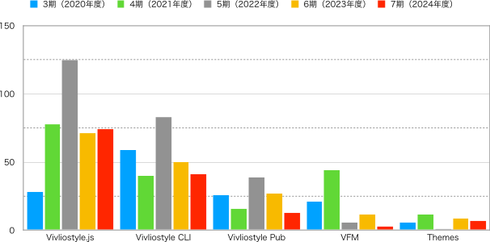

# **2024年度（第7期 2024年4月1日〜2025年3月31日）活動報告**

## プロダクト開発

まず、今期における主要プロダクトのPR数（ただしアプリケーションによるものを除く）を示す。比較のために3期〜6期も併記している。

{ width=100% }

## 技術評論社gihyo.jpでの連載記事

開発以外のトピックスとしては、まず[gihyo.jp](https://gihyo.jp/about/site)での連載、[Vivliostyleが拓くCSS組版の可能性](https://gihyo.jp/list/group/Vivliostyle%E3%81%8C%E6%8B%93%E3%81%8FCSS%E7%B5%84%E7%89%88%E3%81%AE%E5%8F%AF%E8%83%BD%E6%80%A7)が挙げられる。この連載では、Vivliostyleの技術的な特徴や活用事例、CSS組版の可能性について、実践的な例を交えながら解説している。以下に執筆時点での記事一覧を示す。なお、連載の趣旨と経緯については[前期の活動報告書](https://vivliostyle.org/viewer/#src=https://vivliostyle.github.io/vivliostyle_doc/ja/reports/vivliostyle-report-2023/vf2023report.html&bookMode=true)を参照されたい。

- [Vivliostyleでなにができるの？（村上真雄、小形克宏）](https://gihyo.jp/article/2024/01/vivliostyle-01)
- [Vivliostyleに特化したMarkdown - VFMの使い方（akabeko）](https://gihyo.jp/article/2024/03/vivliostyle-02)
- [CSSフレームワークVivliostyle Themeで簡単にページデザインを編集する（spring-raining）](https://gihyo.jp/article/2024/04/vivliostyle-03)
- [Vivliostyleで市販書籍とそっくりに組んでみよう（大津雄一郎）](https://gihyo.jp/article/2024/05/vivliostyle-040)
- [VFMで学会論文を書いてVivliostyleで組んで投稿する［前編］（yamahige）](https://gihyo.jp/article/2025/02/vivliostyle-05)
- [VFMで学会論文を書いてVivliostyleで組んで投稿する［後編］（yamahige）](https://gihyo.jp/article/2025/02/vivliostyle-05-2)

## Vivliostyle Pubの再起動

もう一つの今期のトピックスは、Vivliostyle Pubの再起動である。本プロダクトは2022年4月にアルファ版を公開した。当初はインストール不要で高水準なCSS組版を楽しめるWebアプリとして、大方の好評を得ることができた。とはいえ、時間の経過とともに少しずつ気になる点が出てくるものだ。

たとえば、エンジニア好みのVScodeに似たインターフェイスは、本来誰もが気軽に使えるはずのWebアプリのものとしては矛盾していないだろうか。また、ストレージやユーザー認証をGitHubに依存していることが、ユーザーをエンジニアに限定する結果となっていないだろうか。さらに、アルファ版の公開後に大幅なアップデートを果たした新しいthemesが使えないままであるなど、その後のVivliostyleプロダクトのアップデートをキャッチアップできていないことも気になる。

それでも、それらを改修しようとすれば大規模な作業になることは容易に予想できる。そう簡単にVivliostyle Pubの抜本的なアップデートに踏み切ることもできないまま、数年が過ぎてしまったのが実情だった。

そうした時に連絡をとってきたのが、自費出版のWebサービス[Booko](https://www.booko.co.jp/)（代表・長谷川恵子氏）だった。同サービスは簡単に本が作れるインターフェイスが好評な反面、見開きを超える長文が扱えないという技術的課題を抱えており、それを解決するために当法人との連携を探ったのだった。一方、ユーザーが非エンジニアになかなか広がらない課題をもつ当法人にとって、Bookoの持つ種々のノウハウは非常に魅力的に映った。

もともとBookoも当法人も、HTMLとCSSを使いWeb上で本を作るというゴールは同じだ。その一方で、お互いに自分にないリソースを持っている、つまり相互補完的な関係にある。このことに気付いた当法人の村上代表理事・小形理事と、Booko代表の長谷川氏は、3人で資金を持ち寄って合同会社を立ち上げることにした。これが2025年2月に設立したビブリオブッコ合同会社である。もちろんこの社名は、両者の相互補完的な関係をそのまま表している。

ただし、オープンソース開発団体としての当法人の活動に変わりはない。これを機にオープンソースのVivliostyle Pubの抜本的なアップデートに取り組むことにする。ビブリオブッコ合同会社は、その成果物を利用した、新しいBookoのサービス（VivlioBooko）を開発・運営することになる予定だ。

## 理事

- [村上真雄 (Shinyu Murakami)](https://github.com/MurakamiShinyu)〈代表理事、設立時社員〉
- [リボアル・フロリアン (Florian Rivoal)](https://github.com/frivoal)〈理事、設立時社員〉
- [ヨハネス・ウィルム (Johannes Wilm)](https://github.com/johanneswilm)〈理事、設立時社員〉
- [小形克宏 (Katsuhiro Ogata)](https://github.com/ogwata)〈理事、2020年1月21日より〉
