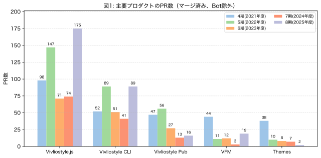

# 一般社団法人ビブリオスタイル 2025年度活動報告書

## 2025年度（第8期 2025年4月1日〜2026年3月31日）活動報告

### プロダクト開発

今期における主要プロダクトのPR数（ただしアプリケーションによるものを除く）を示す。比較のために4期〜7期も併記している。

{ width=100% }

今期最大のトピックは、開発の活発化である。Vivliostyle.jsのPR数は175と前期の74から2倍以上に増加し、過去最高を記録した。Vivliostyle CLIも前期の41から89へと大きく伸びた。さらに、前期はわずか3にとどまっていたVFMも19にまで回復し、Vivliostyle Pubも6から16へと増えている。なお、Vivliostyle Pubは今期、後述するゼロベースでの再構築を新リポジトリ[`vivliostyle.pub`](https://github.com/vivliostyle/vivliostyle.pub)で開始しており、ここでのPR数（10件）と旧リポジトリ[`vivliostyle-pub`](https://github.com/vivliostyle/vivliostyle-pub)の保守PR数（6件）を合計したものを当期の数値としている。Themesは2とこれまでで最も少ない数となったが、これは開発の重心が他プロダクトへシフトしたためである。総じて、Vivliostyle.jsとCLIを中心としたコア開発が大きく前進した1年であったといえる。

### NLnet財団からの助成金獲得

今期のもう一つの大きなトピックは、欧州のオープンソース支援団体である[NLnet財団](https://nlnet.nl/)から[NGI0コモンズ基金](https://nlnet.nl/commonsfund/)の助成対象として採択されたことである。詳細は[当法人のブログ記事](https://vivliostyle.org/ja/blog/2025/07/07/obtained-a-grant-from-nlnet/)を参照されたい。

NLnet財団は、欧州委員会のNext Generation Internet（NGI）イニシアチブの一環として、インターネットの公共性・プライバシー・セキュリティを高めるオープンソース技術プロジェクトを支援している。Vivliostyleはこの基金から助成を受けることになり、今期はその第1回〜第3回分として合計約143万円が交付された（決算報告書「受取補助金」参照）。

この助成により、これまで開発リソースの不足から進捗が緩やかだった以下のような領域に集中的に取り組めるようになった。

- Vivliostyle.jsにおける最新CSS仕様への対応（ページ分割アルゴリズムの改善、脚注処理など）
- Vivliostyle Pubのエディター機能の拡張とテーマ整備
- Vivliostyle CLIのブラウザサポート拡充
- ドキュメントサイトの整備

前掲の主要プロダクトのPR数の大幅な増加は、この助成によって開発リソースが確保されたことの直接的な成果でもある。

### Vivliostyle Pubのゼロベース再構築

前期の活動報告書では、自費出版Webサービス[Booko](https://www.booko.co.jp/)との協業を契機に、長らく停滞していたVivliostyle Pubの開発を再起動することを述べた。今期はそれを具体化し、ゼロベースでの再構築に着手した1年であった。

旧リポジトリ[`vivliostyle-pub`](https://github.com/vivliostyle/vivliostyle-pub)で公開されていたアルファ版は、技術スタックの古さや設計上の制約から発展的な拡張が難しかったため、新リポジトリ[`vivliostyle.pub`](https://github.com/vivliostyle/vivliostyle.pub)を2025年1月に作成し、フロントエンドのセットアップから組み直すこととした。この新Vivliostyle Pubの開発は、前述のNLnet財団からの助成金を主たる原資として[spring-raining氏](https://github.com/spring-raining)に開発を委託する形で進めている。

今期の主な進捗としては、新リポジトリにおいて以下のPRがマージされた（FY2025期間中、すべてspring-raining氏による）。

- 基本機能：エディタ機能の改善、エントリ並び替え機能、AST viewerへのCSSペイン追加、プレビューページの追加
- 出力機能：PDFエクスポート
- 配信基盤：デプロイCIの整備、ビルドエラーの修正

成果物は[`alpha.vivliostyle.pub`](https://alpha.vivliostyle.pub)で公開しており、ブラウザ上でMarkdownを編集して即座にプレビュー・PDF出力できる段階まで到達している。なお、旧リポジトリも今期中はVivliostyle CLI/Viewerの最新版追従を目的とした保守更新が継続された（村上代表理事による6件のPR）。

来期は引き続きspring-raining氏による開発を継続し、共同編集機能や国際化など、当初の目標であった「誰もが簡単にCSS組版を楽しめるWebアプリ」の実現に向けて開発を加速していく予定である。

### ドキュメントサイトの刷新

開発の活発化を受けて、利用者向けの情報発信もまた強化する必要が生じた。そこで今期取り組んだのが、新たな公式ドキュメントサイト[docs.vivliostyle.org](https://docs.vivliostyle.org/ja/)の構築である。

このサイトは、Vivliostyleエコシステムを構成する4つのプロダクト（Viewer、CLI、VFM、Themes）について、初心者向けのチュートリアルから開発者向けのAPIリファレンスまで網羅的に提供することを目的としている。チュートリアル、FAQ、リファレンス、実践的な活用ガイド（脚注、CMYK変換、ページグループ対応など）、貢献ガイドといった構成である。

#### ワンストップ化

従来、各プロダクトのドキュメントは、それぞれのリポジトリに置かれているものもあれば、旧ドキュメントサイトに置かれているものもあり、置き場所が一貫していなかった。そのため、あるプロダクトの使い方を調べようとすると、まずどこに該当ドキュメントがあるのかを利用者自身が見極める必要があり、複数のプロダクトを横断的に調べたいときには、なおさら大きな負担を強いていた。この状態を解消するために、新ドキュメントサイトでは各プロダクトのリポジトリをsubmoduleとして読み込み、**ワンストップですべてのドキュメントを参照できる場** として整備した。

#### ドッグフーディングとSSMO

もう一つの主旨は、Vivliostyle自身によるドッグフーディングである。本サイトのドキュメントは [VFM](https://github.com/vivliostyle/vfm)（Vivliostyle Flavored Markdown）で記述し、[Vivliostyle CLI](https://github.com/vivliostyle/vivliostyle-cli) を用いて以下の3形式に出力している。

- **WebPub** — オンライン閲覧用HTMLページ
- **PDF** — 印刷可能なドキュメント
- **EPUB** — 電子書籍フォーマット

これは、Vivliostyleが標榜する **SSMO（Single Source Multi Output）** の実践そのものでもある。同一のMarkdownソースから複数形式を生成することで、Vivliostyleプロダクトの機能をリアルなユースケースで自ら検証しつつ、その有用性を利用者に示すことを最終的な狙いとしている。今後も継続的な拡充を予定している。

### 理事

- [村上真雄 (Shinyu Murakami)](https://github.com/MurakamiShinyu)〈代表理事、設立時社員〉
- [リボアル・フロリアン (Florian Rivoal)](https://github.com/frivoal)〈理事、設立時社員〉
- [ヨハネス・ウィルム (Johannes Wilm)](https://github.com/johanneswilm)〈理事、設立時社員〉
- [小形克宏 (Katsuhiro Ogata)](https://github.com/ogwata)〈理事、2020年1月21日より〉
