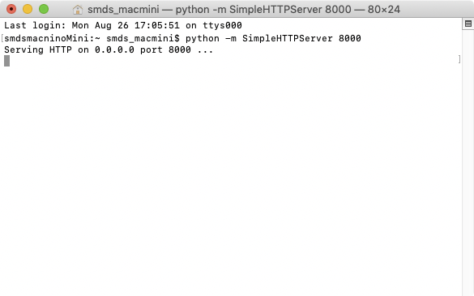
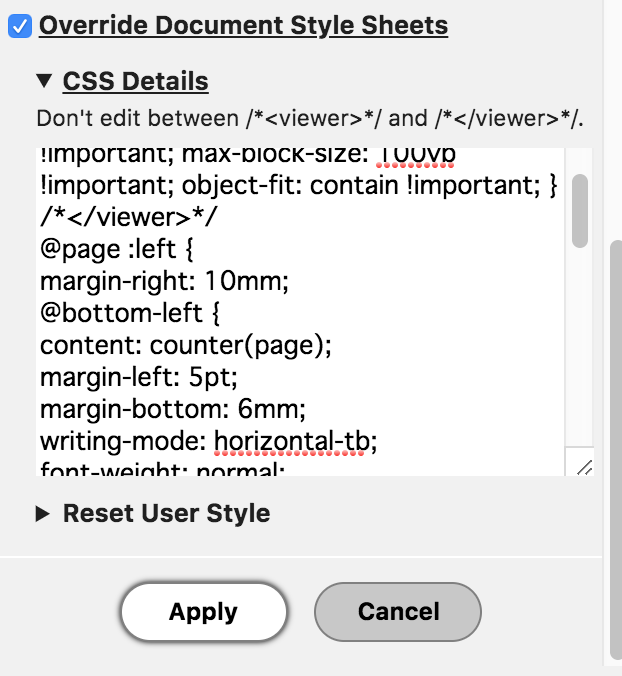
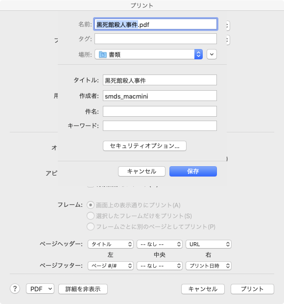

# EPUB ファイルから Vivliostyle で PDF を作りたい！

<div class="draft-author">
田嶋　淳（@JunTajima）<span class="footnote" style="text-align: left;"><a href="http://densyodamasii.com/">http://densyodamasii.com/</a></span>
</div>

　印刷 DTP データからの EPUB 作成の仕事を長年やっていて、ずっと解決できないでいた悩みがあった。それは、__「EPUB を PDF に出力すること」__である。Web 方面の人はなぜそんなことが必要なのか不思議に思うかもしれない。それは　__「出版社に内容を確認してもらうため」__に必要になるのだ（「検収」と呼ぶ）。もちろんわれわれ制作者は、できる限り元データの情報を失わない形で電子化をするのだけど、だからといってチェックもせずにそのまま販売はできない。そしてチェックのためには、__できるだけ元の本の版面に近い形で EPUB を表示させ、それを元の本と見比べる__必要が出てくる。出版社によっては外部の校正者に依頼するケースもあるから、可能ならプリントできる PDF 形式の変換データも渡すことが必要になってくるのだ。
　ところが長いことこれが随分難しい話だった。__商業用 EPUB ビューアには例外なく「印刷の機能がない」__からだ。理由はまあ明確で、もし購入した電子本を印刷の機能を使って PDF にできてしまえば、それはすなわち__海賊版の作成補助になってしまう__からだ。これはどこの出版社も納得しないだろうからまあ仕方ない。
　ただし、前述の理由で製作段階では紙に出力できる PDF を作る必要はあるから、現場ではスクリプト処理で連続スクリーンショットを取り、それを PDF 化するというような力技が必要になっていた。画像の塊だからこの PDF はファイルサイズが恐ろしくデカい。減色処理をしても平気で 400〜500MB にもなる。これだと作成そのものにも時間がかかるし、データを送付するのも大変だ。どうにかできないか、というのが長年の悩みだった。
　そこで Vivliostyle である。EPUB の表示に対応済みと村上さんからお聞きしたとき、これならもしかして行けるのではないかとすぐに思った。なにしろ本来の素性が CSS 組版エンジンなので、組版表示の能力はかなり期待はできる。そこが貧弱だと検収用には使えないのだ。ということで村上さんにご指導をいただき、早速試してみた。

## やりたいこと
　最初に、やりたいことを箇条書きでまとめておく。

<div class="page-break"></div>

1. EPUB を CSS の標準的な表現に沿った形で PDF 化したい
2. 元の本の版面にできるだけ合わせたい
3. Web にアップロードせずローカルで処理したい
4. 校正指示のためにページ番号は入れたい
5. 元 EPUB の CSS はできれば触りたくない
6. Mac 標準のツール群でどうにかしたい

　個々の項目に関して説明すると、まず 1 については、表示確認目的である以上、標準的な表現である方が望ましい。現在いくつかの EPUB ビューアは日本語を読みやすくする目的で独自に表現の拡張を行なっているが、そういったものはリファレンス的な用途には不向きだ。
　2 については実際の表示確認のワークフローが底本との照らし合わせである以上必須になる。特に__一行文字数は確実に合わせたい__。これが合っていないと、校正におそろしく手間がかかる。これは実際にやってみればすぐわかる。可能ならば__2 つの版面を並べて「絵として比較できる」状態が望ましい__のだ。括弧類や句読点のツメ処理などの関係でどのみち全く同じ組版にはならないけれど、見比べる以上共通点は少しでも多い方がよい。
　3 は販売前の商用 EPUB の制作に利用する以上は当然だ。データそのものを外部から見られる場所にアップロードするわけにはいかない。__もし漏洩したら大問題になる__。
　4 はまあできればでよいけれど、修正箇所の指示で今出版社の担当者が大いに悩んでいそうなのは日々感じているので、入れられるなら入れてあげたい。
　5 は 4 を踏まえた上で、その CSS 指定のために元の EPUB のファイル群は可能なら触りたくない。触ればヒューマンエラーも起きるし、手間もかかる。
　で、その上で、できるなら追加でモジュール群などをインストールしてマシンを環境構築する手間は避けられるのなら避けたい。これは会社の複数台のマシンをメンテナンスする労力からくる要望だ。

## VivliostyleでEPUBをローカル表示させPDF化する手順

　ということを踏まえて、実際に Vivliostyle で EPUB をローカル表示させ、PDF にするまでをやってみた。手順は以下の通り。

### 1. Webサーバをローカルで立てる

　Vivliostyle は本来サーバに置いて動かすようなソフトウェアなので、それをローカルで使うにはまず自分のマシン内にサーバを立てる必要がある。もちろんこれはローカルで完結していて外部からは見えない状態なのだが、いわば自分のマシン内に仮想的に立てたサーバ上のファイルをローカルのブラウザで見られる状態にする必要があるのだ。

　Vivliostyle の公式説明では Node.JS を使うことになっていたのだが、Node.JS 自体のインストールを個々のマシンで行わなければならない上に、インストールで少々手こずってしまい、結果的に村上さんにアドバイスをいただいて Python のコマンドを使って解決した。Python ならば Mac に標準で入っているのでその方がむろん望ましい。

　手順としては単純で、Mac に標準で入っている__「ターミナル」上で「`python -m SimpleHTTPServer 8000`」のコマンドを打ち込むだけ__だ。これだけでポート 8000 を対象としてローカルサーバが起動する。次の画面のようになっていれば OK。



### 2. Vivliostyle Viewerをローカルで起動

　さて、無事ローカルサーバが立ち上がったら、その上でローカルのフォルダ内にある Vivliostyle Viewer を動かしてやる。例えばダウンロードしてきた `vivliostyle-js-2019.1.105` のフォルダが Mac のデスクトップ上の `vivliostyle_test` フォルダに置かれているなら、URL 指定は以下のような形になる。

> `http://localhost:8000/Desktop/vivliostyle_test/vivliostyle-js-2019.1.105/viewer/vivliostyle-viewer.html`

　これをブラウザのアドレスバーに入力して無事に Vivliostyle Viewer の画面が表示されればひとまずは成功。


　デスクトップにフォルダを置きたくないというのであれば、「Documents」が Mac のログインユーザの「書類」フォルダに当たるようなのでそちらでもいいだろう。今どんなフォルダがサーバ上から見えているのかを知りたければ、__「`localhost:8000`」__とだけアドレスバーに入れてやればリストが出てくるはず。


### 3. テストファイルをVivliostyleで表示

　さてそれではいよいよ EPUB ファイルを Vivliostyle 上で表示してみる。手順 2 の Vivliostyle Viewer の URL の後に__「`#b=`」__を書き、「`http://localhost:8000`」の後に表示ファイルのパスを指定してやればよい。EPUB表示の場合は解凍したEPUBフォルダのパスを指定するか、あるいはEPUB内.opfファイルのパスを指定してやればOKだ。

　例えばデスクトップの `vivliostyle_test` フォルダ内に置いた `testepubfolder` を表示させたいのなら

> `http://localhost:8000/Desktop/vivliostyle_test/vivliostyle-js-2019.1.105/viewer/vivliostyle-viewer.html#b=http://localhost:8000/Desktop/vivliostyle_test/testepubfolder/item/standard.opf`

　のような記述になる。これで無事に EPUB が表示されれば成功だ。


### 4. CSSを追記してページ番号を表示

　では、これに加えてページ番号を表示させてみよう。Vivliostyle には表示の際に CSS を追加して表示させる機能があるのでそれを使う。ブラウザ上の Vivliostyle Viewer の環境設定で__「Override Document Style Sheets」__のチェックボックスをチェックし、「CSS Details」に CSS を書き込んでやればよい。



　今回はページ番号の表示のために以下の内容を追記した。

```css
@page :left {
  margin-right: 10mm;
  @bottom-left {
    content: counter(page);
    margin-left: 5pt;
    margin-bottom: 6mm;
    writing-mode: horizontal-tb;
    font-weight: normal;
    font-family: serif-ja, serif;
  }
}
@page :right {
  margin-left: 10mm;
  @bottom-right {
    content: counter(page);
    margin-right: 5pt;
    margin-bottom: 6mm;
    writing-mode: horizontal-tb;
    font-weight: normal;
    font-family: serif-ja, serif;
  }
}
@page :first {
  @bottom-left {
    content: '';
  }
  @top-left {
    content: '';
  }
}
```

　最後の「`@page :first`」のブロックは 1 ページ目は書影なので番号を入れたくないから消しているだけなので、気にしないなら入れなくてもよいだろう。

　同時に、環境設定メニューでチェックボックスをいくつかチェックしてやる。全ページレンダリング読み込み指定の__「Render All Pages」__と、画像表示最適化の__「Set image max-size to fit page」__および__「Keep aspect ratio」__だ。最終的に PDF 化するのが目的なので全ページ出てくれないと困るし、画像表示最適化のチェックを入れておかないと画像がページ内にきちんと収まってくれなかったりする。


　__最後に「Apply」をクリックして設定を適用__してやり、無事にページ番号が表示されていれば OK。


### 5. プリントしてPDFを出力

　ここまでできれば、あとはブラウザの画面を元の本と見比べて 1 行文字数などを調整してやり、プリントメニューから PDF としてプリントを実行するだけだ。サイズはブラウザのウィンドウサイズで調整できるのでとてもラク。

　

　__おつかれさまでした！__

## ここまでの手順をPerlで自動化してみた

　さて、できるにはできたのだけれど、これを毎回仕事でやるのは相当ツラい。なのでここまでの手順を Perl で自動化して楽をすることにした。


　まあ一応ソースコードを載せておくけれど、実際大したことはしていない。[^ https://github.com/JunTajima/epubVivliostylePreview.pl/blob/master/epubVivliostylePreview.pl]

```perl
######vivliostyleフォルダ、表示するepubファイルの順でパスを指定するとepubファイルをVivliostyleで起動する。Mac専用。######
use utf8;
#Encodeモジュールをインポート
use Encode qw/encode decode/;

######Vivliostyleで表示する際のCSS追加指定######
my $addVivliostyleCss = "&renderAllPages=true&userStyle=data:,/*%3Cviewer%3E*/%0Aimg,%20svg%20%7B%20max-inline-size:%20100%25%20!important;%20max-block-size:%20100vb%20!important;%20object-fit:%20contain%20!important;%20%7D%0A/*%3C/viewer%3E*/%0A\@page%20:left%20%7B%0Amargin-right:%2010mm;%0A\@bottom-left%20%7B%0Acontent:%20counter(page);%0Amargin-left:%205pt;%0Amargin-bottom:%206mm;%0Awriting-mode:%20horizontal-tb;%0Afont-weight:%20normal;%0Afont-family:%20serif-ja,%20serif;%0A%7D%0A%7D%0A\@page%20:right%20%7B%0Amargin-left:%2010mm;%0A\@bottom-right%20%7B%0Acontent:%20counter(page);%0Amargin-right:%205pt;%0Amargin-bottom:%206mm;%0Awriting-mode:%20horizontal-tb;%0Afont-weight:%20normal;%0Afont-family:%20serif-ja,%20serif;%0A%7D%0A%7D%0A\@page%20:first%20%7B%0A\@bottom-left%20%7B%0Acontent:%20%27%27;%0A%7D%0A\@top-left%20%7B%0Acontent:%20%27%27;%0A%7D%0A%7D&spread=true"; #見開き表示、画像表示最適化、ノンブル表示の指定を追加
#############################################

#vivliostyleパッケージのパスを取得
my $vivliostyleFolderPath = $ARGV[0];
$vivliostyleFolderPath = decode('UTF-8', $vivliostyleFolderPath);
#パッケージの親ディレクトリのパスを取得（そこを起点にローカルWebサーバを起動する）
my $currentFolderPath = $vivliostyleFolderPath;
$currentFolderPath =~ s@^(.+?)/[^/]+$@$1@;
#vivliostyleフォルダ名を取得
my $vivliostyleFolderName = $vivliostyleFolderPath;
$vivliostyleFolderName =~ s@^.+?/([^/]+)$@$1@;

#表示するepubファイルのパスを取得
my $epubFilePath = $ARGV[1];
$epubFilePath = decode('UTF-8', $epubFilePath);

#乱数代わりに日時の数字を取得してepub解凍フォルダ名決定
my $getDateTimeNowCommand = 'date "+%Y%m%d%H%M%S"';
my $datetimenow = `$getDateTimeNowCommand`;
my $epubUnzipFoldername = "vivliostyleepubtmp_" . $datetimenow;
#テンポラリフォルダ無ければ作る
unless (-d $currentFolderPath . "/tmp"){mkdir $currentFolderPath . "/tmp"};
#テンポラリフォルダにEPUBファイルを解凍する
my $epubUnzipCommand = "unzip " . $epubFilePath . " -d " . $currentFolderPath . "/tmp/" . $epubUnzipFoldername;
system $epubUnzipCommand;

#ローカルWebサーバ起動処理
my $serverStartCommand = 'osascript -e \'tell application "Terminal" to do script "cd ' . $currentFolderPath . ';python -m SimpleHTTPServer 8000"\'';
system $serverStartCommand;

#ディレイ処理
my $delayCommand = "osascript -e 'delay 2'";
system $delayCommand;

#Vivliostyle Viewer起動
my $openVivliostyleCmd = 'osascript -e \'tell application "Google Chrome" to open location "http://localhost:8000/' . $vivliostyleFolderName . '/viewer/vivliostyle-viewer.html#b=http://localhost:8000/tmp/' . $epubUnzipFoldername . $addVivliostyleCss . "\"'";
system $openVivliostyleCmd;
```

　使い方はターミナルで __「`$ perl スクリプトファイルのパス Vivliostyle のパッケージのパス EPUB ファイルのパス`」__の順番で指定してやれば、自動でローカルサーバを起動し、Chrome の画面に Vivliostyle を使って EPUB を表示する。

　注意点としては
- 展開後の EPUB フォルダではなく展開前の EPUB ファイルを指定
- Perl 内でシェルを呼んで osascript で Applescript でターミナルとか Chrome を立ち上げているので Mac 専用。EPUB の解凍とかにもシェルを使っている
- vivliostyle パッケージと同じフォルダに展開した EPUB ファイルはそのまま残るのであとで消す必要がある
- 追加モジュール等は使ってないので Mac なら割と環境を選ばず動くはず

　ぐらいだろうか。

　なお、職場用にはさらに Xojo で簡単な UI を付けてアプリ化した。そのあたりまでやらないと多分現場では使ってもらえない。


