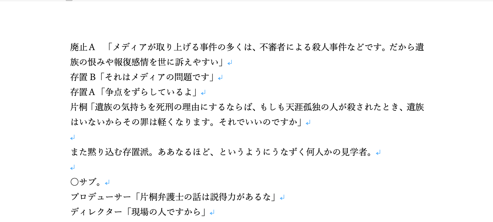
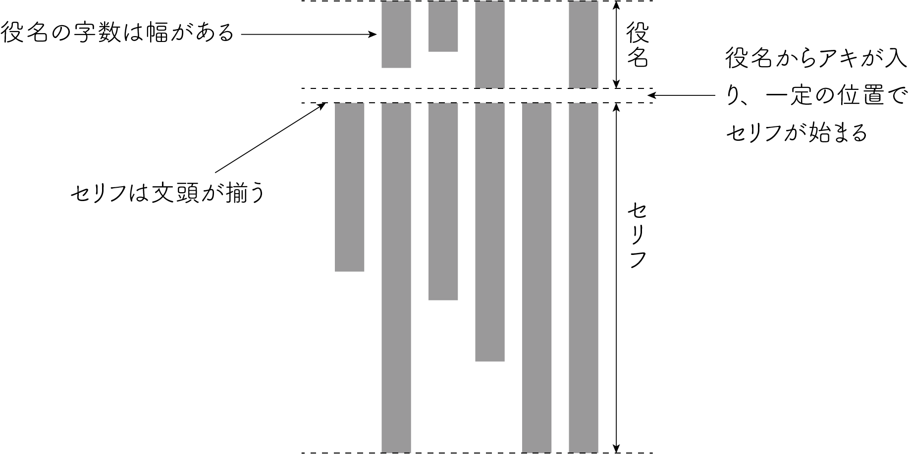
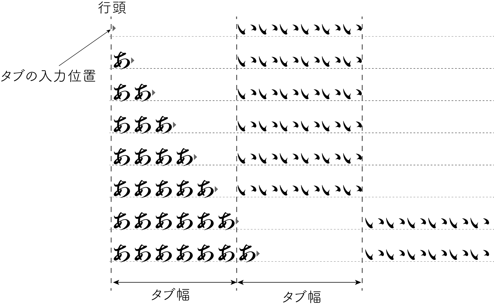
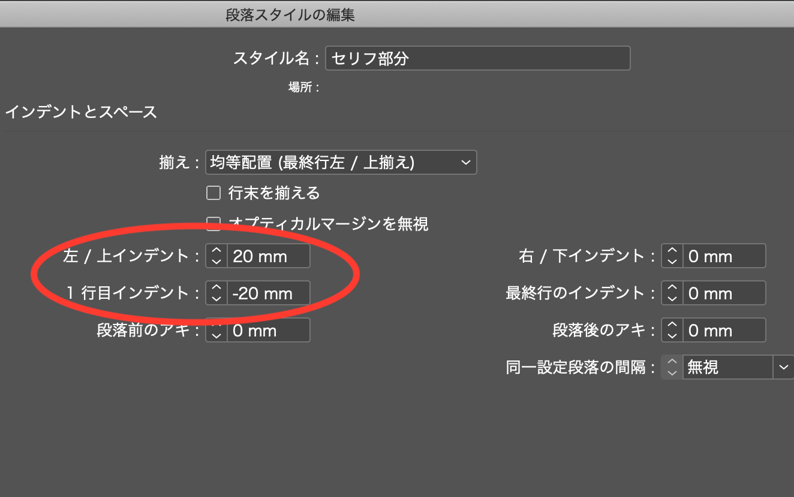
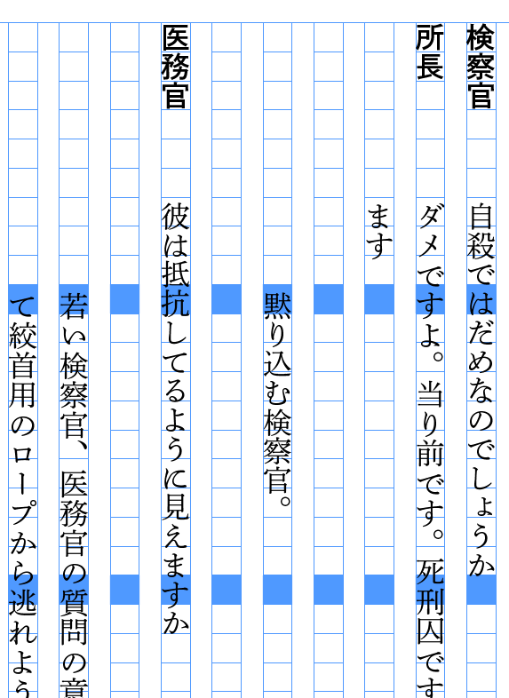
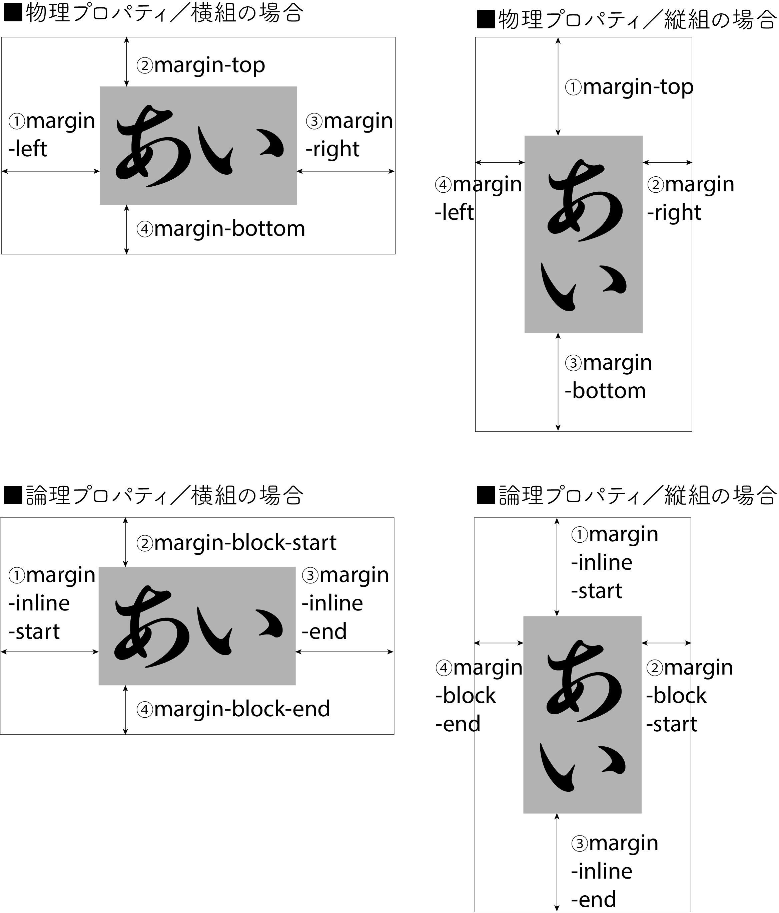
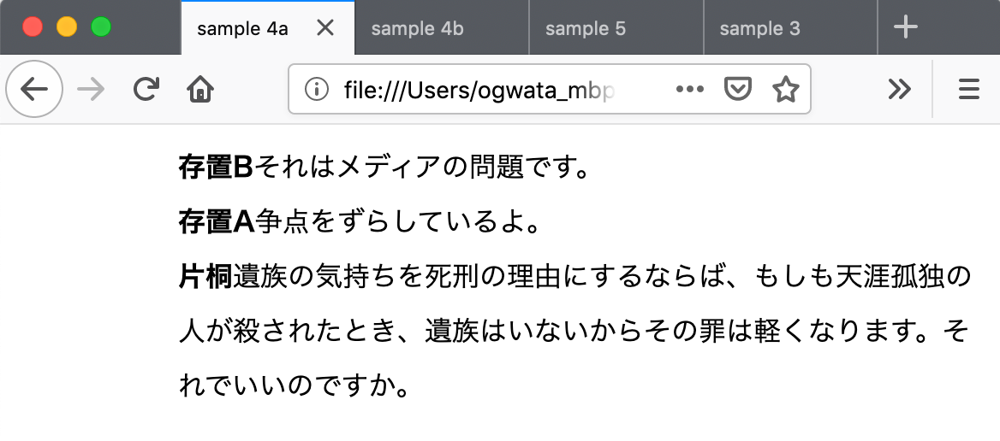
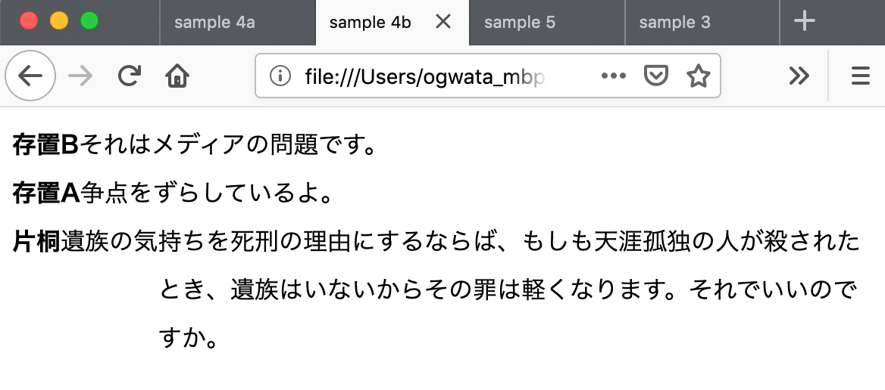
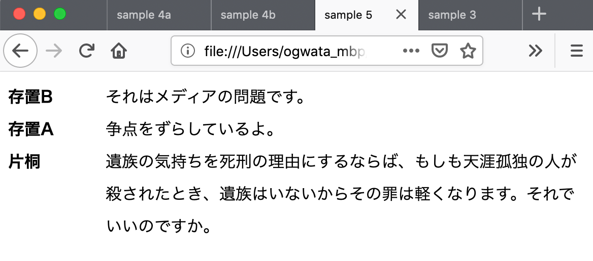
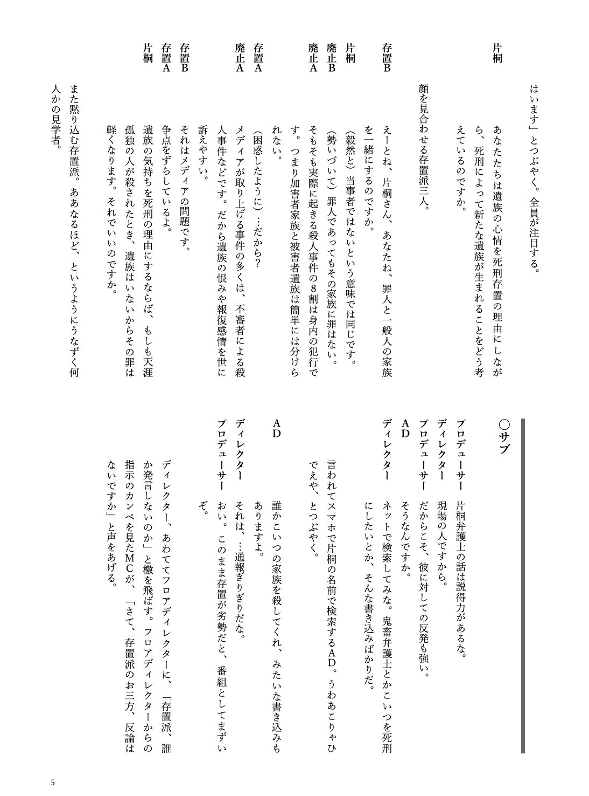

# Vivliostyle で縦組シナリオを組版する

<div class="draft-author">
小形克宏（電脳マヴォ合同会社）<span class="footnote" style="text-align: left;"><a href="https://www.mavo.co.jp/">https://www.mavo.co.jp/</a></span>
</div>

## はじめに

私は小さなエージェント会社に勤務している。仕事はマンガの編集・制作だ。ちょっと前に、あるオリジナル・シナリオをマンガ化するクラウドファンディングをおこなった[^2]。

[^2]:「森達也原作マンガ『死刑（仮）』第1話45ページを完成させたい」https://camp-fire.jp/projects/view/153218

幸い目標額を達成できたので、今度はそのシナリオを読みやすく組み、リターン品として支援者にお届けすることになった。そこで、この機会に以前から興味のあった Vivliostyle に挑戦することを思い立った。まず、出発点である Word のオリジナル原稿を示しておこう（[@fig:fig_1]）。



それでも、仕事で InDesign は使ってきたものの、HTML やら CSS は耳学問のみ。具体的に言うと「class 定義、@page ルールってなんでしたっけ」というレベル。実際、私がまず最初にしたことは、図書館に行って、HTML や CSS の入門書を読むことだった。まあ、そこから始まる過程全てを再現しても、読者には退屈なだけだろう。そこで、本稿では組版的に興味深いトピックに絞って追うことにする。

## シナリオ組版ってなんだ!?

私自身、映画や演劇を見るのは好きだが、作る側での関わりはない。だからシナリオについてもほとんど知識がない。まずは組む対象を知らなければ。そこでネット上をあれこれ画像検索したところ、以下のような組み方の特徴があることがわかった。

1. 役名から一定の間隔を空け、同じ位置でセリフが始まる→セリフ部分の行頭が揃う
2. 役名の文字数は作品により幅がある→あらかじめ文字数を勘案してセリフの開始位置を決めないとうまく揃わない
3. ト書きはフォント、インデントや囲みなどにより、役名 + セリフから強く区別される

衆目の一致するところ、組版的に最も面倒臭いのは 1 と 2 だろう。図にすると以下のようになる（[@fig:fig_2]）。



じっと見るうちにハタと気づいた。ア、ナルホドネ、要するにこれは「突き出しインデント + タブ区切り」なのだ。

突き出しインデントとはなにか。たぶん最も身近で見かける例は、この原稿でも数行前で使っている箇条書きだ。ご覧いただくと分かるとおり、折り返した 2 行目の行頭がインデントされ、1 行目の文章部分の最初と揃っている。結果として文頭の数字部分が文章部分から突き出ることになる。シナリオの場合は、この突き出た数字部分が何文字かに増え、役名になるわけである。

しかしこれだけでは実現できない。「一定の位置に揃える」ために役名とセリフをタブで区切ることが重要だ。タブとは任意の位置に文字を揃える機能のこと。文字数が 0 の場合において、タブの入力位置（つまり行頭）からその次の文字までの距離を「タブ幅」という。たとえばタブ幅が 6em とすれば、タブより前に 6em 未満=1〜5em の文字があった場合でも、タブの次の文字は同じ位置に揃ってくれる（[@fig:fig_3]）。シナリオの場合、役名が 1〜5 文字に収まれば、セリフ部分の開始位置がきれいに揃うわけだ。



## InDesignで仮組みしてみる

こうしてシナリオ組版のアルゴリズムは分かった。しかしここでいきなり不馴れな HTML + CSS に挑戦するのは、私には敷居が高すぎる。そこで、まず手慣れた InDesign でテスト組版をすることにした。いろいろ試した結果、あらかじめ役名とセリフをタブで区切っておいたテキストに対し、次のような段落スタイルを適用することで実現できることが分かった（[@fig:fig_4]）。



ここでポイントとなるのは、左／上インデントと 1 行目インデントの数値だ。設定パネルを見ると、同じ数の正の値が前者に、負の値が後者に与えられていることが分かるだろう。これにより、①段落全体を特定の数値でインデント（左/上インデント）させた上で、②1 行目だけが段落全体のインデントと同じ量だけ突き出すことになる。以下はこの設定の適用結果だ（[@fig:fig_5]）。



## CSSで実現するための試行錯誤

ここまでをまとめると、前項で解明した「役名とセリフをタブで区切る」「段落全体をインデントさせ、1 行目のみインデントと同じ量だけ突き出す」の 2 つを、HTML + CSS で実現すればよいということだ。やったね、これで楽勝じゃん。

もちろん、世の中それほど甘くない。とはいえ突き出しインデントに限れば、ありふれた表現だけに CSS でも簡単に実現できる。

```css
p {
     margin-left: 6em; /* ブロック全体を 6em インデント */
     text-indent: -6em; /* 先頭行のみ 6em 突き出し */
}
```

つまりブロック全体の左／上の余白サイズを `margin` プロパティで、ブロック 1 行目のインデントを `text-indent` プロパティで指定する。

問題はタブ区切りだ。役名とセリフをタブ区切りしたテキストを HTML にしてブラウザで表示させると以下のようになってしまう（[@fig:fig_6]）。なお、この段階では縦組は後回しにしている。


役名とセリフの区切りが、スペース（U+0020）1 つに置き換わってしまった。これでは狭苦しくていけないし、そもそもセリフの開始位置が揃っておらず、セリフ 2 行目もインデントされていない。では、HTML でタブを表現するにはどうすればよいのか。

調べると `white-space` というプロパティがあることが分かった。これを使えばソース中のタブ等をそのまま表示してくれるらしい。そこで HTML の `p` 要素に対し、以下のように指定した。

```html
<p style="white-space: pre;">
  <strong>存置B</strong>それはメディアの問題です。
</p>
<p style="white-space: pre;">
  <strong>存置A</strong>争点をずらしているよ。
</p>
<p style="white-space: pre;">
  <strong>片桐</strong>遺族の気持ちを死刑の理由にするならば、もしも天涯孤独の人が殺されたとき、遺族はいないからその罪は軽くなります。それでいいのですか。
</p>
```

これをブラウザで表示させたのが以下のものだ（[@fig:fig_7]）。


3 行目を見ていただくと分かるとおり、行が折り返されていない。`white-space`プロパティはコードを表示するためのものなので、これは当然の振る舞いと言える。また、タブの方も 1 行目と 2 行目は役名の文字の長さがタブ幅を超えてしまったらしく、セリフの開始位置が 3 行目と揃っていない。

その後、`white-space: pre` のかわりに `white-space: pre-wrap`の指定をすると、タブ等の空白文字をそのまま表示し、行の折り返しもしてくれることを知った。とはいえ、タブ幅を指定できるわけではないので、[@fig:fig_7]と同様の問題は残る。やっぱりダメだこりゃ。

ここでハタと気づいた。そもそもなぜ HTML では強制的にタブがスペースに置き換えられたのか。考えてみれば、同じようにタブを入力した場合でも、OS、アプリケーションなど環境によってタブ幅は変わる（設定により変えられる）。HTML + CSS では多様なデバイスで同じ表示結果が求められることを考えれば、むしろタブを機能させないのは合理的な判断なのだ。つまり、私のアプローチがあさっての方向に暴走していたわけだ。となると新たにタブを使わない CSS での表現方法を見つけないといけない……。

## 村上さんのアドバイス降臨！

困ったな、なんとかならないっすかね、と slack で泣きついたら、Vivliostyle の開発者・村上真雄さんから、速攻で以下のようなアドバイスをいただいた（以下、村上 CSS と略）。

> - style= “white-space: pre;” は削除
> - 役名（ `<strong>` タグ）ではじまるセリフの段落を他の段落と区別できるように `class` をつける
> - CSSでセリフの段落に対し、以下のように指定

```css
p.line {
     margin-inline-start: 6em;
     margin-block-start: 0;
     margin-block-end: 0;
}
p.line > strong:first-child {
     margin-inline-start: -6em;
     min-inline-size: 6em;
     display: inline-block;
}
```

見ると分かるとおり、上記では突き出しインデント + タブ区切りを実現するだけでなく、最新のプロパティを使うことで、同一の指定で縦組にも横組にも使えるよう工夫されている。すばらしい！　いやあ、コミュニティって神。みんなも Vivliostyle の slack に参加するといいよ！[^3]

[^3]: Vivliostyle 公式サイトの「コミュニティ」ページ https://vivliostyle.org/ja/community/ から参加可能。

以下、この村上 CSS の詳細について、その後調べたことを元に解説していこう。

### 論理プロパティについて

まず、村上 CSS で使われている以下のプロパティは、新しい概念にもとづく「論理プロパティ」と呼ばれるものだ。

- margin-block-start
- margin-block-end
- margin-inline-start
- min-inline-size

ここでいう「論理」（logical）とは、従来のような物理的（physical）ではなく論理的な方向・サイズを扱うことに由来する。

たとえば、これまで使われてきた物理プロパティ `margin-top` 、`margin-right`、`margin-bottom`、`margin-left` に対応する論理プロパティは `margin-block-start`、`margin-inline-end`、`margin-block-end`、`margin-inline-start`だ。この例から分かるように、今までは top、right、bottom、left という物理的（絶対的）な方向を使って指定してきたが、論理プロパティでは start や end という論理的（相対的）な方向を使っている。

これを使う最⼤のメリットは特定の組み⽅向に依存しないで記述できることだ。今までは横組を前提に書かれた CSS を縦組に切り換えようとすれば、⽅向やサイズに関連するプロパティの値を⼀つ⼀つ書き換えなければならなかった。しかし論理プロパティを使えば、`writing-mode`プロパティで組み⽅向の指定を変更するだけですむ（[@fig:fig_8]）[^4]。

[^4]:より詳細は以下の記事を参照。「[CSS\]知っておくと便利な論理プロパティ、ボックスモデルにおける古い方法とこれからの方法」https://coliss.com/articles/build-websites/operation/css/new-css-logical-properties.html



論理プロパティを規定する仕様が “CSS Logical Properties and Values Level 1”[^5] だ。`writing-mode`プロパティを規定する “CSS Writing Modes Level 3” [^6]を実装するには論理プロパティが必要になることもあり、まだワーキングドラフトの段階であるにも関わらず、プラウザへの実装は順調に進んでいる[^7]。

[^5]: https://drafts.csswg.org/css-logical/

[^6]: https://www.w3.org/TR/css-writing-modes-3/

[^7]: https://wpt.fyi/results/css/css-logical?label=experimental&label=master&aligned


### 突き出しインデントについて

その論理プロパティを使って、どうやって突き出しインデントを実現するのか。あらためて InDesign における突き出しインデントの実現方法を振り返ると、以下の通りだった。

1. 段落全体を特定の数値でインデント（左／上インデント）させる
2. 1 ⾏⽬のみ段落全体のインデントと同じ量だけ突き出す

そして物理プロパティでは、`margin`でプロック全体を正の値で、`text-indent`で 1 行目だけ同じ数の負の値を指定するのだった。

```css
p {
     margin-left: 6em; /* ブロック全体を 6em インデント */
     text-indent: -6em; /* 先頭行のみ 6em 突き出し */
}
```

では、論理プロパティではどう実現するか。まずト書き等と区別するため、あらかじめ HTML で指定したい箇所を `class` で定義しておく（ここでは `class` 名を “line” とした。もちろんこれは物理プロパティでも必要）。

```html
<p class="line">
  <strong>存置B</strong>それはメディアの問題です。
</p>
<p class="line">
  <strong>存置A</strong>争点をずらしているよ。
</p>
<p class="line">
  <strong>片桐</strong>遺族の気持ちを死刑の理由にするならば、もしも天涯孤独の人が殺されたとき、遺族はいないからその罪は軽くなります。それでいいのですか。
</p>
```

そのうえで、CSS で “line” ブロック全体の左／上余白を 6em に指定する。

```css
p.line {
     margin-inline-start: 6em;
     margin-block-start: 0;
     margin-block-end: 0;
}
```

ここまでをブラウザで表示させたのが以下のもの（[@fig:fig_9]）。しかし、これではまだ半分、突き出しになっていない。



そこで上記に加えて、“line” ブロックの 1 行目だけに負の値、-6em を指定したいわけだが、この特定のブロックの 1 行目「だけ」を特定するのに技が必要だ。

あらためて HTML をじっと見ると、役名が必ず子要素 `strong`で強調されている。これをキーにすれば特定できそうだ。子要素だけを指定するには親要素と子要素を `>` でつなげばよい。

いや待ってほしい、`strong`は強調としてもよく使われるから、役名だけに使っていると決め打ちすると痛い目に遭う。もう一段、正確性を増すための絞り込みが必要だ。そこで疑似要素 `first-child` を使うことで、「`strong`要素が最初の要素である場合」と限定する。そのうえで、そこに負の値、-6em を指定する。以下のように。

```css
p.line > strong:first-child {
     margin-inline-start: -6em;
}
```

これをブラウザで表示させたのが以下のもの（[@fig:fig_10]）。ぶじに突き出しインデントになった。



### セリフ部分の開始位置を揃える

あとはセリフ部分の開始位置を揃えればよい。再び HTML を観察すると、指定しようとする “line” は例外なく 2 つの要素で成り立っていることが分かる。つまり、行頭は `strong` 要素で指定された役名で始まり、それにセリフが続いている。ということは、行頭の要素（役名部分）のために「一定の領域」を確保し、それにセリフの領域が続くと考えればよい。上記 CSS の `margin-inline-start: -6em;` に続けて、以下のように指定する。

```css
     min-inline-size: 6em;
     display: inline-block;
```

<div class="page-break"></div>

この `min-inline-size` プロパティは任意の要素における最小サイズ（横組の場合は水平方向、縦組の場合は垂直方向）を指定するものだ。この場合 CSS の前行まで「“line” において最初の要素として `strong` が使われているもの」を指定しているので、ここでもそれが継承される。言い換えれば、“line” に役名が存在する場合、役名の領域の領域の⻑さとして 6em 確保される。そして、それに隣接してセリフの領域が始まるようになるわけだ。

別の言い方をすると、役名が 5em 以内であれば、セリフの領域は必ず行頭から 6em の位置で始まる。これは前の方で述べた「タブ幅」の振る舞いそのものであることに注意してほしい。

加えて `display` プロパティを使って、縦組でも横組でも 2 つの要素が必ず直列に配置されるよう指定する。この場合の値は、組み方向に関わらず `margin` と `padding` のサイズが有効になる `inline-block` が適当だろう。ここまでの村上 CSS を、ブラウザで表⽰させたのが以下のものだ（[@fig:fig_11]）。



## 仕上げ：縦組、2段組み、縦中横の指定

さて、これで冒頭「シナリオ組版ってなんだ!?」の項で示した 3 大特徴のうち、2 つまで達成できたことになる。残りはト書き部分の区別化だが、これはト書き用の `class` を定義したうえで、論理プロパティ `margin-block-start` 、`margin-inline-end`、`margin-block-end`、`margin-inline-start`をあてればよい。

あとは縦組と 2 段組み、版面の指定だ。これもゼロからやるとなれば大変だが、Vivliostyle のサンプルページを使えば、ぐっと楽ができる。公開されているうち、同じ縦組／2 段組みの例である「雑誌レイアウト『白馬岳』」の “style.css”[^8] を雛型として、合わない部分だけ修整していくことにする。となると、HTML も調整が必要だろう。

[^8]: https://github.com/vivliostyle/vivliostyle_doc/blob/gh-pages/samples/shirouma/style.css


大筋としては `class` 名を HTML と CSS とで合わせ、不要な記述があればばっさり削除していく。前項まで検討してきた役名 + セリフ部分のプロパティも忘れずに書き加えておこう。

他に縦組特有の作業として、「縦中横」の指定が必要だ。これを指定しないと以下のようにアルファベットや数字だけが横転してしまう（[@fig:fig_12]）。

<div class="page-break"></div>

まず、HTML で縦中横にする文字を `span` 要素で囲み、`class`指定をしておく。『白馬岳』の “style.css” では `class` 名を `text-combine` としているので、これを生かして HTML で以下のように指定する。

```html
<p class="line">
  <strong>存置<span class="text-combine">B</span></strong>
  それはメディアの問題です。
</p>
<p class="line">
  <strong>存置<span class="text-combine">A</span></strong>
  争点をずらしているよ。
</p>
```

『白馬岳』の “style.css” では、以下のように縦中横を実現する `text-combine-upright` プロパティが指定されている。

```css
.text-combine {
     text-combine-upright: all;
}
```


ちなみにこの “style.css” は書かれたのが少し古いようで、ベンダープレフィックスがついた複数の縦中横用プロパティも記述されている。しかし、現在の Vivliostyle はブラウザによって必要なプレフィックスを自動補完してくれるので、`text-combine-upright`プロパティ以外は削除した。さあ、ここまでをブラウザで表示させてみよう（[@fig:fig_13]）。

うまくいったようだ。あとは本文や見出しのフォントを調整して出来あがりだ（[@fig:fig_14]）。



## おわりに

以上、Vivliostyle における縦組シナリオ組版を報告した。数年前から、出版業界では InDesign の独占がつづいている。この無競争状態が健全とは言えないことは誰の目にも明らかだろう。日本語組版が未来へ進歩をつづけるためにも、強力なオルタナティブの登場が待望されている。Vivliostyle がその答えになるかどうか、それは私達ユーザのサポートにかかっていると言えるだろう。
