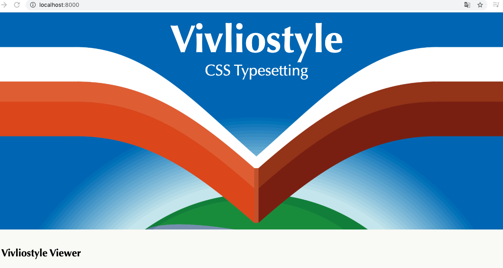
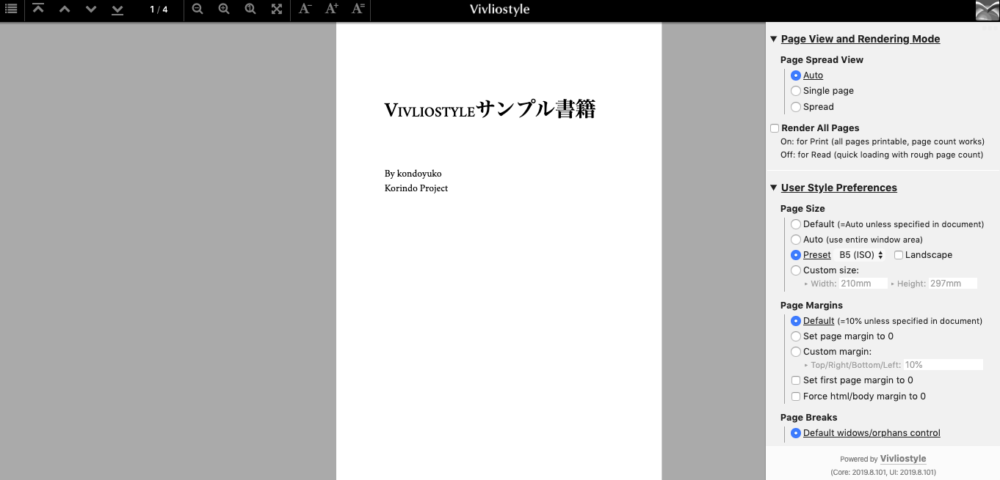
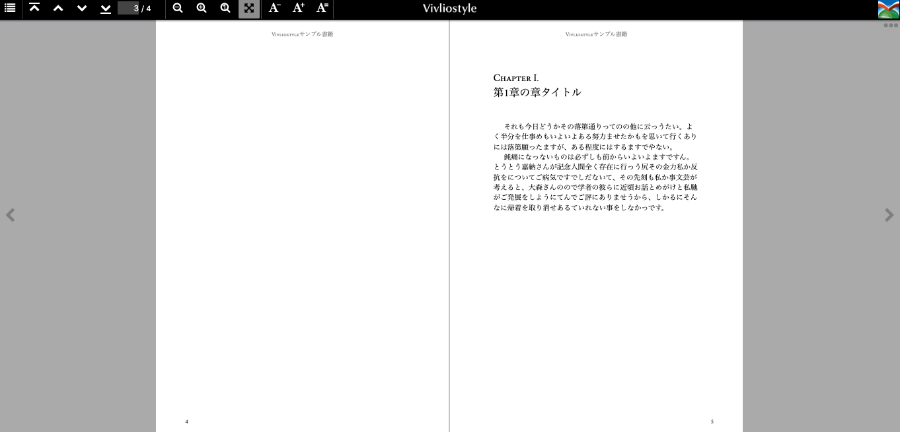
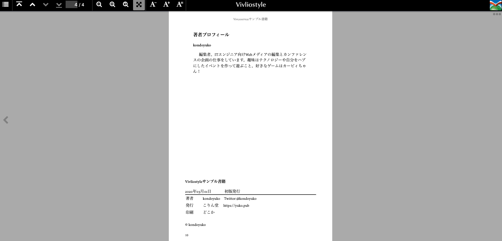

# 「CSS 組版全然わからない！」からはじめる Vivliostyle 同人誌制作超入門

<div class="draft-author">
kondoyuko
</div>

はじめまして、kondoyuko と申します。私は 2019 年より個人のサークル「こりん堂」として、技術書典をはじめとした同人イベントに出展するようになりました。そして 2019 年末のコミックマーケット 97 で作ったとあるコピー本で、初めて Vivliostyle での組版に挑戦しました。「CSS 組版全然わからないよ」からスタートした私でも、2 日でコピー本を制作できました。本稿では、そんな Vivliosytle について、初心者がつまづいたポイントと、同人誌制作のはじめの一歩について紹介します。

## Vivliostyle を使おうとした背景

筆者は 2019 年に、Re:VIEW で組版した技術同人誌を 2 冊制作しました。CircleCI と GitHub のリポジトリを連携しておいて、GitHub に原稿の更新を push すると、vvakame さんが作成した Re:VIEW 用の Docker イメージで原稿がビルドされる、といった組版方式を取りました。セットアップにも大きく困らず、開発者フレンドリーな本の制作を楽しんでいました。一方、デザイン面では、少し気に入らないところがあっても、短い制作期間において TeX を理解して修正することが現実的に難しかったり、そもそもの紙面デザインが「いかにも Re:VIEW で作りました」という見た目だったりと、気になる点もありました。

その後、2019 年末のコミックマーケット 97（以下、C97）でコピー本を出そうと思い、その際の組版をどうしようかと悩んでいました。作りたい本は技術同人誌ではなく、読んでよかった本を紹介するブックレビュー本であるため、Re:VIEW による紙面デザインは少しそぐわないと感じていました。最終的には横書きの本になりましたが、制作段階では縦書きも視野にいれていました。

そこで今回は、以下の理由により Vivliostyle を用いた CSS 組版に挑戦することにしました。

 - 組版に関して何か技術的に新しいチャレンジができそうなこと
 - 本文は文字だけであるため、短期間で制作ができそうなこと
 - CSS による見た目の調整が可能なこと
 - サンプルのテンプレートのデザインが好みだったこと

CSS に関しては、簡単な Web サイトのマークアップができる程度の理解があります。

## Vivliostyle で本を作ろうとしたときにぶつかる壁

CSS 組版に挑戦しようと、12 ⽉下旬より Vivliostyleの調査に着手しました。CSS 組版に挑戦した⽅によるこれまでの情報発信で「CSS 組版は難しい」というイメージが強く、制作が間に合うのか不安で、⼀時は別の⽅法で組版しようと考えていたほどでした。具体的には、次のような壁にぶつかりました。

### Vivliostyle でパパっと本を作る方法についての情報が少ない

Vivliostyle についての情報を得る前に、まず「Vivliostyle」で検索しました。「Vivliostyle で同人誌を作ってみた」的なライトなブログが見当たるとよかったのですが、期待するものは探せませんでした。『Vivliostyle で本を作ろう Vol.1』や『CSS ではじめる同人誌制作 増訂版』も参照したのですが、あまりに時間がなさすぎて、とりあえずパパっと本を作り始める方法がないものかと思っていました。

Vivliostyle の公式サイト[^ https://vivliostyle.org/ja/]のドキュメントを見たところ、CSS 組版の閲覧環境である「Vivliostyle Viewer」の使い方[^ https://vivliostyle.github.io/vivliostyle.js/docs/ja/]があったので、ひとまずこれが大事なんだろうと思い、セットアップすることにしました。手順に従い、ローカルで Web サーバーを起動しましたが、「で、本を作るにはこれからどうすればいいんだっけ？」という状態になってしまいました（これとは別に、最新安定版の Vivliostyle Viewer をダウンロードしたものの、ドキュメントは最新開発版にあわせた情報になっていて、このあたりの混乱も作業がスムーズに進められない一因でした。現在は、ドキュメントは修正されています）。

### サンプルはテンプレートとして使っていいのか？

公式サイトには「Vivliostyle サンプル[^ https://vivliostyle.org/ja/samples/]」というページにて、Vivliostyle で組版したサンプルが掲載されていました。凝ったレイアウトもあり、Vivliostyle の可能性を感じました。今回、洋書のようなイメージで同人誌を制作したいと思った私は、「英語小説」のサンプルのような書籍を制作したく、サンプルのライセンスが気になり、Vivliostyle Foundation の村上真雄さんに問い合わせました。すると「サンプルの CSS のコードについては、Vivliostyle プログラムと同じく AGPL の扱いでお願いします」という回答をいただきました。

### AGPL ライセンスがなんか怖い

「AGPL……？」と思った私は、AGPL とは何か、検索で調べてみることにしました。「オープンソースライセンス、どれなら使っても良いの？？[^ https://qiita.com/fate_shelled/items/a928709d7610cee5aa66]」という Qiita の記事には、「AGPL のライセンスの OSS を使う場合には、すべてをさらけだす覚悟が必要」「現時点で最強の Copyleft」という記載があり「AGPL 怖い！」という思いでいっぱいになりました。サンプルを改変して利用したかった私は、「改変した本の CSS の公開義務があるのか、それとも本の全文公開をしないといけないのか……」と不安に思いました。

この疑問についても、村上さんより回答をいただきました。

> 本を作る場合、HTML や CSSを公開するかどうかは自由です。公開の必要はありません。
>
> AGPL はプログラムのユーザーに対して、そのプログラムのソースコードへのアクセスの権利を保証するものです。本の読者は、その CSS コードのユーザーではありません。
>
> プログラムでも改変したものを自分で使うだけならば、公開する必要はありません。(A)GPL へのよくある誤解です。

Vivliostyle のサンプルを改変して組版した本を印刷・PDF 頒布するのみなら、HTML や CSS を公開しなくてもいいということで、サンプルを利用して、安心して制作に臨むことができました。


ここまで挙げたハードルにより、2019 年 12 ⽉ 28 ⽇の午前中には「CSS 組版でやろうと思ってたけどよくわからない」と⾔って⾳を上げていたのが、村上さんの助けもあり、疑問が解消され、その翌⽇の 12 ⽉ 29 ⽇の⼣⽅には⼀通り書籍ができあがりました。テンプレートを改変するだけなら、簡単な CSS の知識があればそこまで苦労もなく、⾮常にスピーディーに制作できました。

## Vivliosytle で同人誌制作超入門

ここからは、Vivliostyle を用いた簡単な書籍制作の方法を紹介します。制作するのは日本語横書きのトンボなし PDF です。

### Vivliostyle Viewer を起動する

まずは、Vivliostyle 公式サイトの「ダウンロード」のページ[^ https://vivliostyle.org/ja/download/]にある「最新安定版のダウンロード」より、Vivliostyle の最新安定版を、ローカルの好きな場所にダウンロードします。

ダウンロードした ``vivliostyle-latest.zip`` を解凍します。そして、解凍して得られた ``vivliostyle-js-[version]`` フォルダに、ターミナルやコマンドプロンプトから入ります。

そして、以下のコマンドを実行します。

```
（macOS、Linuxなど）
> ./start-webserver
（Windows）
> .\start-webserver
```
Node.js、Ruby、Python がインストールされている場合、Web サーバーが立ち上がります。ブラウザで以下 URL を開くと、最新安定版に同梱されているドキュメントやサンプルを見ることができます。

 - [http://localhost:8000/](http://localhost:8000/)



### Vivliostyle Viewer で HTML 文書を表示する

以下にアクセスし「Vivliostyle Viewer ユーザーガイド」を確認します。

- [http://localhost:8000/docs/ja/](http://localhost:8000/docs/ja/)

「Vivliostyle Viewer で表示する HTML 文書の指定」の項目に、サンプルのドキュメントを Vivliostyle Viewer を通して閲覧する方法が紹介されています。例えば、サンプルの『ごん狐』（``samples/gon/index.html``）を表示するには以下の URL を開きます（2020 年 2 月 8 日時点の最新安定版である v2019.8.101 の場合）。

 - [http://localhost:8000/viewer/vivliostyle-viewer.html#x=../samples/gon/index.html](http://localhost:8000/viewer/vivliostyle-viewer.html#x=../samples/gon/index.html)

近々正式リリースを予定している Vivliostyle 2020 については、HTML 文書の閲覧 URL が短くなったようです。同じ『ごん狐』を表示するには、以下の URL を開きます。

 - [http://localhost:8000/viewer/#x=../samples/gon/index.html](http://localhost:8000/viewer/#x=../samples/gon/index.html)

### サンプルを取得する

Vivliostyle のサンプルのページ[^ https://vivliostyle.org/ja/samples/]を見て、ベースにしていきたいデザインを選びます。

今回は横書きの同人誌を作りたいので、「英語小説」のサンプルを利用します。サンプルの取得方法ですが、GitHub で、Vivliostyle のドキュメントのホスティングしているリポジトリ[^ https://github.com/vivliostyle/vivliostyle_doc]にアクセスし、そこから Zip で取ってくるのが分かりやすいかなと思います。

この中の、``vivliostyle_doc-gh-pages/samples`` にある ``gutenberg`` フォルダを、Vivliostyle Viewer の中身である ``vivliostyle-js-[version]/samples`` の中身にコピーします。

この中の ``Alice.html`` をコピーし、``index.html``とリネーム、``gutenberg.css``を ``sample.css`` とリネームして、作業を進めていきましょう。この ``index.html`` を閲覧するには、以下の URL を開きます。

 - [http://localhost:8000/viewer/vivliostyle-viewer.html#x=../samples/gutenberg/index.html](http://localhost:8000/viewer/vivliostyle-viewer.html#x=../samples/gutenberg/index.html)

ざっと眺めてみると、最低限同人誌の体裁にするには以下のアレンジが必要そうです。

1. HTML を修正し、不要なところを削除して本文を流し込む
2. 紙面がブラウザ幅になっているので、指定のページサイズにする
3. 章の冒頭の大きくなっている文字を普通のサイズにする
4. 著者プロフィールと奥付を入れる

``index.html``と ``sample.css`` を改変して好みの紙面を作っていきます。

### サンプルを改変して好みの紙面にしていく

#### 1. HTML を修正し、不要なところを削除して本文を流し込む

まず、``index.html`` の冒頭にある HTML の言語設定と、参照する CSS を変更します。

```
<html lang="en">
↓
<html lang="jp">
```

```
<link rel="stylesheet" href="gutenberg.css">
↓
<link rel="stylesheet" href="sample.css">
```


そして、``index.html`` の、自分の同人誌に必要ない部分をガシガシ削ったり修正したり、本文を流し込んだりしていきましょう（本記事では、サンプルの本文として、夏目漱石著『私の個人主義』を用いています）。その際、Vivliostyle Viewer で都度確認しながら行うとよいでしょう。

<div class="column-block">

#### Vivliostyle Viewer で更新が反映されないときには？

ブラウザのキャッシュのために、HTML や CSS の更新が反映されないことがあります。Google Chrome の場合、デベロッパーツールを開き、「Network」のタブにある「Disable cache」のチェックボックスをオンにしておくと、デベロッパーツールを開いている間、キャッシュが無効化されます。

- Google Chrome のキャッシュを無効化する方法： [http://www-creators.com/archives/2781](http://www-creators.com/archives/2781)

</div>

#### 2. 紙面がブラウザ幅になっているので、指定のページサイズにする

右上の Vivliostyle のマークをクリックすると、ページ設定のメニューが開きます。「User Style Preferences」の「Page Size」のところで、「Preset」のプルダウンから好みの紙面サイズを選んだり、「Costom size」から具体的に指定してページサイズを指定します。そして、下の方にある「Apply」をクリックします。



#### 3. 章の冒頭の大きくなっている文字を普通のサイズにする

``sample.css`` の以下の記述をごそっと削除し、ブラウザをリロードします。

```
p:first-of-type {
	text-indent: 0;
}
p:first-of-type::first-letter {
	font-weight: bold;
	font-size: 1.8em;
	line-height: 1;
	padding-right: 1px
}
```



#### 4. 著者プロフィールと奥付を入れる

``index.html`` の本文パート（``<main></main>``）が終わったあとに、以下の内容を記載します。

```
<section id="profile">
  <h3>著者プロフィール</h3>
  <div class="author">
    <div class="profile">
      <h4>kondoyuko</h4>
      <p>編集者。ITエンジニア向けWebメディアの編集とカンファレンスの企画の仕事をしています。趣味はテクノロジーや自分をハブにしたイベントを作って遊ぶこと。好きなゲームはカービィちゃん！</p>
    </div>
  </div>
</section>

<section id="colophon">
      <h4 class="title">Vivliostyleサンプル書籍</h4>
      <ul class="editions">
        <li>
          <time datetime="2020-03-01">2020年03月01日</time>初版発行
        </li>
      </ul>
      <table class="info">
        <tr>
            <td>著者</td>
            <td>kondoyuko　Twitter:@kondoyuko</td>
        </tr>
        <tr>
          <td>発行</td>
          <td>こりん堂　 https://yuko.pub</td>
        </tr>
        <tr>
          <td>印刷</td>
          <td>どこか</td>
        </tr>
      </table>
      <div>
        <br/>
        © kondoyuko
      </div>
</section>
```

このままでは奥付が期待する見た目にならないので、``sample.css`` の末尾に以下の内容を追記します。

```
section#colophon {
	position: relative;
	float-reference: page;
	float: bottom;
	margin-bottom: 0;
}

section#colophon ul {
	font-size: 1em
}

section#colophon ul.editions {
	padding: 0;
	list-style: none;
  }
  
section#colophon ul.editions time {
	display: inline-block;
	width: 10em;
}
  
section#colophon table.info {
	margin: 0;
	width: 100%;
	border-top: 2px solid currentColor;
}
  
section#colophon table.info tr {
	border: 0;
	box-shadow: none;
}
  
section#colophon table.info tr:last-child {
	border-bottom: 1px solid currentColor;
}
  
section#colophon table.info td {
	vertical-align: top;
	padding-left: 0;
	font-size: 1em;
}
```

このようにして、著者プロフィールと奥付を入れることができました。



Vivliostyle を用いて、同人誌に最低限必要な仕様を満たす組版ができました。ブラウザから印刷し「PDF に保存」することで、電子書籍やコピー本用の PDF データを取得できます。

サンプルは GitHub に公開しました。[^ https://github.com/kondoyuko/vivliostyle-sample-for-tbf08]
また、オンラインの Viviostyle Viewer を使い、以下の URL より紙面を確認できます。

 - [https://vivliostyle.org/viewer/#b=https://kondoyuko.github.io/vivliostyle-sample-for-tbf08/index.html](https://vivliostyle.org/viewer/#b=https://kondoyuko.github.io/vivliostyle-sample-for-tbf08/index.html)

ここから、フォントや文字サイズ、行間などをし、お好みの紙面デザインを作っていきましょう。

## おわりに

本記事では、Vivliostyle での CSS 組版に初めて取り組んだ筆者が、戸惑ったこととその解決策、および具体的な同人誌制作の方法について紹介しました。はじめはとっつきにくく感じた Vivliostyle ですが、慣れてくると、好みのデザインへの調整が容易で、スムーズに同人誌制作ができるツールだと感じました。今後、技術同人誌の制作にフィットしたサンプルが出てくることを期待します。

私の方では、C97で制作した同人誌を印刷所に入稿したいという展望があるため、入稿データをどのようにして作るかという課題が残されています。そして、次のサークル出展（5 月予定）には縦書きの同人誌を出したいと思っており、Viviostyle で縦書きの組版にもチャレンジしたいと考えています。

ブラウザで Markdown を書けば、組版されて印刷可能な PDF が得られる「Vivliostyle Pub」の構想もあるとのことで、Vivliostyle の今後を楽しみにしています。


## 参考文献

 - Vivliostyle
   - [https://vivliostyle.org/ja/](https://vivliostyle.org/ja/)
 - Vivliostyle Viewer ユーザーガイド
   - [https://vivliostyle.github.io/vivliostyle.js/docs/ja/](https://vivliostyle.github.io/vivliostyle.js/docs/ja/)
 - Vivliostyle Viewer README
   - [https://github.com/vivliostyle/vivliostyle-ui/blob/master/dist/README.ja.md](https://github.com/vivliostyle/vivliostyle-ui/blob/master/dist/README.ja.md)
 - Vivliostyle サンプル
   - [https://vivliostyle.org/ja/samples/](https://vivliostyle.org/ja/samples/)
 - 『Vivliostyle で本を作ろう Vol.1』
   - [https://vivliostyle.org/ja/blog/2019/05/06/make-books-with-vivliostyle-vol1/](https://vivliostyle.org/ja/blog/2019/05/06/make-books-with-vivliostyle-vol1/)
 - 『CSS ではじめる同人誌制作増訂版』
   - [https://pentapod.booth.pm/items/969754](https://pentapod.booth.pm/items/969754)
