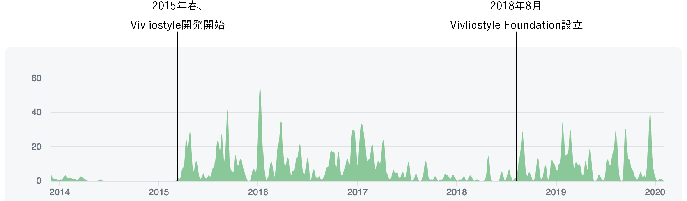
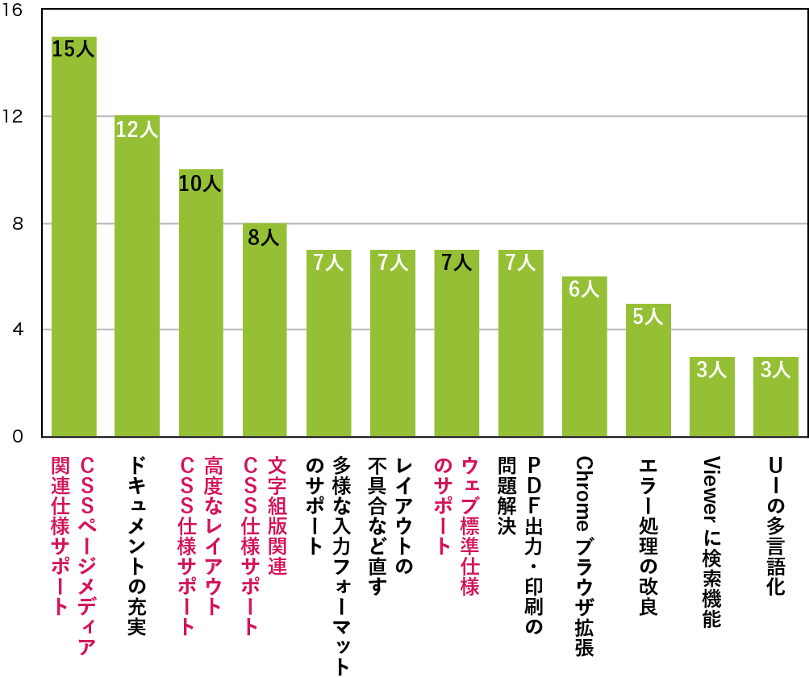
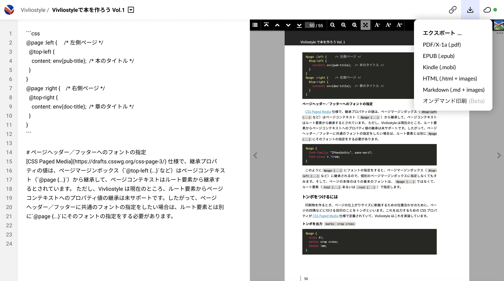

# “Vivliostyle”、未来へのステップ

小形克宏一般社団法人ビブリオスタイル理事 <a href="https://vivliostyle.org/ja/">https://vivliostyle.org/ja/</a>

## はじめに
2020 年でスタートから 6 年になる “Vivliostyle”。その道のりは決して平坦なものではなかったが、幸いなことに新たな開発者達によって次なるステップへ飛躍しようとしている。本稿では、これまでの経緯を簡単に振り返りつつ、次世代の “Vivliostyle” が何を目指すかについて説明したい。

## “Vivliostyle” の歴史

“Vivliostyle” は 2014 年 7 月頃、村上真雄によって構想されたのが始まりだ。その柱は、①ブラウザ上で動作する CSS 組版エンジンを、②オープンソースによって開発するの 2 点だった。同年 8 月には、村上が代表となって株式会社ビブリオスタイル (Vivliostyle Inc.) が設立され、それから半年ほどたった 2015 年春、川久保亮氏をメイン開発者として実際の開発作業が始まる。

開発にあたってはフルスクラッチから作ることも試行されたが、結局 Peter Sorotokin 氏 (元 Adobe、その後 Google)[^2] による仕様提案、EPUB Adaptive Layout [^3] と、その JavaScript による参考実装 [^4] を土台にすることになった。この EPUB Adaptive Layout とは、 EPUB において多段組や図版が入る複雑なページレイアウトを、CSS 仕様の拡張と JavaScript の補完によって実現しようというものだった。

[^2]: https://github.com/sorotokin
[^3]: http://idpf.org/epub/pgt/
[^4]: https://github.com/sorotokin/adaptive-layout

加えて、CSS Paged Media 3 [^5] 、CSS Page Floats [^6]、CSS Generated Content for Paged Media [^7] などを実装することで、CSS 組版を実現する組版エンジンの実現を目指すことになった。いまだにこれら仕様をブラウザは実装していないことからも分かるとおり、“Vivliostyle” は最初から CSS 仕様のテストベッドだった。その後も開発の進展にともない、多くの仕様が追加実装されている。現在の “Vivliostyle” が実装するプロパティ一覧は、公式サイトに掲載しているのでご覧いただきたい [^8]。

[^5]: https://www.w3.org/TR/css-page-3/
[^6]: https://www.w3.org/TR/css-page-floats-3/
[^7]: https://www.w3.org/TR/css-gcpm-3/
[^8]: https://docs.vivliostyle.org/#/supported-features

その後、2016 年 3 月に株式会社ビブリオスタイルの代表取締役が、村上真雄から石田智之氏に交代する。それから 2 年たった 2018 年 3 月、同社は社名をトリムマーク株式会社 (Trim-marks Inc.)[^9] に、製品ブランド名を “VersaType” に変更した上で、以下の決定をくだした。

[^9]: https://trim-marks.com/ja/

1. オープンソース開発をやめ、商用ライセンス版 (“VersaType” ブランド) だけを扱うビジネスモデルに転換する。
2. “Vivliostyle” のブランド名やロゴをオープンソースで使えるように、それらの権利を村上真雄に移譲する。
3. オープンソースで公開されていたソースコードは、権利はそのままにして、管理を村上真雄に移譲する。

この決定から間もない同年 8 月、村上真雄が中心となって、一般社団法人ビブリオスタイル (Vivliostyle Foundation、以下 “VF”) が設立され、ここでオープンソース開発を続けていくことになった。つまり、この時にプロジェクトとしての “Vivliostyle” は、プロプライエタリのトリムマーク株式会社と、オープンソースの一般社団法人ビブリオスタイルとに分岐したことになる。

それから後、2019 年に “VF” は “JavaScript” から “TypeScript” への移行を完了させる。“TypeScript” は Microsoft によって開発されたオープンなプログラム言語だ。“JavaScript” から上位互換を維持しつつ、静的な型付けとクラスベースのオブジェクト指向を追加している。これによりコーディング時に型のサジェストや、正確な型チェックなどが提供されるようになる。加えて Microsoft をはじめとする多様な開発者向けツールが使用可能になる。コードが読みやすくなり、大人数による開発が容易になり、結果としてよりオープンソース開発を進めやすい環境が整えられたと言える。

なお、私自身は 2010 年頃から村上真雄と友人だったが、2019 年 10 月頃より少しずつ “VF” の業務を手伝うようになり、2020 年 1 月、正式に理事に着任している。

## “Vivliostyle” の現状

さて、2018 年 8 月の “VF” への管理移行は、社員によるものからボランティアによるものへと、開発の担い手が転換したことを意味する。言い換えれば給料をもらっての開発から、自発意思による開発に変わったのだ。常識的にはアクティビティは低下しそうだが、実際はどうだったのか。

図は “Vivliostyle” の “GitHub” における、プロジェクト開設以来の Commit (更新) 数の推移をグラフ化したものだ（[@fig:fig_1]）[^10]。株式会社ビブリオスタイルが開発していた時期に比べ、“VF”への移行後も頻度はそれほど下がっていないことが分かるだろう。引き続き開発は盛んに行われているのである。

[^10]: https://github.com/vivliostyle/vivliostyle/graphs/contributors

なぜそれができたのか？　理由の一端が分かるのが、2019 年 8 月に “VF” が開催したイベント、「Vivliostyle 開発者とユーザーの集い 2019 夏」でのアンケート集計結果だ（[@fig:fig_2]）[^11]。

[^11]: https://vivliostyle.github.io/vivliostyle_doc/ja/vivliostyle-user-group-vol2/shinyu/index.html

正確にカウントしていなかったのが申し訳ないが、回答者数は 30 数人。そして何回でも回答してよいことになっていた。そこで太字で示した設問にご注目いただきたいのだが、多くの人の興味は「最新仕様 (とくに CSS) の実装」に集中していることが分かる。

つまり、このイベントに来た開発者にとって、「“Vivliostyle” なら最新仕様が実装できる」のであり、このイメージこそが、“Vivliostyle” の変わらぬ開発頻度を保証していると言えるだろう。

当時私は “VF” のメンバーではなく、一参加者だったが、この結果はよく覚えている。“Vivliostyle” のイメージももちろんだが、若い開発者達にとって CSS の組版仕様が興味を惹くものであることに「へえ」と思った。それは地味で難解な文字/組版の仕様が関心を持たれることへの驚きであり、この時の発見が現在の職につながっているようにも思える。

“VF” では 2019 年 10 月から、前述イベントで集まった人々を誘って、開発者会議を開いている。“VF” は事務所を持たないので、会場は株式会社デンショク [^12] のご厚意で提供された同社会議室。ここに毎月 1 回、最初の週末に、実際に会場まで足を運んでくれた 4～5 人に、“Google Hangout” によるリモート参加の ２〜3 人が加わって討議する。決して多いとは言えない人数だが、ここで 1 ヵ月間の重要な開発方針が決められる (見るだけでも大歓迎なので、ぜひ参加を！)。

[^12]: http://www.denshoku.co.jp/

初めて会議に出席した際には軽いカルチャーショックを覚えた。性別、年齢がまったく問題にされず、職歴も本名も不問というのは、昔からオフライン・ミーティングで慣れている。しかし、それはあくまで趣味の世界であり、プロダクト開発では未体験。正直言って「これで大丈夫？」という不安がつきまとった。

しかしそんな不安も、新たな体験により上書きされてゆく。たとえばウェブデザインの検討で、ベクターエディタ “Figma” [^13] の画面共有機能を使って会議室のスクリーンに映し出し、全員で感想や疑問点を出しあう。遠隔地にいる担当者はそれに対応してリアルタイムで修整、即座に OK/NG が決まっていく。その場で解決できない課題は、“GitHub”  で issue をたてられ、そこで議論が続けられる。

[^13]: https://www.figma.com

そうした議事はリアルタイムでタイピングされ “slack” に投稿される。翌日には蓄積されたテキストが整形され、“GitHub” の Wiki に議事録として転載される [^14] 。それだけでなく、ほどなくそこから決定事項を抜き出した議事概要が作成される [^15] 。すばらしいスピード感。既存のあらゆるサービスを組み合わせた、時間と空間の制約を乗り越える濃密なコミュニケーション。

[^14]: https://github.com/vivliostyle/discussion/wiki/slack-meeting-log-2020-01-12
[^15]: https://github.com/vivliostyle/discussion/issues/63

会議の後、有志による懇親会も楽しい（結局オフ会である)。飲んだり食べたりしながら、あれをしたい、これはどうかと語り合う。上下ではなく水平に広がる人間関係、自発と信頼にもとづく協働作業。

##  “Vivliostyle Pub” の開発

オープンソース開発を目的に非営利団体、一般社団法人として設立された “VF” だったが、私が手伝うようになった 2019 年 10 月〜11 月頃、本音を言えばオープンソース開発をいつまで続けていけるか、あまり自信はなかったように思う。しかし、前述のような開発者会議を何回か経たあと、村上と私は次のような結論に達した。

これだけ素晴らしい開発者達が集まってくれたのは、 “Vivliostyle” のソースコードに魅力を感じてくれたからだ。どうやら私達は、開発者たちをやる気にさせるアジェンダ設定ができているらしい。この現状が続く限り、“VF” は「オープンソース開発と普及を推進する非営利団体」として生き残っていけるだろう。これからの私達の仕事は、アジェンダの点検と更新だ。

しかし、その前に課題もある。資金作りだ。いくら自発的に集まってくれたと言っても、いつまでも無報酬では続かない。また、開発にはサーバをはじめとする各種サービスの経費がかかる。素晴らしい人間関係は壊れるのも一瞬である。

そうならないためにはどうすればよいか？　資金集めの受け皿として「収益になるサービス」を作れないだろうか。その名を “Vivliostyle Pub” 。このサービスの要点は、以下の 2 点にまとめられる。

- 機能①：ブラウザ上でマークダウン等により原稿が書ける
- 機能②：組版結果を印刷可能な PDF (PDF/X-1a) に出力できる

平たくいえば「マークダウンで原稿を書けば印刷用 PDF が作れる」ということだ。ここで私達が幸運だったのは、上記①も②も、それぞれ原型になるプログラムの作者が開発チームにいたということだ。

まず、spring-raining 氏 [^16] による、ブラウザ上で動作するオンラインエディタ “Viola” [^17] である。 これは HTML や CSS、画像、フォントファイルなどを扱うことができるエディタ画面と、編集結果を “Vivliostyle” によりレンダリングするプレビュー画面からできている。

[^16]: https://github.com/spring-raining
[^17]: https://viola.pub/

もともと “Viola” はアクセス数がスケールしても大丈夫なように堅牢に作り込まれていたが、個人開発であることも手伝ってユーザは増えず、作り込んだ分だけ維持費がかさんでいた。そこで “VF” が引き取り、技術書典の出展者向けのサービス (後述) として作り直してはどうかと前述懇親会で言い出したのは、他ならぬ spring-raining 氏だった。なるほど、たしかにそれなら “VF” が収益手段を確保できるだけでなく、ユーザも喜び三方良しである。

他方、印刷可能な PDF 出力は、ずっと以前から “Vivliostyle” にとって鬼門だった。その構造上、 “Vivliostyle” 自身は PDF 出力機能を持たず、ブラウザに依存することにしている。しかし “Chrome” に限っては、「PDF に保存」メニューで PDF を生成すると、OpenType/CFF フォントが Type3 フォントとして埋め込まれてしまう問題があった。

Type3 フォントは印刷用データを生成する RIP (Raster Image Processor) では対応してないことが多い。つまり “Chrome” が作る PDF は、一般のプリンタでは問題なくても印刷用の PDF としては使えない。なお、この問題は “Safari” や “Firefox” では発生しない。しかし、“Chrome” はブラウザのうち最大シェアをもっており、知らん顔はできない。

そういうわけで、この問題の解決は “Chrome” の開発元、Google 次第だ。ところが同社は対応に消極的で、当分解決は望めそうもない。ブラウザに印刷可能な PDF の生成を求めるユーザはごく少数だろうから、あまり無理も言えない。困っていたところに、印刷向け PDF/X-1a 準拠データへの変換ツール “press-ready”[^18] の作者、uetchy 氏 [^19] が開発に加わってくれて、数年来の懸案が一挙に解決してしまった。

[^18]: https://github.com/vibranthq/press-ready
[^19]: https://github.com/uetchy

このように主要なコンポーネントが揃っていたのはありがたいが、残念ながらすぐ完成という訳にはいかない。多くの人に使ってもらうためには、認証系がしっかりしていないと大変なことになる。その他、バックエンドを担う各種サービスとの連携はゼロから考えないといけない。また、マークダウンも書籍執筆に最適なものがない以上、仕様から考える必要がある。課題は山積だ。今のところリリース目標は 2020 年中と考えている。

それでも、せめてモックアップ画面を公表したいとお願いしたところ、uetchy 氏が作ってくれたのが以下のものだ（[@fig:fig_3]）。原稿 (テキスト/マークダウン/HTML) を入力編集するエディター画面と、プレビュー画面の 2 ペイン構成であり、右上の出力メニューから、印刷可能な PDF/X-1a を含む多様な出力フォーマットに対応していることが分かる。もちろんこのままリリースとはならないが (後述するが、初期バージョンとも異なる)、開発の意図は伝わるはずだ。

## “Vivliostyle Pub” のビジネスモデル

さて、最後に “Vivliostyle Pub” におけるビジネスモデルについてまとめておこう。話の性格上、画餅とか眉唾とかのツッコミが入りそうだが、そこは暖かく見守っていただきたい。

まず確認しておきたいのは、CSS 組版における最大のアドバンテージはワンソース・マルチユースであることだ。同じデータをブラウザ用にも印刷用にも使えるのは、本来 CSS 組版がもつ利点だ。くわえて、 CSS ファイルを書き換えるだけで、組み方向の縦横切り換え、判型その他、デザインフォーマットの変更といった大きな修整が自由自在。ワンソース・マルチユースは印刷業界の「夢」と言えるが、そのゴールに最も近いのが CSS 組版である。

しかし、 “Vivliostyle Pub” では、当面この「夢」をあきらめる。この先うまくローンチまで漕ぎ着けたとして、初期の脆弱な運用体制で利益を上げるためには、特定少数のユーザ層に確実にアピールしたい。「なんでもできる」に拘れば開発・運用コストがかさみ、かえって命取りになりかねない。最初のうちは堅実に単機能を売り込んでいくことになった。

そこで、まずマークダウンの編集と PDF/X-1a の出力のみをサポートする初期バージョンをローンチすることにし、そこでのターゲット・ユーザとして技術同人誌即売会 (技術書典や技書博) の出展者を想定する。彼らの多くは既に CSS を習得している。そしてなるべく少ない学習コストで出版できることを切望している。さらに新しもの好きである。まさに初期 “Vivliostyle Pub” にとって最適のユーザだ。

その上で、印刷会社と提携して “Vivliostyle Pub” に専用の入稿ボタンを配置し、このボタンを押すだけで印刷可能な PDF が印刷会社に送信されるようにする。同時に印刷会社側では、「Vivliostyle Pub プラン」を設定してもらい、あがった売り上げの一定率を “VF” に戻していただくというビジネス・モデルである。簡単に言えば「“Vivliostyle Pub” を、御社の営業窓口にしませんか」ということだ。

最後に、将来的なビジネスモデルについても書いておこう。ロケットの 1 段目点火でうまく発射に成功したら、今度は 2 段目、3 段目の点火として、段階的に入力/出力フォーマットを増やしていきたい。つまり、いよいよ本来の利点であるワンソース・マルチユースを全面展開させるのである。

なかでも期待したいのは EPUB/mobi への出力だ。印刷会社との提携について前述したが、 EPUB/mobi をサポートすれば、これをそのまま電子書店との提携に置き換えられる。つまり、“Vivliostyle Pub” が各電子書店の納品窓口になるわけだ。

ここまで、コンテンツの作成/出力機能ばかりに注目してきたが、 “Vivliostyle Pub” の可能性はこれに留まらない。たとえば初期バージョンからユーザのコンテンツを蓄積、管理、一覧できる機能を提供するが、これに公開機能を付与すれば、ユーザから見れば電子出版できることになる。将来的には、ユーザがコンテンツを販売するオプションもありうる。つまり “Vivliostyle Pub” は、“note”[^20] のようなコンテンツ・プラットフォームの可能性も持っているのである。

[^20]: https://note.com/

もう一つ、“Vivliostyle Pub” がモバイルに対応すれば、コミケの参加サークルのなかで大きな占有率をもつ、BL 小説サークルにリーチできるようになる。そこで問われるのは、現在彼女たちが使っている “Word” より、“Vivliostyle Pub” が有用かどうかだ。とはいえ、使い慣れたスマホで執筆から入稿まで一気通貫できるのだ。比較的分の良い勝負と言えないだろうか。

## おわりに

以上、 “Vivliostyle” の過去と未来について説明した。本稿の主な読者として念頭においたのは、開発に加わってくれそうなエンジニアの皆さん、そしてスポンサーになっていただけそうな方々だ。それらの人々に、少しでも “Vivliostyle” の秘められた可能性が伝わったなら幸いである。もし興味を持ったら、まずは公式サイト[^21]や “slack” [^22] を覗いてみて欲しい。

[^21]: https://vivliostyle.org/ja/
[^22]: https://bit.ly/2SvPSQQ
