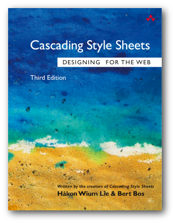

# Web 出版の未来と CSS 組版

村上真雄

JAGAT（日本印刷技術協会）の PAGE2020 のオープンイベント「XML パブリッシング交流会—ウェブ出版と日本語組版の未来」[^ https://kokucheese.com/event/index/589362/](2020 年 2 月 7 日)で、『ウェブ出版と日本語組版の未来と CSS 組版 Vivliostyle』[^ http://bit.ly/page2020xpub]という話をしたのですが、そのテーマでもう少し書こうと思います。

## 〈Web 出版〉とは何でしょう？

いま多くの人にとって、紙に印刷されたテキストよりも Web 上のテキストを読んでいることのほうが多いと思います。Web で何かを公開（publish＝出版）することは〈Web 出版〉と言えるので、印刷出版よりも Web 出版が優勢になっていくのは必然でしょう。

そうは言ってもこの技術同人誌が紙の本として作られているように、紙の本のニーズもまだまだあります。そうすると、紙以外の出版は Web の技術でできるのだから、紙の出版も同じく Web の技術でできるようになると便利だよね、ということで CSS 組版にもつながります。

Web の技術ですべての出版ができるようになったら、すべての出版が Web 出版に収斂していく、そして読み手の好みやニーズに応じて様々なメディア形式にオンデマンドで出力できるようになる、という未来が想像できます。

## Web 出版 vs 印刷出版

### 紙と Web の違い：「紙は難解な内容を長文で論じるのに向くメディア」

紙の本のニーズが簡単になくならない理由に、そのメディアの特性が Web とは違うということもあります。まとまった量のコンテンツを売買するのに都合がよくて、そのような長めのコンテンツをじっくり読ませやすいメディアの特性があります。

『片手間で教える文章講座2　「ユニバーサル日本語」の構成（紙とWebの違い）｜安田峰俊｜note』[^ https://note.com/meirojin/n/n5c422e085c3d]というネット記事で、「紙媒体と Web 媒体は『視認性』が違う」、「紙は Web よりも難解な内容を、より深く長く論じることに向いたメディア」と論じられています。紙媒体向けと Web 媒体向けで文章の書き方も変わり、Web 媒体では「段落あたりの文字数は、おおむね紙媒体の半分〜3 分の 2 以下」がよいことなど、いろいろ勉強になります。そしてその「紙と Web の違い」とされることに、組版スタイルの違いも関係があるようです。

段落の区切りが紙媒体では行頭の 1 文字下げだけなのに対して、Web 媒体では、

> 改行ごとに1行の空白が挟まれる場合も多い。これは、Web記事は紙媒体の記事よりも段落ごとに読者の思考が中断しやすいことを意味している。画像の挿入が記事を分断する形でおこなわれることが多い点も、この傾向に拍車をかける。
> 
> なので、Web記事は難解な内容を長文で論じるのにはあまり向いていない。

なるほど、たしかに。

### 紙と Web の UI・組版スタイルの違い

段落区切りばかりでなく、紙と Web はいろいろ違います：

- ページめくり / スクロール
- 固定ページサイズに文字数・行数で版面設計 / 可変ページ(画面)サイズ
- 行末を揃える / 行末を揃えない
- 段落区切りは段落先頭の字下げ / 段落間のアキ

それから、日本語の本や雑誌は理工系を除くと縦書きが主流なのに対して、Web は圧倒的に横書きです。[CSS Writing Modes Level 3](https://www.w3.org/TR/css-writing-modes-3/) が W3C 勧告になって、Web での縦書きは標準的に使えるものになりましたが、それが使われる場面は限定的でしょう。

紙と Web でそれぞれに向く出版コンテンツが違うのは、UI（ページ／スクロール）と組版スタイルの影響があるといえそうです。紙のページ（固定のサイズでページめくり）と Web ページ（可変サイズでスクロール）の違いがまずあって、それぞれに適した組版スタイルとして今の状態になっているのでしょう。

いまの Web ページの主流の UI と組版スタイルは、現状のブラウザで使える Web 標準技術の制約も関係しています。Web ブラウザ上で本のページのように読めるようにするページネーションのしくみが標準化されていないことが問題です。Web 標準が進化することで変わってくる可能性があります。

## EPUB・電子書籍

EPUB は、Web 標準技術（HTML や CSS）を使った電子書籍フォーマットです。EPUB 3.0 (2011 年) で、縦書き（CSS Writing Modes）やルビ（HTML の ruby 要素）など日本語組版に必要な機能が標準になって、それからこの世界標準フォーマットでの日本語電子書籍が普及することになりました。まさに Web 標準が進化したことで実現したことです。

電子書籍閲覧アプリには、たいてい Web ブラウザエンジンが使われています。HTML+CSS のコンテンツを表示するものなので、当然ですね。CSS での縦書きの標準化が進んだのは、日本語電子書籍での縦書きのニーズからです。

しかし、Web ブラウザではページネーションのしくみが標準化されていないために、電子書籍閲覧アプリでのページネーションは、何らかの代わりの方法で実装されていて、ページのレイアウトの機能は貧弱です。

今の EPUB は、Web 標準技術が使われているとはいっても、現状は Web とはかなり別の世界です。ページネーションが必要なこと、EPUB コンテンツは普通の HTML ではなく XML 構文（XHTML 形式）にする必要があったり、XML ファイルでメタデータやパッケージ内容を記述する必要があるなど。

## Web 出版物の標準化 (W3C Web Publications) はどうなってる？

出版の将来の標準として今の EPUB よりもより Web と親和性の高いものにしようという〈Web 出版物〉標準化の動きがあります。[Web Publications (W3C Working Group Note, 13 August 2019)](https://www.w3.org/TR/wpub/) がそれです。Web 上の出版物（1 個以上の HTML 文書とその他のリソースで構成され、目次があって、順番に読むことができるなど）の標準の仕様を作り、またそれをパッケージ化（1 つのファイルにまとめる）した形式を定義して、それが将来の EPUB（EPUB 4.0）にもなるだろうというものでしたが、しかしこの文書のステータスの記述を見ると、ちょっと残念な状態であることが書かれています:

> Due to the lack of practical business cases for Web Publications, and the consequent lack of commitment to implement the technology, the Publishing Working Group has chosen to publish this document as a Note and focus on other areas of interest, including developing the manifest format as a separate specification.

（Web 出版の実際的なビジネスケースが不足し、その結果、技術を実装するというコミットメントが不足しているため、出版ワーキンググループはこのドキュメントをノートとして発行し、別の仕様としてマニフェスト形式を開発するなど、関心のある他の分野に焦点を当てることを選択しました。）

その別の仕様として開発が進んでいる出版物マニフェスト仕様が [Publication Manifest (W3C 勧告候補)](https://www.w3.org/TR/pub-manifest/) です。出版物の内容とメタ情報を JSON-LD 形式で記述するものになっています。こちらは W3C 勧告候補というステータスになっているので、使うことができそうです。マニフェストの役割は、EPUB でいえば [EPUB Packages](https://www.w3.org/publishing/epub3/epub-packages.html) 仕様で定義されている EPUB パッケージ文書（拡張子 .opf の XML ファイル）に相当します。

W3C での Web 出版物の標準化が目指していたものの全体像は、[Web Publications Use Cases and Requirements](https://www.w3.org/TR/pwp-ucr/) にあります。そこにある多くのユースケースと要件は、Web で実現されるべき将来の出版の標準として楽しみだったのですが、その標準化が「技術を実装するというコミットメントが不足」で止まっていて、残念。

### Web 出版物でのページネーションの要求

Web 出版物の要件としては、ページネーションについても書かれています（ただし必須ではありません）: [4.4 Movement](https://www.w3.org/TR/pwp-ucr/#movement)

> Req. 26: It should be possible to see the Web Publication in a “paginated” view. When a user agent renders a Web Publication in a paginated layout, it must lay out each document in the default reading order sequentially, with the last page of a resource being followed by the first page of the subsequent one.

（要件 26: Web ページを「ページ分割された」ビューで表示できるようにする必要があります。ユーザーエージェントがページ分割されたレイアウトで Web パブリケーションをレンダリングする場合、リソースの最後のページに後続の最初のページが続くように、各ドキュメントをデフォルトの読み取り順序で順番にレイアウトする必要があります。）

それからページネーションとスクロール方式を切り替えられるべきともあります。いつでもページネーションがよいわけでないので当然でしょう。

### “WebBook” というよりシンプルな代替仕様案

Web Publications 標準化については当初から、ブラウザへの実装が期待できない、仕様が複雑すぎ、せっかく普及した EPUB3 との互換性がなくなる、などの批判が W3C 内からもあり、それに代わるものとして WebBook Level 1 (Unofficial Proposal Draft, 2 February 2018)[^ http://glazman.org/e0/webbook.html] という仕様案が提案されていました。これも Unofficial Proposal Draft の状態から進んでいないですが、現在のブラウザで実現できて、JSON のマニフェストも不要で HTML だけで記述できるシンプルな仕様、EPUB3 と互換性を持たせることも可能ということで、Web 出版物のようなものを実現するのに参考になります。

### Vivliostyle での Web 出版物のサポート

Vivliostyle プロジェクトの目標のひとつに将来の Web 出版物の標準をサポートしたいということがありました。その標準化が今後どうなるかはさておき、これまで提案されている関連仕様ドラフトでも有用なものは取り入れていきたいです。

約 1 年前の Vivliostyle version 2019.1.101 リリース[^ https://vivliostyle.org/ja/blog/2019/02/27/vivliostyle-2019.1.101-released/] から、部分的に Web 出版物関連の機能を実装しています。このリリースノートにある次の項目です：

- 目次（Table of Contents, TOC）ナビゲーションが有効になりました
- Web 出版物および同様の複数 HTML 文書をサポート

Web Publications のマニフェストを利用できるほか、マニフェストが指定されていない場合には、目次要素（`<nav role="doc-toc">` など）からリンクされた(X)HTML 文書がロードされるというところは、“WebBook” 仕様案を取り入れています。

## CSS 組版 (CSS Print) と Web のページネーションの標準化

CSS 組版で本が作れるようになったのはそんなに新しいことではありません。YesLogic 社の Prince[^ https://www.princexml.com/] という CSS 組版ソフトウェアが最初にリリースされたのは 2003 年で、Håkon Wium Lie と Bert Bos による CSS の入門書 “Cascading Style Sheet – designing for the Web” (3rd edition)[^ https://www.amazon.com/dp/B003XNTT80/] が、それで組版されて出版されたのが 2005 年です。

Vivliostyle は Web ブラウザベースの CSS 組版エンジンですが、それより前にすでに、Web ブラウザを使わない独自開発の組版エンジンで PDF を出力できる CSS 組版ソフトウェアが、Prince をはじめとして、いくつか存在していたのです。私が Vivliostyle の前に開発に携わっていたアンテナハウス社の Antenna House Formatter[^ http://www.antenna.co.jp/AHF/] もそのひとつです。

### CSS 組版の仕様

Vivliostyle を含め、CSS 組版ソフトウェアは Web ブラウザには実装されていないページメディア向けの CSS 仕様を実装しています。CSS Paged Media、CSS Generated Content for Paged Media (GCPM)、CSS Page Floats が主なものです。これらはまだ標準が完成していないドラフト仕様です。

- **CSS Paged Media**
  - **CSS Paged Media Level 3** <https://drafts.csswg.org/css-page-3/>
  - Proposals for the future of CSS Paged Media (Level 4), Editor's Draft <https://drafts.csswg.org/css-page-4/>
- **CSS Generated Content for Paged Media (GCPM)**
  - **CSS Generated Content for Paged Media Level 3** <https://drafts.csswg.org/css-gcpm-3/>
  - CSS Generated Content for Paged Media Level 4, Editor's Draft <https://drafts.csswg.org/css-gcpm-4/>
  - WHATWG CSS Books, Living Idea <https://books.idea.whatwg.org/>
- **CSS Page Floats**
  - **CSS Page Floats** <https://drafts.csswg.org/css-page-floats/>
  - WHATWG CSS Figures, Living Idea <https://figures.idea.whatwg.org/>

この中で [**CSS Paged Media Level 3**](https://drafts.csswg.org/css-page-3/) がもっとも基本的ですが、それが “Level 3” であるのは、[CSS Level 2](https://www.w3.org/TR/CSS2/) にもより基本的な [Paged media](https://www.w3.org/TR/CSS2/page.html#the-page) の仕様があったからです。

### CSS Paged Media 関連仕様の分裂: 2013 年ごろの話

CSS Paged Media Level 3 仕様は、1999 年に最初の W3C ドラフト仕様が出て、それから仕様策定が進んで 2004 年には W3C 勧告候補 [CSS3 Paged Media Module, W3C Candidate Recommendation, 25 February 2004](https://www.w3.org/TR/2004/CR-css3-page-20040225/) に 1 度なっていたのに、それから Working Draft に戻って、2006 年により高度な仕様は Generated Content for Paged Media (GCPM) 仕様になって、それからいろいろ仕様が変わりながら、[Prince](https://www.princexml.com/) や [Antenna House Formatter](http://www.antenna.co.jp/AHF/) でドラフト仕様の不完全な実装と独自拡張が進むという状況になります。

2013 年まで、W3C CSSWG での CSS Paged Media と関連仕様（GCPM と Page Floats）策定の中心人物は、CSS 仕様のもともとの提唱者である Håkon Wium Lie 氏（当時 Opera CTO）でした。しかし彼は、W3C CSSWG での仕様の標準化を断念して、今の最新 HTML 仕様を策定している [WHATWG](https://whatwg.org/) で “Living Standard” として仕様策定を進めようとします。それが、[WHATWG CSS Books](https://books.idea.whatwg.org/) と [WHATWG CSS Figures](https://figures.idea.whatwg.org/) です。当初 “Living Standard” だったのが、今は “Living Idea” に変わって、その最終更新は 2017 年で止まっています。

W3C CSSWG のほうでは、その分裂のあと、“Living Idea” のアイデアも一部取り入れて [CSS Generated Content for Paged Media Level 3](https://drafts.csswg.org/css-gcpm-3/) や [CSS Page Floats](https://drafts.csswg.org/css-page-floats/) がいくらか進んだ（CSS Page Floats は Vivliostyle の Johannes Wilm がエディターを担当して、その仕様が Vivliostyle に実装された）のですが、その後また停滞してます。

### 今は忘れられている “Level 4” の提案: Proposals for the future of CSS Paged Media

これも 2013 年ごろにあった CSSWG 内での動きとして、CSS Paged Media Level 3 仕様はいろいろダメなので、もっと良い “Level 4” を作ろうという提案がありました。[Proposals for the future of CSS Paged Media (Level 4), Editor's Draft](https://drafts.csswg.org/css-page-4/) です。

> This module describes an extension of the page model that partitions a flow into pages. It adds to Paged Media Level 3 features introduced by other modules like CSS Regions or CSS Exclusions and Shapes: content flows, exclusions, more powerful headers and footers, etc. It does not deprecate nor obsolete Paged Media Level 3 but is designed to live gracefully with it.

（このモジュールでは、フローをページに分割するページモデルの拡張について説明します。Paged Media Level 3 に CSS Regions、CSS Exclusions and Shapes などのモジュールによって導入される、複数のコンテンツフロー、除外、より強力なヘッダーとフッターなど。Paged Media Level 3 を非推奨にしたり廃止したりするものではなくて、うまく共存できるように設計されています。）

そして、この提案と関連して、[CSS Generated Content for Paged Media Level 4, Editor's Draft](https://drafts.csswg.org/css-gcpm-4/) の提案がされます。

私はこの “Level 4” 仕様の標準化が進むのも期待してました。また、そのような将来の標準となるものを実現したいということも Vivliostyle プロジェクトの構想につながっています。

### Paged Media “Level 4” と EPUB Adaptive Layout と Vivliostyle

2015 年に Vivliostyle の開発を開始するとき、ベースとして Peter Sorotokin 氏による [EPUB Adaptive Layout implementation](https://github.com/sorotokin/adaptive-layout) を利用することにしました。この [EPUB Adaptive Layout](http://idpf.org/epub/pgt/) 仕様は CSS Paged Media “Level 4” で構想されているものと機能的には近いものです。

Vivliostyle はその実装をベースにして、Paged Media Level 3 と関連仕様の実装を加え、そしてさらに今後標準化されていくだろう “Level 4” に対応していく（機能が近い EPUB Adaptive Layout 実装がベースなのでできるはず）、という計画なのです。

### 最近の動き：W3C Workshop on CSS Print と CSS Print Community Group

2020 年 2 月 13 日に、プラハにて W3C Workshop on CSS Print[^ https://wiki.csswg.org/planning/print-workshop-2020] が開催されました。Vivliostyle からの参加は見送りましたが、世界の CSS Print（「CSS 組版」とほぼ同じ）の関係者たちが集まって盛況だったようです。参加者たちのポジションペーパーや発表資料が公開されています。たいへん参考になります：

- <https://wiki.csswg.org/planning/print-workshop-2020>

また、この W3C Workshop の議論から、[CSS Print Community Group](https://www.w3.org/community/cssprint/) が作られることになりました。W3C CSSWG だけではブラウザベンダーからの積極的なサポートがない CSS Print 関連仕様はなかなか進まない。そこで CSS Print 関連仕様を議論するための W3C Community Group（Working Group よりもゆるい集まりで、W3C メンバー以外でも参加できる）を作られて、CSSWG で CSS Print に関連する仕様のエディターである Dave Cramer 氏と Rachel Andrew 氏が議長になって、メンバー募集中です。興味ある方いかがでしょうか？

- <https://www.w3.org/community/cssprint/>

このように、この数年停滞していた CSS 組版関連の標準化が、また動き出そうとしています。まずは CSS Paged Media Level 3 と関連仕様（GCPM と Page Floats）が完成に向かうこと、そうして、今は忘れられている “Level 4” の議論や、Web でのページネーションの標準化ということもまたはじまることをと期待します。

### Vivliostyle の開発を進めて、未来の Web 出版の標準を作ろう

Vivliostyle はもともと新しい標準を作ることにコミットしながら開発を進めていくというプロジェクトです。仕様の議論や実装を進められる開発者たちを増やしたいので、どうぞよろしくお願いします！
