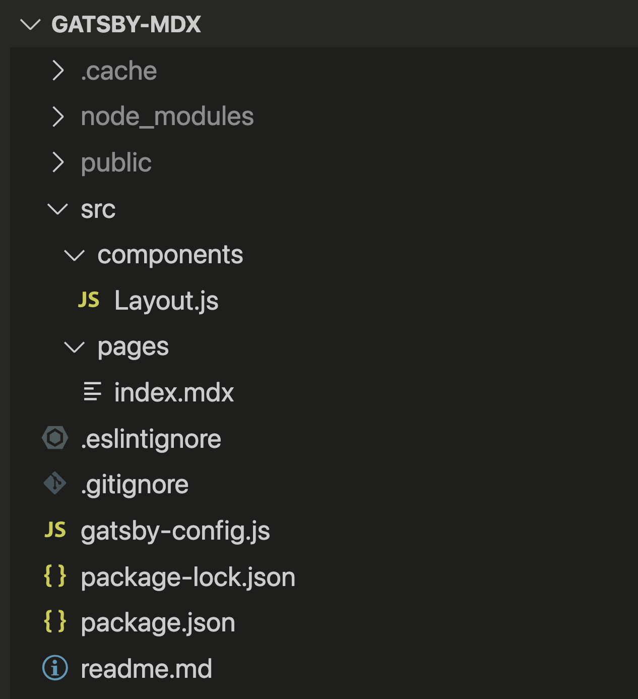
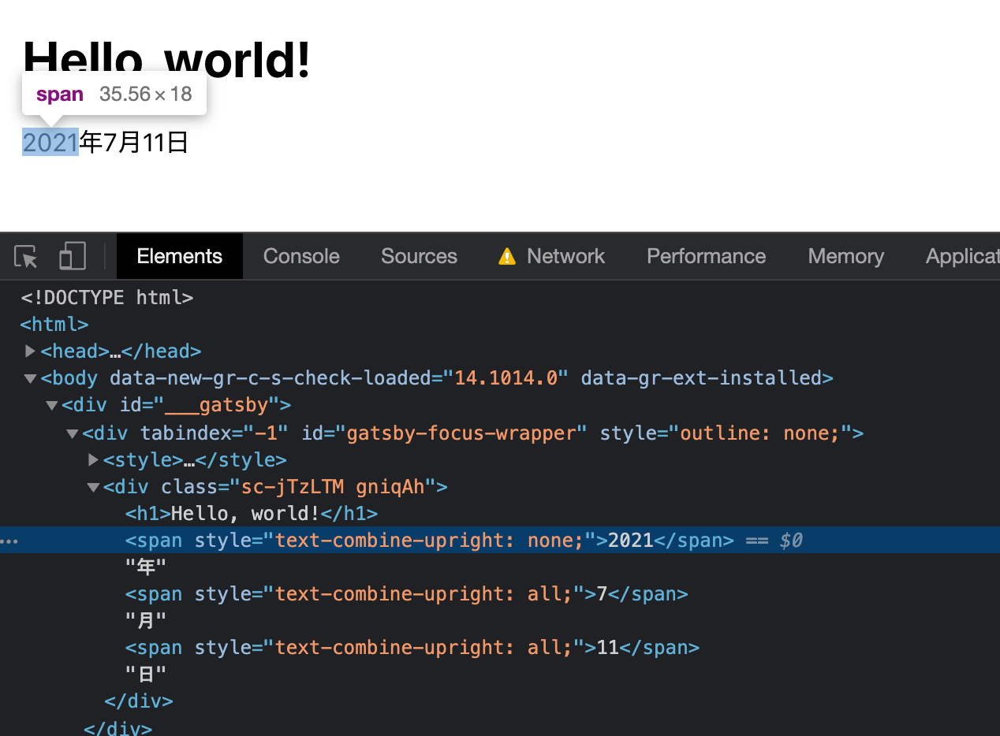
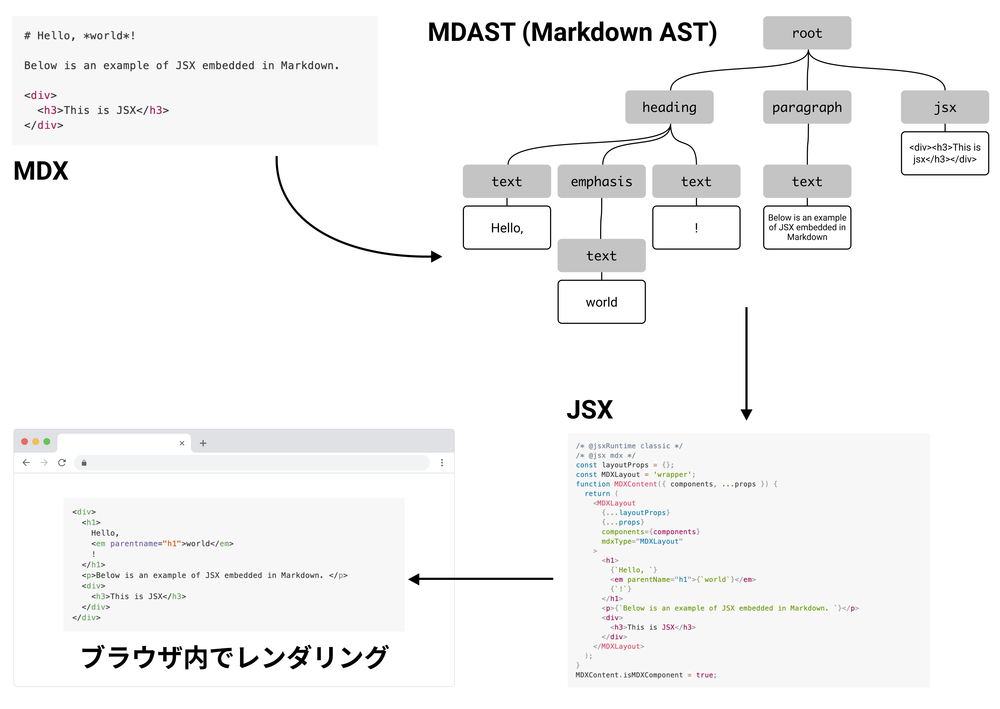

# Markdown を拡張する MDX はドキュメント作成の新たな可能性？

<div class="doc-author">
spring-raining
</div>

はじめましてこんにちは、spring-raining です。今回の記事では、またしても CSS 組版とは直接関係ないものの、個人的にお気に入りの OSS プロジェクト「[MDX](https://mdxjs.com/)」を紹介します。

## MDX = Markdown + JSX

MDX の名前の由来は Markdown + JSX なので、MDX を理解するためにはまず JSX について知る必要があります。

JSX とは JavaScript の拡張構文の一つで、元々 React のために考え出されたものです。Web アプリケーションの開発の経験がないと前提知識が多く難しい内容ですが、React とは Web アプリケーションを作成するための有名なライブラリで、ざっくり言うと JavaScript のソースコードの中で HTML (XML) タグを扱いやすくしたものが JSX です。

この JSX を Markdown に埋め込んだものが MDX です。上記の成り立ちの通り、MDX は一見すると Markdown に HTML が埋め込れたもののように見えます。<span class="footnote">この例の `style` 属性のように、本来の XML とは全然違う構文ももちろんありますが、JSX の詳細についてはこの記事では割愛します</span>

```mdx
# Hello, *world*!

Below is an example of JSX embedded in Markdown.

<div style={{ padding: '20px', backgroundColor: 'tomato' }}>
  <h3>This is JSX</h3>
</div>
```

CSS 組版のような用途では、最終的に Markdown を HTML に変換するため、直接 Markdown 中に HTML を書けばわざわざ MDX を使わなくても良さそうです。それでは、MDX を使うメリットとは何でしょうか？

## MDX を使うメリット

### 簡単に独自コンポーネントを使える

JSX (と React) では一つの要素の単位をコンポーネントと呼んでおり、MDX では通常の HTML タグと同じようにユーザーの作ったコンポーネントを使えます。この点では他のテンプレートエンジンと近い機能を備えていますが、ベースとなるテキストが Markdown であることはドキュメントの記法として有利です。

### 直接 JavaScript として読み込める

MDX を使うことで、原稿として書かれた Markdown は上記の JSX を通して直接 JavaScript としてみなすことができます。これは、React のようなライブラリを使った Web アプリケーションの上で扱う際に非常に便利です。

例えば、あるドキュメントを紙媒体と Web ページ両方に掲載したい状況を考えます。原稿が HTML であれば、もちろんブラウザに表示させることができますが、MDX は一つのコンポーネントとして扱うことができるので、ページの一部分に配置したり、並べて掲載したりすることがとても簡単です。また、フォントやテキスト色を変えるなど、外部からの装飾も既存の CSS にとらわれずに制御できます。

## MDX の始めかた

MDX の公式サイトでは、[MDX を使う方法](https://mdxjs.com/getting-started/)について詳しく書かれています。MDX 自体はテキスト変換のためのライブラリを提供しているだけなので、他の Web アプリケーション作成フレームワークと組み合わせて使います。JSX をベースとする都合上、基本的に React を採用したフレームワークを使うほうが良いでしょう。今回は、**Gatsby** というフレームワークと組み合わせて使う例を紹介します。

プロジェクトファイルの作成自体はとても簡単です。Node.js が使用できる環境で、以下のコマンドを実行します。

```
npm init mdx gatsby
```

これを実行すると、`gatsby-mdx` というディレクトリに空の Gatsby プロジェクトに MDX プラグインをインストールした状態でセットアップしてくれます。作られたファイルを見てみましょう。

{width="40%"}

`src` ディレクトリの中の `pages/index.mdx` が実際にページとして表示される MDX ファイルです。また、`components/Layout.js` というファイルは各ページで共通して読み込まれるレイアウトコンポーネントで、中身を見てみると外部のスタイルシートが読み込まれているようです。

それでは、`gatsby-mdx` ディレクトリに移動して開発サーバーを起動してみます。以下のコマンドを実行してください。

```
npm run start
```

少し待ったあと、`http://localhost:8000` にアクセスするように表示されます。このページを開くと、「Hello, world!」と表示されており、`pages/index.mdx` の内容がそのまま表示されていることがわかります。

### 独自コンポーネントを作成する

次に、少し CSS 組版っぽいコンポーネントを作成する例を紹介します。

「縦中横」は、縦書きの文章中に横組みでテキストを挿入する処理のことで、日本語では数桁の数字を縦中横で組むことがあります。このレイアウトは、CSS では `text-combine-upright` というプロパティで指定しますが、仕様で定められているもののうち実際にブラウザが実装しているものは `none` と `all` のみで、桁数に応じて自動で切り替えてくれる `digits <integer>?` は提供されていません。この問題を、独自コンポーネントで解決してみます。

<figure>
  
  <figcaption aria-hidden="true">縦中横の適用例 (<a href="https://www.w3.org/TR/2012/NOTE-jlreq-20120403/ja/">日本語組版処理の要件</a>より引用)</figcaption>
</figure>

まず、`src/components` ディレクトリに `Tcy.js` ファイル <span class="footnote">一般的に JSX ファイルは通常の JavaScript と区別するために `.jsx` という拡張子を使う慣習がありますが、Gatsby ではどちらでも良いようです</span> を作成し、以下のようなコードを書きます。

```jsx
import React from 'react';

export const Tcy = ({ number, digits = 2 }) => {
  const textCombineUpright =
    Number.isFinite(number)
    && `${number}`.length <= digits
    ? 'all' : 'none';
  return (
    <span style={{ textCombineUpright }}>
      {number}
    </span>
  );
};
```

上記の例では、`Tcy` という名前のコンポーネントを作成しています。`number` が正しい数字で、テキストで表した際の文字数が `digits` 以下のとき、`text-combine-upright` に `all` を設定するようにしています。

このコンポーネントを MDX ファイルで使用するためには、次のように書きます。

```markdown
import { Tcy } from '../components/Tcy';

# Hello, world!

<Tcy number={2021} />年
<Tcy number={7} />月
<Tcy number={11} />日
```

外部のコンポーネントをインポートするときは、JavaScript と同じように `import` 文を使います。そして、先ほど作成した `Tcy` コンポーネントに `number` プロパティを与えます。`digits` プロパティは省略していますが、同じように与えることができます。

ブラウザーの開発ツールで見てみると、目的通り「7」と「11」にだけ `text-combine-upright: all` が設定されていることが確認できます。

{width="80%"}

## MDX のしくみ

MDX で書かれた文章を解釈するためのパーサーは、**Remark**というライブラリを使って実装されています。<span class="footnote">最近では Remark の作者である wooorm 氏も MDX の開発に積極的に関わっているので、最近ではむしろ MDX のための機能拡張が Remark に取り入れられるということも多いです。</span>Remark とは、Markdown を HTML など様々な形式に変換するためのライブラリで、テキストを抽象構文木 (AST) に変換して処理することが特徴です。Remark については、過去に「[Vivilostyleで本を作ろう vol.2](https://vivliostyle.org/ja/blog/2019/09/25/make-books-with-vivliostyle-vol2/)」で紹介した記事もあるので、そちらもぜひご覧ください。

実際に MDX が拡張構文をパースする部分は、Remark のプラグインとして実装されています。そして、生成された AST に従って目的の形式に出力されます。注意したい点は、MDX は Remark とは異なり、入力された MDX ファイルを HTML ではなく JavaScript (もしくは JSX) のコードとして出力される点です。MDX を最終的に HTML の原稿として扱いたい場合は、React などの処理系を通して HTML にレンダリングする必要があります。



本来の用途であれば、この JavaScript はブラウザが読み込むことで動的に DOM が構築されるので、HTML に変換する必要はありません。しかし、Vivliostyle は静的な HTML のみを読み込むため、このまま原稿として使うには不便です。そこで、フロントエンドの世界で **スタティックサイトジェネレート** (SSG) と呼ばれる技術<span class="footnote">類似のテクニックにサーバーサイドレンダリング (SSR) があります。どのタイミングでレンダリングするかの違いだけなので、今回の例では本質的な違いはありません。</span>を使い、原稿として読み込める HTML への変換を試みます。

### 原稿を SSG で生成する

大げさな前置きを書いた手前で恐縮ですが、前の章で紹介した Gatsby を使っている場合、実はコマンド一つで生成できます。

```
npm run build
```

コマンド実行後、`public` というディレクトリが作成され、この中の `index.html` というファイルが生成されたドキュメントになります。このディレクトリをそのまま Vivliostyle に与えてあげれば、PDF に変換されます。簡単ですね！

ただし、制約がまったく無いわけではありません。Vivliostyle はドキュメント中の JavaScript を解釈しないので、HTML に埋め込みたいものはすべてビルド時に依存関係を解決させる必要があります。Dynamic import なども使えないので、外部のライブラリを使ったり自分で実装する際は注意が必要です。

## MDX v2 の新機能

MDX は現在新しいバージョンが開発中で、この記事の執筆時点では `v2.0.0-next.9` として公開されています。一見見ただけでもかなり大幅な変更がありそうなので、現時点での変更内容について少しだけ見てみようと思います。

### Expression 記法

ドキュメントとしては書き起こされていませんが、MDX v2 では新たに **Expression** の文法が導入されています。JSX では、中括弧 (`{}`) で囲われた部分を JavaScript の式として評価する文法がありますが、従来これを MDX で使うためには `<div></div>` のように JSX タグで囲われた部分でしか使えませんでした。v2 では、通常の Markdown の文脈でも直接 `{}` で囲うことによって、その部分が式として評価されるようになります。これは、インラインの Markdown でも同じように解釈されます。

例えば、以下のような MDX があった場合、

```markdown
# Hello, {1 + 1}

{
  'mdx'.toUpperCase()
}
```

JSX として見るとこのように解釈されます。

```jsx
<h1>Hello, {1 + 1}</h1>
<p>{'mdx'.toUpperCase()}</p>
```

これが JSX の処理系でレンダリングされると、以下のようになります。

```html
<h1>Hello, 2</h1>
<p>MDX</p>
```

MDX をドキュメント作成として使う場合、これまでは外部のライブラリはコンポーネントとしてしか読み込めなかったので、使い勝手はあまり良くなかったです。この変更により、インラインで JavaScript の便利な機能を埋め込めるようになるので使い道がぐっと広がっています！

### MDAST の変更

上記の変更も含めて、MDX をパースした時に生成される MDAST (Markdown AST) の構造が大きく変わっています。MDX v1 では、MDAST に以下のようなタイプ名のノードが拡張されていました。

`jsx` `import` `export`

一方で、v2 では以下のようなタイプが定義されています。

`mdxJsxFlowElement` `mdxJsxTextElement` `mdxjsEsm` `mdxFlowExpression` `mdxTextExpression`

内部的には以下の 3 つのパーサーに分けて実装されているので、それぞれについて見てみます。

#### mdast-util-mdx-jsx: `mdxJsxFlowElement` `mdxJsxTextElement`

MDX 中の JSX タグをパースします。ブロックとして JSX が出現した場合 `mdxJsxFlowElement`、インラインで JSX が出現した場合 `mdxJsxTextElement` というタイプで出力されます。

以下はこのパーサーが出力する AST です。注目すべきは attributes の内容で、これまでは JSX の中身まではパースされなかったものが、attribute についてもしっかりパースされているのがわかります。また、`estree` という要素が追加されていますが、この内容は JavaScript の AST の仕様である ESTree に従ってパースされたものです。

```jsx
<MyComponent {...props}/>
```

```javascript
{
  type: 'root',
  children: [
    {
      type: 'mdxJsxFlowElement',
      name: 'MyComponent',
      attributes: [
        {
          type: 'mdxJsxExpressionAttribute',
          value: '...props',
          data: {
            estree: {
              type: 'Program',
              body: [
                {
                  type: 'ExpressionStatement',
                  expression: {
                    type: 'ObjectExpression',
                    properties: [
                      {
                        type: 'SpreadElement',
                        argument: {type: 'Identifier', name: 'props'}
                      }
                    ]
                  }
                }
              ],
              sourceType: 'module'
            }
          }
        }
      ],
      children: []
    }
  ]
}
```

#### mdast-util-mdxjs-esm: `mdxjsEsm`

MDX 中に登場する ESM 形式の import/export 文をパースします。import も export もまとめて `mdxjsEsm` タイプとして出力されます。

以下のようなテキストが MDX で出現した場合、AST の内容は次のようになります。この AST でも、JavaScript として構文解析された結果が `estree` の中に格納されます。

```jsx
import a from 'b'
export var c = ''
```

```javascript
{
  type: 'root',
  children: [
    {
      type: 'mdxjsEsm',
      value: "import a from 'b'\nexport var c = ''",
      data: {
        estree: {
          ...
        }
      }
    }
  ]
}
```

#### mdast-util-mdx-expression: `mdxFlowExpression` `mdxTextExpression`

MDX 中の Expression をパースします。ブロックとして出現した場合 `mdxFlowExpression`、インラインで JSX が出現した場合 `mdxTextExpression` というタイプで出力されます。

```mdx
{
  a + 1
}

b {true}.
```

```javascript
{
  type: 'root',
  children: [
    {
      type: 'mdxFlowExpression',
      value: '\na + 1\n',
      data: {
        estree: {
          ...
        }
      }
    },
    {
      type: 'paragraph',
      children: [
        {type: 'text', value: 'b '},
        {
          type: 'mdxTextExpression',
          value: 'true',
          data: {
            estree: {
              ...
            }
          }
        },
        {type: 'text', value: '.'}
      ]
    }
  ]
}
```

## まとめ

エンジニアではない書き手にとっては、MDX を使うために JSX を習得する必要があるため決してハードルが低いものではありません。しかし、ドキュメントの管理者という目線では、独自記法を提供するためのパーサーなどを用意する手間なく文章を拡張できるためとても魅力的です。また、JSX を使わず通常の Markdown を扱う際でも、MDX を使うことで Markdown を JavaScript のエコシステムに組み込むことができます。

このような特徴を考えると、ドキュメントを MDX を使って書くことは、文章を PDF だけでなく React (あるいは JSX を扱える他のフレームワーク) を使った Web サイトに埋め込みたい場合、Markdown に便利な拡張をバリバリ加えて大規模なドキュメントを作りたい場合、周りにフロントエンドエンジニアがいる場合にぴったりな選択肢だと思います。
