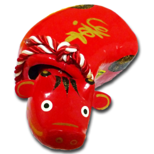

### 著者プロフィール {#profile}

  
  

    <h4>
      spring-raining
    </h4>
    <code>
      <i class="fab fa-twitter" aria-hidden="true"></i>
      spring_raining
    </code>
    <code>
      <i class="fab fa-github" aria-hidden="true"></i>
      spring-raining
    </code>
    

      前回の合同誌の時からまたまた引っ越しました。将来の夢は 47 都道府県全てに引っ越すことです (無理)
    

  

  
  

    <h4>
      MH35
    </h4>
    <code>
      <i class="fab fa-twitter" aria-hidden="true"></i>
      MH35JP
    </code>
    <code>
      <i class="fab fa-github" aria-hidden="true"></i>
      mh35
    </code>
    

      普段から同人誌を作っているが、縦書きなこともあり TeX メイン。Vivliostyle で縦書きができるらしいので、今度組版をしてうまい具合に対応できるか見てみたいところ(トンボもつけられるよね？)
    

  

  
  

    <h4>
      アカベコ
    </h4>
    <code>
      <i class="fab fa-twitter" aria-hidden="true"></i>
      <i class="fab fa-github" aria-hidden="true"></i>
      akabekobeko
    </code>
    

      プログラマー。Vivliostyle では VFM や Create Book などを担当しています。
    

  

  
  

    <h4>
      小形克宏
    </h4>
    <code>
      <i class="fab fa-twitter" aria-hidden="true"></i>
      <i class="fab fa-github" aria-hidden="true"></i>
      ogwata
    </code>
    

      Vivliostyle Foundation 理事。ありがたいことに、ただ今 Vivliostyle の商業出版企画が進行中。来年前半にお届けできればいいな。どうかお楽しみに！
    

  

  
  

    <h4>
      村上真雄
    </h4>
    <code>
      <i class="fab fa-twitter" aria-hidden="true"></i>
      <i class="fab fa-github" aria-hidden="true"></i>
      MurakamiShinyu
    </code>
    

      Vivliostyle Foundation 代表。おかげさまで、オープンソース CSS 組版ツールとしてだいぶよいものになってきたと思います。まえより自信を持って Vivliostyle を人に勧められます。まだまだ課題は多いので開発協力よろしく！
    

  

## Vivliostyle で本を作ろう Vol. 6 {#colophon}

<ul class="editions">
  <li>
    <time datetime="2022-09-11">
      2022 年 9 月 11 日
    </time>
    初版発行
  </li>
</ul>

<table class="info">
  <tr>
    <td>発行</td>
    <td>Vivliostyle ユーザー会</td>
  </tr>
  <tr>
    <td>編集</td>
    <td>
      spring-raining
       
      https://harusamex.com
       
      harusamex.com@gmail.com
    </td>
  </tr>
  <tr>
    <td>
      印刷
    </td>
    <td>
      日光企画 (表紙: NP ホワイト 200kg クリア PP 加工 / 本文: 上質紙 90kg) 
      https://www.nikko-pc.com
    </td>
  </tr>
</table>

© Vivliostyle User Group
