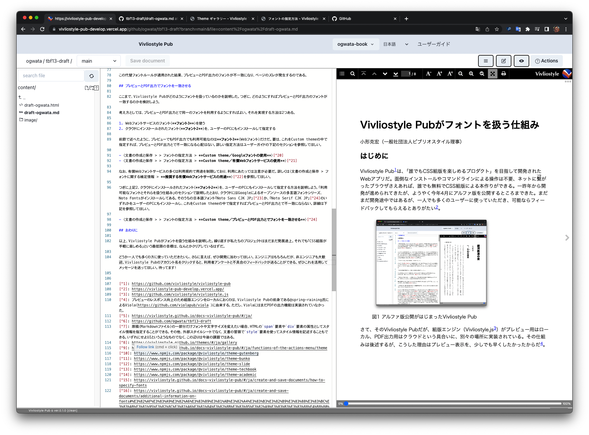
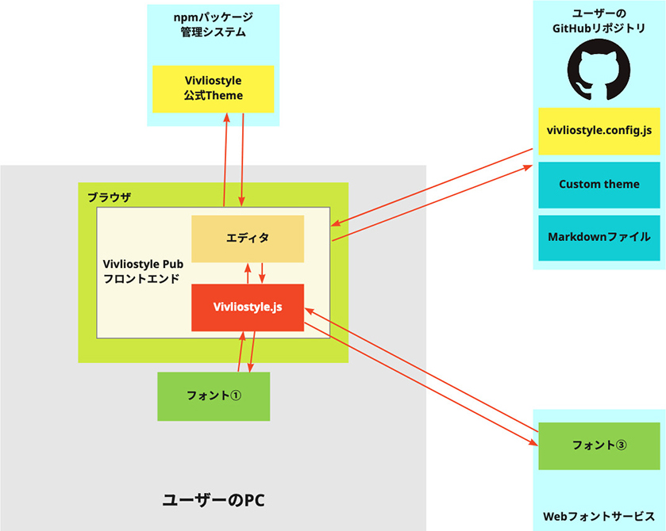
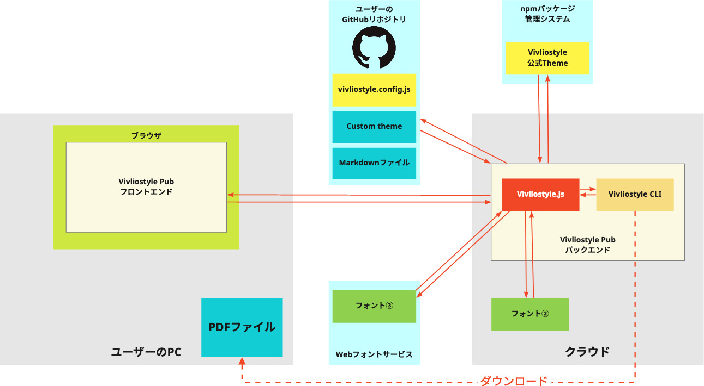

# Vivliostyle Pub がフォントを扱う仕組み

小形克宏（一般社団法人ビブリオスタイル理事）

## はじめに

[Vivliostyle Pub](https://github.com/vivliostyle/vivliostyle-pub)は、「誰でも CSS 組版を楽しめるプロダクト」を目指して開発された Web アプリだ。面倒なインストールやコマンドラインによる操作は不要、ネットに{繫|つな}がったブラウザさえあれば、誰でも無料で CSS 組版による本作りができる。一昨年から開発が進められてきたが、ようやく今年 4 月に[アルファ版](https://vivliostyle-pub-develop.vercel.app/)を公開するところまできた。まだまだ開発途中ではあるが、一人でも多くのユーザーに使っていただき、可能ならフィードバックしてもらえるとありがたい。

{width=400}

さて、その Vivliostyle Pub だが、組版エンジン（[Vivliostyle.js](https://github.com/vivliostyle/vivliostyle.js)）がプレビュー用はローカル、PDF 出力用はクラウドという具合いに、別々の場所に実装されている。具体的な仕組みは後述するとして、このようにした理由はプレビュー表示を、少しでも早くしたかったからだプレビューのレスポンス向上のため組版エンジンをローカルにおくのは、Vivliostyle Pub の前身である@spring-raining 氏による Viola（ https://github.com/violapub/viola ）に由来する。ただし、ViolaにはまだPDFの出力機能は実装されていなかった。。

ところが、組版エンジンを分離させた結果、ユーザーが意識しないままプレビューと PDF 出力とでフォントが食い違う可能性が発生するようになった。もし両者のフォントが違えば、プレビューと PDF 出力とで行数やページ数が違ってしまう。

とはいえ、食い違ったとしても、それは CSS における `font-family` や、Linux における fontconfig の指定によりフォールバックした結果であり、相似のフォントで代替させる既定の動作にすぎない。それでも、同人誌印刷では 1 ページ違えば印刷料金が変わることもある。プレビューと PDF 出力でページが異なることが分かれば、ユーザーは Vivliostyle Pub に不信感を抱くだろう。

この問題はいずれ解決するべきとは思うが、アーキテクチャの深い部分に関わるものであり、すぐには無理と思われる。本稿では Vivliostyle Pub がどのようにフォントを扱っているのかを説明する。これによりユーザーの混乱を少しでも防ぎ、より多くの人に Vivliostyle Pub を使ってもらえればと思う。少しの間、お付き合いいただければ幸いだ。

なお、本稿の内容は、筆者が主に担当した「[Vivliostyle Pubユーザーガイド](https://vivliostyle.github.io/docs-vivliostyle-pub/#/ja/)」の一部を、読み物として再構成したものであることをお断りしておく。より深く理解するために、対応するユーザーガイドのセクションを〈　〉で示した。それから、本稿は Vivliostyle Pub で執筆したその Vivliostyle Pub でコミットした履歴がこちら→https://github.com/ogwata/tbf13-draft/commits/main。

## フォントを指定する方法

まず、Vivliostyle Pub ではどのようにしてフォントや文字サイズを指定するのだろうか。残念ながら、既存ワードプロセッサのようにテキストを選択し、その部分のフォントや文字サイズを指定するような GUI はまだなく原稿（Markdown ファイル）の一部分だけフォントや文字サイズを変えたい場合、HTML の `span` 要素や `div` 要素の属性としてスタイル情報を指定できる。その他、外部スタイルシートでなく、文書の冒頭で `style` 要素を使ってスタイル情報を記述することもできる。いずれにせよ UI というようなものでなく、この辺りは今後の課題ではある。、別途スタイルシートの中でそれらを指定するという間接的な方法をとっている。利用できるスタイルシートは下記の 3 種類だ。

1. **Plain theme**：ブラウザのデフォルトスタイルシートにもとづく必要最低限のもの
2. **Vivliostyle公式theme**：[npmパッケージとして公開されているスタイルシート](https://vivliostyle.github.io/themes/#/ja/gallery)
3. **Custom theme**：ユーザーが自分で書いた CSS スタイルシート

いずれも Action メニューと呼ばれるプルダウンメニューの中から選択／切り替えができる〈[Theme（スタイル情報の選択）](https://vivliostyle.github.io/docs-vivliostyle-pub/#/ja/functions-of-the-actions-menu/theme)〉。

上記 1 で使用されるフォントは、使っているブラウザで設定されたデフォルトフォントだ。ただし Plain theme は手っ取り早くプレビューを確認するためのもので、出力はあまり想定していない。

上記 2 の Vivliostyle 公式 theme で指定されている `font-family` は下記の通りだ。

- Book theme for latin font……`Georgia, serif;`
- 文庫用のテーマ……`"游明朝", "YuMincho", serif;`
- Slide theme……`'Noto', 'YuGothic', 'Yu Gothic', 'Meiryo', sans-serif;`
- Techbook (技術同人誌) theme……`'Neue Frutiger World', 'Verdana',  'Hiragino Sans', sans-serif;`
- Academic theme……`'Hiragino Mincho ProN', serif;`

## 利用可能なフォントとそれらを扱う仕組み

Vivliostyle Pub が扱えるフォントは、フォントがおかれた場所ごとに以下の 3 種類に分別できる。〈[フォントの指定方法](https://vivliostyle.github.io/docs-vivliostyle-pub/#/ja/create-and-save-documents/how-to-specify-fonts)〉

- ユーザーの PC にあるローカルフォント（**フォント①**）
- クラウドにインストールされたフォント（**フォント②**）
- Web フォントサービスのフォント（**フォント③**）

上記のうち**フォント②**のリストはユーザーガイド〈[クラウドにインストールされているフォント一覧](https://vivliostyle.github.io/docs-vivliostyle-pub/#/ja/create-and-save-documents/additional-information-on-fonts#%E3%82%AF%E3%83%A9%E3%82%A6%E3%83%89%E3%81%AB%E3%82%A4%E3%83%B3%E3%82%B9%E3%83%88%E3%83%BC%E3%83%AB%E3%81%95%E3%82%8C%E3%81%A6%E3%81%84%E3%82%8B%E3%83%95%E3%82%A9%E3%83%B3%E3%83%88%E4%B8%80%E8%A6%A7)〉にまとめてある。詳しくはそちらを見ていただくとして、簡単に言うと[Noto fonts](https://fonts.google.com/noto)と[Microsoft TrueType core fonts](https://packages.ubuntu.com/focal/ttf-mscorefonts-installer)、および Linux の標準的なフォントセットだ。

それでは、上記 3 種類のフォントを使って、Vivliostyle Pub はどのようにしてプレビューしたり、PDF 出力したりしているのだろう。まずプレビューの仕組みから見てみよう（図 2）。

{width=400}

プレビューのために実際に組版をおこなうのが、中央にある Vivliostyle.js であり、これはユーザーの PC 上のフロントエンドにある。したがって同じユーザーの PC 上にある**フォント①**、そしてネットを介して利用可能な Web フォントサービスの**フォント③**がプレビューで利用できるわけだ。

他方、クラウドにインストールされた**フォント②**はこの図では見当たらない。フロントエンドにある Vivliostyle.js からはクラウド上のフォントにアクセスする手段がないからだ。つまりプレビューでは**フォント②**は利用できない。

次に PDF 出力の仕組みを見ててみよう（図 3）。

{width=100%}

PDF 出力のために組版をおこなう Vivliostyle.js は、クラウド上のバックエンドにある。だから Vivliostyle.js と同じクラウドにある**フォント②**、そしてネットを介して利用可能な Web フォントサービスの**フォント③**が PDF 出力で利用できる。

他方、ユーザーの PC にある**フォント①**はこの図には見当たらない。クラウドにある Vivliostyle.js からは、ユーザの PC 上にあるフォントにアクセスする手段がないからだ。つまり PDF 出力では**フォント①**は利用できない。

このように、プレビューと PDF 出力はお互いに独立して動作している。プレビューを担当する Vivliostyle.js は、PDF 出力の際どのようなフォントが使われているのかを知らず、また PDF 出力を担当する Vivliostyle.js は、プレビューの際どのようなフォントが使われているのかを知らない。

たしかに図 3 にはユーザーの PC にあるフロントエンドも図示されてはいるが、これはユーザーの指示をバックエンドに伝え、また PDF ができたというバックエンドからのフィードバックを画面に表示しているだけで、組版エンジン同士が連携しているわけではない。

ここまでの説明をまとめてみよう。プレビューを担当するユーザーの PC 上の Vivliostyle.js は、ローカルフォント（図 2：**フォント①**）、及び Web フォントサービスのフォント（図 2、図 3：**フォント③**）が利用可能だ。

一方、PDF 出力を担当するクラウド上の Vivliostyle.js は、クラウドにインストールされたフォント（図 3：**フォント②**）、及び Web フォントサービスのフォント（図 2、図 3：**フォント③**）が利用可能だ。ここまでの説明で、プレビューと PDF 出力で共通して利用可能なのは**フォント③**だけということを覚えておいていただきたい。

さて、PDF 出力の際にクラウドにないフォントが指定されていた場合、どのようになるのだろう。これを説明するのが、ユーザーガイド〈[クラウド上のVivliostyle CLIにおける代替フォントルール](https://vivliostyle.github.io/docs-vivliostyle-pub/#/ja/create-and-save-documents/additional-information-on-fonts#%E3%82%AF%E3%83%A9%E3%82%A6%E3%83%89%E4%B8%8A%E3%81%AEvivliostyle-cli%E3%81%AB%E3%81%8A%E3%81%91%E3%82%8B%E4%BB%A3%E6%9B%BF%E3%83%95%E3%82%A9%E3%83%B3%E3%83%88%E3%83%AB%E3%83%BC%E3%83%AB)〉のセクションだ。このルールが適用された結果、プレビューと PDF 出力のフォントが不一致になり、ページのズレが発生するのである。

## プレビューとPDF出力でフォントを一致させる

ここまで、Vivliostyle Pub がどのようにフォントを扱っているのかを説明した。つぎに、どのようにすればプレビューと PDF 出力のフォントが一致させられるのかを検討しよう。

考え方としては、プレビューと PDF 出力とで同一のフォントを利用するようにすればよい。それを実現する方法は 2 つある。

1. Web フォントサービスのフォント（**フォント③**）を指定する
2. クラウドにインストールされたフォント（**フォント②**）を、ユーザーの PC にもインストールして指定する

前節で述べたように、プレビューでも PDF 出力でも利用可能なのは**フォント③**（Web フォント）だけだ。要は、これを Custom theme の中で指定すれば、プレビューと PDF 出力とで不一致になる心配はない。詳しい指定方法はユーザーガイドの下記のセクションを参照してほしい。

- 〈[Custom theme／Googleフォントの使用](https://vivliostyle.github.io/docs-vivliostyle-pub/#/ja/create-and-save-documents/how-to-specify-fonts#custom-theme%EF%BC%8Fgoogle%E3%83%95%E3%82%A9%E3%83%B3%E3%83%88%E3%81%AE%E4%BD%BF%E7%94%A8)〉
- 〈[Custom theme／有償Webフォントサービスの使用](https://vivliostyle.github.io/docs-vivliostyle-pub/#/ja/create-and-save-documents/how-to-specify-fonts#custom-theme%EF%BC%8F%E6%9C%89%E5%84%9Fweb%E3%83%95%E3%82%A9%E3%83%B3%E3%83%88%E3%82%B5%E3%83%BC%E3%83%93%E3%82%B9%E3%81%AE%E4%BD%BF%E7%94%A8)〉

なお、有償 Web フォントサービスの多くは利用規約で用途を制限しており、Vivliostyle PUB で使うにあたっては注意が必要だ。詳しくは〈[推奨する有償Webフォントサービスの用途](https://vivliostyle.github.io/docs-vivliostyle-pub/#/ja/create-and-save-documents/additional-information-on-fonts#%E6%8E%A8%E5%A5%A8%E3%81%99%E3%82%8B%E6%9C%89%E5%84%9Fweb%E3%83%95%E3%82%A9%E3%83%B3%E3%83%88%E3%82%B5%E3%83%BC%E3%83%93%E3%82%B9%E3%81%AE%E7%94%A8%E9%80%94)〉を参照してほしい。

つぎに上記 2、クラウドにインストールされたフォント（**フォント②**）を、ユーザーの PC にもインストールして指定する方法を説明しよう。「利用可能なフォントとそれらを扱う仕組み」のセクションで説明したとおり、クラウドには Google によるオープンソースの多言語フォントシリーズ、Noto Fonts がインストールしてある。そのうちの日本語フォント「[Noto Sans CJK JP](https://github.com/googlefonts/noto-cjk/tree/main/Sans)」か、「[Noto Serif CJK JP](https://github.com/googlefonts/noto-cjk/tree/main/Serif)」のいずれかをユーザーの PC にもインストールし、これを Custom theme の中で指定すればプレビューと PDF 出力とで不一致にならない。詳細は下記を参照してほしい。

- 〈[Custom theme／プレビューとPDF出力とでフォントを一致させる](https://vivliostyle.github.io/docs-vivliostyle-pub/#/ja/create-and-save-documents/how-to-specify-fonts#custom-theme%EF%BC%8F%E3%83%97%E3%83%AC%E3%83%93%E3%83%A5%E3%83%BC%E3%81%A8pdf%E5%87%BA%E5%8A%9B%E3%81%A8%E3%81%A7%E3%83%95%E3%82%A9%E3%83%B3%E3%83%88%E3%82%92%E4%B8%80%E8%87%B4%E3%81%95%E3%81%9B%E3%82%8B)〉

## おわりに

以上、Vivliostyle Pub がフォントを扱う仕組みを説明した。繰り返しになるが私たちのプロジェクトはまだまだ発展途上。それでも「手軽に CSS 組版が楽しめる」という最低限の目標は、かろうじてクリアしているはずだ。

どうか一人でも多くの方に使っていただきたいし、さらに言えば、ぜひ開発に加わってほしい。エンジニアはもちろんだが、非エンジニアも大歓迎。[Vivliostyle Pubの画面右上にあるアカウント名の部分をクリックすると、利用者アンケートと不具合のフィードバックを送るプルダウンメニューが開く](https://vivliostyle.github.io/docs-vivliostyle-pub/#/ja/readme-first/quick-start-guide-and-required-environment#%E3%83%AD%E3%82%B0%E3%82%A2%E3%82%A6%E3%83%88%EF%BC%8F%E5%88%A9%E7%94%A8%E8%80%85%E3%82%A2%E3%83%B3%E3%82%B1%E3%83%BC%E3%83%88%E3%81%AE%E9%80%81%E4%BB%98%EF%BC%8F%E4%B8%8D%E5%85%B7%E5%90%88%E3%81%AE%E3%83%95%E3%82%A3%E3%83%BC%E3%83%89%E3%83%90%E3%83%83%E3%82%AF)。ぜひこれを活用してメッセージを送ってほしい。待ってます！
