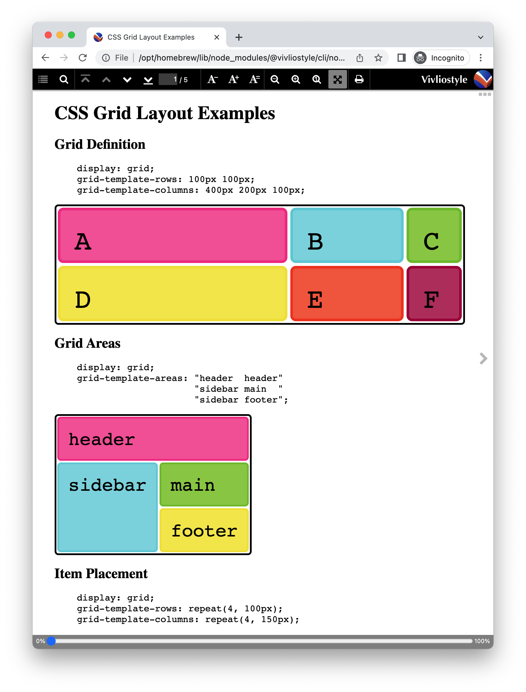

# Vivliostyle.js における Web 標準 CSS サポートの大改善

<div class="doc-author">
村上真雄
</div>

## CSS組版なら、Web標準のCSS機能は使えて当然でしょ

CSS 組版の大きなメリットは、Web の標準の CSS の知識があれば、自分でスタイルシートを作ることが簡単にできることです。
標準の CSS を学ぶための材料はたくさんあります。[MDNサイトのCSS入門](https://developer.mozilla.org/ja/docs/Web/CSS)などお薦めです。

でも、せっかく Web の標準の CSS を覚えたのにそれを CSS 組版で使おうとしたら、CSS 組版エンジンではその CSS 機能は使えないとなったら、CSS 組版へのモチベーションがダダ下がりになりますよね。Web の標準の CSS 機能は CSS 組版でも使えて当然のはずでしょう。（アニメーション機能など、印刷での再現が無理なものを除けば）

しかし、それが問題でした。

### これまで不満だったVivliostyle.jsでのWeb標準CSSサポート

CSS 組版エンジン Vivliostyle.js の大きな特徴は、標準の Web ブラウザ上で動く JavaScript プログラムとして実現されており、CSS でのレイアウトの機能の多くはブラウザでサポートされている CSS の機能を利用して、それだけでは足りないところを独自に実装しているということです。

このような方式なので、Vivliostyle.js がサポートする CSS の機能はブラウザがサポートする CSS の機能を包含するスーパーセットであるべきなのですが、現実はそうなっていなくて、ブラウザでは標準で使えるのに Vivliostyle.js では使えない機能が多々あるという残念な問題がありました。

#### 最近までVivliostyle.jsで使えなかったCSSの機能の例

- [CSS変数（カスタムプロパティ）](https://developer.mozilla.org/ja/docs/Web/CSS/Using_CSS_custom_properties)
- [CSS Grid Layout](https://developer.mozilla.org/ja/docs/Learn/CSS/CSS_layout/Grids)
- [CSS Colors Level 4](https://www.w3.org/TR/css-color-4/)の色の関数の新しい形式
  - 例: `color: rgb(50% 60% 80% / 50%);`
- [一括指定プロパティallやデフォルト指定キーワード initial、unset、revert](https://developer.mozilla.org/ja/docs/Web/CSS/all)

など。（これらは最近やっと使えるようになりました！）

### ブラウザのCSS機能をそのまま活かすのが簡単でない理由

もしブラウザに CSS プロパティや CSS ルールの構文を拡張するための標準のしくみがあれば、ブラウザの CSS 機能をそのまま保ちながら足りない CSS 機能を追加できそうですが、残念ながらまだそれがありません（[CSS Houdini](https://developer.mozilla.org/ja/docs/Web/CSS/CSS_Houdini)というブラウザの API のセットの開発が進められていて、将来的にはそれが役に立ちそうですが、現時点ではまだ使えません）。そのため Vivliostyle.js では、CSS の機能を拡張するために、CSS の構文解析やカスケーディングの処理、CSS プロパティやその値の指定が正しいかどうかを判定する処理などを自前で行う必要がありました。

Vivliostyle.js のベースになっている[Peter Sorotokin氏によるEPUB Adaptive Layout実装](https://github.com/sorotokin/adaptive-layout/)が作られたのは 2013 年ごろです。Vivliostyle.js での CSS の処理は、この古いプログラムを引き継いで、CSS 組版に必要な CSS の機能を拡充させていったものです。それから今まで CSS の標準仕様とブラウザでのそのサポートはだいぶ進んでいるのに、Vivliostyle.js でそれをすぐに反映させることができず、だいぶギャップが生じていました。その結果として、ブラウザで使える最新の CSS の機能がなかなか Vivliostyle.js で使えるようにならない問題が起きていたのです。

### ブラウザで使えるCSSプロパティと値は基本的にすべて使えるようにしました！

最近の Vivliostyle.js の更新（v2.16 と v2.17）で、これまでの CSS の処理を見直して、ブラウザで使える CSS プロパティと値は基本的にすべて使えるように改良しました。Vivliostyle.js の中に CSS の構文解析やカスケーディングの処理、有効な CSS 指定かどうか判定する処理があるのは変わりませんが、Vivliostyle.js の中で定義されていない CSS プロパティやプロパティの値があったとき、それがブラウザでサポートされているものならば有効なプロパティ指定として生かすようにしたのです。

今後は、ブラウザでサポートされている CSS プロパティやその値が機能しなかったら、それはバグと言えるので[Vivliostyle.jsにバグ報告ください](https://github.com/vivliostyle/vivliostyle.js/issues)。

### これでCSS Grid Layoutが使える！

[CSS Grid Layoutのデモ](https://webkit.org/demos/css-grid/)を Vivliostyle CLI の preview で表示する例：

```
vivliostyle preview https://webkit.org/demos/css-grid/
```

{width=80%}

このように、これまで Vivliostyle で使えなかった CSS Grid Layout が使えるようになりました。

### CSS変数をサポートしました！

[CSS変数（カスタムプロパティ）](https://developer.mozilla.org/ja/docs/Web/CSS/Using_CSS_custom_properties)は、もう何年も前にブラウザで利用可能になって普及していますが、Vivliostyle では使えない状態でした。CSS 組版のスタイルシートをカスタマイズしやすくするために、これがないと不便です。Vivliostyle.js v2.17 で、やっと使えるようになりました！

CSS 変数は、任意のスタイルルールの中で使用できて、また、ページを定義する `@page {...}` の中でも使用できます。次の簡単な例をご覧ください。

```css
:root {
  --page-width: 148mm;
  --page-height: 210mm;
  --page-margin: 20mm;
  --page-header: "My Report";
  --page-footer: counter(page) " / " counter(pages);
}
@page {
  size: var(--page-width) var(--page-height);
  margin: var(--page-margin);
  @top-center {
    content: var(--page-header);
  }
  @bottom-center {
    content: var(--page-footer);
  }
}
```

## まだ残っているCSS標準サポートの課題

CSS プロパティのサポートについてはだいぶ改善できました。しかし、最新のブラウザで使えるのに Vivliostyle でサポートできてない CSS の機能はまだあります。以下のものなどです：

- `:is()`、`:has()`、`:where()` 擬似クラス
- `::marker`　箇条書きのマークを指定する擬似要素
- `@counter-style`　カウンタースタイルを定義
- `@layer`　カスケードレイヤー

### :is()、:has()、:where() 擬似クラスなどSelectors Level 4サポート（予定）

[CSSセレクター](https://developer.mozilla.org/ja/docs/Web/CSS/CSS_Selectors)について、Vivliostyle.js では[Selectors Level 3](https://www.w3.org/TR/selectors-3/)の仕様が実装されてますが、最近のブラウザでは[Selectors Level 4](https://www.w3.org/TR/selectors-4/)の仕様の実装が進んでます。それが使えるようになれば、いろいろな条件によってスタイルを変えることがより簡単にできるようになります。

とくに [:has() 擬似クラス](https://developer.mozilla.org/ja/docs/Web/CSS/:has)が使えると、画期的に便利になります。従来の CSS セレクターでは、親の要素や前の要素が何であるかによる要素の選択はできても、子要素や後につづく要素が何であるかによって要素を選択できないことが不便でした。それができるようになります！

`:has()` 擬似クラスの使用例：

```css
section:has(section) {
  /* 内側にも section が存在する section のスタイル */
}
```

```css
h1:has(+ p) {
  /* 段落 p があとに続く見出し h1 のスタイル */
}
```

関連 Vivliostyle.js Issues:

- [#957 Support for Selectors Level 4](https://github.com/vivliostyle/vivliostyle.js/issues/957)
- [#828 Support the CSS :has() selector](https://github.com/vivliostyle/vivliostyle.js/issues/828)

### 箇条書きのマークを指定する ::marker擬似要素

[::marker擬似要素](https://developer.mozilla.org/ja/docs/Web/CSS/::marker)は箇条書きの記号や番号のを指定できる擬似要素 `::marker` が使えると、箇条書きのスタイルをより自由にできます（これまでは代わりに `::before` 擬似要素を使って工夫する必要がありましたが、より簡単になります）。

例：箇条書きの番号の色とフォントを変える

<div class="page-break"></div>

```html
<style>
ol > li::marker {
  color: blue;
  font: italic 200% sans-serif;
}
</style>
<ol>
  <li>あああああ</li>
  <li>いいいいい</li>
  <li>ううううう</li>
</ol>
```

この結果は次のようになるはず：

<figure>
<div><span style="color: blue; font: italic 200% sans-serif;">1. </span>あああああ</div>
<div><span style="color: blue; font: italic 200% sans-serif;">2. </span>いいいいい</div>
<div><span style="color: blue; font: italic 200% sans-serif;">3. </span>ううううう</div>
</figure>

例：番号付きの NOTE

```html
<style>
p.note {
  margin-left: 5em;
  display: list-item;
  counter-increment: note-counter;
}
p.note::marker {
  content: "NOTE " counter(note-counter) ": ";
}
</style>
<p class="note">あああああ</p>
<p class="note">いいいいい</p>
<p class="note">ううううう</p>
```

この結果は次のようになるはず：

<figure>
<div><span>NOTE 1: </span>あああああ</div>
<div><span>NOTE 2: </span>いいいいい</div>
<div><span>NOTE 3: </span>ううううう</div>
</figure>

関連 Vivliostyle.js Issue:

- [#732 Support the ::marker CSS pseudo-element](https://github.com/vivliostyle/vivliostyle.js/issues/732)

### カウンタースタイル定義機能 @counter-style

箇条書きの番号、ページ番号、章番号など自動連番に使うカウンタースタイル（list-style-type プロパティや counter()関数に指定する）は、標準で以下のものなどが使えます：

- decimal (1, 2, 3, …)
- decimal-leading-zero (01, 02, 03, …, 98, 99)
- lower-roman (i, ii, iii, iv, v, …)
- upper-roman (I, II, III, IV, V, …)
- lower-alpha (a, b, c, …)
- upper-alpha (A, B, C, …)
- lower-greek (α, β, γ, …)
- cjk-decimal (一, 二, 三, …, 一〇, 一一, …)
- japanese-informal (一, 二, 三, …, 十, 十一, …)
- japanese-formal (壱, 弐, 参, …, 壱拾, 壱拾壱, …)

など。（詳しくは[CSS list-style-typeプロパティ](https://developer.mozilla.org/ja/docs/Web/CSS/list-style-type)を参照）

標準で定義されていないカウンタースタイルを自分で定義できる[@counter-style](https://developer.mozilla.org/ja/docs/Web/CSS/@counter-style)が使えるようになるとより便利になります。

例：カウンタースタイル circled-lower-latin (ⓐ, ⓑ, ⓒ, …)を定義

```css
@counter-style circled-lower-latin {
  system: alphabetic;
  speak-as: lower-latin;
  symbols: ⓐ ⓑ ⓒ ⓓ ⓔ ⓕ ⓖ ⓗ ⓘ ⓙ ⓚ ⓛ ⓜ
           ⓝ ⓞ ⓟ ⓠ ⓡ ⓢ ⓣ ⓤ ⓥ ⓦ ⓧ ⓨ ⓩ;
  suffix: " ";
}
```

関連 Vivliostyle.js Issue:

- [#731 Support the @counter-style CSS at-rule](https://github.com/vivliostyle/vivliostyle.js/issues/731)

### カスケードレイヤー @layer

競合するスタイルルールがあるとき、どのスタイルが適用されるかは、指定される順番や CSS セレクターの詳細度で決まります（詳しくは MDN の[「CSSカスケード入門」](https://developer.mozilla.org/ja/docs/Web/CSS/Cascade)参照）。しかし、ベースのスタイルシートに対してスタイルルールを追加して特定の要素のスタイルを変えたいときなど、CSS セレクターの詳細度に気をつけないと思うようにスタイルを上書きできないのが面倒なところです。これを解決するのが、最近のブラウザで利用可能になった[カスケードレイヤー @layer](https://developer.mozilla.org/ja/docs/Web/CSS/@layer)です。

関連 Vivliostyle.js Issue:
- [#977 Support for Cascade Layers (CSS @layer at-rule)](https://github.com/vivliostyle/vivliostyle.js/issues/977)

## 組版に役に立つCSS機能の追加実装も進めてます！

ここまでは、最新のブラウザで使える標準の CSS 機能を Vivliostyle.js でサポートすることについて書きました。このブラウザ標準の CSS サポートを進めることと、それで足りない組版のための CSS 機能の実装を進めることは、Vivliostyle.js を CSS 組版エンジンとしてよりよいものにするためにどちらも必要です。

Vivliostyle.js がサポートしている CSS 機能は、Vivliostyle のドキュメント[「サポートするCSS機能」](https://docs.vivliostyle.org/#/ja/supported-css-features)にあります。そのうち Vivliostyle.js で追加実装した CSS 仕様の主なものは以下です：

- [CSS Text Level 4](https://www.w3.org/TR/css-text-4/)
  - hanging-punctuation プロパティ——行末の句読点のぶら下げなど
  - text-spacing プロパティ——和欧文間スペースや約物の詰めなど
- [CSS Paged Media Level 3](https://www.w3.org/TR/css-page-3/)
  - ページメディア用 CSS の基本仕様
- [CSS Generated Content for Paged Media](https://www.w3.org/TR/css-gcpm-3/)
  - 名前付き文字列（Named strings）——本文中の見出しなどの文字列をページヘッダーに柱として表示するのに使用
  - 脚注（Footnotes）
  - ページセレクター `:nth(An+B)`：n 番目のページのスタイルを指定するのに使用
  - `target-counter()` 関数——クロスリファレンスや目次・索引などの参照先ページ番号を生成するのに使用
- [CSS Fragmentation Level 3](https://www.w3.org/TR/css-break-3/)
  - 改ページや改ページ禁止の制御など
- [CSS Page Floats](https://www.w3.org/TR/css-page-floats-3/)
  - ページの上部や下部に図版などをフロート配置するページフロートの仕様

以下は、ページメディア用 CSS の機能でまだ実装できていない主なもの（Vivliostyle.js Issues にあるもの）：

- [#734 Support the margin-break property](https://github.com/vivliostyle/vivliostyle.js/issues/734)
  - 仕様: [CSS Fragmentation Level 4 — Adjoining Margins at Breaks: the `margin-break` property](https://www.w3.org/TR/css-break-4/#break-margins)
  - ブロックのマージンがページの先頭になったときに、そのマージンを保持するか 0 にするかが指定できる。
    - デフォルトの `margin-break: auto` は、なりゆき改ページでページの先頭になったブロックのマージンを破棄
    - `margin-break: keep` はマージンを保持する
    - `margin-break: discard` 強制改ページであってもページの先頭になったブロックのマージンを破棄（0 にする）
- [#424 Support for running elements](https://github.com/vivliostyle/vivliostyle.js/issues/424)
  - 仕様: [CSS Generated Content for Paged Media — Running elements](https://www.w3.org/TR/css-gcpm-3/#running-elements)
  - HTML 文書内の要素をページマージン領域に柱（欄外見出し）として表示できるようにする機能
  - 単純な文字列だけの柱ならば名前付き文字列（Named strings）で実現できているが、より複雑な要素を柱に表示するのに必要。

## Vivliostyle.jsまだまだ開発途上なのでどうぞよろしく！

以上、Vivliostyle.js の CSS 仕様サポート改善の取り組みについてでした。ここで取り上げていない課題（バグを直すことなど）もたくさんあり、まだまだ開発途上です。

Vivliostyle を使っていると、思い通りの組版結果にならなかったり（それはバグのせいかもしれない）、機能が足りないと感じることがあると思います。ぜひ Issue 登録してください。そのとき、まずすでにその問題が Issue に登録されていないか探してみてください。そして、すでにある Issue だったら、自分もその問題で困っていることなど、コメントをつけたりしてくれると、こちらもその Issue に取り組むモチベーションが上がります。

- Vivliostyle.js Issues: https://github.com/vivliostyle/vivliostyle.js/issues

どうぞよろしく！
