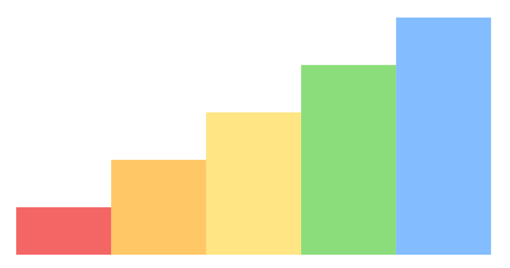

# あなたが知らないかもしれない CSS 変数活用法

<div class="doc-author">
spring-raining
</div>

先日、Vivliostyle に大きなアップデートがあり、現代のブラウザで普及が進みつつある CSS Variable (CSS 変数) が Vivliostyle でも使えるようになりました！
この CSS Variable、実はこれまでの CSS の概念を大きく覆すものであり、私たちのような Web フロントエンドエンジニアにとってはもはや当たり前のように使われているものですが、最近の CSS の進化を知らない人にはまだまだその活用方法が知られていないようです。
この記事では、CSS Variable で実現できることについて、実例を交えて紹介しようと思います。

ちなみに、この記事の内容は特に Vivliostyle 特有のものではないので、Vivliostyle だけでなく普段の Web サイト制作にも活用できる内容になっています。ぜひ使ってみてください。

## CSS Variable と CSS プリプロセッサとの根本的な違い

ご存知の人も多くいると思いますが、念のため本題に入る前に変数 (variable) について紹介します。

変数とは、あるデータに対して後から参照ができるように名前をつけたものを表します。
適切に変数をつけることにより、複雑で抽象的な内容を簡潔にまとめて扱うことができます。
また、ある名前に割り当てられた変数の内容 (値) は後から変えることができます<span class="footnote">プログラミング言語によっては変数の内容を変えられないルールもありますが、CSS Variable はユーザーが定義できる全ての変数が可変です。</span>。

よくある勘違いとして、CSS Variable は変数なので、SASS や Stylus などの CSS プリプロセッサの変数と役割は変わらない、というものがあります。
確かに CSS Variable に保存できる情報は CSS プリプロセッサに似たものと言えますが、これらとは決定的に異なる機能を持っています。
それは、CSS Variable は **その内容を任意のタイミングで変えられる** という点です<span class="footnote">ただし、Vivliostyle の環境では組版のビルド時にスタイルシートの内容が固定されるので、CSS Variable の内容を変えた際に再度ビルドする必要があります。もっとも、PDF や紙へ出力した時点でその内容を変えることは不可能なので、Vivliostyle で動的に CSS Variable の内容を変えたいという状況は無いでしょう。</span>。
CSS プリプロセッサの変数はビルド時に内容が決まってしまうので、後からその内容を変更できません。

CSS Variable は、その内容を変えたタイミングで文字通りブラウザの表示が変わるというリアクティビティ (反応性) を持っています。このリアクティビティにより、これまでは JavaScript などのプログラムでしか実現できなかったような表現が、最小限の CSS でできるようになっています。

## CSS Variableの基本

CSS Variable を使うこと自体は非常に簡単です。以下のように CSS で宣言することで、変数 `--my-variable` が定義されます。

```css
:root {
  --my-variable: purple;
}
```

ここでポイントが 2 つあります。

* CSS Variable の名前はハイフン 2 つ (`--`) で始める必要があります。変なルールですが、既存の CSS との互換性を保つためです。慣れましょう。
* どこでも変数を定義できる一般的なプログラミング言語や CSS プリプロセッサとは異なり、CSS Variable はセレクターの中 (ここでは `:root`) で宣言する必要があります。この理由については後で紹介します。

この変数を参照するためには、CSS の `var()` 関数を使います。

```css
h1 {
  color: var(--my-variable);
}
```

こうすることで、`--my-variable` の内容が展開され、`h1` 要素に `color: purple` のスタイルが適用されます。とても簡単ですね！

## CSS Variableのカスケーディング

CSS でよく知られる特徴として、プロパティのカスケーディングがあります。
例えば、`<p class="foo"></p>` という HTML に対して次のような CSS を適用させることを考えます。

```css
.foo {
  color: red;
}
p {
  color: blue;
}
```

`.foo` と `p` という 2 つのセレクターはどちらも `<p class="foo"></p>` に対して適用されますが、実際にはこの場合 `color: red` となります。

CSS には **詳細度** という考え方があり、スタイルの指定の中で競合する設定があった場合に、セレクターの詳細度にしたがってスタイルが決まるというルールがあります。
この場合、詳細度は `p` よりも `.foo` のセレクターの方が高いため、こちらの指定が優先して適用されます。
また、セレクターが同じ詳細度の場合、後から指定した方が適用されます。

CSS Variable にも同様の考え方があり、CSS Variable を宣言したセレクターによって変数の内容の詳細度が変わってきます。
例えば、前の章で紹介した `:root` セレクターは詳細度が最も低いので、より詳細度の高いセレクターの中で同じ名前の CSS Variable の内容を上書きできます。
このことから、他のプログラミング言語とは異なり、CSS では変数の宣言する際の順番についての考え方が希薄です。
また、宣言がまだ終わっていない CSS Variable を先に参照できるため、一般的な「変数」を想像すると戸惑うこともあるかもしれません。
ただこの機能を使いこなすことで、より複雑なスタイルの指定を簡潔に記述していくことができるでしょう。

ちなみに、この詳細度をより細かくプラガブルに設定できる **@layer** ルールという新しい仕様もブラウザでの実装が進んでいます。
まだ Vivliostyle では使うことができませんが、こちらもぜひ注目してみてください。

## CSS Variableで色を扱う

CSS の機能の中で最もわかりやすいものは、色を変える機能についてかもしれません。
この記事でも、まずは CSS Variable で色を扱うことを考えてみます。

```css
.fancy-box {
  --box-theme-color: #ff00ff;
  background-color: var(--box-theme-color);
}
```

CSS には、色を指定するために複数の方法があります。
おそらく一番有名な 16 進数のカラーコード (`#ffffff`, `#000000` など) の他にも、[特定の色](https://developer.mozilla.org/en-US/docs/Web/CSS/named-color) は名前で指定できます。
また、最近は `rgb()`、`hsl()` などの関数でも指定できるようになりました。
CSS Variable ではどの色の指定方法も使えます。

もちろん上のカラーコードで指定する方法でも問題なく使えますが、ここでは個人的なおすすめの方法「数値のみで指定」の方法を紹介します。
この方法では、以下の例のように RGB の数値のみで色を設定して、実際に使用する際に `rgb()` で `var()` を囲んでいます。

```css
.fancy-box {
  --box-theme-color: 255 0 255;
  background-color: rgb(var(--box-theme-color));
}
```

なぜこの方法をおすすめするかというと、カラーコードではなく数値で指定することで、後々に CSS Variable の値を活用しやすくなるためです。
たとえば、`--box-theme-color` と同じ色で透明度が 50%の色を得たい場合でも、次のように指定できます。

```css
.fancy-box {
  background-color: rgb(var(--box-theme-color) / 0.5);
}
```

`rgb()` 関数 (もしくは `rgba()` 関数) は、RGB の 3 要素の他に透明度を指定する 4 つ目の引数 (関数に与える値) を与えることができ、この例のように `0.5` を与えることで透明度が 50%の色が得られます。
言い換えると、`rgb()` 関数の 1〜3 番目の引数は `var(--box-theme-color)` として、4 つ目の引数は `0.5` として分割して与えているということです。
この例のように、CSS Variable は複数の値をまとめて関数の引数に与えられることも特徴です。

### 実例: カラーテーマを作る

もう少し発展させて、ユーザーが好きな色を指定できるカラーテーマ機能を作ってみます。
以下の例では、`--color-key` という CSS Variable を一つだけ使っていますが、この数値を変えてみると `.fancy-box` の要素がさまざまな色に変化していることが確認できます。

```css
.fancy-box {
  --color-key: 200;
  padding: 0.5rem 1rem;
  border-radius: 0.5rem;
  background: linear-gradient(
    hsl(var(--color-key) 100% 80%),
    hsl(var(--color-key) 100% 40%)
  );
  box-shadow: 0 2px 10px hsl(var(--color-key) 100% 30% / 0.8);
}
```

<style>
  .fancy-box {
    margin: 0 0.5rem;
    padding: 0.5rem 5rem;
    border-radius: 0.5rem;
    background: linear-gradient(
      hsl(var(--color-key) 100% 80%),
      hsl(var(--color-key) 100% 40%)
    );
    box-shadow: 0 2px 10px hsl(var(--color-key) 100% 30% / 0.8);
  }
</style>

<figure>
  <div>
    <span class="fancy-box" style="--color-key: 50;">color-key: 50</span>
    <span class="fancy-box" style="--color-key: 200;">color-key: 200</span>
  </div>
  <figcaption><code>--color-key</code>による色相変化の例</figcaption>
</figure>

`hsl()` とは、1〜3 番目の引数にそれぞれ「色相 (Hue)」「彩度 (Saturation)」「明度 (Lightness)」を指定できる関数です。
このうち 1 番目の色相のみ `var(--color-key)` として CSS Variable で指定することで、色相を固定したまま明るい色、くすんだ色などを表現しています。

今のところブラウザへの実装は完了していないものの、CSS Color Module Level 4 ではさらに便利な関数が提案されています。
他の色とのコントラストを考慮して適切な色を選択する `color-contrast()`、
複数の色をブレンドする `color-mix()`、
より人間の知覚に近い CIE 色空間から色を選べる `lab()` や `lch()` など、色に関する機能は今後大幅に強化される予定です。

## CSS Variableの値を計算する

CSS Variable とは別に、最近の CSS には新しい機能の `calc()` 関数も追加されています。
この機能はほとんど魔法のようなもので、これまで CSS には無縁だった「計算」が新しくできるようになりました。

```css
div {
  margin: calc(1rem * 2); /* 1rem × 2 = 2rem になる */
  padding-left: calc(1rem + 4px); /* 足し算、引き算は異なる単位でも大丈夫 */
}
```

`calc()` 関数に渡すことができる式では、四則演算 (`+` `-` `*` `/`) を使うことができます。
CSS ならではのルールとして、以下の点に気をつけてください。

* `+` と `-` の前後には必ずスペースを入れる必要があります。たとえば、`calc(1rem * -1)` は動かないため、`calc(1rem * - 1)` とする必要があります。
* `*` は異なる単位同士を掛け合わせることができないので、片方は単位なしの数値である必要があります。
* `/` は分母が単位なしの数値である必要があります。

もちろん CSS Variable と `calc()` を組み合わせて使うこともできます。値の計算を最大限に活用することを考えてみましょう。

### 実例: フォントサイズへの活用

組版に特徴的な要件として、「1 行に含まれる (全角の) 文字数を固定したい」というのはよくある要望の一つかと思います。

見る環境にこだわらずはみ出してもよければ、`em` 単位で文字数だけ横幅をとれば良いです。しかし、できれば Vivliostyle 以外の PC やスマホの環境でも一貫して表示させたいところです。
このような場合、CSS Variable で指定することでより柔軟に制御できます。

```css
main {
  --main-width: 100vw;
  --row-character-num: 40;
  width: var(--main-width);
  font-size: calc(var(--main-width) / var(--row-character-num));
}
```

この指定により、`<main>` 要素は閲覧環境によらずページの横幅いっぱい (`100vw`) の幅になり、1 行あたり 40 文字になるようにフォントサイズが自動的に調整されます。
この状態でブラウザの横幅を変えてみると、その大きさによってフォントサイズが変化することを確認できます。

それでは、さらにルールを追加して「ある一定以上のフォントサイズにならないように、左右に余白を追加する」という CSS を設定してみます。

```css
main {
  --main-width: 100vw;
  --row-character-num: 40;
  --max-font-size: 16px;
  --font-size: min(
    calc(var(--main-width) / var(--row-character-num)),
    var(--max-font-size)
  );
  margin: 0 auto;
  width: calc(var(--font-size) * var(--row-character-num));
  font-size: var(--font-size);
}
```

ここで使われている `min()` 関数は、与えられた引数から最も小さいものを出力します。
`--max-font-size` では `16px` と指定されているので、ここでの `--font-size` は 1 行に 40 文字が入り、かつ `16px` よりも小さい数字ということになります。
そして、`<main>` の横幅に `--font-size` と 40 を掛け合わせた値を指定して、横方向の `margin` に `auto` を指定すると、ちょうど横幅が 40 文字分になるように余白が設定されます。

上記の `min()` 以外にも、要素同士の大きさを比較する `max()`、`clamp()` 関数が用意されており、これらは `calc()` と組み合わせて使われることが多いです。
また、現在ブラウザに実装されていないものの中には、三角関数の計算をする `sin()`、`cos()` など色々な数学関数の仕様が追加されるので、今後はますます `calc()` の重要性が増してくるでしょう。

### 実例: Charts.cssでグラフを作る

最後に、これまでの CSS Variable の機能を最大限に活用したライブラリである [Charts.css](https://chartscss.org/) を紹介します。

グラフを描画するライブラリはこれまでにもいくつもありましたが、このライブラリの最大の特長は JavaScript を一切使わずに CSS だけでグラフを描画しているという点です。
CSS Variable と `calc()` を最大限に活用することで、棒グラフや折れ線グラフまで表現できるのです。

実際に使用する際は、以下のように `<table>` タグを使います。各項目の大きさは `--size` を使って指定すると、Charts.css が自動的にレイアウトしてくれます。

```html
<table class="charts-css column" style="width: 400px; height: 200px">
  <caption> Column Example #1 </caption>
  <tbody>
    <tr><td style="--size: calc(2 / 10)"></td></tr>
    <tr><td style="--size: calc(4 / 10)"></td></tr>
    <tr><td style="--size: calc(6 / 10)"></td></tr>
    <tr><td style="--size: calc(8 / 10)"></td></tr>
    <tr><td style="--size: calc(10 / 10)"></td></tr>
  </tbody>
</table>
```



## まとめ

CSS Variable 自体は比較的昔からあったものの、最近はその普及度が加速していると感じています。
その理由は、やはり Internet Explorer のサポートの終了の影響が大きいでしょう。
これまでは使いたくても使えなかった CSS Variable の恩恵が、ついに誰でも受けられるようになりました。

個人的には、今後は自分で CSS Variable を定義するだけではなく、(最後に紹介した Charts.css のように) ライブラリが API として CSS Variable を改変できるような仕組みが普及していくと予想しています。
CSS Variable が当たり前に使えるようになり、CSS の書き方がどのように変わっていくか今から楽しみです。
